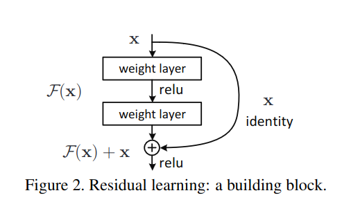
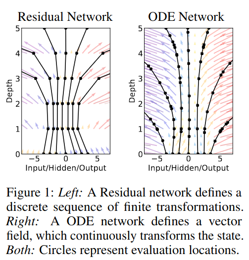
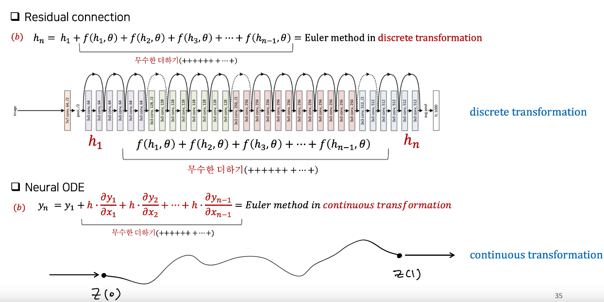
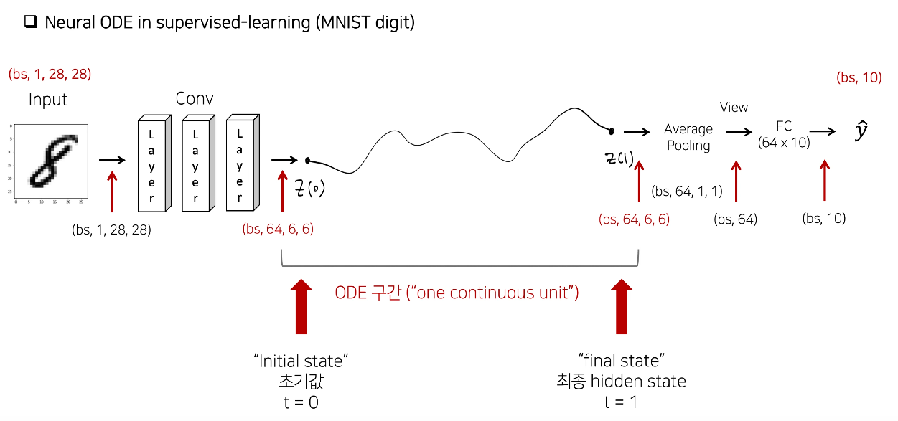

## NeuralODE: Neural Ordinary Differential Equations
*NeurIPS(2022), 4711 citation, University of Toronto, Review Data: 2024.05.25*

[Intro](#intro) 
[Related Work](#related-work) 
[Method](#method) 
[Experiment](#experiment) 
[Conclusion](#conclusion) 

> Core Idea

<strong>"test1"</strong> 

***

### <strong>Intro</strong>

$\textbf{이 주제의 정의 및 요구사항과 중요한 이유}$

$\textbf{이 주제의 문제점과 기존의 노력들}$

$\textbf{최근 노력들과 여전히 남아있는 문제들}$

$\textbf{본 논문에서 해결하고자 하는 문제와 어떻게 해결하는지, 그 결과들}$

- Deep neural network model 의 새로운 계열을 소개한다. 
  - Hidden layer 의 이산적인 순서를 명시하는 대신에 network 를 사용하여 hidden state 의 derivative (미분) 를 parameterize 했다.
- 일정한 메모리 배용을 가지며 각 입력에 맞춰서 평가 전략을 조정할 수 있고, 속도를 위해 수치적 정확도 (numerical precision) 를 명시적으로 조절할 수 있다. 

- Data dimension 을 나누지 않고 continuous normalizing flow 를 구축한다. 

$\textbf{본 논문의 주요 기여점}$

***

### <strong>Related Work</strong>

***

### <strong>Method</strong>

- ODE (Ordinary Differential Equation) 상미분 방정식
  - 상미분 방정식이란: 독립변수가 하나인 미분 방정식이다. 
  - 미분 방정식이란: 도함수와 도함수 이전의 함수로 구성된 방정식이다. 
    - $1$ 계 도함수가 포함된 미분방정식을 $1$ 계 상미분방정식이라고 한다. 
    - E.g., $y = y'$ 을 만족하는 함수는 $ae^x = (ae^x)'$
  - **도함수의 적분을 통해 원래 함수를 구하는 것이 해를 구하는 것이다.**
  - 그렇다면 원래 함수를 어떻게 구할까 $\rightarrow$ Euler's method

- Euler's method: initial condition 을 활용하여 ODE 의 해를 근사하는 기법이다.
  - 현재 시점 $i$ 에서 $\Delta x$ 만큼 이동했을 때의 값은, 현재 step 에서의 기울기 $\times \Delta x$ 만큼 이동했을 것이라고 approximation. 
  - 이 방법을 통해 모든 점에서의 값을 구하면 original function 을 근사할 수 있다.

$$ h_{i+1} = h_i + \Delta x \frac{\partial h_i}{\partial x_i}  $$

- 즉, Euler method 는 function approximation 의 일종 $\rightarrow$ 부정 적분 $\rightarrow$ 무수한 더하기
  - 여기서의 initial point 는 $h_1$

$$ h_{2} = h_1 + \Delta x \frac{\partial h_1}{\partial x_1} $$

$$ h_{3} = h_2 + \Delta x \frac{\partial h_2}{\partial x_2} $$

$$ ... $$

$$ h_{i} = h_{i-1} + \Delta x \frac{\partial h_{i-1}}{\partial x_{i-1}} $$

$$ So, $$

$$ h_{i} = h_1 + \Delta x \frac{\partial h_1}{\partial x_1} +  \Delta x \frac{\partial h_2}{\partial x_2} + ... +  \Delta x \frac{\partial h_{i-1}}{\partial x_{i-1}} $$

- 다시 돌아와서 Euler method 의 수식을 보면, 다음 step 에서의 값은 $h_{i+1}$ 현재 step 에서의 값인 $h_{i}$ 에 잔차인 $\Delta x \frac{\partial h_i}{\partial x_i}$ 을 더한 것이다.

$$  h_{i+1} = h_i + \Delta x \frac{\partial h_i}{\partial x_i}  $$

- 그리고나서 ResNet 의 skip connection 을 바라보면 Euler method 와 매우 비슷한 것을 알 수 있는데
  - 이는 Euler method 의 discretization version 이다. 
  - $f(h_i, \theta_i):$ $h_i$ 를 입력으로 한 network module 의 output 

$$ \textit{Euler method in discrete transformation} $$

$$ h_{i+1} = h_i + f(h_i, \theta_i) $$

- 이러한 skip connection 이 여러 개 있으니 다음과 같이 표현할 수 있다.

$$ h_i = h_1 + f(h_1, \theta_1) + f(h_2, \theta_2) + ... + f(h_{i-1}, \theta) $$

- 한 번 정리하면, 

$$ \textit{Euler method in continuous transformation} $$

$$ h_{i} = h_1 + \Delta x \frac{\partial h_1}{\partial x_1} +  \Delta x \frac{\partial h_2}{\partial x_2} + ... +  \Delta x \frac{\partial h_{i-1}}{\partial x_{i-1}} $$

$$ \textit{Euler method in discrete transformation} $$

$$ h_i = h_1 + f(h_1, \theta_1) + f(h_2, \theta_2) + ... + f(h_{i-1}, \theta) $$

- 결국 neural network 의 목적도 function approximation 인데 discrete 하게 값을 추정하는 것보다, 연속적인 vector field 에서 값은 근사하는게 더 정확할 것이다

- 다시 말해 본 논문에서 하고자 하는 것은 skip connection 을 discrete 하게 구성하지 말고 연속적으로 보자!
  - 따라서 initial point 의 dimension 과 구하고자 하는 point 의 dimension 이 동일해야 Euler method 를 통해 구할 수 있다. 

$\textbf{Custom forward}$

- Forward 과정을 다음과 같이 표현할 수 있다. 
  - $f(z(t), t; \theta):$ $t$ 시점에서의 $z(t)$ 미분 값이라고 볼 수 있다. 

$$ Z(1) = Z(0) + \int_0^1 f(z(t), t; \theta) dt  $$

$\textbf{Custom backward}$

- 각 state 별 gradient 를 *Adjoint state* $a(t)$ 로 정의 

$$ a(t) = \frac{\partial Loss}{\partial z(t)} = \text{Gradient} = \text{Adjoint state of t-state}  $$

- Final state 의 gradient $a(0)$ 를 얻기 위해, $a(1)$ 에서 시작한다. 이때, 새로운 ODE 를 forward 처럼 풀어준다. 
  - 즉 ODE 관점에서, initial point 가 $a(1)$ 이 된다.

$$ a(0) = a(1) + \Delta t \frac{\partial a_1}{\partial t_1} + ... + \Delta t \frac{\partial a_{0+ \epsilon}}{\partial t_{0 + \epsilon}} $$

$$ a(0) = a(1) - \int_1^0 \frac{\partial a_t}{\partial t}  dt $$

$$ \frac{\partial Loss}{\partial z(0)} = \frac{\partial Loss}{\partial z(1)} - \int_1^0 \frac{\partial a_t}{\partial t}  dt $$

- 이렇게 얻은 gradient 를 활용하여 optimization 을 진행한다. 
  - $a(0)$ ($Z(0)$ 에서의 gradient)를 구함으로써 $Z(0)$ 이전의 neural network module 을 학습시킬 수 있다.

***

### <strong>Experiment</strong>

***

### <strong>Conclusion</strong>

***

### <strong>Question</strong>

