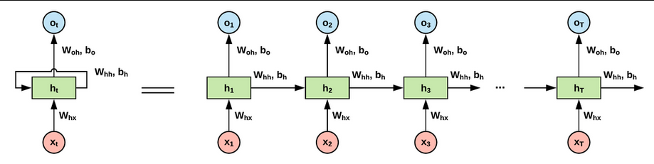
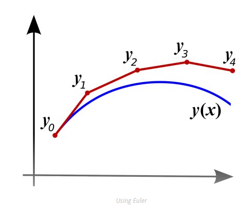

## NeuralODE: Neural Ordinary Differential Equations
*NeurIPS(2022), 4711 citation, University of Toronto, Review Data: 2024.05.25*

[Intro](#intro) 
[Related Work](#related-work) 
[Method](#method) 
[Experiment](#experiment) 
[Conclusion](#conclusion) 

> Core Idea

<strong>"Continuous Skip Connection"</strong> 

***

### <strong>Intro</strong>

- Residual network & RNN & normalizing flow 는 일련의 변환 (transformation)을 hidden state 로 구성하여 복잡한 변환을 구축했다.

$$ h_{t+1} = h_t + f(h_t, \theta_t) $$

- Residual network

- RNN

- Normalizing flow 

- 이러한 transformation 은 Euler discretization 으로 볼 수 있다. 

- Deep neural network model 의 새로운 계열을 소개한다. 
  - Hidden layer 의 이산적인 순서를 명시하는 대신에 network 를 사용하여 hidden state 의 derivative (미분) 를 parameterize 했다.

$$ \frac{dh(t)}{dt} = f(h(t), t, \theta) $$

- Memory efficiency: 일정한 메모리 비용을 가진다.
  - 역전파하지 않고, ODE solver 의 연산을 통해 ODE solver 의 모든 입력에 대해 스칼라 값 loss 의 기울기를 계산하는 방법을 제시했다.
  - Forward pass 의 중간 값을 저장하지 않아도 되기에 일정한 memory cost

- Euler's method 
  - Modern ODE solver 들은 더 정확한 근사치를 제공하지만 문제의 복잡성에 따라 model evaulation cost 가 확자될 수 있다. 
  - Euler method 는 상미분 방정식을 푸는 가장 간단한 방법이다. 
  

- Normalizing Flow: 본 논문에서 제안한 continuous transformation 은 예상치 못하게 change of variable formula 를 계산하기 쉽게 바꿔준다. 
  - Normalizing flow 의 single-unit bottleneck 을 피하는 새로운 invertible density model 을 구축한다. 
  - Normalizing flow 의 특징에 따라 직접 maximnum likelihood 를 계산하여 학습할 수 있다. 

- Continuous time-series models 
  - 시간 간격 및 observation 을 이산화해야 하는 RNN 과 달리, 연속적으로 정의된 본 논문의 모델은 임의의 시간에 도착하는 data 를 자연스럽게 통합한다. 

***

### <strong>Related Work</strong>

***

### <strong>Method</strong>

- ODE (Ordinary Differential Equation) 상미분 방정식
  - 상미분 방정식이란: 독립변수가 하나인 미분 방정식이다. 
  - 미분 방정식이란: 도함수와 도함수 이전의 함수로 구성된 방정식이다. 
    - $1$ 계 도함수가 포함된 미분방정식을 $1$ 계 상미분방정식이라고 한다. 
    - E.g., $y = y'$ 을 만족하는 함수는 $ae^x = (ae^x)'$
  - **도함수의 적분을 통해 원래 함수를 구하는 것이 해를 구하는 것이다.**
  - 그렇다면 원래 함수를 어떻게 구할까 $\rightarrow$ Euler's method

- Euler's method: initial condition 을 활용하여 ODE 의 해를 근사하는 기법이다.
  - 현재 시점 $i$ 에서 $\Delta x$ 만큼 이동했을 때의 값은, 현재 step 에서의 기울기 $\times \Delta x$ 만큼 이동했을 것이라고 approximation. 
  - 이 방법을 통해 모든 점에서의 값을 구하면 original function 을 근사할 수 있다.

$$ h_{i+1} = h_i + \Delta x \frac{\partial h_i}{\partial x_i}  $$

- 즉, Euler method 는 function approximation 의 일종 $\rightarrow$ 부정 적분 $\rightarrow$ 무수한 더하기
  - 여기서의 initial point 는 $h_1$

$$ h_{2} = h_1 + \Delta x \frac{\partial h_1}{\partial x_1} $$

$$ h_{3} = h_2 + \Delta x \frac{\partial h_2}{\partial x_2} $$

$$ ... $$

$$ h_{i} = h_{i-1} + \Delta x \frac{\partial h_{i-1}}{\partial x_{i-1}} $$

$$ So, $$

$$ h_{i} = h_1 + \Delta x \frac{\partial h_1}{\partial x_1} +  \Delta x \frac{\partial h_2}{\partial x_2} + ... +  \Delta x \frac{\partial h_{i-1}}{\partial x_{i-1}} $$

- 다시 돌아와서 Euler method 의 수식을 보면, 다음 step 에서의 값은 $h_{i+1}$ 현재 step 에서의 값인 $h_{i}$ 에 잔차인 $\Delta x \frac{\partial h_i}{\partial x_i}$ 을 더한 것이다.

$$  h_{i+1} = h_i + \Delta x \frac{\partial h_i}{\partial x_i}  $$

- 그리고나서 ResNet 의 skip connection 을 바라보면 Euler method 와 매우 비슷한 것을 알 수 있는데
  - 이는 Euler method 의 discretization version 이다. 
  - $f(h_i, \theta_i):$ $h_i$ 를 입력으로 한 network module 의 output 

$$ \textit{Euler method in discrete transformation} $$

$$ h_{i+1} = h_i + f(h_i, \theta_i) $$

- 이러한 skip connection 이 여러 개 있으니 다음과 같이 표현할 수 있다.

$$ h_i = h_1 + f(h_1, \theta_1) + f(h_2, \theta_2) + ... + f(h_{i-1}, \theta) $$

- 한 번 정리하면, 

$$ \textit{Euler method in continuous transformation} $$

$$ h_{i} = h_1 + \Delta x \frac{\partial h_1}{\partial x_1} +  \Delta x \frac{\partial h_2}{\partial x_2} + ... +  \Delta x \frac{\partial h_{i-1}}{\partial x_{i-1}} $$

$$ \textit{Euler method in discrete transformation} $$

$$ h_i = h_1 + f(h_1, \theta_1) + f(h_2, \theta_2) + ... + f(h_{i-1}, \theta) $$

- 결국 neural network 의 목적도 function approximation 인데 discrete 하게 값을 추정하는 것보다, 연속적인 vector field 에서 값은 근사하는게 더 정확할 것이다

- 다시 말해 본 논문에서 하고자 하는 것은 skip connection 을 discrete 하게 구성하지 말고 연속적으로 보자!
  - 따라서 initial point 의 dimension 과 구하고자 하는 point 의 dimension 이 동일해야 Euler method 를 통해 구할 수 있다. 

$\textbf{Custom forward}$

- Forward 과정을 다음과 같이 표현할 수 있다. 
  - $f(z(t), t; \theta):$ $t$ 시점에서 $z(t)$ 를 미분한 값이라고 볼 수 있다. 따라서 skip connection과 동일하게, $z(t+1)$ 를 $f(z(t), t; \theta) + z(t)$ 로 봐야한다. 여기서의 $f$ 는 각 network block 이다. 

$$ Z(1) = Z(0) + \int_0^1 f(z(t), t; \theta) dt  $$

$\textbf{Custom backward}$

- Continuous-depth network 를 학습시키는 기술적인 주요 어려움은 ODE solver 를 통한 backpropagation 이다. 
  - ODE solver 의 결과를 input 으로 하는 scalar-valued loss fucntion $L()$ 을 최적화하는 방법을 고려해보자.
  - 당연하게도 $L()$ 을 최적화하려면 $\theta$ 에 대한 기울기가 필요하다. 

- $L()$ 을 $\theta$ 에 대해서 편미분 하기전에, chain rule 에서의 전 단계인 $z$ 에 대해서 미분을 먼저 해보자 
  - $\frac{\partial L}{\partial \theta_t} = \frac{\partial L}{\partial z(t)} \frac{\partial z(t)}{\partial \theta_t}$

----

- 각 state 별 gradient 를 *Adjoint state* $a(t)$ 로 정의 

$$ a(t) = \frac{\partial Loss}{\partial z(t)} = \text{Gradient} = \text{Adjoint state of t-state}  $$

- Final state 의 gradient $a(0)$ 를 얻기 위해, $a(1)$ 에서 시작한다. 이때, 새로운 ODE 를 forward 처럼 풀어준다. 
  - 즉 ODE 관점에서, initial point 가 $a(1)$ 이 된다.

$$ a(0) = a(1) + \Delta t \frac{\partial a_1}{\partial t_1} + ... + \Delta t \frac{\partial a_{0+ \epsilon}}{\partial t_{0 + \epsilon}} $$

$$ a(0) = a(1) + \int_1^0 \frac{d a_t}{d t}  dt $$

$$ \frac{\partial Loss}{\partial z(0)} = \frac{\partial Loss}{\partial z(1)} + \int_1^0 \frac{d a_t}{d t}  dt $$

- $\frac{\partial Loss}{\partial z(1)}$ 은 구할수가 있는데, $\frac{d a_t}{d t}$ 는 어떻게 구할까
  - Appendix B 에 proof 가 있다.

- 결론부터 말하자면 다음과 같다.

$$ \frac{da(t)}{dt} = -a(t)^\textsf{T} \frac{\partial f(z(t), t, \theta)}{\partial z(t)} $$ 

$$ a(0) = a(1) - \int_1^0 a(t)^\textsf{T} \frac{\partial f(z(t), t, \theta)}{\partial z(t)} dt  $$

- 이제 증명해보자. 먼저, network $f$ 의 output 인 $f(z(t), t, \theta)$ 는 $\frac{dz(t)}{dt}$ 이고, $a(t) = \frac{\partial L}{\partial z(t)}$ 이다. 

- Continuous hidden state 에서는 $\epsilon$ 만큼 변화한 $z$ 를 다음과 같이 정의할 수 있다. 

$$ z(t+ \epsilon) = z(t) + \int_t^{t+\epsilon} f(z(t),t,\theta) dt $$

- 이는 chain rule 로 적용하여 

$$ \frac{\partial L}{\partial z(t)} = \frac{\partial L}{\partial z(t+\epsilon)} \frac{\partial z(t+\epsilon)}{\partial z(t)}   $$

$$ a(t) = a(t+\epsilon) \frac{\partial z(t+\epsilon)}{\partial z(t)} $$

- 그리고 나서, 

$$ \frac{da(t)}{dt}  = \lim_{\epsilon \rightarrow 0^+} \frac{a(t+\epsilon) - a(t)}{\epsilon}  $$

$$ = \lim_{\epsilon \rightarrow 0^+} \frac{a(t+\epsilon)-a(t+\epsilon)^\textsf{T}\frac{\partial z(t+\epsilon)}{\partial z(t)}}{\epsilon} $$

$$ = \lim_{\epsilon \rightarrow 0^+} \frac{a(t+\epsilon)-a(t+\epsilon)^\textsf{T}\frac{\partial }{\partial z(t)}(z(t) + \epsilon f(z(t), t, \theta) + \mathcal{O}(\epsilon^2))}{\epsilon}, \ \text{Taylor series} $$

$$ = \lim_{\epsilon \rightarrow 0^+} \frac{a(t+\epsilon)-a(t+\epsilon)^\textsf{T}(I + \epsilon \frac{\partial f(z(t), t, \theta)}{\partial z(t)} + \mathcal{O}(\epsilon^2))}{\epsilon} $$

$$ = \lim_{\epsilon \rightarrow 0^+} \frac{-\epsilon a(t+\epsilon)^\textsf{T}( \frac{\partial f(z(t), t, \theta)}{\partial z(t)} ) + \mathcal{O}(\epsilon^2)}{\epsilon} $$

$$ = \lim_{\epsilon \rightarrow 0^+} -a(t+\epsilon)^\textsf{T}( \frac{\partial f(z(t), t, \theta)}{\partial z(t)} ) + \mathcal{O}(\epsilon^2) $$

$$ = -a(t)^\textsf{T}( \frac{\partial f(z(t), t, \theta)}{\partial z(t)} ) $$

$$ \textbf{So, } \ \frac{da(t)}{dt} = -a(t)^\textsf{T}( \frac{\partial f(z(t), t, \theta)}{\partial z(t)} ) $$

----

다시 돌아와서 $L$ 을 $\theta$ 에 대해서 미분해보면, 

$$ \frac{da(t)}{dt} = \frac{d}{dt}(\frac{\partial L}{\partial z(t)})  = -a(t)^\textsf{T}( \frac{\partial f(z(t), t, \theta)}{\partial z(t)}) $$

- 양변에 $\frac{\partial z(t)}{\partial \theta_t}$

$$ \frac{d}{dt}(\frac{\partial L}{\partial \theta_t}) = -a(t)^\textsf{T}( \frac{\partial f(z(t), t, \theta)}{\partial \theta_t}) $$

- $0$ 시점의 값은 

$$ \frac{\partial Loss}{\partial \theta(0)} = \frac{\partial Loss}{\partial \theta(1)} + \int_1^0 \frac{d}{d t}(\frac{\partial L}{\partial \theta_t})  dt $$

- 이때, $1$ 시점의 값은 $\frac{d}{dt}(\frac{\partial L}{\partial \theta_t})$ 를 $t$ 에 대해서 적분하고 $t=t_1$ 으로 대입하여 풀 수 있는데, 이 값은 $0$이 된다. 

$$ \frac{dL}{d\theta_t} = - \int_{t_1}^{t} a(t)^\textsf{T} \frac{\partial f(z(t), t, \theta)}{\partial \theta}dt $$

- 따라서, 최종적인 수식은 다음과 같이 정리된다. 
  - 결국 $a(t) = \frac{\partial L}{\partial z(t)}$ 를 구해야 풀 수 있다. 

$$ \frac{\partial Loss}{\partial \theta(0)} = \int_1^0 \frac{d}{d t}(\frac{\partial L}{\partial \theta_t})  dt = - \int_1^0   a(t)^\textsf{T} \frac{\partial f(z(t), t, \theta)}{\partial \theta} dt $$

- 또 다른 증명들 
  1. Appendix B
     - 위에서 구한 $\frac{da(t)}{dt}$ 를 일반화하여 $\theta, t$ 에 대한 gradient 도 구할 수 있다. 
  2. 라그랑주를 이용한 풀이 (+ 그적미적 등등)
     - <a href='https://vaipatel.com/posts/deriving-the-adjoint-equation-for-neural-odes-using-lagrange-multipliers/'>Proof</a>

- 이렇게 얻은 gradient 를 활용하여 optimization 을 진행한다. 
  - $a(0)$ ($Z(0)$ 에서의 gradient)를 구함으로써 $Z(0)$ 이전의 neural network module 을 학습시킬 수 있다.

- $a(t)^\textsf{T} \frac{\partial f(z(t), t, \theta)}{\partial z(t)}$ 와 $a(t)^\textsf{T} \frac{\partial f(z(t), t, \theta)}{\partial \theta}$ 는 자동 미분으로 계산이 가능하다. 

- 알고리즘은 다음과 같다. 
  - Backpropagation 을 통해 stop time $t_1$ 에서의 final state 는 구할 수 있다. 
  - 그 시점까지의 loss gradient도 마찬가지로 구할 수 있다. 
  - 여기서부터 시작해서 ODE solver로 start time $t_0$ 까지의 graident 도 계산 가능하다. 

- Continuous Normalizaing Flows
  - $f$ 가 $z$ 에서 균일하게 Lipschitz 연속이고 $t$ 에서 연속이라고 가정하면 로그 확률의 변화는 다음과 같은 미분 방정식을 따른다. 
  - Jacobian 의 determinant 를 계산하는 대신 trace(대각합) 연산만 하면된다. 
  - Appendix A
  - $p(z_0)$ : 초기 데이터 분포 
  - Trace 함수는 determinant 와 다르게 선형 함수이다. 

$$ \frac{\partial \log p(z(t))}{\partial t} = -tr(\frac{df}{dz(t)}) $$

$$ \log p(z(t+1)) = \log p(z(t)) + \frac{\partial \log p(z(t))}{\partial t} $$

***

### <strong>Experiment</strong>

$\textbf{Replacing residual networks with ODEs for supervised learning}$

- 수치적으로 초기값 문제를 가지는 ODE(Ordinary Differential Equation, 상미분방정식)를 해결하기 위해 LSODE와 VODE에 구현된 암시적 Adams 방법을 사용한다.

- 모델: 입력을 $2$ 번 다운샘플링한 다음 $6$ 개의 표준 residual block을 적용하는 작은 ResNet (ODE-Net)
- MNIST 에서의 성능을 비교한다. 
- RK-Net 은 동일한 구조를 사용하지만 Runge-Kutta 를 통해 기울기가 직접 역전파된다. $L$ 은 레이어 수이고, $\tilde L$ 은 ODE solver 가 한 번의 forward pass 에서 요청한 함수 평가 횟수이다. ODE-Net과 RK-Net 모두 ResNet 과 비슷한 성능을 달성했다. 

- CNF (Continuous Normalizing Flow) 가 NF 대비 더 낮은 loss 를 달성한다. 
  - 심지어 더 적은 iteration 으로 달성함
  - 더 target representation 에 가까운 구현을 달성

- 불규칙적인 데이터를 신경망에 적용하는 것은 어렵다. 일반적인 RNN 은 고정된 기간에서 발생한 관측값을 사용한다. 
  - 연속적으로 보면 이런 경우도 잘 대처한다. 
  - 심지어 extrapolation 도 잘 수행한다. 

***

### <strong>Conclusion</strong>

***

### <strong>Question</strong>

