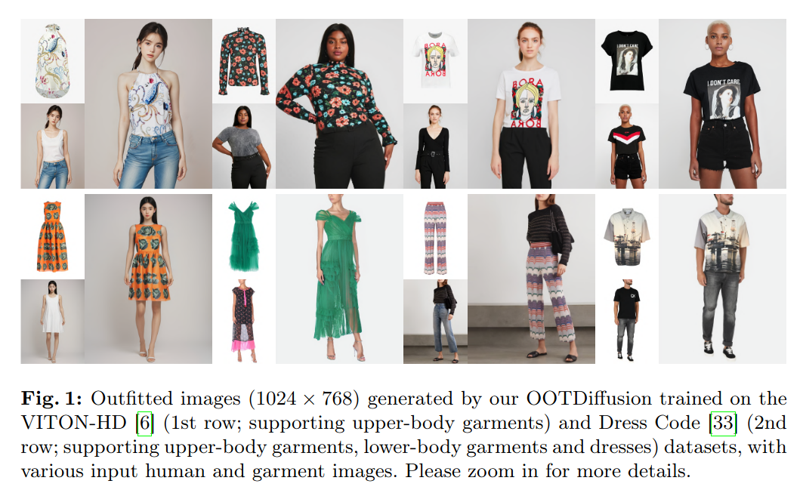
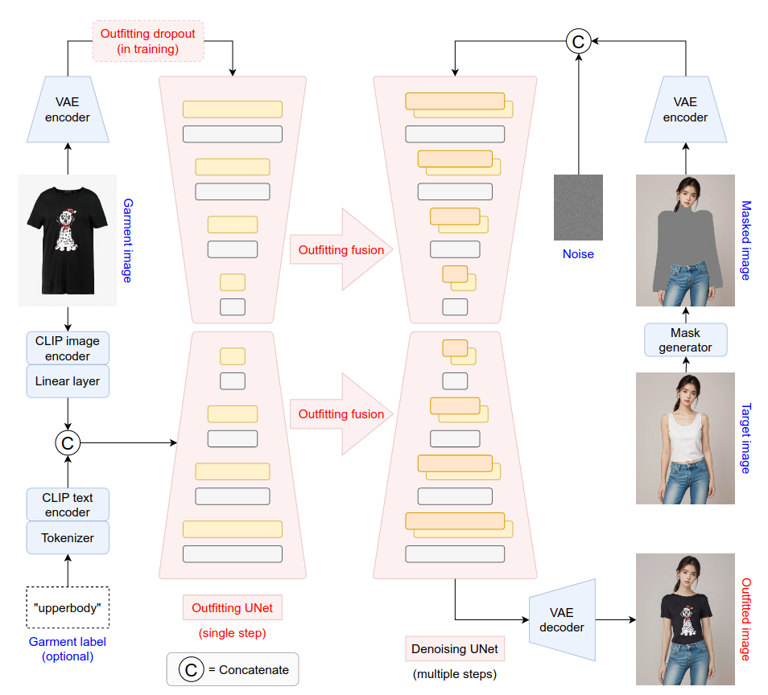
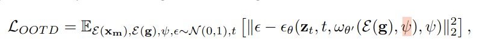
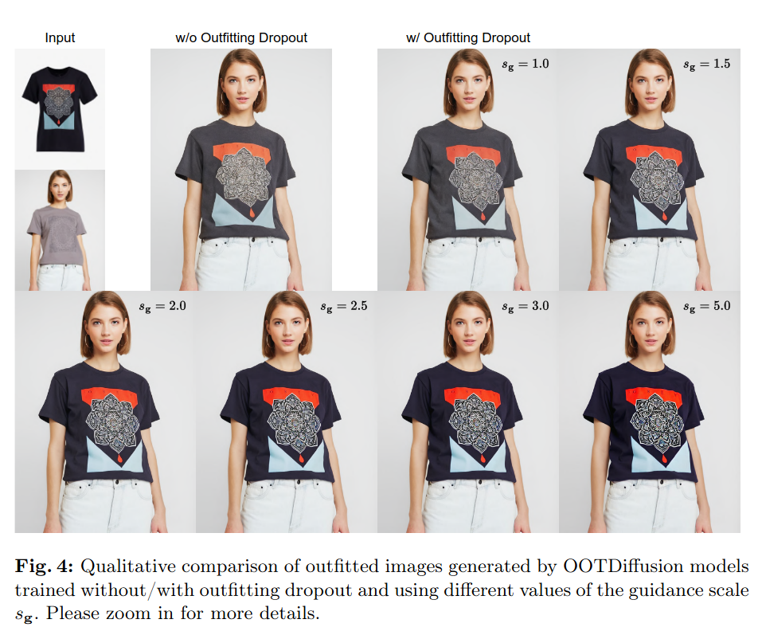
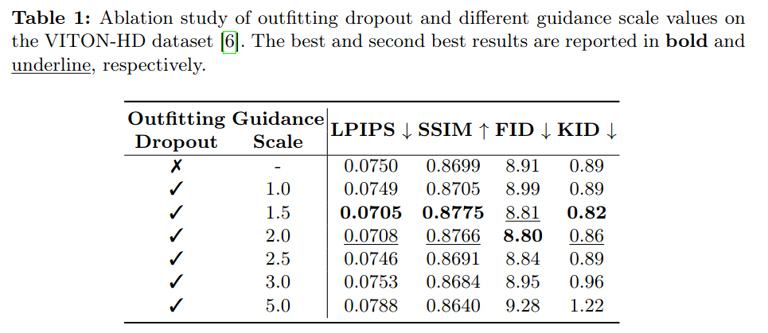
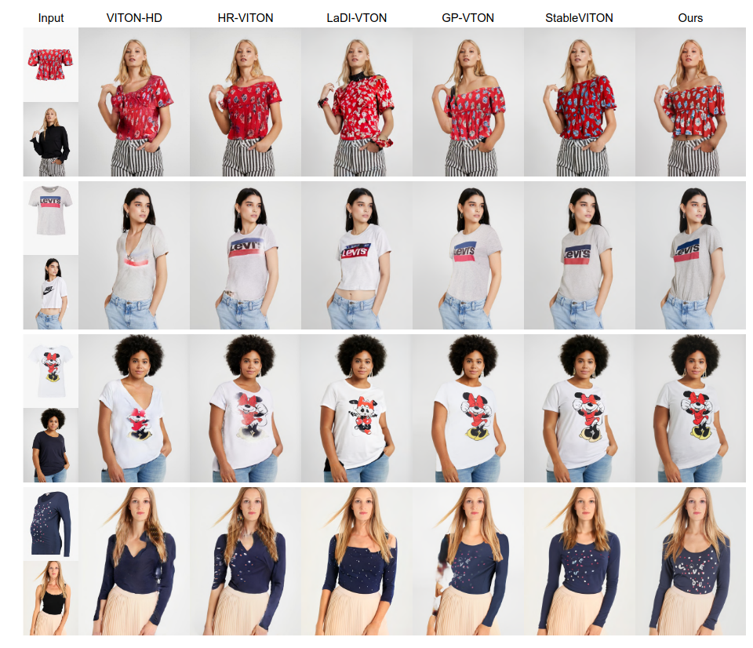
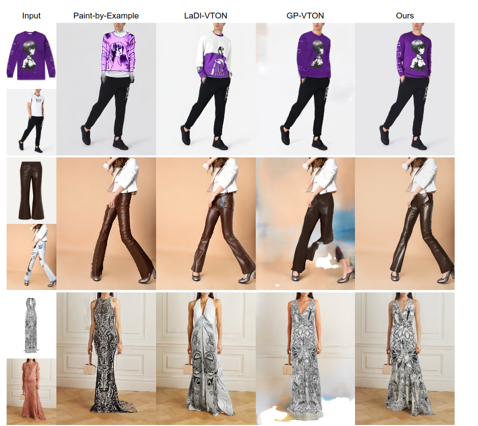
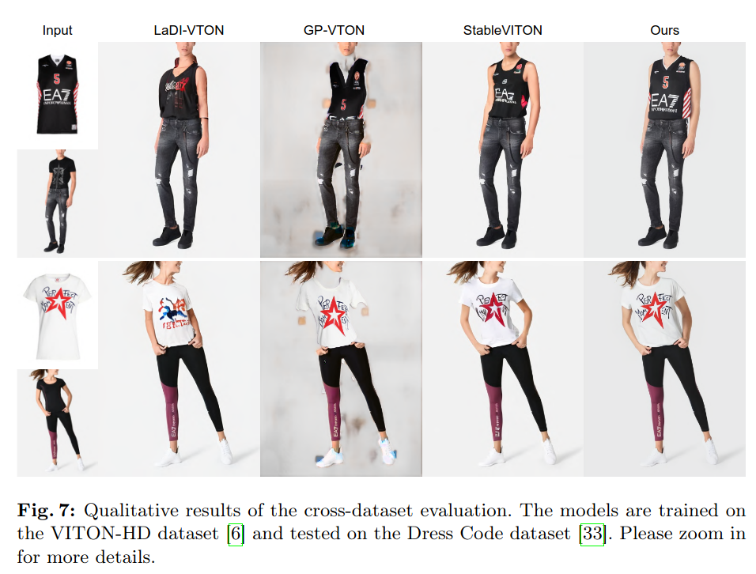
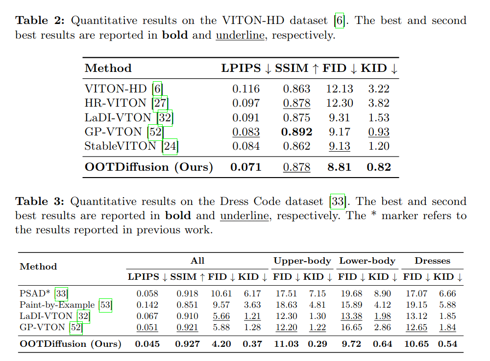
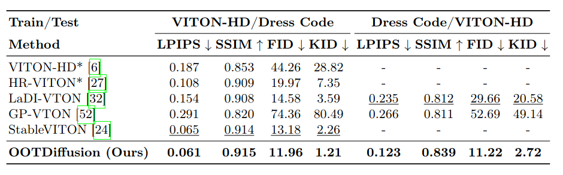

## OOTDiffusion: Outfitting Fusion based Latent Diffusion for Controllable Virtual Try-on
*arXiv(2024), 0 citation, Review Data: 2024.3.28*

[Intro](#intro) 
[Related Work](#related-work) 
[Method](#method) 
[Experiment](#experiment) 
[Conclusion](#conclusion) 

> Core Idea

<strong>"test1"</strong> 

***

### <strong>Intro</strong>

- 현재 image-based VITON 이 직면한 문제는 $2$ 가지로 볼 수 있다. 
  1. 생성된 이미지는 현실적이고 자연스러워야 하며, 불일치를 피해야 한다. 요즘에는 GAN or LDM 을 활용해서 task 를 수행한다.
     1. 이전의 GAN-based approach 는 일반적으로 올바른 의복 주름, 자연스러운 빛과 그림자, 또는 현실적인 인체를 생성하는 데 어려움이 존재했다.
     2. 따라서, 최근의 작업은 LDM 기반의 방법을 선호하며, 이 방법은 착용된 이미지의 현실성을 효과적으로 향상시킨다. 
  2. 복잡한 텍스트, 질감, 색상, 패턴 및 선 등과 같은 의복 세부 특징을 최대한 보존하는 것이다. 
     1. 이전 연구에서는 일반적으로 의복 특징을 대상 인체와 정렬하기 위해 명시적인 변형 과정을 수행하고, 그런 다음 변형된 의복을 생성 모델에 제공했다. 
     2. 따라서 이러한 VTON 방법의 성능은 대게 독립적인 변형 과정의 효과에 극도로 의존하며, 이는 훈련 데이터에 과적합될 수 있다. 
     3. 반면, 일부 LDM-based approach 는 CLIP textual-inversion 을 통해 garment feature 를 학습하고자 했지만 세밀한 garment detail 을 보존하는데 실패했다. 

- OOTDiffusion
  - Pretrained latent diffusion models 을 이용하여 UNet 이 garment detail feature 를 학습하게끔 설계했다. 
  - 중복되는 warping process 없이, 제안된 outfitting fusion 을 통해 UNet 의 self-attention layer 에서 garment feature 가 정확하게 target human body 에 정렬된다. 
  - 더욱이, classifier-free guidance 를 통해 garment feature 의 strength 를 조절할 수 있도록 oufitting dropout 을 training process 에 도입했다. 
  - High-resolution image generation 이 가능하다. 

***

### <strong>Related Work</strong>

- Image-based Virtual Try-on
  - GAN-based
    - VITON-HD: 고해상도 데이터셋을 수집하고 ALIAS 정규화 및 생성자를 제안하여 변형된 의상과 대상 영역 사이의 불일치를 해결했다.
    - HR-VITON: 왜곡 및 segmentation 을 동시에 수행하여 몸의 가려짐과 의상의 불일치를 처리했다. 
    - GP-VTON: 변형된 의상을 생성하기 위한 LFGP warping module 을 제안하고, warping network 에 대한 DGT 교육 전략을 도입했다. 
    - GAN-based method 는 일반적으로 실제 의류 주름과 자연스러운 빛과 그림자를 간과하는 명시적인 warping process 에 의존하며, 이는 착용된 이미지의 충실도와 실제감을 심각하게 저하시킨다. 
    - 또한, 훈련 데이터의 과적합을 유발하고 분포 외 이미지에서 심각한 성능 저하를 초래할 수 있다. 
  - LDM-based
    - LaDI-VTION, DCI-VTON: 명시적인 warping process 를 요구한다. 
    - 특히 LaDI-VTON 은 시각적 의류 특징을 CLIP token embedding space 에 mapping 하기 위해 textual inversion 을 수행하고, warping 된 입력과 함께 latent diffusion model 을 condition 으로 사용한다. 
    - DCI-VTON 은 warped cloth 를 masked person image 와 직접 결합하여 coarse result 를 얻은 후, diffusion model 을 통해 정제한다. 이러한 방법 중, 어느 것도 CLIP encoder 에 의한 정보 손실로 인해 복잡한 패턴 및 텍스트와 같은 의복 세부 사항을 완전히 보존하지 못했다. 
    - StableVITON: 최근에는 해당 model 이 독립적인 warping 을 폐기하고 의복과 인간 몸의 의미적 상관 관계를 학습하기 위한 zero-cross attention block 을 제안했다. 그러나 cross-attention layer 에서 정보 손실이 여전히 발생하며, 추가된 zero block 은 훈련 및 추론 비용을 증가시킨다. 
    - 반면, 본 논무의 LDM-based OOTDiffusion 은 pre-trained UNet 을 세밀하게 튜닝하여 의복 세부 사항을 one step 에 배우고, 이를 정보 손실이 거의 없는 의복 융합을 한다. 
- LDM-based Controllable Image Generation 
  - latent diffusion model 은 최근 몇 년간 text-to-image generation 에서 큰 성공을 거뒀다.
  - 더 제어 가능한 결과를 위해 prompt-to-prompt 와 Null-text inversion 은 cross-attention layer 를 제어하여 inpu caption 을 수정하여 모델의 추가적인 훈련없이 이미지를 세밀하게 편집했다. 
  - InstructPix2Pix: input image 와 text guidance 가 주어졌을 때, 수정된 이미지를 생성하는 diffusion model 을 훈련하기 위해 paired data 를 생성했다. 
  - Paint-by-example: self-supervised learning 으로 image conditioned diffusion model 을 훈련하여 세밀한 이미지 제어를 제공했다.
  - ControlNet, T2I-Adapter: pre-trained diffusion model 에 추가적인 block 을 통합하여 공간 조건부 제어를 가능하게 했다. 
  - IP-Adapter: text 와 image feature 에 대한 decoupled cross-attention 을 채택하여 image prompt 와 추가적인 구조적 condition 으로 제어 가능한 생성을 가능하게 했다. 
  - 본 논문에서는 의상 특징에 관련하여 잠재 확산 모델이 더 제어 가능한 착용된 이미지를 생성할 수 있도록, UNet의 self-attention layer 에 outfitting fusion 을 채용하고 훈련 시 outfitting dropout 을 수행했다. 

***

### <strong>Method</strong>

- Notation
  - $x \in \mathbb{R}^{3 \times H \times W}$: target human image
  - $g \in \mathbb{R}^{3 \times H \times W}$: input garment image 
  - $x_g \in \mathbb{R}^{3 \times H \times W}$: generated image 
  - In this paper, employ OpenPose and HumanParsing model to generate a masked human image 
  - $x_m \in \mathbb{R}^{3 \times H \times W}$: masked human image
  - VAE Encoder $\mathcal{E}$: $\mathcal{E}(x_m) \in \mathbb{R}^{4 \times h \times w}$, where $h = \frac{H}{8}, w = \frac{W}{8}$
  - $\epsilon \in \mathbb{R}^{4 \times h \times w}$: Gaussian noise 
  - $z_T \in \mathbb{R}^{8 \times h \times w}$: input latent (concatenate $\epsilon, x_m$)
  - $\mathcal{E}(g) \in \mathbb{R}^{4 \times h \times w}$: encoded garment latent 

- Overview
  - Concatenate $\epsilon, x_m$ 해서, $z_T$ 를 만든다. 따라서 기존의 SD model 에 추가로 $4$ zero-initialized channel 을 붙인다. 
  - Encoded garment latent $\mathcal{E}(g)$ 를 **oufitting UNet** 에 single step 으로 줘서, garment feature 를 학습하고, 이를 outfitting fusion 을 통해 **denoising UNet** 에 통합한다. 
  - 학습 중에, $\mathcal{E}(g)$ 에 대해서 outfitting dropout 을 수행한다. 
  - 추가적으로, CLIP textual inversion 을 garment image $g$ 에 대해서 수행하고, 선택적으로 (optionally) auxiliary conditioning input 으로써 garment label $y \in$ {upperbody, lowerbody, dress} 에 대한 text embedding 값과 concat 한다. 이는 cross-attention 을 통해 outfitting, denoising UNet 에 모두 적용된다. 
  - 요약하자면, (1) oufitting UNet 과 denoisin Unet 모두 cross-attention 에는 CLIP textual inversion 으로 학습되는 garment image $g$ 와 option 으로 같이 concat 되는 $y$ 가 들어가고, (2) one step 으로는 encoded garment latent  $\mathcal{E}(g)$ 가 outfitting UNet 에 들어가서, (3) outfitting fusion 을 통해 denoising UNet 에 통합된다. (4) 그 후, multi-step denoising 으로 noise 제거하고 decoding.

$\textsf{Outfitting UNet}$

- Stable Diffusion model 의 UNet 과 동일하다. (본 논문에서 제안한 Denoising UNet 과는 다르다. Denoising UNet 은 앞의 conv 에 $4$ channel 을 추가함) 
- $\omega$: Outfitting UNet
- $\psi$: garment image 와 text 를 encoding 하고 concat
- 즉, Outfitting UNet 에 condition 과 VAE 로 encoding 한 garment image 를 input 으로 준 결과를 Denoising UNet 에 줘서 동시에 학습한다. 
- Outfitting UNet 은 one step forward process 만을 사용한다. Noise 를 추가하지도 않는다. (즉, ControlNet 인데 UNet decoder block 도 사용)

$\textsf{Outfitting Fusion}$

- Self-attention layer input 으로 $x_n$ 대신 $x_{gn}$ 을 사용한다. 그런 다음 출력 특성 맵의 첫 번째 절반을 자르고 이를 self-attention-layer 의 최종 출력으로 사용한다. 
- Self-attention layer 에서의 의상 퓨전을 통해 의상 특징이 암묵적으로 warping 되어 target human body 와 무시할 만한 정보 손실로 효과적으로 상관관계를 가진다. 
- 따라서 denoising UNet은 outfitting UNet 으로부터 정확한 특성을 학습하여 의복 세부 사항을 보존하고 생성된 이미지에서 대상 인간 몸에 자연스럽게 적응시킨다.

$\textsf{Outfitting Dropout}$

- Classifier-free guidance 를 사용하기 위해, $\mathcal{E}(g)$ 를 null 로 학습 all-zero latnet.
- $10$ % 비율로 한다. 
- Guidance scale 은 $1.5 \sim 2.0$ 이 가장 좋았다. 

***

### <strong>Experiment</strong>

$\textsf{Dataset}$

- $1024 \times 768$ 이미지로 학습가능하지만 $512 \times 384$ 로 학습 (VITON-HD, DressCode)
- VITON-HD dataset: 13,679 image pairs of frontal half-body models and corresponding upper-body garments, where 2032 pairs are used as the test set.
- Dress Code dataset: 15,363/8,951/2,947 image pairs of full-body models and corresponding upper-body garments/lower-body garments/dresses, where 1,800 pairs for each garment category are used as the test set.

$\textsf{Model}$

- VITON-HD dataset (supporting upper-body garments) 과 Dress Code (supporting upper-body, lower-body garments and dresses) dataset 으로 독립적으로 학습된 OOTDiffusion

- Use Stable Diffusion v1.5

$\textsf{Evaluation}$

- Paired setting: LPIPS, SSIM
- Unpaired setting: FID, KID

- Classifier-free guidance results

- Qualitative comparison on the VITON-HD

- Qualitative comparison on the DressCode

- Cross-dataset evaluation 
  - Train on the VITON-HD
  - test on the DressCode

- Quantitative results

***

### <strong>Conclusion</strong>

$\textsf{Limitation}$

- 먼저, 우리의 모델은 짝지어진 인간과 의복 이미지에서 훈련되기 때문에 교차 카테고리 가상 착용에 대해 완벽한 결과를 얻지 못할 수 있습니다. 예를 들어, 긴 드레스를 입은 여성에게 티셔츠를 입히거나 바지를 입은 남성에게 스커트를 입히는 경우 등입니다. 이 문제는 앞으로 동일한 자세에서 다른 옷을 입은 각 사람의 데이터셋을 수집함으로써 부분적으로 해결될 수 있습니다. 
- 또 다른 제한 사항은 가상 착용 후 원본 인간 이미지의 일부 세부 사항이 변경될 수 있다는 것입니다. 예를 들어 근육, 시계 또는 타투 등입니다. 그 이유는 관련된 신체 부위가 마스킹되고 확산 모델에 의해 다시 그려지기 때문입니다. 따라서 이러한 문제를 해결하기 위해 더 많은 실용적인 전/후 처리 방법이 필요합니다.

***

### <strong>Question</strong>

<a href="">link</a>

> 인용구
