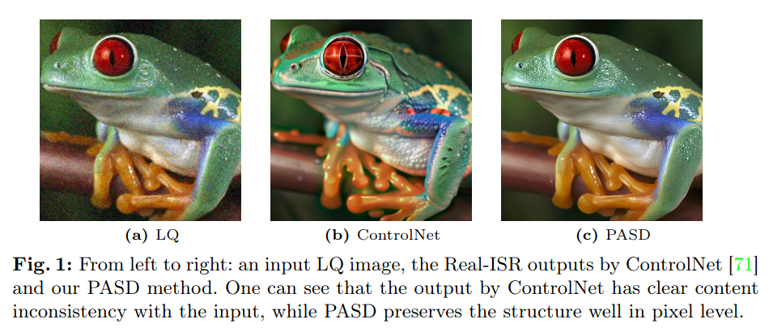
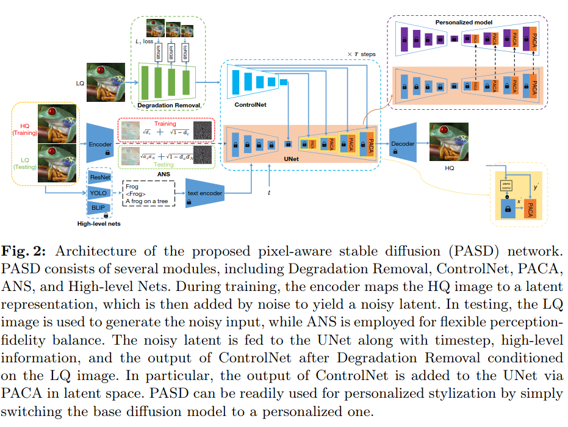

## PASD: Pixel-Aware Stable Diffusion for Realistic Image Super-Resolution and Personalized Stylization
*arXiv(2023), 34 citation, The Hong Kong Polytechnic University & Alibaba Group, Review Data: 2024.08.20*

[Intro](#intro) 
[Related Work](#related-work) 
[Method](#method) 
[Experiment](#experiment) 
[Conclusion](#conclusion) 

> Core Idea

<strong>"test1"</strong> 

***

### <strong>Intro</strong>

$\textbf{이 주제의 정의 및 요구사항과 중요한 이유}$

- 실제 세계의 이미지는 획득 과정에서 저해상도, 블러, 노이즈 등 복잡한 열화가 혼합되어 발생하는 경우가 많다. 이미지 복원 방법은 특히 딥러닝 시대에 큰 진전을 이루었지만, 여전히 방법론 설계에서 이미지 충실도를 추구하다 보니 과도하게 부드러운 디테일을 생성하는 경향이 있다. 이미지 충실도에 대한 제약을 완화함으로써 현실감 있는 이미지 초해상도(Real-ISR)는 열화된 관찰 데이터로부터 지각적으로 현실적인 이미지 디테일을 재현하는 것을 목표로 한다. 생성적 적대 신경망(GAN)과 적대적 학습 전략은 Real-ISR에서 널리 사용되었고, 유망한 결과를 얻었지만, GAN 기반 Real-ISR 방법은 여전히 풍부하고 현실적인 이미지 디테일을 재현하는 데 한계가 있으며, 종종 불쾌한 시각적 인공물을 생성하는 경향이 있다.

- Diffusion model은 다양한 image 생성, 수정, 향상, 전이 task들에 대해서 인상적인 성능을 보여줬다. 특히, pre-trained text-to-image stalbe diffusion model은 strong generative priors를 가지고 realistic super-resolution (Real-ISR)와 image stylization problem에 대해서 잠재적인 해결책을 제공했다.

$\textbf{이 주제의 문제점과 기존의 노력들}$

- GAN 기반 방법은 만화화 및 오래된 사진 복원과 같은 다양한 이미지 스타일화 작업에서도 널리 사용되어 왔다. 예를 들어, Chen 등은 CartoonGAN을 제안하여 짝을 이루지 않은 데이터를 사용해 만화 스타일화를 생성했다. 그러나 서로 다른 스타일을 위해서는 다른 모델을 훈련시켜야 했습니다. Wan 등은 삼중 영역 변환 네트워크를 도입하여 오래된 사진을 복원했으나, 이 방법의 다단계 절차는 사용하기에 복잡하다는 단점이 있다.

- 하지만, 기존의 방법론들은 신뢰성있는 pixel-wise image structure을 유지하는 데 실패했다. 

$\textbf{최근 노력들과 여전히 남아있는 문제들}$

- ControlNet은 픽셀 단위의 조건부 제어에는 적합하지 않다. Liu와 Wang 등은 사전 학습된 SD 프라이어를 이미지 컬러화 및 Real-ISR에 사용할 수 있음을 입증했으나, 픽셀 수준의 세부 정보를 전달하기 위해 스킵 연결에 의존하여 이미지 복원에 추가적인 학습이 필요했고, 이는 이미지 스타일화와 같은 잠재 공간에서 수행되는 작업에 모델의 능력을 제한했다.

$\textbf{본 논문에서 해결하고자 하는 문제와 어떻게 해결하는지, 그 결과들}$

- 본 연구에서는 Real-ISR 및 개인화된 이미지 스타일화를 달성하기 위해 pixel-aware stable diffusion (PASD) network를 제안한다. 
  - 구체적으로, pixel-aware cross attention module을 도입하여 diffusion model이 픽셀 단위로 이미지의 지역적 구조를 인식할 수 있도록 한다.
  - Degradation removal module을 사용하여 이미지의 고수준 정보와 함께 확산 과정을 안내하는 degradation에 민감하지 않은 특징을 추출한다. 
  - 조정 가능한 noise schedule을 도입하여 이미지 복원 결과를 더욱 향상시킨다. 
  - Base diffusion model을 styleized diffusion model로 대체하는 것만으로도 PASD는 쌍을 이루는 학습 데이터를 수집하지 않고도 다양한 스타일의 이미지를 생성할 수 있으며, 기본 모델을 미적 모델로 교체함으로써 PASD는 오래된 사진을 되살릴 수 있다. 

$\textbf{Word}$

- PASD: Pixel-Aware Stable Diffusion 
- PACA: Pixel-Aware Cross Attention 
- Real-ISR: Realistic Image Super-Resolution
- HQ: high-quality image
- LQ: low-quality image
- ANS: Adjustable noise schdule

***

### <strong>Related Work</strong>

- Realistic image super-resolution 
- Personalized Styleization 
- Diffusion Probabilitic Models 

***

### <strong>Method</strong>

- PASD
  - Degradation Removal, ControlNet, PACA, ANS, High-level Nets
  - High-level Nets: image를 보고 대략적인 captioning을 진행하는 network 

- Degradation Removal
  - 저해상도 이미지의 degradation 영향을 줄이고 저해상도에 민감하지 않은 저수준 제어 특징을 추출한다. 
  - LQ 이미지에서 깨끗한 특징을 추출하여 확산 과정을 제어한다. 
  - LQ 이미지의 $1/2, 1/4, 1/8$ 축척 해상도에서 다중 스케일 특징 맵을 추출한다. 
  - 직관적으로, 이러한 특징들이 직관적으로, 이러한 특징들이 해당 스케일에서 고해상도(HQ) 이미지를 최대한 가깝게 근사할 수 있도록 사용되며, 이후의 확산 모듈이 현실적인 이미지 디테일 복원에 집중할 수 있도록 하여 이미지 열화를 구별하는 부담을 줄인다. 
  - 따라서, 모든 단일 스케일 특징 맵을 HQ RGB 이미지 공간으로 변환하기 위해 "toRGB"라는 컨볼루션 레이어를 사용하는 중간 감독을 도입한다. 각 해상도 스케일에서 L1 손실을 적용하여 해당 스케일에서 HQ 이미지의 피라미드 분해와 유사하게 재구성되도록 한다.
  - 이 module은 Real-ISR task에서만 필요하다.

- High-level Nets
  - 의미적 제어 특징을 추출하는 고수준 정보 추출 모듈 

- Pixel-Aware Cross Attention (PACA)
  - 이미지 복원 과정에서 이미지 디테일과 texture를 픽셀 단위로 인식시킨다.
  - 잘 알려진 ControlNet은 엣지나 분할 마스크와 같은 작업별 조건을 잘 지원하지만, 픽셀 단위의 제어에는 실패한다.
  - 두 네트워크의 특징 맵을 단순히 더하는 것은 픽셀 수준의 정밀한 정보를 전달하지 못할 수 있으며, 입력 저해상도(LQ) 이미지와 출력 고해상도(HQ) 이미지 간의 구조적 불일치를 초래할 수 있다. LQ 입력에 ControlNet을 단순 적용했을 때 출력 이미지에서 구조적 불일치가 명확하게 나타난다.

- ANS

***

### <strong>Experiment</strong>

***

### <strong>Conclusion</strong>

***

### <strong>Question</strong>

