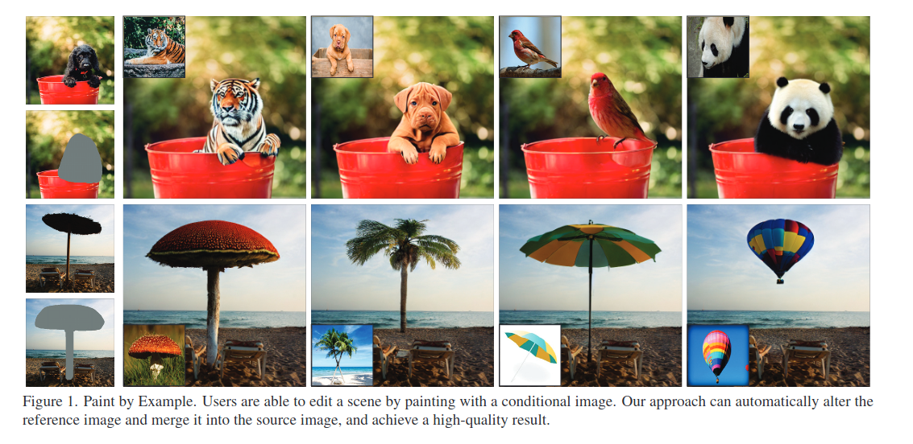
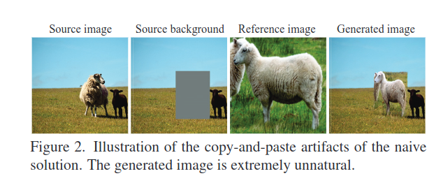
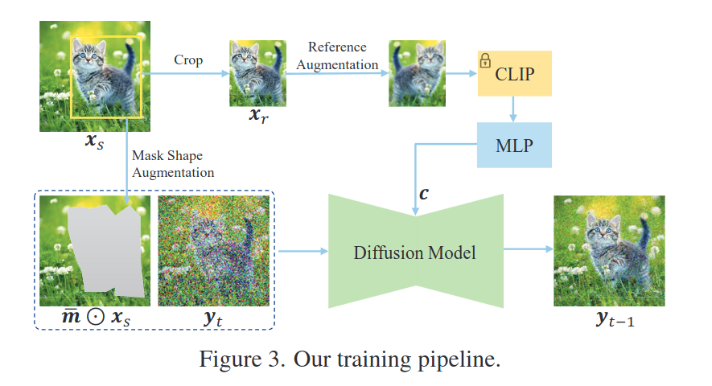
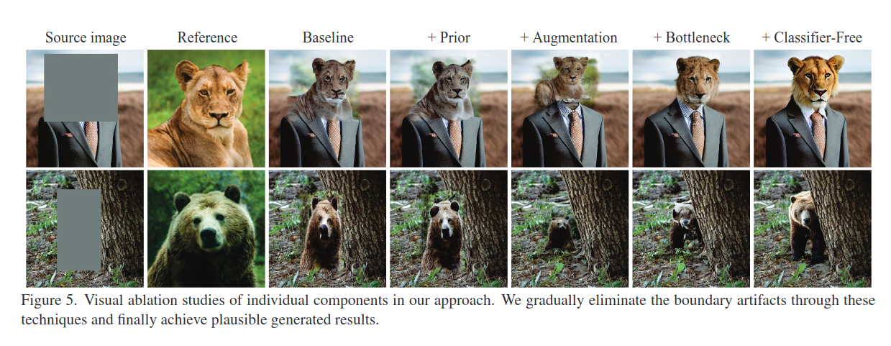

## Paint by Example: Exemplar-based Image Editing with Diffusion Models
*CVPR(2023), 90 citation*

[Intro](#intro) 
[Related Work](#related-work) 
[Method](#method) 
[Experiment](#experiment) 
[Conclusion](#conclusion) 

> Core Idea

<strong>"Image Editing with Reference Image using Self-supervised Learning"</strong> 

***

### <strong>Intro</strong>

- Exemplar-guide 로 image editing 을 진행한다. 
  - Self-supervised training 으로 source image 와 exemplar 를 disentangle 하고 re-organize 한다. 
  - 하지만, 단순한 접근 방식으로는 exemplar image 를 copy and paste 하는 것과 같이 명백한 artifacts 를 초래하기에, content bottleneck 과 strong augmentation 을 제안했다.
  - Exemplar image 에 대한 arbitrary shape mask 를 설계했고, exemplar image 와의 유사성을 위해 classifier-free guidance 를 도입했다. 
  - Model 은 self-reference setting 으로 학습된다. (reference image 가 input image 의 변형임)
    - 하지만 이건, real exemplar 에 일반화되지 않는다. model 은 간단하게 reference object 를 copy-and-paste 하면 되기 때문이다. 
    - 이 문제를 해결하기 위해 본 논문에서는 $2$ 가지 방법을 추가로 도입한다. 
      - 1. pre-trained model 사용. 하지만 오랜 시간 fine-tuning 을 하면 문제가 발생할 수 있다.
      - 2. 따라서, Spatial token 을 버리고 오직 global image embedding 만을 condition 으로 사용하는 self-reference conditioning 을 도입 (content bottleneck)
    - 더불어서, 훈련이 실제 편집에서 사용되는 것처럼 일반적인 user brush 를 흉내내기 위해 불규칙한 random mask 를 사용했다.
    - Classifier-free guidance 를 도입.

- Difficulty
  - 1. Model 은 reference image 의 형태와 질감을 캡쳐하면서 배경에서의 잡음은 무시해야 한다. 
  - 2. 객체의 변형된 모습 (다른 자세, 크기, 조명) 을 합성하여 원본 이미지에 맞게 표현해야 한다.
  - 3. Model 은 masking region 의 경계를 smooth 하게 변환시켜야 한다. 
  - 4. Reference image 의 해상도는 edit region 보다 낮을 수 있다. 이런 경우, model 은 super-resolution 을 포함해야 한다. 

***

### <strong>Related Work</strong>
1. Image Composition
2. Semantic Image Editing
3. Text-driven Image Editing

***

### <strong>Method</strong>

- Source image $X_s \in R^{H \times W \times 3}$
- Edit region 은 사각형이나 irregular shape 둘 다 가능
- Binary mask $m \in$ { $0,1$ } $^{H \times W}$
  - $1$ 이 수정가능한 영역이다. 
- Reference image $X_r \in R^{H' \times W' \times 3}$
- 우리의 목적은 { $X_s, X_r, m$ } 으로부터, image $Y$ 를 생성하는 것이다.

- Training data
  - { $(\bar m \odot X_s, X_r, m),X_s$ }: (원본 이미지에 object 마스킹 된 이미지, 참조 이미지, mask image, ground truth)
  - 실제 학습에는 $m$ 이 들어가지는 않는다. 

- Text-guided inpainting model 의 경우 condition $c$ 는 text 가 입력으로 들어간 pre-trained CLIP text encoder 의 output ($77$ token) 이다.
  - 마찬가지로, 본 논문에서는 CLIP image embedding 으로 간단하게 생각할 수 있다. (class token $1$ 개 + patch token $256$ 개) $c = CLIP_{all}(X_r)$
  - 이 단순한 해결책은 훈련과정에선 잘 수렴한다. 하지만 test image 에 적용할 때는 생성된 결과가 복사 및 붙여넣기 artifacts 가 존재한다. 즉, 자연스럽지 않은 이미지가 생성된다. 
  - 따라서, 본 논문에서는 content bottleneck 을 도입하여 네트워크가 단순히 복사하는 것을 막고 reference image 의 contents 를 이해하도록 강제했다.
  - 강력한 augmentation 을 도입하여 training 과 test 시의 불일치 문제를 완화한다. 
  - Classifier-free guidance 도입

- Compressed representation. 
  - Text conditioning 의 경우, the model is naturally compelled to learn semantics as text is an intrinsically semantic signal.
  - Image conditioning 의 경우, context information 을 이해하기보다는 기억하고 복사하는 것이 쉽기에 model 이 해당 방향으로 나아가게 된다. 
  - 이를 피하기 위해, reference image 의 정보를 압축하여 mask region 을 재구성하게 하여 난이도를 높여준다. (CLIP image encoder 의 class token 만을 사용)
  - 이로써, reference image 를 $224 \times 224 \times 3$ 에서 차원이 $1024$ 인 $1$ 차원 벡터로 압축하게 된다. 
  - 하지만, 이렇게 고도로 압축하게 되면 의미 정보는 유지하지만 high-frequency detail 을 무시하는 경향이 있어서 FC layer 를 추가로 연결하여 feature 를 decode 한다.
  - 또한, 복사 붙여넣기 학습을 방지하기 위해 pre-trained model 을 사용한다. (좋은 초기화)

- Strong Augmentation. ($A$)
  - Self-supervised learning 으로 인해, training & testing 사이의 domain gap 이 존재한다. 
  - 따라서, Augmentation 을 진행 (including flip, rotation, blur and elastic transform) 하여 source image 와의 연결을 끊는다. 

$$ c = MLP(CLIP(A(X_r))) $$

- Mask Shape Augmentation.
  - Bounding box 에 기반한 arbitrarily shaped mask 를 생성했다. 
  - 1. Bounding box 의 edge 에 대해, 먼저 Bessel curve 를 만들고 curve 에서 uniformly $20$ 개의 point 를 sampling.
  - 2. 무작위로 $1 - 5$ pixel offset 을 추가한다.
  - 3. 이러한 지점들을 직선으로 순차적으로 연결하여 임의의 모양을 가진 mask 를 생성한다. 
  - Training 과 Test 시에 차이를 줄였다.

- Classifier-free guidance
  - $20$ % 로 learnable vector $v$ 를 사용

- Ablation study
  - Baseline: pre-trained model 안 쓰고 학습
  - Prior: pre-trained model 사용
  - Augmentation: strong augmentation
  - Bottleneck: class token 만 사용

***

### <strong>Experiment</strong>

***

### <strong>Conclusion</strong>

- Self-supervised Learning 으로 인해 reference image 가 학습 과정에서 올바르게 작동하지 않을 수 있다. (copy-and-paste)
1. pre-trained model 사용. 하지만 오랜 시간 fine-tuning 을 하면 문제가 발생할 수 있다.
2. CLIP image embedding 의 Spatial token 을 버리고 오직 global image embedding 만을 condition 으로 사용하는 self-reference conditioning 을 도입 (content bottleneck)
   1. 이렇게 함으로써, 강제적으로 reference image 의 contents 를 이해하도록 시킴 (정보가 적으니까)

3. 훈련이 실제 편집에서 사용되는 것처럼 일반적인 user brush 를 흉내내기 위해 불규칙한 random mask 를 사용했다.

4. Strong Augmentation
   1. Reference image
   2. Mask shape

5. Classifier-free guidance 를 도입.

***

### <strong>Question</strong>

