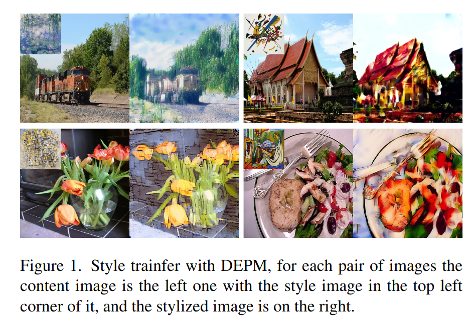
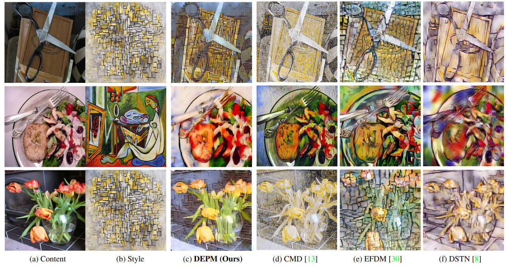

## Diffusion-Enhanced PatchMatch: A Framework for Arbitrary Style Transfer With Diffusion
*CVPR(2023), 0 citation*

[Intro](#intro) 
[Related Work](#related-work) 
[Method](#method) 
[Experiment](#experiment) 
[Conclusion](#conclusion) 

> Core Idea

<strong>"Style Transfer using Diffusion Model without Any Training"</strong> 

***

### <strong>Intro</strong>
- Diffusion model 은 text-to-image synthesis 부터 image restoration, image engancement, image compression, image inpainting 등 다양한 task 를 수행할 수 있다.
- 하지만, 단어로 style 을 표현하는 것은 어려운 과제이다.
- 본 논문에서는 Stable Diffusion 을 활용하여 어떤 finetuning 이나 pre-training 없이 style transfer 를 하는 Diffusion-Enhanced PatchMatch(*DEPM*) 를 제안한다.
- 즉, inference 시에 임의의 스타일을 전송할 수 있다.

***

### <strong>Related Work</strong>
- Style transfer technique 은 3 가지 type 으로 분류할 수 있다.
  - Optimization-based
    - A neural algorithm of artistic style(2015)
    - Arbitrary style transfer in real-time with adaptive instance normalization(2017)
  - Neural network training-based
    - Perceptual losses for real-time style transfer and super-resolution(2016)
    - A style-aware content loss for real-time hd style transfer(2018)
  - Arbitrary image style transfer
    - Fast patch-based style transfer of arbitrary style(2016)
    - Universal style transfer via feature transforms(2017)

- DEPM 은 훈련이 필요하지 않고 임의의 스타일을 전송하는 더 유연하고 효율적인 해결책을 제공하려는 $3$ 번째 범주에 속한다. (Arbitrary image style transfer)

***

### <strong>Method</strong>
- Whitening and Coloring Transform(WCT)

***

### <strong>Experiment</strong>

***

### <strong>Conclusion</strong>
- Utilize Patch-based techniques with whitening and coloring transformations in latent space  
- Input image 의 content detail 을 보존하면서 color transformation 관점에서 우수한 성능을 보여준다.
- 어떤 학습 없이 arbitrary style transfer 가 가능하다. 

***

### <strong>Question</strong>

