## Plug-and-Play Diffusion Features for Text-Driven Image-to-Image Translation
*CVPR(2023), 356 citation, Weizmann Institute of Science, Review Data: 2024.06.14*

[Intro](#intro) 
[Related Work](#related-work) 
[Method](#method) 
[Experiment](#experiment) 
[Conclusion](#conclusion) 

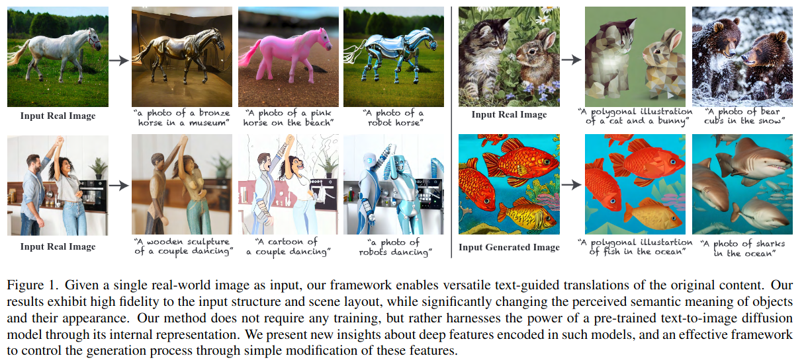

> Core Idea

<strong>"While Maintaining Structure of Original Image, Change Semantic Meaning of Text Guidance, Training-Free"</strong> 

***

### <strong>Intro</strong>

$\textbf{이 주제의 정의 및 요구사항과 중요한 이유}$

- Large-scale text-to-image generative model 은 굉장히 복잡한 시각적 주제도 받아들여 다양한 이미지를 합성한다. 

$\textbf{이 주제의 문제점과 기존의 노력들}$

- T2I 의 발전은 콘텐츠 생성에서 창의적인 프로세스를 새롭게 만들어내지만, 그들의 강력한 representation 은 사용자의 제어성을 희생시키고 있다. 즉, 사용자는 입력된 text 를 통해서만 생성 과정을 이끌어 낼 수 있다. 
- 이러한 모델을 실제 콘텐츠 생성 작업에 활용하는 데 있어서 중요한 과제는 생성된 콘텐츠에 대한 사용자의 제어권을 제공하는 것이다. 

$\textbf{최근 노력들과 여전히 남아있는 문제들}$

- 생성된 layout 의 조작하는 가능한 방법은 user-provided mask 와 같은 추가적인 guiding signal 을 명시적으로 조합하는 것이다. 
  - Make-A-Scene: object 의 class 와 layout 을 정의하는 label segmentation mask 를 조건으로 text-to-image model 을 학습했다. 
- 하지만, 광범위한 계산이 필요할 뿐만 아니라 추론 할 때도 이런 input 이 필요하다. 

$\textbf{본 논문에서 해결하고자 하는 문제와 어떻게 해결하는지, 그 결과들}$

- 이 논문에서는 T2I synthesis 를 I2I transformation 의 영역으로 확장하는 새로운 framework 를 제안한다. 
  - Artistic drawing 부터 photo-realistic image 까지의 범위를 가지는 structure guidance signal 
- Guidance image 와 target text prompt 를 입력으로, pre-trained text-to-image diffusion model 이 guidance image 의 semantic layout 을 보존하면서 target text 를 준수한다. 
  - 특히, 모델 내부의 spatial feature 와 self-attention 을 조작함으로써 생성된 구조에 대한 세밀한 제어를 달성할 수 있다고 경험적으로 입증했다.
  - 학습이나 fine-tuning 이 전혀 필요하지 않다. 
  - Realistic image 를 sketch 로 변환하거나 대충 그린 그림, animation 으로 변환 할 수 있다.
  - 심지어는 class, object 의 변형, lighting 이나 색깔도 수정할 수 있는 다재다능한 text-guided image translation task 를 할 수 있다.

- 구체적으로 근본적인 질문은 "모델 내부에서 구조적 정보가 어떻게 인코딩되는지" 이다. 
  - 이를 위해, 생성 과정 중에 형성되는 intermediate spatial feature 를 탐구하고, 이를 경험적으로 분석한 후, 모델 내부의 공간적 특성에 간단한 조작을 적용하여 생성된 구조를 세밀하게 제어할 수 있는 새로운 framework 를 개발했다. 
  - Guidance image 에서 공간적 특성과 self-attention 을 추출하고, 이를 target image 의 text-guided generation process 에 직접 주입했다. 

- 본 논문의 접근법은 Prompt-to-Prompt 와 연관이 있다. P2P 는 cross-attention layer 를 조작하여 이미지의 공간 배치와 각 단어 간의 관계를 제어할 수 있음을 관찰했다. 
  - 그러나, 생성된 layout 에 대한 세밀한 제어가 텍스트와의 상호작용만으로는 어렵다는 것을 입증했다. 즉, text 로 표현되지 않는 지역적 공간 정보 (e.g., 객체의 일부분)는 P2P 에 의해 보장되지 않는다. 
  - 반면, 본 논문의 방법은 공간 정보의 높은 세분화를 보여주며 text 와의 상호작용을 제한하지 않으면서도 생성된 구조를 제어할 수 있다. 

- An overview of Prompt-to-Prompt 

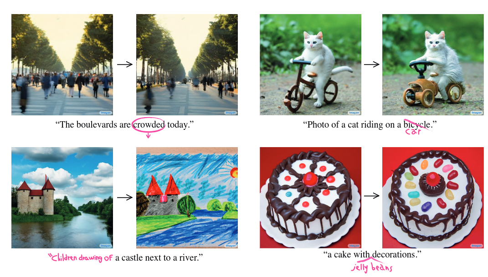

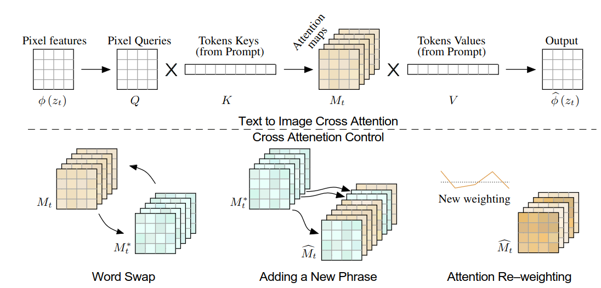

$\textbf{본 논문의 주요 기여점}$

1. 생성 과정에서의 내부적 공간적 특징에 대해 새로운 경험적 insight 를 제공한다. 
2. 학습이나 fine-tuning 없이 text-guided I2I translation 을 수행할 수 있는 framework 를 제안했다. 
3. 정량적, 정성적으로 basline 을 뛰어넘었다. 

***

### <strong>Related Work</strong>

- Image-to-image translation
  - Input image 의 domain 에 불변한 특성들은 (e.g., 물체의 구조나 장면의 layout) 보존하면서 source domain 에서 target domain 으로 image 를 mapping 한다. 
  - 다양한 방법들이 존재하지만, 대부분 source 와 target domain 의 예시 이미지들이 training data 로 필요하다. E.g., horse-to-zebra, day-to-night, summerj-to-winter
  - 다른 방법들은 pre-trained model 을 활용한 latent space walk 이다. 

- Text-guided image manipulation
  - DiffusionCLIP 은 text guided 조작을 수행하기 위해 CLIP 을 diffusion model 을 fine-tune 하는 데 사용한다. 
  - DreamBooth 와 Textual Inversion 은 사용자가 제공한 이미지를 개인화하는 것이라는 공통 목표를 공유한다. 하지만 이들과 다르게 어떠한 학습이 필요하지 않다. 
  - SDEdit: 학습이 필요없고 text 로 guidance 를 줄 수도 있다. 하지만, guidance layout 을 보존하고 target text 를 충족시키는 사이에 trade-off 관계가 존재한다. (어떤 time step 에서 다시 복원을 시작하냐에 따라서 realistic 과 faithfulness 가 달라진다)

- Trade-off relationship in SDEdit

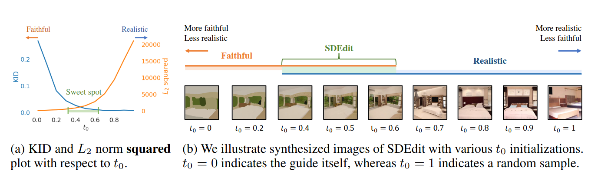

***

### <strong>Method</strong>

- SD v1.4 를 사용했다. 
  1. Guidance image 를 DDIM Inversion 을 통해 noise 화 시킨다. 그 후, U-Net 에 통과시켜 spatial layout 을 추출. 이때의 text 는 null 값이다. Text-guided generation 하고 있는 U-Net 에 공간적 정보를 전달한다. 
  2. DDIM Inversion 으로부터 구한 noise 를 그대로 물려받는다. 특정 time-step 이후에 $i.$ 에서 수행한 결과들을 받아서 최종 결과를 도출한다.

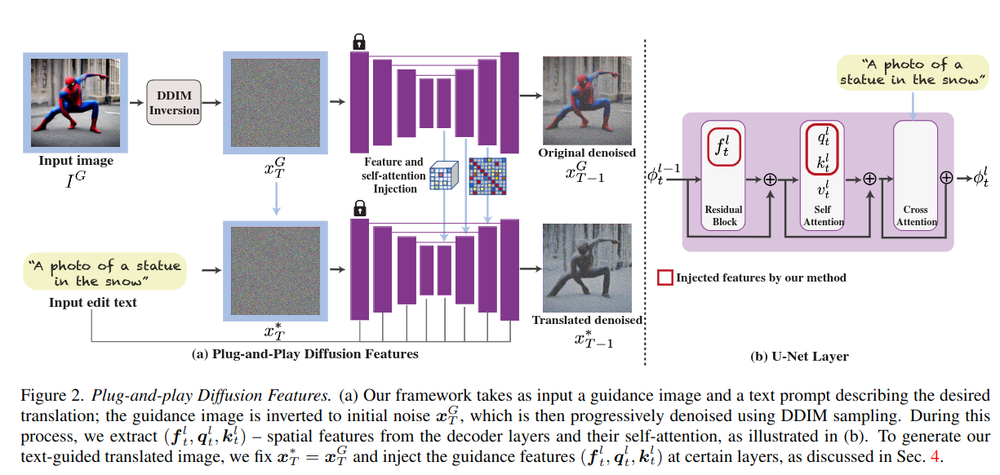

- 저자는 경험적으로 generation process 에서 decoder layer 를 시각화하여 다음을 알아냈다. 
  1. 중간 decoder layer 에서 추출된 공간적 feature 는 semantic information 을 encoding 하며 외형 정보에 영향을 덜 받는다. 
  2. 공간적 특성 간의 유사성을 나타내는 self-attention 은 정교한 layout 과 shape detail 을 보존할 수 있다. 

$\textbf{Spatial features}$

- 인간형 이미지 $20$ 장 (generated & real images) 를 사용했고, 전체 생성 과정의 약 $50$ % ($t= 540$) 에서 서로 다른 decoder layer 에서 spatial feature 를 시각화했다. 
  - $t=540$ 이니 학습 과정에서 (DDPM 은 $T=1000$ 이니까) 시각화 한 거 같다. 
  - 각 block 에서 추출된 feature vector ($f_t^l$) 에 대해서 PCA 를 적용하고 상위 $3$ 가지 주요 구성 요소를 시각화했다. (색깔이 있는 거 보니까 $H \times W \times 3$ 인데, channel 별로 $3$ 개씩 골라서 시각화 한 거 같다)
  - Layer $4$ : 객체 외관의 큰 변동과 이미지 도메인 내에서 모든 이미지에 공유되는 의미 있는 영역 (e.g., 다리, 머리가 구분됨)을 보여준다. 
  - Layer $7$ : 여기서부터는 외형 정보도 포함되고 있다. 

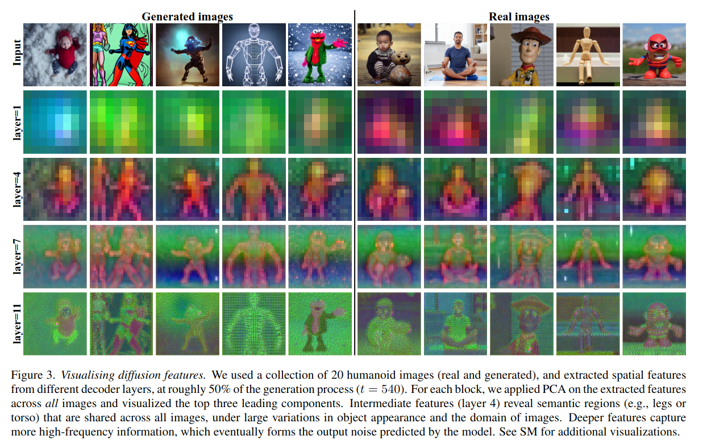

- 각 시간 단계에서 이미지들 간에 의미 있는 부분들이 (유사한 색상을 가진) 공유된다. 
  - 다리, 허리, 머리가 모든 이미지에서 각각 비슷한 색상으로 묘사된다. 
  - 네트워크가 더 깊을수록, 점점 더 높은 주파수의 저수준 정보를 캡처하게 된다. 

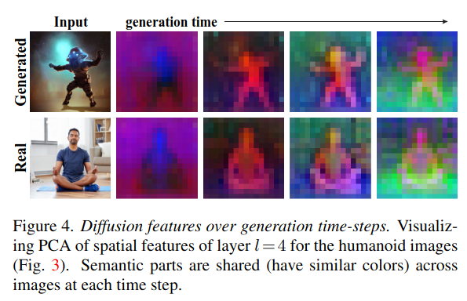

$\textbf{Feature injection}$

- $x_T^G = x_T^*$

- Ablation study
  - (a): Feature injection 을 각 layer 에 대해서 수행 
    - Figure $3$ 에서도 볼 수 있듯이 layer $11$ 은 appearance 가 같이 표현되기에 layers $4-11$ 에서는 source image 의 외형 정보가 표현된다. 
  - (b): Feature injection 은 $4$ 에서만, attention injection 은 각 열에 표시된대로 수행된다.
    - Feature vector 는 layer $4$ 가 semactic layout 정보만을 가지고 있었고, self-attention 은 $4-11$ 까지 모두 semantic layout 을 가지고 있기에 가장 효과가 좋다.

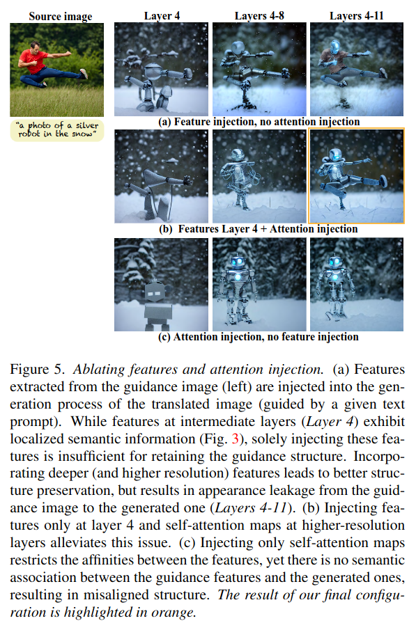

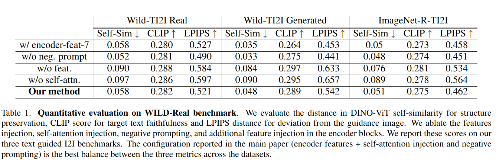

$\textbf{Self-attention}$

- Self-attention visualization 
  - self-attention matrix $A_t^l$ : time step $t$ 에서 $l$ 번째 self-attention layer 의 query, key 의 내적 및 softmax 한 결과 
  - $A_t^l$ 에 대해서 마찬가지로 PCA 로 $3$ 가지 주요 요소를 시각화했다. 
  - 비슷한 영역이면 비슷한 색을 공유한다. e.g., 바지, 머리, 머리카락, 눈사람

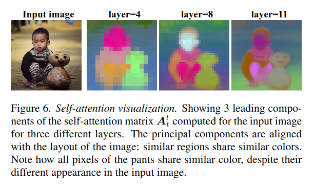

$\textbf{Negative-prompting}$

- Classifier-free guidance 를 사용하여 original prompt 를 더 반영하지 않는 결과를 유도한다. 
  - $\omega$: $1$ 보다 크면, conditional prediction 방향으로 보외법을 한다. 즉, unconditional prediction 방향으로부터 멀어지는 방향으로 shift 되는데, 이때의 unconditional 의 text 를 null 값이 아니라 original prompt (guidance image 를 설명하는)로 설정하면 original content 로부터 멀어진다. 
  - 근데 온전히 negative prompt 로 unconditional prediction 을 구성하는 게 아니라 $\alpha$ 로 값을 조정한다. 

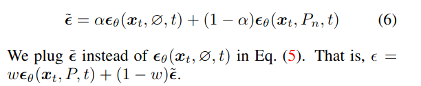

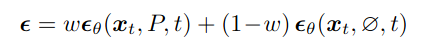

- Plug-and-Play Algorithm
  - Time step $T$ 에서부터 $1$ 까지 denoising 을 한다. 
  - 이때, $\tau_f$ 는 feature injection 을 언제까지 할건지, $\tau_A$ 는 self-attention 의 query, key 를 언제까지 injection 할 것인지를 나타낸다. 
  - DDIM $50$ step: $\tau_f=40, \tau_A=25$

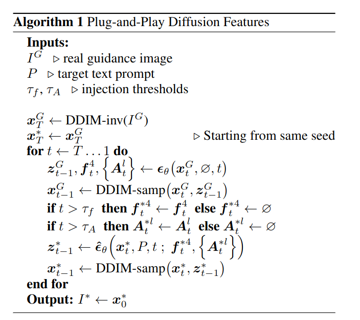

***

### <strong>Experiment</strong>

$\textbf{Datasets}$

- 본 논문의 방법 (text-guided image-to-image translation) 은 arbitrary image domain 에 적용 가능하다. 
- 이렇게 다양한 setting 에 대한 benchmark 가 존재하지 않기에, $2$ 가지 새로운 dataset 을 만들었다. 
  - Wild-TI2I: web 에서 구한, $148$ 개의 다양한 text-image pairs
  - ImageNet-R-TI2I: ImageNet-R dataset 으로부터 구성한 ImageNet object calss 의 다양한 공연 (e.g., 그림, 자수 등)
  - $10$ 개의 다양한 class 로부터 $3$ 개의 high-quality image 를 선택했다. 

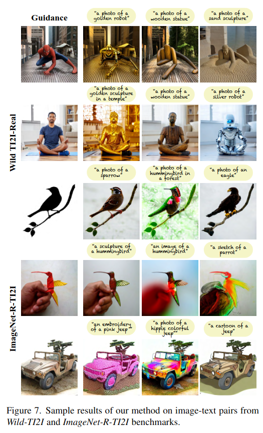

$\textbf{Baselines}

- SDEdit: $3$ 개의 서로 다른 noise level 
- Prompt-to-Prompt 
- DiffuseIT
- VQGAN-CLIP
- Text2LIVE
- FlexIT
- DiffusionCLIP

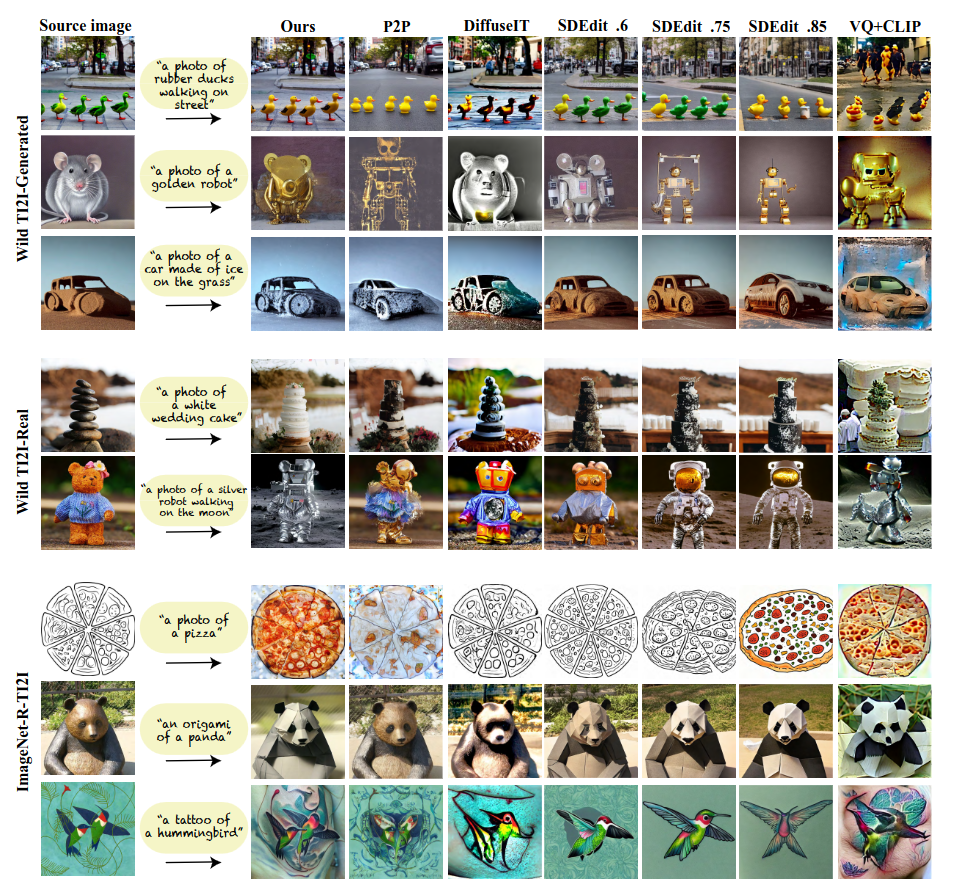

- P2P 와의 비교: semantic layout 을 더 잘 보존한다. 

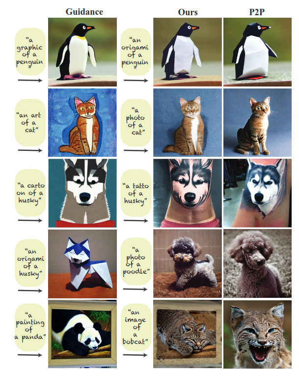

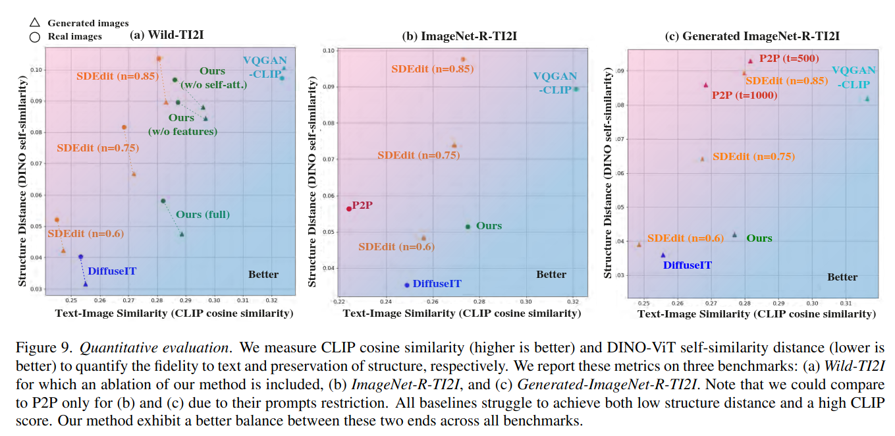

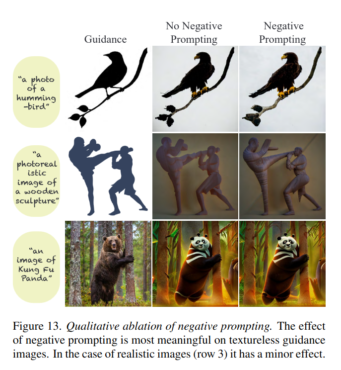

***

### <strong>Conclusion</strong>

***

### <strong>Question</strong>

<a href="">link</a>

> 인용구
