## Q-Diffusion: Quantizing Diffusion Models
*ICCV(2023), 31 citation, UC Berkeley, Review Data: 2024.3.20*

[Intro](#intro) 
[Related Work](#related-work) 
[Method](#method) 
[Experiment](#experiment) 
[Conclusion](#conclusion) 

> Core Idea

<strong>"Data Free, Time Step-Aware Calibration Data Sampling, Specialized Quantizer (4 bit), and Post-Training Quantization (PTQ) Tailored towards Diffusion models"</strong> 

***

### <strong>Intro</strong>

- Unique multi-timestep pipeline 과 diffusion model 의 구조에 특화된, PTQ method 를 제안한다. 이로써, Diffusion model 을 압축하여 generation process 를 가속화한다. 

- Pre-trained diffusion model 로부터, time step 에 따른 calibration (보정) data smapling mechanism 을 제안한다. 
  - 이는 모든 time step 의 activation distribution 을 나타낸다. 
  - 또한, calibration objective 와 weight 및 activation quantizer 의 설계를 diffusion model 에 맞춰서 조정한다. 
  - $4$ bit 로 양자화된 diffusion model 이다. 
  - 데이터가 필요없다.

***

### <strong>Related Work</strong>

- PTQ4DM: diffusion model 을 PTQ 방식으로 $8$ bit quantize 한 논문이다. 하지만 주로 smaller dataset 과 lower resolution 에 초점을 맞췄다. 

***

### <strong>Method</strong>

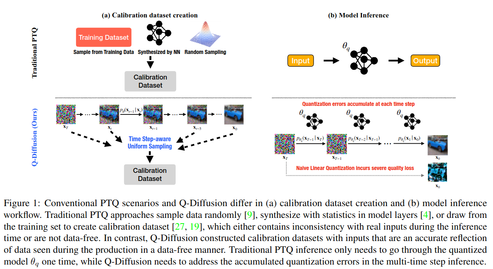

- (a): 본 논문에서는 noise estimation network (UNet) 의 각 time step 마다의 output distribution 이 매우 다를 수 있다는 걸 알아냈다. 따라서 단순하게 모든 time step 에 동일한 PTQ calibration 을 사용하면 성능이 저하된다. 
- (b): 또한, UNet 의 반복적인 inference 는 quantization error 를 누적한다. 이는 UNet 을 위한 혁신적인 quantization 방법과 calibration objective 를 설계하는 데 높은 요구를 제기한다. 

$\textsf{Calibration dataset}$

1. Calibration dataset 은 calibration 시 layer 의 출력 분포를 계산하기 위해서 사용되는 dataset 이다. 이 dataset 을 통해 내가 quantization 한 model 의 성능을 측정하기 때문에, 실제 사용되는 dataset 의 특징을 모두 담고있어야 한다. 
2. 선택한 calibration dataset 을 통해 FP 32 layer (original model) 의 출력 분포를 계산한다.
3. 내가 제안한 method 를 통해 original model 을 quantize 한다. 
4. Calibration dataset 을 통해 quantized model 의 출력 분포를 계산한다. 
5. 분포 간 거리 (KL divergence) 를 계산하여 모델을 평가한다. 거리가 작을수록 원래 모델의 성능을 유지한다는 의미가 된다. 

$\textsf{Post-Training Quantization}$

- $s$: denotes the quantization scale parameters
- $c_{\text{min}}, c_{\text{max}}$: lower and upper bounds for the clipping function clip() 

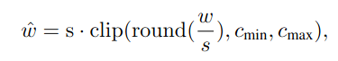

$\textsf{Challenge 1: Quantization errors accumulate across time stpes}$

- Neural network model 에 quantization 을 수행하면 훈련된 모델의 weight 와 activation 에 noise 가 도입되어 각 레이어의 출력에 quantization error 가 발생한다. 이전 연구에서도 양자화 오류가 레이어 간에 누적될 가능성이 있음을 확인했다. 
- 아래의 figure 에서 볼 수 있듯이, 기존의 fp $32$ 와의 quantization error 가 time step $t$ 에 따라서도 누적됨을 알 수 있다. 
  - 특히, INT 4 의 경우 오차가 더 크다. 
  - 이는 모든 time step 에서 quantization error 를 최소화해야 함을 의미한다. 

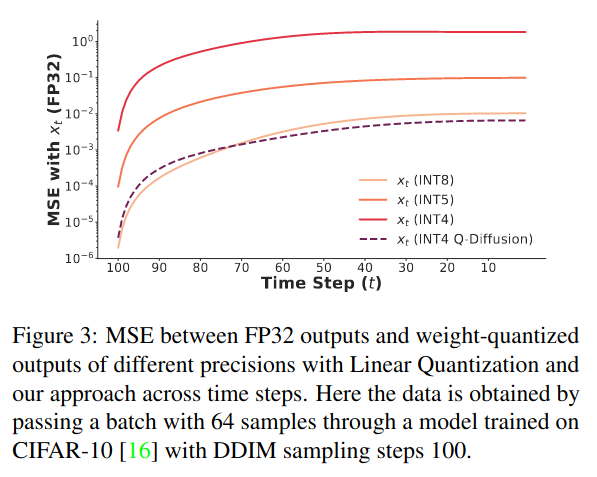

$\textsf{Challenge 2: Activation distributions vary across time steps}$

- 각 time step 에서의 quantization error 를 줄이기 위해 calibration data 로 보정한다. 이때의 calibration data 는 activation distribution 을 올바르게 측정하여 모델의 activation distribtuion 을 올바르게 보정할 수 있도록 실제 입력 분포를 닮은 sample 이어야 한다. 
- 다양한 time step 에서의 UNet model 의 output activation distribution 을 확인했다. $100$ 개의 sampling step 을 가진 DDIM 을 사용하여 동일한 CIFAR-10 실험을 수행하고, 모든 time step 중 $1000$ 개의 무작위 샘플 중 활성화 범위를 그린다.
  - Figure 에서 볼 수 있듯이, activation distribution 은 점진적으로 변화하며 이웃하는 time step 은 유사하고 멀수록 다르다. 
  - Time step 마다 다른 output activation distribution 은 quantization 에 추가적인 어려움이다. 

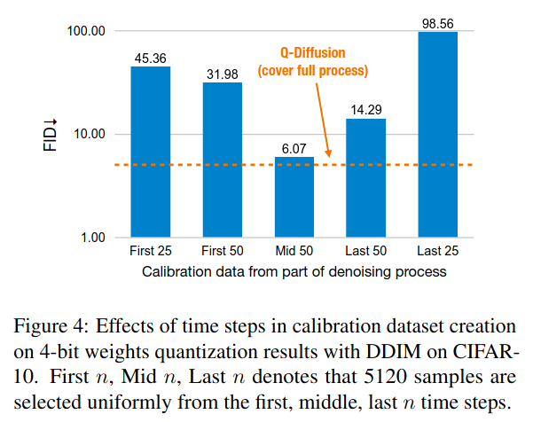

- 특정 time step 에서의 $5120$ sample 을 calibration dataset 으로 만드는 경우 ($4$ bit weights quantization) 의 성능이다. 
  - $n$ 이 증가할수록 성능 손실이 덜하고 가운데의 time step 에서의 dataset 이 좋다.
  - 즉, 위에서의 figure 를 보면 중간 단계의 time step 이 어느 정도 전체 범위를 포착하기 때문이다. 결론적으로는 양자화된 모델의 성능 회복을 위해 다양한 time step 에서의 output activation distribution 을 포괄적으로 고려하여 calibration dataset 을 선택해야 한다. 

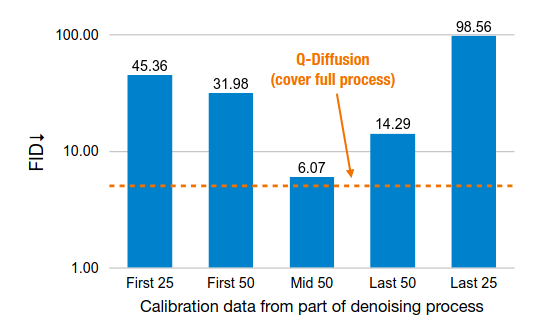

$\textsf{Two methods}$

- 앞서 살펴봤던 문제는, time step 에 따른 (1) quantization error 의 누적과, (2) output activation distribution 의 변화이다. 
- 이 문제를 해결하기 위해서 본 논문은 $2$ 가지 방법을 제안한다. 

1. 연속적인 시간 단계의 출력 분포는 종종 매우 유사함을 이전 figure 에서 밝혔으니, 모든 time step 에 걸쳐 일정한 간격으로 중간 입력을 균일하게 무작위 sampling 하여 작은 calibration dataset 을 생성하는 것을 제안한다. 

2. Shortcut-splitting quantization: shortcut layer 에서의 비정상적인 activation 및 weight 분포를 해결하기위해, connection 전에 양자화를 수행하는 "split" quantization 을 제안했다. 

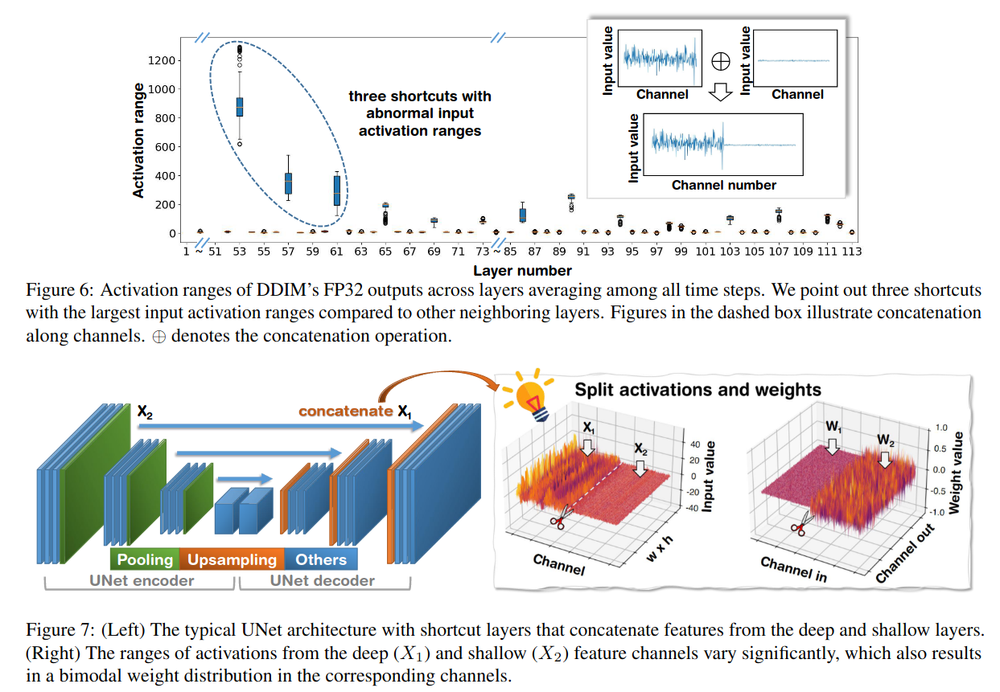

***

### <strong>Experiment</strong>

$\textsf{Setup}$

- Pixel-space diffusion model DDPM 과 latent-space diffusion model Latent Diffusion for unconditional image generation 을 사용
- Channel-wise Linear Quantization 을 baseline 으로 사용
- $32 \times 32$ CIFAR-10, $256 \times 256$ LSUN Bedrooms, and $256 \times 256$ LSUN Church-Outdoor 를 dataset 으로 사용
- DDIM sampler $100$ denoising time step for inference 
- FID and IS 를 통해 evaluation

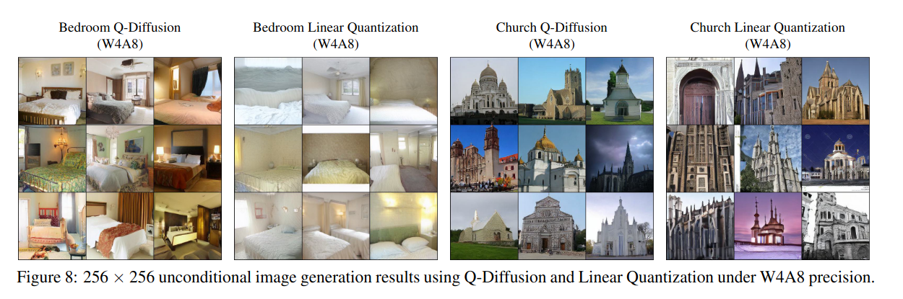

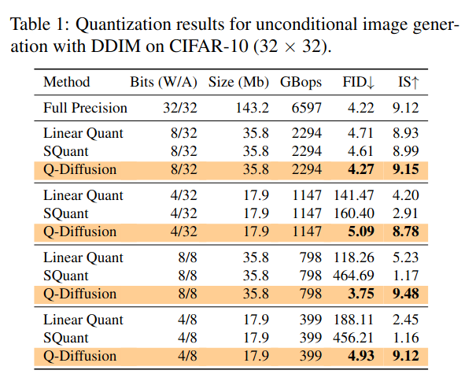

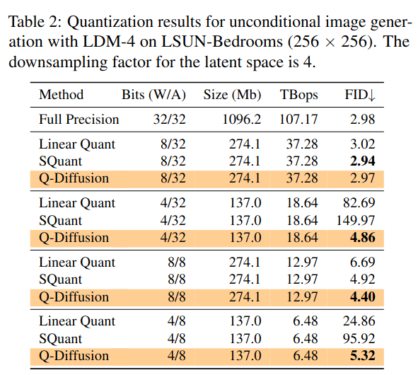

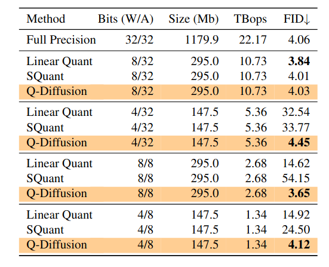

- Text-guided image generation 도 평가한다. 

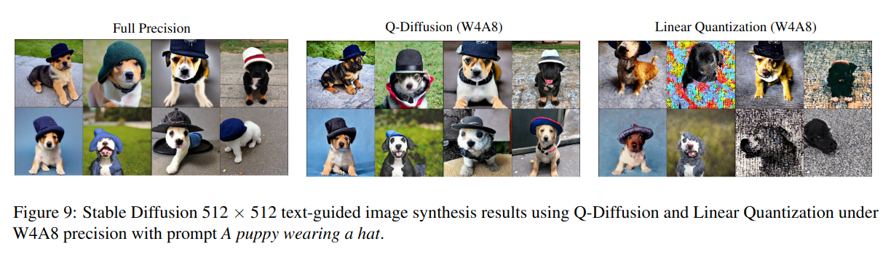

- Ablation Study

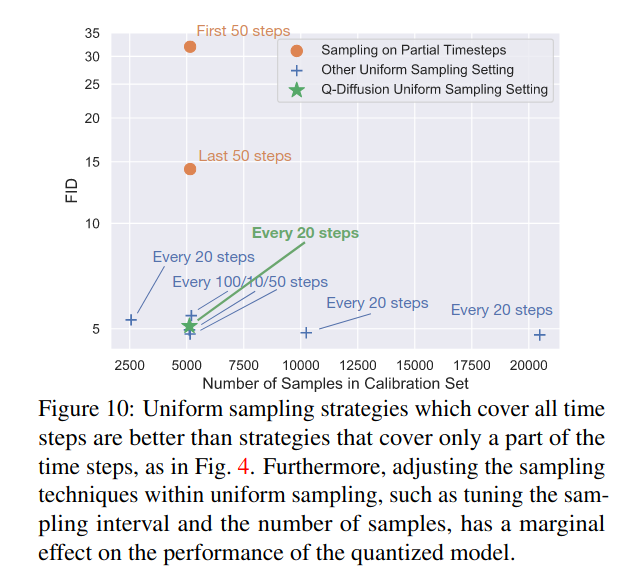

***

### <strong>Conclusion</strong>

***

### <strong>Question</strong>

<a href="">link</a>

> 인용구
