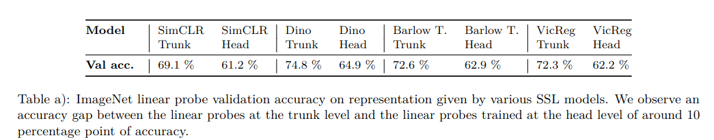

## RCDM: High Fidelity Visualization of What Your Self-Supervised Representation knows About
*arXiv(2021), 34 citation*

[Intro](#intro) 
[Related Work](#related-work) 
[Method](#method) 
[Experiment](#experiment) 
[Conclusion](#conclusion) 

> Core Idea

<strong>"Visualize Representation of Self-Supervised Learning via Diffusion Models"</strong> 

***

### <strong>Intro</strong>
- Self-supervised learning 을 통해 기존의 supervised learning 보다 downstream task (e.g., classification) 에 더 큰 성과를 달성했다. 
- 본 논문에서는, self-supervised learning 을 통해 학습한 representation 이 과연 무엇일지 diffuison model 을 통해 visualization 을 한다. 
- 흔히, self-supervised learning 은 $2$-stage 로 구성된다.
  - First: Backbone (resnet $50$/ViT) + Projector (small NLP) train
  - Second: discard Projector and use Backbone model in downstream task (performance: $10$ ~ $20$ % by using representations at Backbone level)
- 또한, input image 의 invariance 를 가정하고 학습을 진행한다. 
  - Image 에 다양한 augmentation 을 거친 뒤, input 으로 넣게 되고 projector 를 거쳐 나온 representation 끼리의 similarity 를 가깝게 학습한다. (positive sample)
    - E.g., SimCLR
  - 이때, invariant training criteria 가 적용된 건 projector level 인데 downstream task 에서 사용할 땐 projector 를 제거하는 이유도 이 논문에서 보여준다. 
- 본 논문에서 사용하는 self-supervised methods 는 **VicReg, Dino, Barlow Twins, SimCLR** 이다.
- **모든 RCDM sample 은 같은 condition 에서 반복적으로 sampling 하고, 공통적으로 발견되는 것이 representaion 으로써 encoding 된 것으로 본다.**

***

### <strong>Related Work</strong>

***

### <strong>Method</strong>

- 본격적으로 representation 을 탐구하기에 앞서 visualization model (generative model) 로 diffusion model 을 사용한 이유를 알아보자.
  - Diffusion model
    - 1. High-quality samples
    - 2. Samples are faithful: Large vector representation 을 condition 으로 받기에 적합하다. Condition 을 잘 반영하여 생성한다. 
    - 3. Additional reasons
      - GAN is unstable training, 
      - GAN has mode collapse 
      - FID, IS is better than GAN 

- Performance of diffusion models (using Backbone representations, Dino, ImageNet)
  - (a): In-distribution conditional image synthesis
  - (b): Out of distribution conditional image synthesis (Wikimedia)
  - (c): Interpolation (linear) (ImageNet validation)

- Comparison of FID, IS between diffusion and GAN

- 지금부턴, 왜 backbone representaion 을 쓰는 게 downstream task 에서 성능이 더 잘 나오는지 알아보자. 

- Backbone representations vs Backbone + Projector representations 
  - Backbone level 에서의 representaion 을 쓰는 게 성능이 더 좋다. ($10$ % gap)

- 각 method 별, level (backbone/projector) 별로 RCDM sample 을 뽑은 결과이다. 
  - Backbone representation 을 사용해서 generation 을 하면 input image 의 detail 한 정보 (e.g., background, pose)까지 담겨져 있는 걸 알 수 있다.
  - 그에 반해 generation at projector level 은 context 가 아닌, global information 만을 담고 있다. 
  - 즉, input 의 중요한 정보를 projector representation 은 가지고 있지 않기 때문에 성능 차이가 나는 것이다.  

- 여기선, self-supervised representation 이 data augmentation 에 정말로 invariant 한지를 알아보자. 
  - Self-supervised representation at backbone: object scale, grayscale vs color, color palette of the background 모두 variant 하다. (supervised representation 과 같이)
  - Self-supervised representation at projector: object scale 은 encoding 하고 있지만, grayscale-status and background color information 은 제거했다. 즉, object scale 을 제외한 다른 augmentation 에 대해서는 invarinace 하다.

- 마지막으로, Adversarial attack 의 robustness 를 보자
  - Fast Gradient Sign attacks (FGSM) method 를 사용했다. 
  - Original image 에 다른 class 의 gradient (noise) 를 더해서 miss-classification 하도록 한다. 
  - Supervised manner: 약간의 noise 가 더해져도 바로 class 가 바뀐다.
  - Self-supervised: 어느 정도 강건하다. 

- Model Architecture
  - $f$: self-supervised models

***

### <strong>Experiment</strong>

- Setting
  - $2048$ dimensional representation given by a ResNet $50$ 
  - ImageNet
  - Dino, SimCLR

- Additional results: Performance of diffusion models (using Backbone representations, Dino, ImageNet) 
  
- (a): In-distribution conditional image synthesis (Fig. 8)

- (b): Out of distribution conditional image synthesis (Wikimedia) (Fig. 9)

- (c): Interpolation (linear) (ImageNet validation) (Fig. 14, 15)

- Same class with Barlow Twins representaions 

- Espresso class with Barlow Twins representaions 
  

***

### <strong>Conclusion</strong>

|               | **Information about Input Image** | **Invariance to Data Augmentation** |
|:-------------:|:---------------------------------:|:-----------------------------------:|
|  **Backbone** |       Global + detailed info      |            Not invariance           |
| **Projector** |            Global info            |              Invariance             |

***

### <strong>Question</strong>
