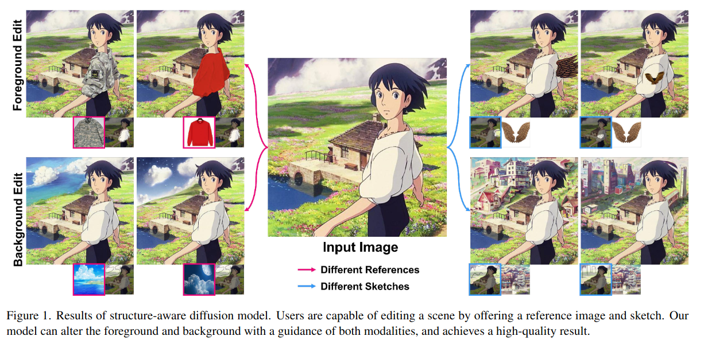
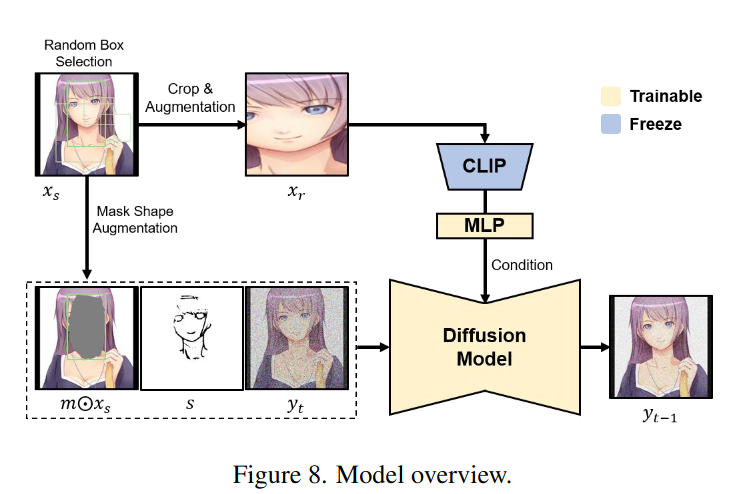
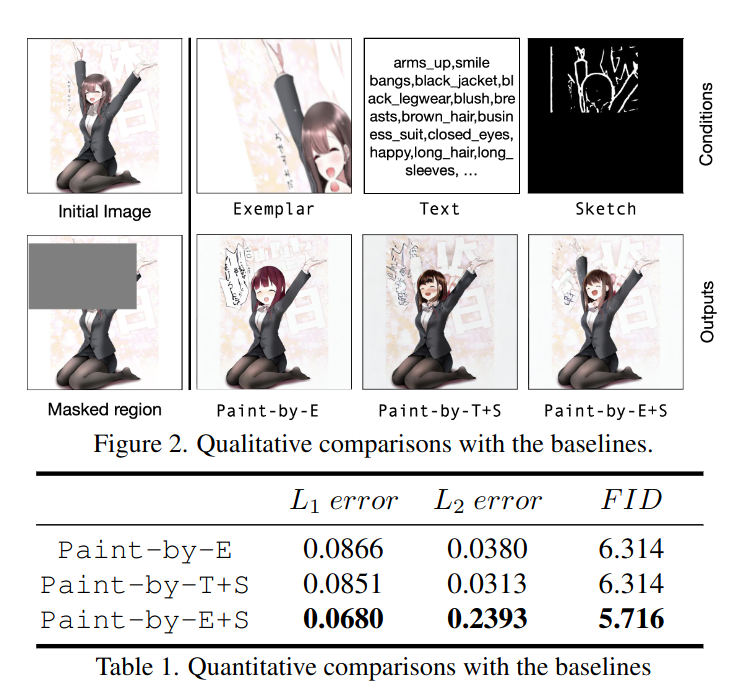
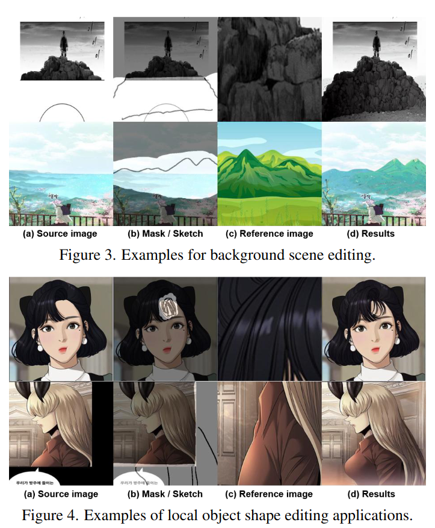
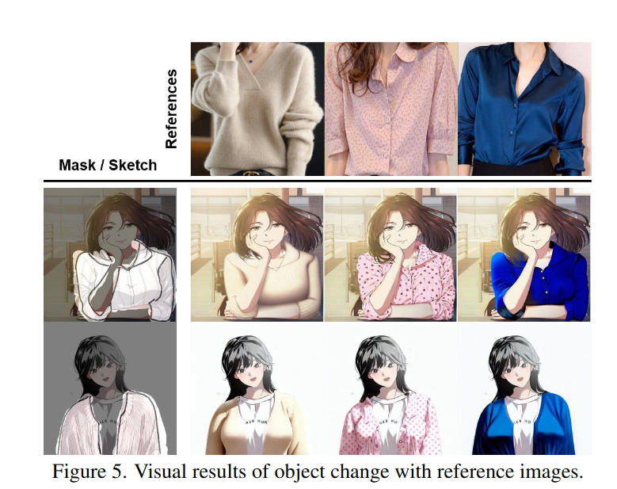
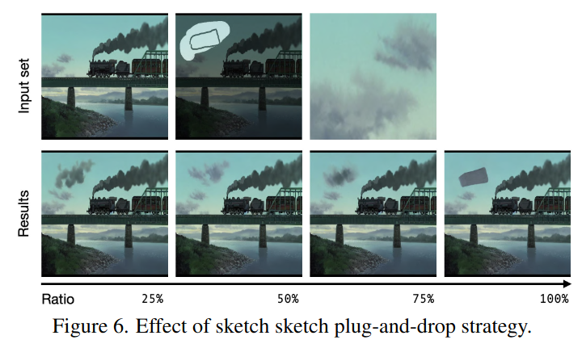
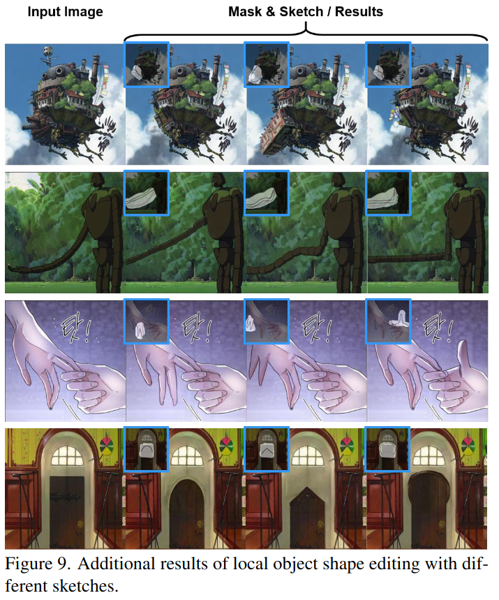
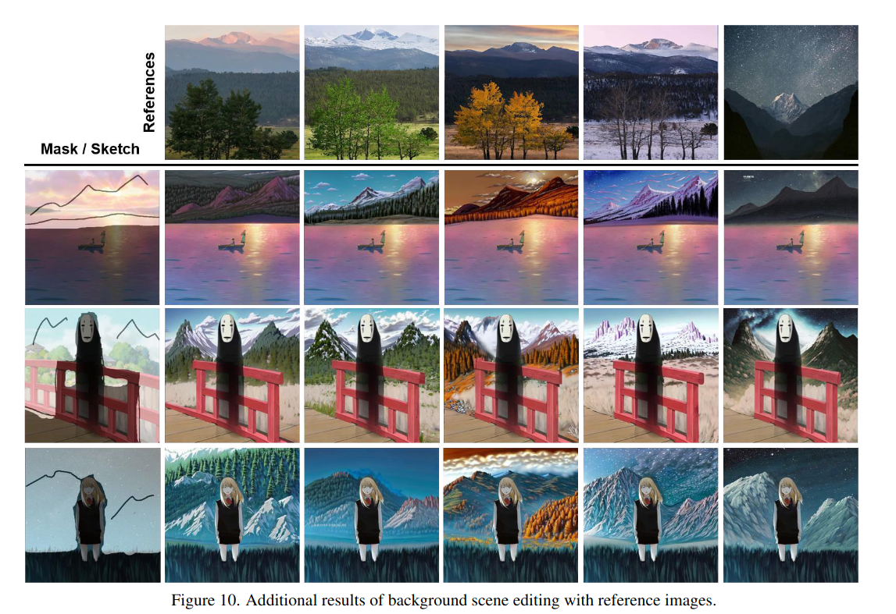
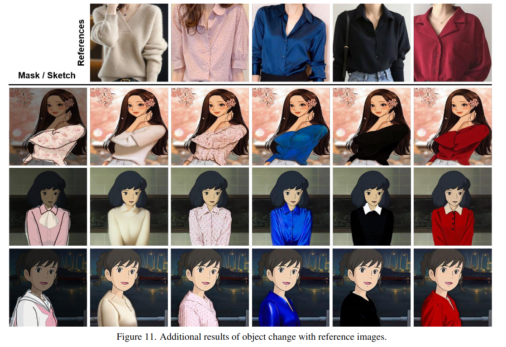

## Reference-based Image Composition with Sketch via Structure-aware Diffusion Model
*arXiv(2023), CVPR workshop(2023),  6 citation, 주재걸 교수님(KAIST)/Naver Webtoon, Review Data:2024.06.13*

[Intro](#intro) 
[Related Work](#related-work) 
[Method](#method) 
[Experiment](#experiment) 
[Conclusion](#conclusion) 

> Core Idea

<strong>"By Offering a Reference Image and Sketch, Users Can Edit a Scene"</strong> 

***

### <strong>Intro</strong>

$\textbf{이 주제의 정의 및 요구사항과 중요한 이유}$

- 최근 large-scale text-to-image 생성 모델의 놀라운 발전은 high-fidelity image 를 생성한다. 
- Painy-by-Example 은 textual description 으로부터 발생하는 모호함을 방지하기 위해 visual hint 를 사용하는 방법을 제안했다. 
  - 이러한 방법은 user 가 reference image 를 이용하여 object-level 의 sematic 을 조작할 수 있게 도와준다. 

$\textbf{이 주제의 문제점과 기존의 노력들}$

$\textbf{최근 노력들과 여전히 남아있는 문제들}$

$\textbf{본 논문에서 해결하고자 하는 문제와 어떻게 해결하는지, 그 결과들}$

- 본 논문의 목적은 새로운 modal 로써 partial sketch (부분 스케치)를 통합하는 것이다. 
  - Sketch 는 직관적이고 효율적인 의미를 제공한다. 
- Editalbility 와 fine-grained generation 을 가능하게 하기 위해, 본 논문은 multi-input-conditioned (i.e., sketches and reference image) image composition model 을 제안한다. 
- Sketch 를 이용한 edge-level 의 controllability 덕분에 원하는 구조 (i.e., sketch) 와 content (i.e., reference image) 를 수정하거나 완성할 수 있다. 
- 본 논문은 sketch guidance 를 유지하면서 reference image 를 사용하여 원하는 영역을 완성한다. 
- Pre-trained diffusion model 을 fine-tuning 한다. 
- Inference phase 에, Sketch plug-and-drop startegy 를 도입했다.
  - 지나치게 단순화된 스케치 (e.g., 구름을 생성하기 위한 단일 직선)가 미치는 영향을 줄이고, 다양한 유형의 스케치를 모델이 수용할 수 있게 한다. 

$\textbf{본 논문의 주요 기여점}$

- 새로운 modal 인 sketch image 를 diffusion model 에 통합시켰다.
- Inference phase 에, Sketch plug-and-drop startegy 를 도입했다.

***

### <strong>Related Work</strong>

***

### <strong>Method</strong>

- PBE 와 완전 동일한 대신, sketch condition 이 input 에 추가된 꼴이다. 
  - Model 도 PBE model 을 사용했다. 

$\textbf{Sketch Plug-and-Drop Strategy}$

- Free-drawn sketch 가 user 가 그린 편리한 condition 임에도 불구하고 model 입장에서는 윤곽 구조를 엄밀히 유지하는 데 어려움을 겪는다. 
  - 특히, 구름이나 눈 덮인 나무와 같은 배경 풍경을 생성할 때 발생하며, 이런 배경 풍경에 대한 sketch 의 경계는 모호하다. 
  - 이런 경우, 단순한 직선은 설명하기에 충분하지 않을 수 있지만 사용자의 부담을 줄일 수 있다. 
  - 이런 측면에서, 본 논문은 스케치 조건의 삽입 단계를 유연하게 조정할 수 있는 간단하면서도 효과적인 방법을 도입한다. 
  - Time step 을 줄이는 방법이다. 

***

### <strong>Experiment</strong>

- 총 $3$ 가지의 condition 이 존재한다. 
  - 두 번째 행의 두 번째 열은 기존의 PBE (only use reference image)의 결과이다.
  - 두 번째 행의 세 번째 열은 text 와 sketch 를 조건으로 생성한 결과이다. 
  - 두 번째 행의 네 번째 열은 reference image + sketch 로 생성한 결과이다. 

- 대충 그린 sketch 에 큰 영향을 받지 않게끔 조정하는 방법이다. 
  - $100$ 에 가까울수록 영향을 많이 받는다는 얘기가 된다. 
  - 이 경우, user 는 하늘에 구름을 더하는 걸 원한다. 하지만 sketch guidance 는 직선으로 되어있기에 detail 한 구름의 경계선을 표현하기에는 부적절하다. 

***

### <strong>Conclusion</strong>

***

### <strong>Question</strong>

<a href="">link</a>

> 인용구
