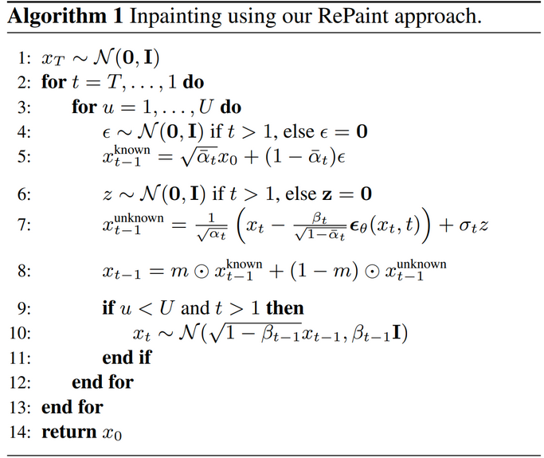
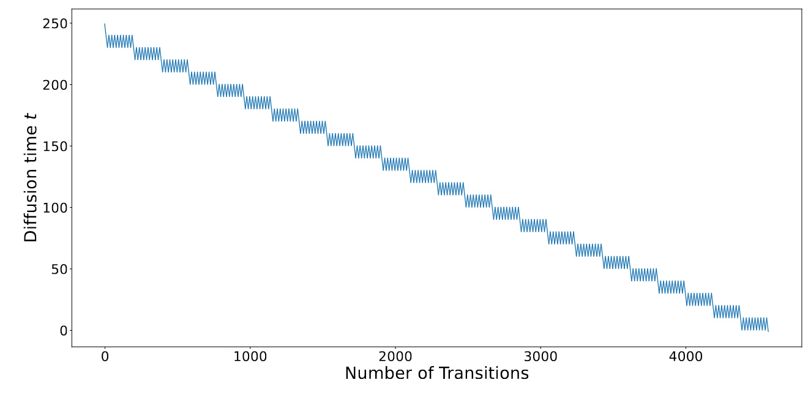

## RePaint: Inpainting using Denoising Diffusion Probabilistic Models
*CVPR(2022), 441 citation*

[Intro](#intro) 
[Related Work](#related-work) 
[Method](#method) 
[Experiment](#experiment) 
[Conclusion](#conclusion) 

> Core Idea

<strong>"Image Inpainting using DDPM"<strong> 
without Condition such as Text

***

### <strong>Intro</strong>
- Image inpainting 은 masking 된 부분을 생성했을 때, 나머지 영역과 의미적으로 합리적이어야 한다. 심지어는 극단적인 형태의 masked region 도 처리해야 한다.
- 대부분의 존재하는 방법들은 특정 분포의 마스크를 학습하기 때문에, unseen mask type 에 대해서 일반화 능력이 부족하다.
- 본 논문에서는, pretrained unconditional DDPM 을 사용하여 free-form inpainting task 를 해결하고자 한다. Probabilistic modeling 에 기반함에도 (not deterministic) diverse and high-quality image를 생성할 수 있다.
- Inpainting task 를 학습하지 않는다. 이로 인해 얻을 수 있는 이점은 2가지 이다.
	- inference 시에 어떤 형태의 mask 가 들어와도 일반화 할 수 있다.
	- image 생성에 강력한 능력을 갖춘 DDPM 을 사용했기 때문에, 더욱 의미론적인 이미지 생성을 할 수 있다. 
- Standard DDPM sampling strategy 를 사용하면 texture 는 일치하지만, 종종 의미적으로 부정확할 때가 존재한다. 따라서 본 논문에서는 개선된 denoising 전략(= **resample**)을 도입한다.

***

### <strong>Related Work</strong>
1. Deterministic Image Inpainting 
2. Diverse Image Inpainting 
3. Usage of Image Prior
4. Image Conditional Diffusion Models 

***

### <strong>Method</strong>

1. DDPM 을 downstream task 인 inpainting task 에 대해서는 학습하지는 않는다. 
	- 단, DDPM 의 pre-trained 는 "Improved denoising diffusion probabilistic models" 라는 논문에서 제안한 방법으로 학습한다.
	- 위의 논문은 variance 까지 학습 대상으로 보고 reverse process의 sampling step 을 줄여주는 method 를 제안한 논문이다.   
	- 또한, "Diffusion models beat gans on image synthesis" 라는 논문을 기반으로 training & inference 를 진행한다. 
	- 최종적으로 inference time 을 4배 줄였다. 
	- 예상컨대, loss setting & inference -> "Improved ..." | model architecture ->  "... beat gans ..." 로 보인다. 
  
2.  Definition
	- Ground Truth image $x$ 
	- Mask region $m$ (made of 0)
	- Unknown pixels $m \odot x$
	- Known pixels $(1-m) \odot x$

3. Process 
- $x^{known}_{t-1}$ 는 clean data $x_0$ 에서 forward process 를 통해 구한다.
- $x^{unknown}_{t-1}$ 는 $x_T \sim N(0,I)$ 를 sampling 하고 model 에 input 으로 제공하여, noise 를 예측한 값을 통해서 iterative 하게 denoising 하여 구한다.
- $new\ sample\ x_{t-1}$ = $m$ $\odot$ $x^{known}_{t-1}$ + $(1-m)$ $\odot$ $x^{unknown}_{t-1}$
- forward process 로 구한 $x^{known}_{t-1}$ 은 원본을 유지하고 있다.
- reverse process(model) 로 구한 $x^{unknown}_{t-1}$ 은 새로 생성하는 이미지이다. 
  - 따라서 원본의 정보를 함유하고 있지 않다. 추후에 이 문제로 인해 resample 이 등장

1. Resample
- *3. Process* 를 적용하여 inpainting 을 진행해보면, generated image 가 content/texture 면에서만 일치하고 의미적으로 일치하지 않는 것을 확인할 수 있다.

- $n =1$ 인 경우가 *3. Process* 를 그대로 적용한 결과이다. masking 한 부분에 대해서 생성하는 과정인 $(1-m) \odot x^{unknown}_{t-1}$ 에서 뒷 부분인 $x^{unknown}_{t-1}$ 가 어떻게 생성됐는지를 보면, $x_{T} \sim N(0,I)$ 에서 sampling 한 뒤에, model 을 통해 iterative 하게 구한 값이다. 다시 말해, time step $T$ 에선 원본의 정보를 고려하지 않은 채 $x_{T-1}$ 을 generation 하기 때문에 문제가 발생한다. 
- $x_{T-1}$ 이후에는  $new\ sample  \; x_{t-1} = m \odot x^{known}_{t-1} + (1-m) \odot x^{unknown}_{t-1}$ 로 인해 new sample $x_{t-1}$ 에 원본의 정보가 들어온 상태에서, model($x_t$, $t$) 에 입력으로 들어오고 self-attention 으로 인해서 원본의 정보를 고려해서 $\epsilon$ 을 output 으로 내뱉긴 하지만 완전한 조화를 이루기에는 어려움이 존재한다. 
- '그럼 조화를 이루기 위해, 어떤 조건이 필요할까' 라고 고민해보면 $\epsilon$ 으로 $x^{unknown}_{t-1}$ 를 만들기 때문에, 결국 model 이 원본의 정보를 충분히 받아들여서 $\epsilon$ 을 생성할 수 있어야 한다. 
- 해당 조건을 해결해주는게 본 논문에서 제안하는 *resample* 이다. 
- 원본의 정보를 가지고 $\epsilon$ 을 잘 prediction 할 수 있도록 원본의 정보가 담긴 $new\ sample\ x_{t-1}$ 에서 $x_t$ 를 다시 sampling 한 뒤, 원본의 정보가 담긴 $x_t$ 를 다시 model 에게 전달해서 원본을 고려해 $x^{unknown}_{t-1}$ 을 재생성할 수 있게 setting 했다.
  

* 10번째 줄에, $x_t$ 를 re-sampling 하는 과정은 오류로 보인다. 논문에서는 글로 다음과 같이 설명하고 있다. 
  

***

### <strong>Experiment</strong>
Setting
- CelebA-HQ & ImageNet dataset
- 256 x 256 resolution
- T = 250, r = 10, j = 10
- r : Re-sampling 을 해당 time-step 에서 몇 번할지
- j : Re-sampling 을 안 하는 구간의 길이 
  

Evalution 
- 생성된 image 가 사실적인가 (human eval)
- LPIPS : 2개의 이미지 유사도 평가 (VGG network 에 넣어서 중간 layer feature 값들을 비교, the lower is better)

Result
- free-form mask 에 대해서 좋은 성능을 달성한다. 

Ablation study
- 대체로 r, j 모두 늘리는 방향이 점수가 높다

***

### <strong>Conclusion</strong>
- Iterative 하게 Random Gaussian noise 를 sampling 했기 때문에 다양한 output image 를 생성할 수 있다. 
- free-form inpainting 이 가능하다. (masking 모양에 대한 generalization 능력을 갖춤)
- 다른 diffusion-based model 과 마찬가지로 GAN 이나 autoregressive-based model 보다 느리다. 이는 실시간 적용이 힘들다는 얘기와 같다.
- 넓은 mask 를 사용하는 경우, ground truth 와 굉장히 다른 이미지를 생성해낸다. 

***

### <strong>Question</strong>