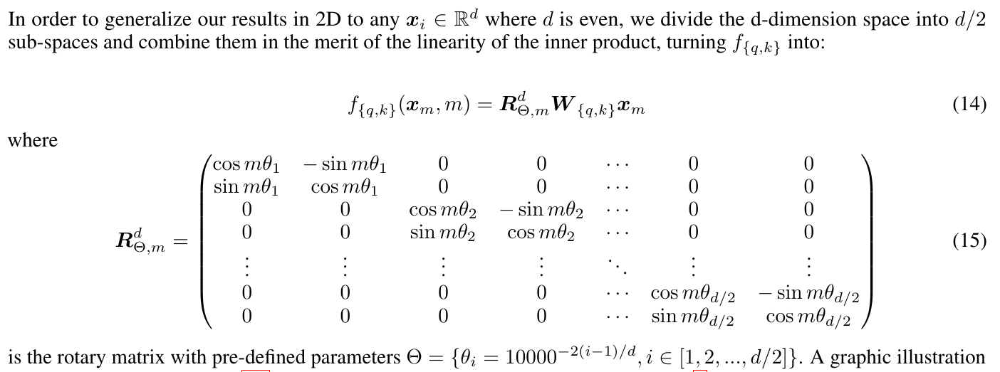
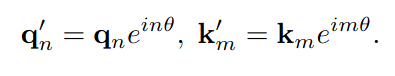
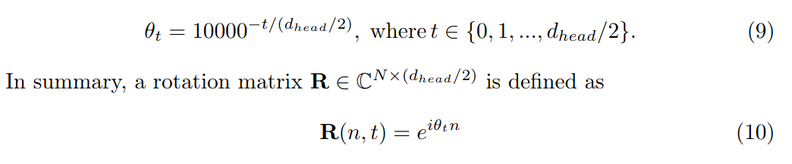
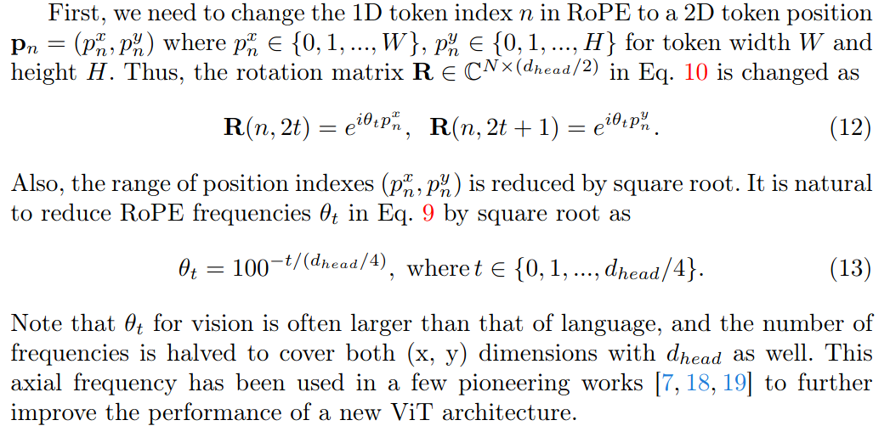
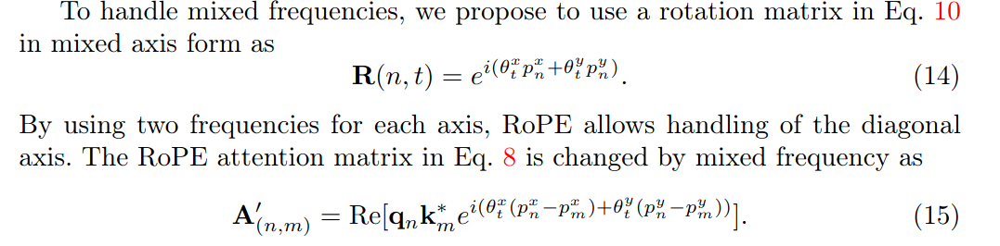

## Rotary Position Embedding for Vision Transformer
*arXiv(2024), 9 citation, [Author], Review Data:*

[Intro](#intro) 
[Related Work](#related-work) 
[Method](#method) 
[Experiment](#experiment) 
[Conclusion](#conclusion) 

> Core Idea

<strong>"test1"</strong> 

***

### <strong>Intro</strong>

- Transformer는 language and computer vision domain에서 다양한 task를 수행하는 강력한 성능으로 인해 유명해졌다. Transformer는 input data를 a sequence of tokens로 처리한다. 그 token들은 다른 token들과 self-attention mechanism을 통해 상호작용한다. 
- Self-attention mechanism은 순서가 있는 token index (e.g., work in language domain)에 의존적이기 때문에 추가적인 position information을 필요로한다. (일반적으로 position embedding이 삽입된다)
- Self-attention의 position information은 상당히 position embedding에 의존적이다. 
- Vision Transformer에 position embedding에 관한 두 가지 주요 방법론이 존재한다: Absolute Positional Embedding (APE) & Relative Position Bias (RPB)
  - APE는 sinusoidal or learnable embedding을 통한 position embedding에 대한 token에 절대적인 위치를 활용한다.
  - 반대로 RPB는 self-attention layer의 attention matrix에 relative bias를 더함으로써 token간의 상대적인 위치를 주입한다. 
  - 일반적으로 APE는 전통적인 ViT 구조에 사용되고 RPE는 Swin Transformer와 같이 hierarchical ViT에 선호된다. 
- Fixed-resoltuion setting에서 이 두 가지 position embedding이 효과적이더라도 resoltuion이 바뀌면 position embedding에서 flexibility와 extrapolation을 필요로 하기에 성능 유지가 힘들다. 
- Pre-training의 resolution이 일반적으로 downstream task와 비교해 작다는 것을 고려하면 multi-resoltuion recognition, object detection, and segmenation과 같은 다양한 application에서 ViT의 성능이 떨어진다. 

- 본 논문은 Rotary Position Embedding (RoPE)를 적용시킴으로써 vision transformer에 대한 position embedding을 향상시키는 데 목적을 둔다. 
- RoPE는 language domain에서의 extrapolation에 대해서 특히 설계된 relative position embedding이다. 

- Rotary Position Embedding (RoPE)는 language model에서 놀라운 성능을 보였다. 특히 Transformer의 length extrapolation에 대해서 잘 작동한다. 
- 하지만, language model domain과 비슷한 computer vision에서의 RoPE의 효과는 탐구되지 않았다. 따라서 이 연구에서는 2D vision data에 대해서 RoPE를 ViT에 적용했을 경우에 대해서 종합적인 분석을 하고자 했다.
  - RoPE의 인상적인 extrapolation 성능은 inference시에 image resolution을 증가시켜도 정확도를 유지한다는 것을 의미한다. 
  - 이는 ImageNet-1k, COCO detection, ADE-20k segmentation에 대한 향상을 가져온다. 

***

### <strong>Related Work</strong>

- Position embedding
- RoPE in vision modeling
- Multi-resolution inference 

***

### <strong>Method</strong>

- RoPE는 channel-wise multiplications으로써 self-attention layer의 query와 key에 적용되는 것으로 소개됐다. (APE와 RPB는 모두 additive operation)

- **RoPE가 impressive extrapolation performance로 인해 추론 시에 긴 content나 더 큰 resolution이 들어와도 잘 작동하는 이유는 다음과 같다**
  - APE: 절대적인 위치 정보에 대해서는 미리 학습하지 않는 이상 더 긴 content가 들어왔을 때 이 content가 앞의 content보다 더 먼 거리에 있음을 모델이 알 수 없다. 따라서 수학적인 보간을 통해 계산을 하지만 그리 효과적이지 않음
  - RPE (Relative Position Embedding): 상대적인 위치 정보만 모델이 각인하면 더 긴 content라도 상대적인 차이만 알려주면 되기에 더 효과적이다. 하지만 다른 방법론은 대부분 additive operation으로 작동한다. 이는 dot-product operation에서 correlation 계산 시에 직관적이지 않으며 단순히 bias로써 더해질 때 attention value와의 상호작용이 제한되어 상대 위치의 활용이 부족해질 수 있다. ( <a href='../llama/llama.md'>LLaMA paper review</a> 에서 좀 더 명확하게 알 수 있다.)

$\textbf{RoPE for 2D images}$

- RoPE는 language domain에서 뛰어난 성능을 보였고 이는 1D input으로만 설계되었기 때문에 2D 입력을 사용하는 vision domain에서는 RoPE를 사용하는 연구가 거의 이루어지지 않았다. 즉, 공간적 정보가 담겨져있는 2D input은 고려하지 않고 설계됨
- 따라서, 이 섹션에서는 입력 이미지에 대해 적용할 수 있는 2D RoPE 구현 방안으로 축 (Axial) 주파수와 학습 가능한 (learnable) 주파수를 소개한다.

- 기존의 RoFormer를 먼저 살펴보자
  - $2$ 차원의 vector씩 분리해서 실수 벡터 공간에서 $\theta_i$ 만큼 회전시키는 rotation matrix $\in \mathbb{R}^{M \times d\times d}$이다. 여기서 $i$는 단어 $m$의 embedding 차원을 $d/2$로 나눈 index이다. 
    - $x_m \in \mathbb{R}^{d \times 1}$
    - $W \in \mathbb{R}^{d \times d}$
    - $f_{q,k}(x_m, m) \in \mathbb{R}^{d \times 1}$
    - 결국 n번째 단어에 대한 Query/ m번째 단어에 대한 Key에 대해서 내적을 하면 스칼라 값 (n번째 단어에 대한 query와 m번째 단어에 대한 key의 상관관계)이 나온다. $\in \mathbb{R}^{1}$
    - 이 과정을 모든 query와 key에 대해서 하면 attention matrix가 나온다. $\in \mathbb{R}^{N \times M}$
  - 실수 벡터 공간이 아닌, 복소 벡터 공간 $\mathbb{C}$ 에서 본다면 

- 실수 벡터 공간에서 본 rotation matrix

- 복소 벡터 공간에서 본 rotation matrix
  - 실수 벡터 공간에서의 $i$가 여기서는 $t$로 표현되어 있다. 
  - 단어 $m$이 단어 $n$으로 표현된다. 
  - $q_n^{'} = q_n e^{in\theta}$: n번째 단어에 대한 query를 $\theta$만큼 복소 공간에서 회전
  - $re^{i\theta} = r(cos\theta + i \ sin\theta)$
  - 이 rotation matrix는 $e$가 두 개의 값을 동시에 표현하므로 $\in \mathbb{C}^{N \times (d_{head}/2)}$ 이다.

- Axial frequency 
  - 1D position embedding을 2D로 확장시키는 일반적인 방법은 각 축에 대해 1D operation을 반복하는 것이다. 
    - Embedding dimension을 두 개로 나눠서 $x$ 축과 $y$ 축에 개별적으로 position embedding을 적용시키는 것이다. 
    - 이 방법은 1D embedding을 두 번 반복하는 것으로써 기술적으로 직관적이다.
    - $0$ 을 포함한 짝수 embedding index는 $x$ 축에 대한 position embedding을 홀수는 $y$ 축에 대한 position embedding을 포함시킨다. 
    - 아마, 복소 평면으로 실수를 가져갔을 때, embedding의 홀수 index가 허수부에 같이 붙는데 그 허수부가 $y$ 축이기 때문인거 같다. 
    - 이 접근법은 "Attention is All You Need"에서 나온 sinusoid position embedding과 같다.

- Mixed learnable frequency
  - Axial frequency는 간단하지만 vision domain에 대해 RoPE를 확장시키는 효과적인 방법이다. 
  - 하지만 Axial frequency는 주파수가 단일 축에만 의존하기 때문에 대각선 방향을 처리할 수 없다. 
  - 따라서 Axial frequency는 $e^{i \theta_t (p_n^x - p_m^x)}$ 나 $e^{i \theta_t (p_n^y - p_m^y)}$로 적용이 되고 mixed frequency $e^{i(\theta_t^x \tilde p_{nm}^{x} + \theta_t^{y} \tilde p_{nm}^{y} )}$ 로 변환될 수 없다. 
  - $\tilde p_{nm}^{x} = p_n^{x} - p_m^{x}$
  - $\tilde p_{nm}^{y} = p_n^{y} - p_m^{y}$
  - Sinusoidal APE의 경우, Sinusoidal 함수는 자기 주의 계층에서 쿼리-키 곱셈을 통해 다른 축과 혼합될 수 있다. 그러나 RoPE는 이미 상대 거리의 위치 뺄셈을 위해 쿼리-키 곱셈을 사용하고 있다. 대각선 방향을 위한 축 주파수를 혼합할 방법이 없다. 본 논문은 이것이 RoPE의 잠재적인 성능을 저하시킬 수 있다고 한다.

- 혼합 주파수 RoPE는 축 주파수의 일반화된 버전이다. Language RoPE와 Axial의 고정 주파수와는 달리, network가 학습 가능판 매개변수로서 주파수 $\theta_t^x, \theta_t^y$를 학습하도록 한다. 
  - 대각선 방향을 처리할 수 있다.
  - 각 헤드와 모든 self-attention layer에 대해 별도의 학습 가능한 주파수 집합을 사용한다. 이는 self-attention layer 당 $d$ 개의 학습 가능한 매개변수를 생성한다. 
  - 이는 ViT-B에서 network parameter의 약 0.01%만 필요하기에 미미하다.

To be continue...

***

### <strong>Experiment</strong>

***

### <strong>Conclusion</strong>

***

### <strong>Question</strong>

<a href="">link</a>

> 인용구
