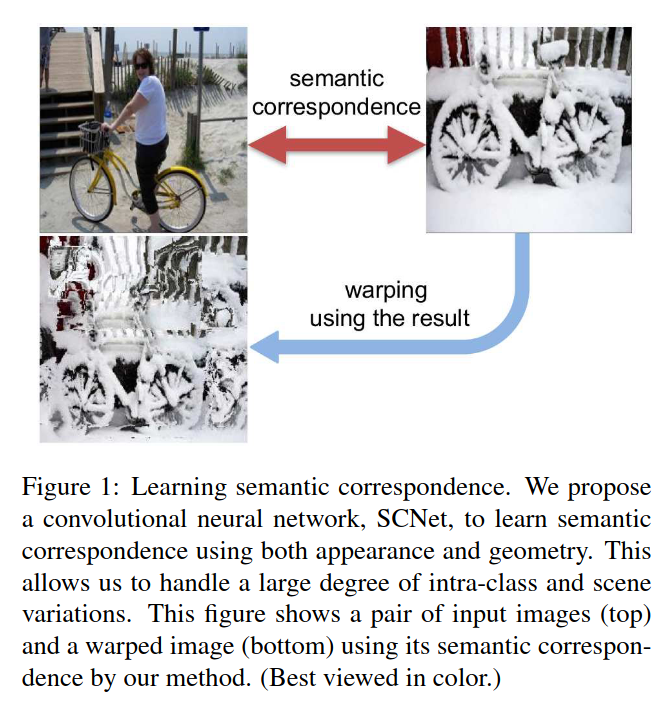
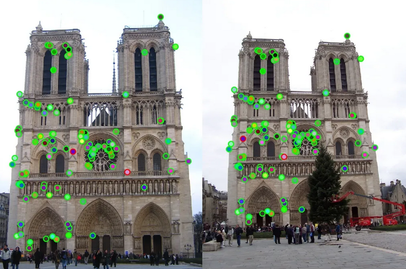
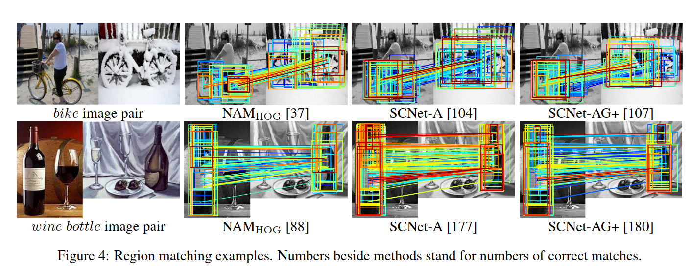

## SCNet: Learning Semantic Correspondence
*ICCV(2017), 160 citation, The University of Hong Kong, Yonsei University, POSTECH, Review Data: 2024.07.05*

[Intro](#intro) 
[Related Work](#related-work) 
[Method](#method) 
[Experiment](#experiment) 
[Conclusion](#conclusion) 

> Core Idea

<strong>"test1"</strong> 

***

### <strong>Intro</strong>

$\textbf{이 주제의 정의 및 요구사항과 중요한 이유}$

- Semantic correspondence: 한 object나 scene category의 다른 instance를 묘사하는 이미지들 사이의 feature matching
  - Feature matching: 서로 다른 이미지에서 유사한 특징을 찾아내고 대응시키는 과정. 주로 feature descriptor로 특징을 찾고 matching 시킨다.
  - Stereo matching: 두 개의 서로 다른 시점에서 촬영한 이미지 쌍(stereo image)을 이용해 깊이 정보를 추출하는 과정이다. 이 과정은 주로 3D 재구성이나 깊이 맵 (depth map)생성을 위해 사용된다.  

$\textbf{이 주제의 문제점과 기존의 노력들}$

- 이전의 work들은 hand-crafted features (SIFT, DAISY, or HOG)와 spatial regularizer를 결합하거나, appearance만을 위해 correspondence model을 학습했다. 

$\textbf{본 논문에서 해결하고자 하는 문제와 어떻게 해결하는지, 그 결과들}$

- 본 논문은 SCNet이라는 CNN 구조의 모델을 제안한다. 
  - Semantic correspondence를 위한 기하학적으로 타당한 모델이다. 
  - 매칭 기본 요소로 region proposal을 사용하며, 손실 함수에 기하학적 일관성을 명시적으로 통합했다. 
  - PASCAL VOC 2007 keypoint dataset의 이미지 쌍을 사용하여 훈련했다. 
  - SCNet outperforms both recent deep learning architectures and previous methods based on hand-crafted features.

***

### <strong>Related Work</strong>

- Semantic correspondence
  - SIFT Flow: 고전적인 optical flow를 확장하여 비슷하지만 서로 다른 장면들간의 correspondence를 확립한다. 
  - DAISY
  - HOG
- Deep learning for correspondence
  - 최근에는 CNN model을 사용하여 feature descriptor나 similarity function을 학습하기 위해 optical flow나 stereo matching과 같은 전통적인 dense correspondence problem에 적용하고 있다. 

***

### <strong>Method</strong>

***

### <strong>Experiment</strong>

***

### <strong>Conclusion</strong>

***

### <strong>Question</strong>

<a href="">link</a>

> 인용구
