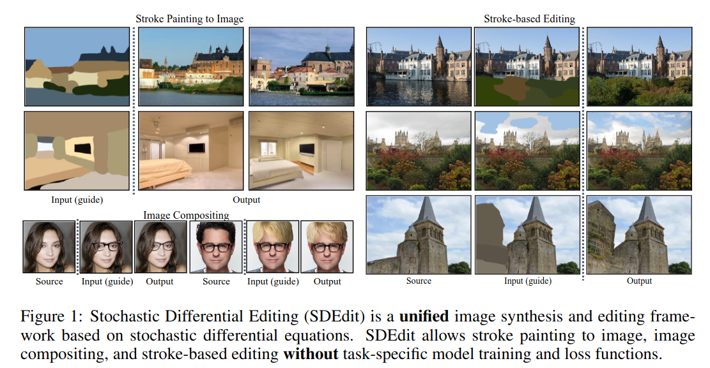
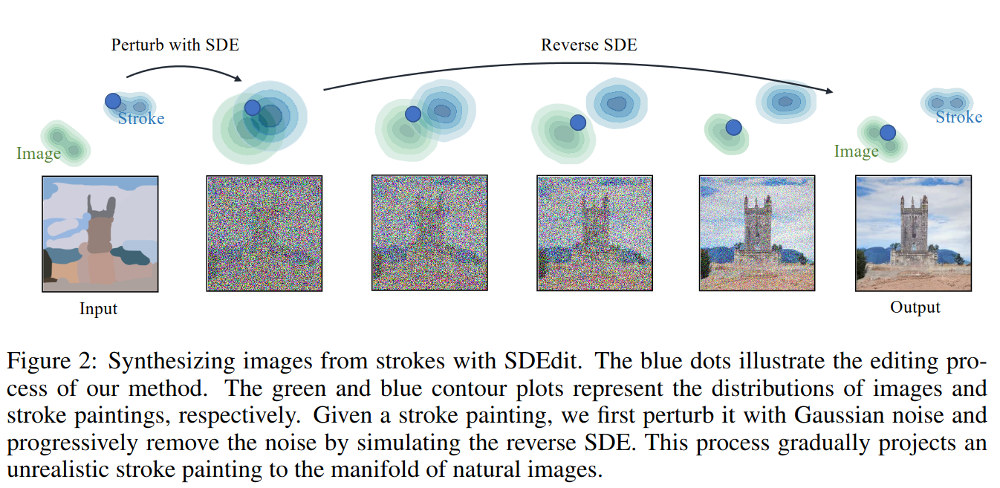
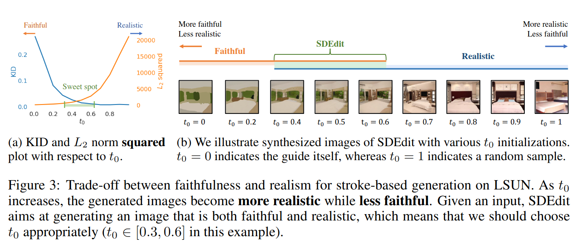
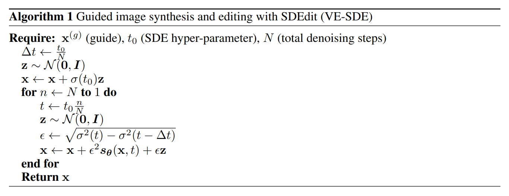
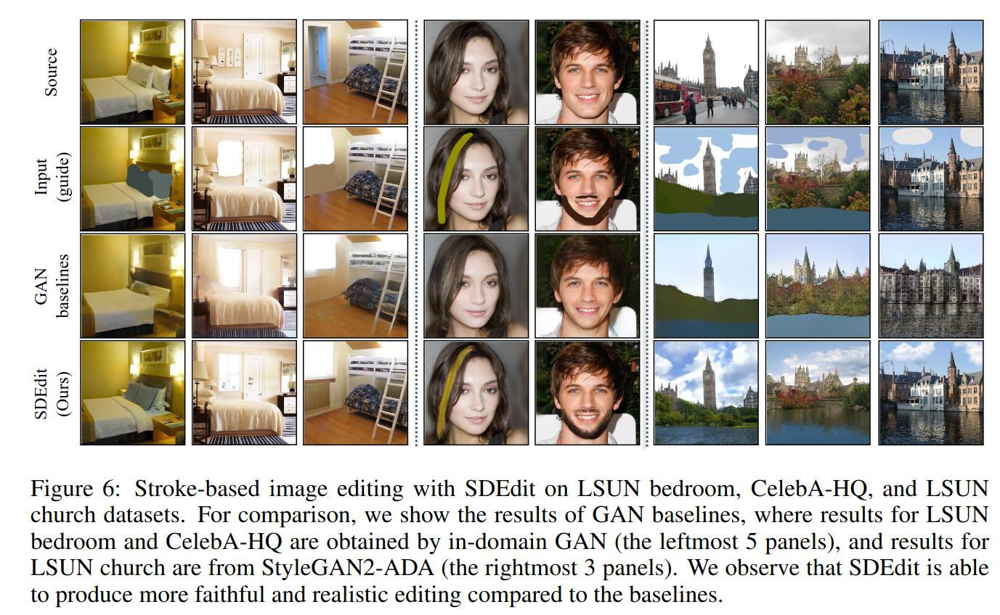
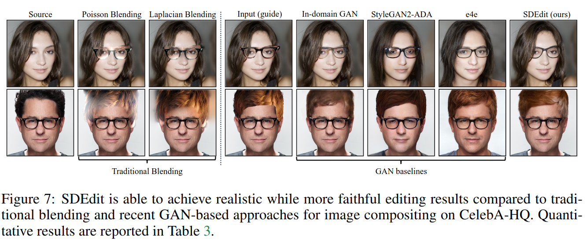

## SDEdit: Guided Image Synthesis and Editing with Stochastic Differential Equations
*arXiv(2021), 462 citation*

[Intro](#intro) 
[Related Work](#related-work) 
[Method](#method) 
[Experiment](#experiment) 
[Conclusion](#conclusion) 

> Core Idea

<strong>"Convert Stroke Painting to Natural image using Perturbation without Fine-tuning"</strong> 

***

### <strong>Intro</strong>

- User 가 최소한의 노력으로 사실적인 image 를 만들고 편집할 수 있게 하는 방법이다. 
- 주요 과제는 손으로 그린 그림 (hand-drawn colored strokes)이나 합성된 이미지 현실성의 균형을 잡는 것이다.
  - 즉, 대충 그린 그림을 가지고 이미지를 만들거나 
  - 대충 합성한 이미지를 가지고 blending 을 잘 해서 실제 이미지처럼 보이게 하는 것이다.
- Task-specific model training/loss function 이 없다는 게 특징이다.  

***

### <strong>Related Work</strong>

- GAN-based
  - Conditional GAN/GAN inversion 을 통해 이 문제를 해결하려고 했지만, 이는 추가적인 학습 데이터나 loss function 을 필요로 했다.

***

### <strong>Method</strong>

- Stroke painting distribution 과 pre-trained diffusion model 이 학습한 distribution 은 다르다. 하지만, noise perturbation 을 통해 두 분포를 겹치게 하고 reverse SDE 를 통해 noise 를 제거하는 순간, stroke painintg sample 은 model 이 학습한 distribution 을 타고 올라간다. 즉, stroke painting sample 을 diffusion model 이 학습한 분포로 끌고 감으로써 natural 이미지를 생성한다. 
  - Stroke painting 에 충분한 noise 를 뿌린 순간, model 은 input 이미지가 stroke image 에서 noise 를 뿌린 건지 natural image 에서 noise 를 뿌린 건지 알 수 없다. 
  - 따라서 가장 중요한 hyper-parameter 는 어떤 time step 의 noise 를 뿌려야 하는 가이다.

- Noise 를 너무 많이 뿌리면, 원본 stroke painting 의 정보가 너무 많이 사라지기에 원본 stroke painting 과의 $L_2 \ norm$ 의 값이 커지지만, 초기부터 이미지를 생성했기에 natural image 와의 KID score 는 낮다 (낮을수록 성능이 좋다).
  - 반대로 noise 를 너무 적게 뿌리면, 원본 stroke painting 의 정보가 너무 많아서 KID score 는 높아지고 $L_2 \ norm$ 의 값은 작아진다. 
  - 우리는 이 trade-off 관계에서 sweet spot 을 찾아야 한다. 

- 구체적으로, noise 를 더하는 과정을 SDE framework 안에서 봤을 때, 크게 VE/VP SDE 가 존재한다. (SMLD/DDPM)
  - 자세한 내용은 <a href='../../딥러닝 이론/Score-based-generative-model/Score-based-generative-model.md'>Score-based Generative Models</a> 에 담았다.
  - 본 논문에서는, VE SDE 를 이용했다. 

- Stroke painting 이 perturbation 된 time step 을 $t_0 \in [0.3,0.6]$ 으로 잡았을 때가 가장 합리적인 guide 라고 한다. 
- Reverse SDE 는 Euler-Maruyama method (reverse diffusion sampling) 방식으로 이산화해서 sampling 을 진행한다. 

- Algorithm
  - 실제 코드 구현으로는 $t_0 = 400$, $N=1000$, $\Delta t = 1$
  - 그냥 이산화해서 계산

***

### <strong>Experiment</strong>

- Blending 도 잘한다.

***

### <strong>Conclusion</strong>

***

### <strong>Question</strong>

