## SDXL: Improving Latent Diffusion Models for High-Resolution Image Synthesis
*arXiv(2023), 219 citation, Stability AI, Review Data: 2024.3.1*

[Intro](#intro) 
[Related Work](#related-work) 
[Method](#method) 
[Experiment](#experiment) 
[Conclusion](#conclusion) 

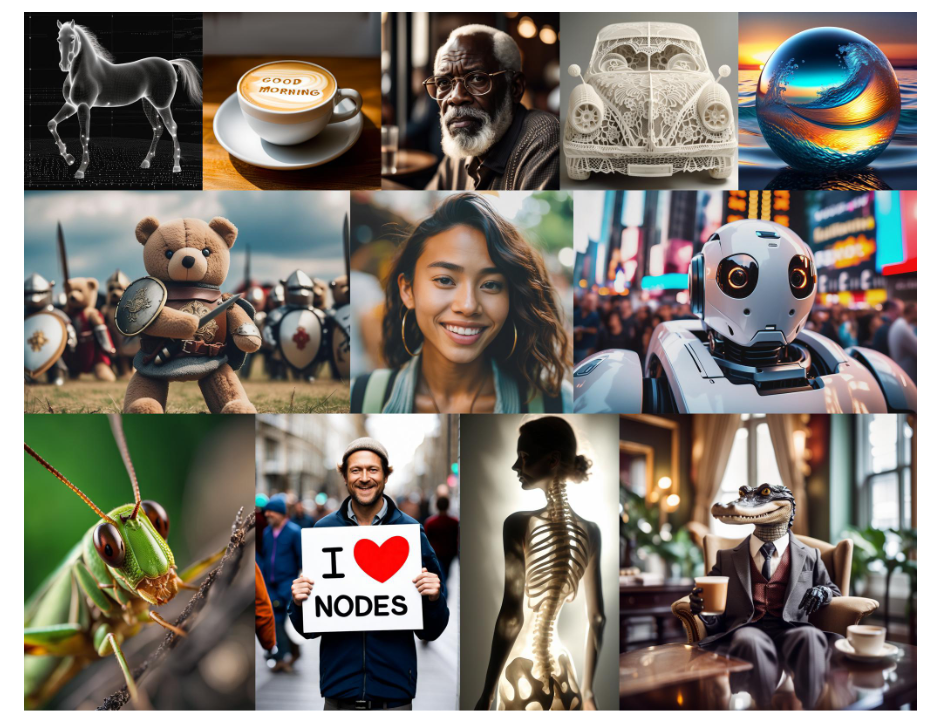

> Core Idea

<strong>""</strong> 

***

### <strong>Intro</strong>

- Latent diffusion model for text-to-image synthesis
  - 이전 SD 보다 $3$ 배는 큰 UNet backbone 을 사용한다. 
  - 더 많아진 Attention block 과 더 큰 cross-attention context (SDv1.5: $768 \rightarrow$ SDXL: $2048$) 가 paramter 수 증가에 큰 영향을 미쳤다. 
  - Multiple aspect ratio 를 학습했다. 
  - 두 개의 text encoder 를 사용한다. 
  - 또한, image-to-image 를 통해 visual fidelity 를 향상시키는 refinement model 도 제안한다. 
- 본 논문에서 제안한 SDXL 이 user study 에서 이전의 SD version 들을 압도했다. 
  - 성능의 발전을 일으킨 요소는 다음과 같다. 
  - 1. $3$ 배 큰 UNet-backbone
  - 2. 추가적인 supervision 이 필요없는 conditioning techniques
  - 3. Refinement models 
 
***

### <strong>Related Work</strong>

***

### <strong>Method</strong>

- Refinement model 을 안 써도 이전 version SD 의 성능을 (*user preference*) 뛰어넘는다. 

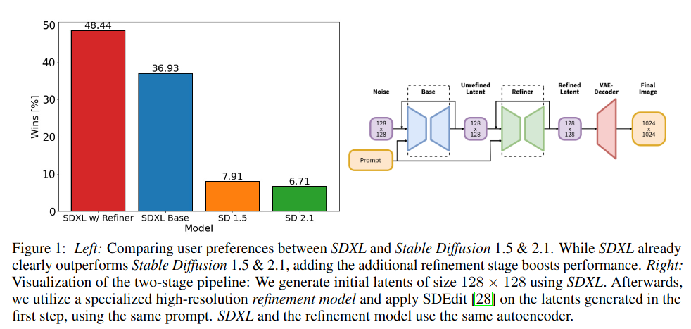

- 이전 SD model 과의 구조적 비교
  - Text encoder: $817$ M parameters
  - UNet: $2.6$ B parameters 

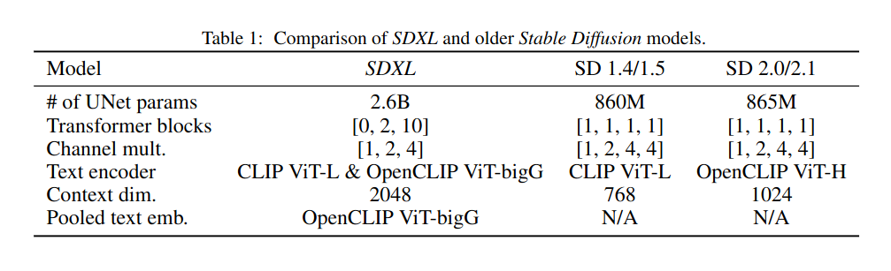

$\textsf{Process}$

Inputs $\rightarrow$ VAE Encoder $\rightarrow$ $128 \times 128$ latents $\rightarrow$ apply SDEdit $\rightarrow$ Refiner $\rightarrow$ VAE Decoder $\rightarrow$ $1024 \times 1024$ images

$\textsf{Micro-Conditioning}$

- SDXL 은 model size 가 커서 학습 데이터를 많이 필요로한다. 하지만, 이미지의 최소 크기를 만족시키는 이미지 (고화질 이미지) 를 구하는 건 어렵다. 
  1. 특정 최소 해상도를 만족시키지 못하는 training image 는 모두 버린다. 
     1. E.g, SD 1.4/1.5 는 $512 \times 512$ 이하의 이미지는 모두 버렸다.
     2. 이는 데이터의 상당 부분을 버려야 하니, 성능 손실과 일반화에 악영향을 준다. 
     3. 실제로 실험한 결과, $39$ % 의 데이터가 버려진다.
  2. 해상도가 작은 이미지들을 upscale 한다.
     1. 일반적으로 upscaling artifacts (e.g., blurry sample) 를 발생시킨다.
  3. 위의 방법들이 효과적이지 못하기에, 본 논문에서는 원래 이미지의 해상도를 조건부로 설정하는 것을 제안했다. 
     1. 이미지의 원래 (재조정 전) 높이와 너비를 추가 조건으로 제공한다. 
     2. 각 구성 요소는 Fourier feature encoding 을 통해 독립적으로 encoding 되며, time step embedding 에 더해짐으로써, single vector 에 concatenate 된다.

- Pre-training dataset 의 Height & Width distribution 이다. 

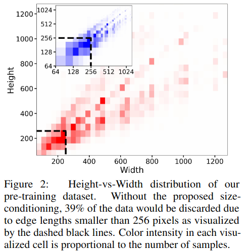

- Image 의 원래 해상도를 conditioning 으로 줬기 때문에, 해상도 조건부에 따라 output image 도 달라진다.
  - 저해상도를 조건부로 주고 생성하면, 저해상도 이미지처럼 나온다. 
  - 학습 때, 저해상도 이미지를 upscale 하여 저해상도 이미지를 생성하도록 학습된다. 
  - 추측컨대, inference 때에는 noise 에서 시작을 하니 저해상도를 학습해도, condition 으로 $1024$ 을 주면 고해상도 이미지를 생성하는 효과를 얻을 수 있다. 

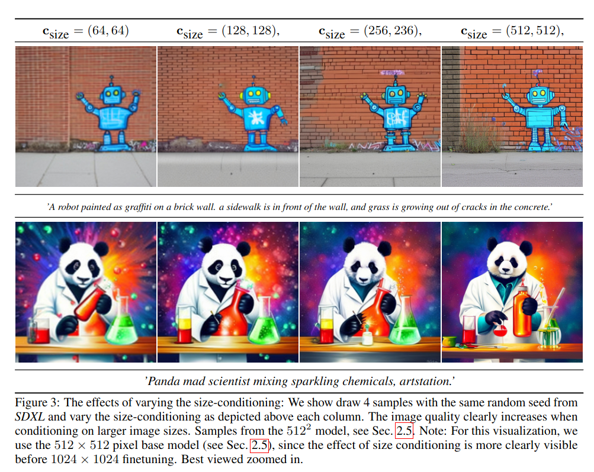

- 수치적으로, (1) 조건을 만족시키지 못하는 이미지를 버리거나, (2) upscale 하되, original resolution info 를 주지 않은 경우 보다, (3) upscale 하면서, original resolution info 를 조건부로 주는 게 더 효과적임을 알 수 있다. 
  - CIN: Class-conditional ImageNet ($512 \times 512$)
  - DDIM sampling 을 통해 $5$ K sample with $5$ classifier-free guidance scale 
  - IS and FID 
  - CIN-512-only: overfitting $\rightarrow$ bad generalization 
  - CIN-nocond: generate blurry sample $\rightarrow$ reduce FID score 

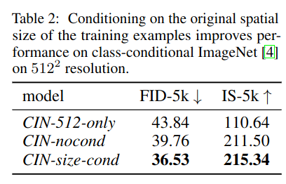

$\textsf{Conditioning the Model on Cropping Parameters}$

- 첫 번째, 두 번째 row 는 일반적인 이전의 SD model 의 실패작들이다. 
  - 학습 시에, 고해상도 이미지들을 randomly crop 하기 때문에 inference 시에도 cropped image 가 생성되는 걸 알 수 있다. 
    - 1. 이미지의 가장 짧은 width/height 를 target size 에 먼저 resize 
    - 2. longer axis 을 따라, randomly cropping 
- 이 문제를 해결하기 위해 본 논문에서는, 간단하면서도 효과적인 방법을 제안한다. 
  - Crop coordinate 를 image resolution 과 마찬가지로 Fourier feature embedding 을 통해 conditioning parameter 로써 model 에게 주는 것이다. 
  - Time step embedding 에 더해주기 전에, channel dimension 을 따라 feature embedding 을 concatenate  

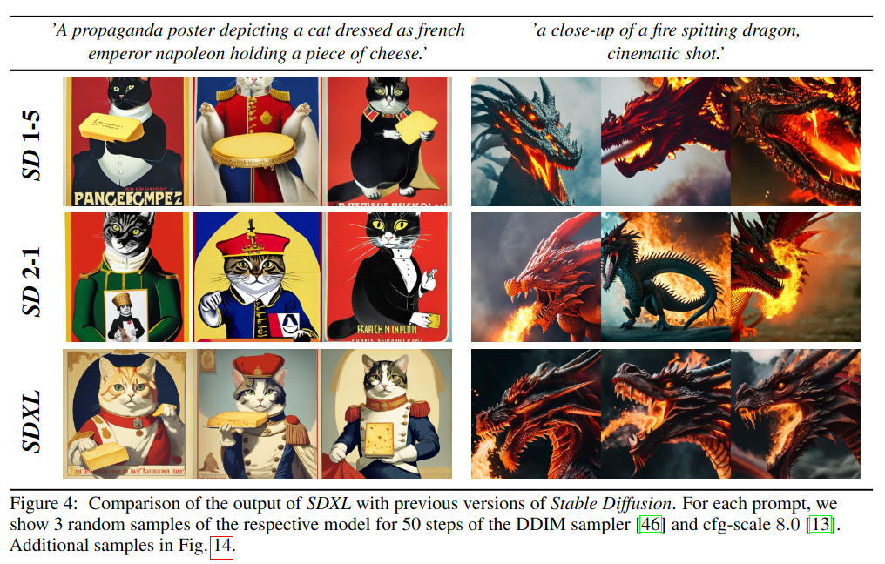

- Image size & crop conditioning algorithm

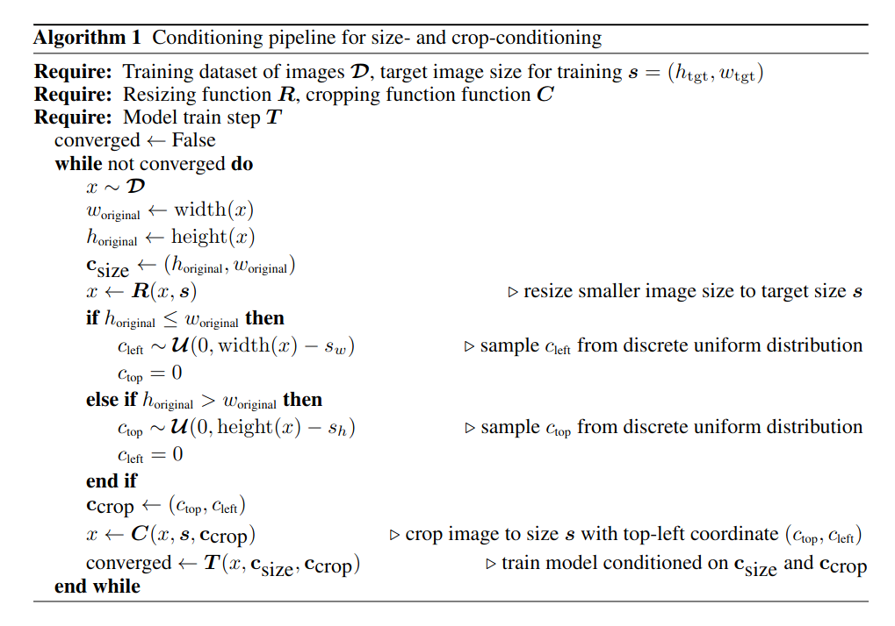

- Crop condition 을 주면 다음과 같은 결과가 나온다. 
  - $c_{crop} = (0,0)$: crop 안 함
  - $c_{crop} = (0,256)$: 위에서부터 $256$ 만큼 crop 해서 사용. 즉, 생성된 이미지는 전체 이미지에서 위에서부터 $256$ 만큼 존재하는 이미지가 나온다. 
  - $c_{crop} = (256,0)$: 왼쪽부터 $256$ 만큼 crop 해서 사용. 즉, 생성된 이미지는 전체 이미지에서 왼쪽에서부터 $256$ 만큼 존재하는 이미지가 나온다. 
  - $c_{crop} = (512,512)$: 전체 이미지에서 가운데를 확대한 효과

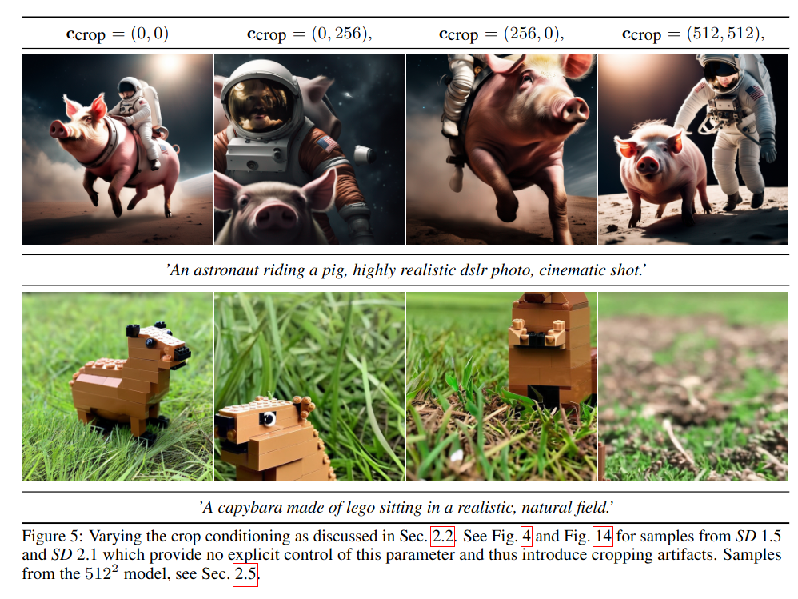

$\textsf{Multi-Aspect Training}$

- 기존의 이미지는 주로 $512 \times 512$ or $1024 \times 1024$ 의 정사각형 이미지를 생성했다면, 본 논문에서는 다양한 종횡비를 고려하고자 했다. 
- 위의 방법들과 마찬가지로 종횡비도 Fourier feature embedding 을 통해 condition 으로 제공한다. 

$\textsf{Effectiveness of Refiner}$

- 큰 이미지에서 왼쪽은 W/O refiner, 오른쪽은 W/ refiner 이다. 
  - 각각의 red, blue bounding box 를 살펴보면 refiner model 을 거쳤을 때 세부사항을 더 잘 생성하는 것을 알 수 있다.

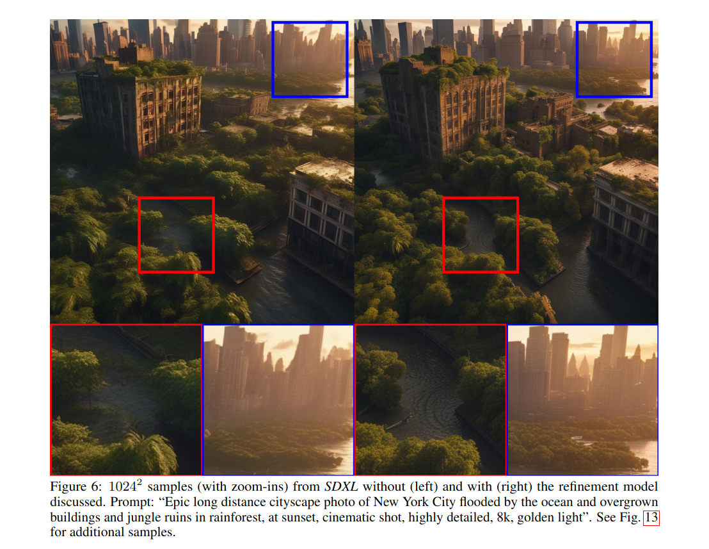

$\textsf{Improved Autoencoder}$

- SD 은 frozen pre-trained auto-encoder 를 사용한다. 
  - Semantic composition 은 대부분 LDM 에서 수행되지만, 생성된 이미지의 local, high-frequency detail 을 향상시키기 위해 autoencoder 를 학습한다. 

- 재학습된 auto-encoder 의 향상된 성능 
  - COCO2017 validation set ($256 \times 256$)

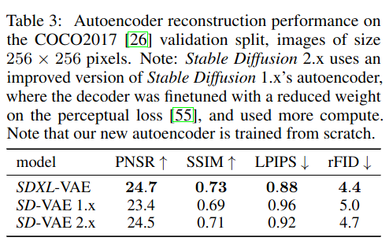

***

### <strong>Experiment</strong>

- Base model 은 $1000$ step discrete-time diffusion schedule 을 가진다. 
- Refinement model 은 $200$ step

- Future work
  - Single stage: 현재는 two-stage 이다. 이로 인해 두 개의 큰 모델을 memory 에 load 해야 하므로 접근성과 sampling 속도가 저해된다. 
  - Text synthesis
  - Architecture 
  - Distillation

- Limitations
  - 많은 향상을 이뤘지만, 여전히 복잡한 prompts (e.g., 공간적 배열 - close up) 이나 손, prompt 의 혼합
    - 첫 번째 사진: 복잡한 prompt, hands
    - 마지막 사진: 흰색 문과 부서진 앞유리, 빨간색 트럭인데 흰색이 트럭에 섞였다. 

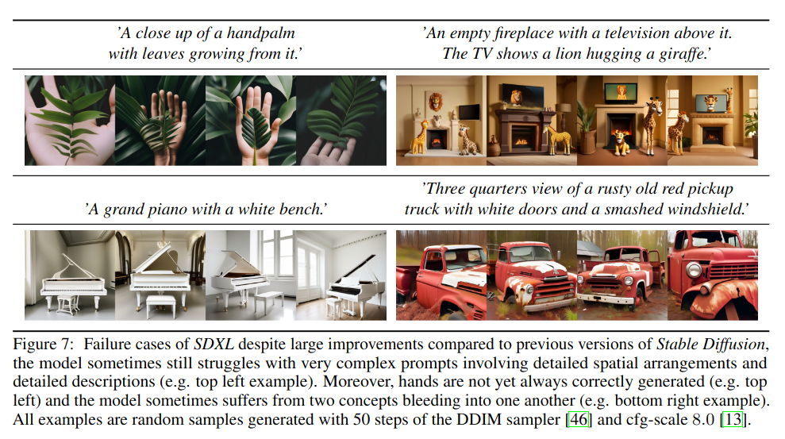

- Comparisons on PartiPrompts W/O refiner
  - Opensource model 이 아닌 midjourney 와 user preference 로 비교한 결과이다. 
  - $2$ category 를 제외한 나머지에서 이겼다. 

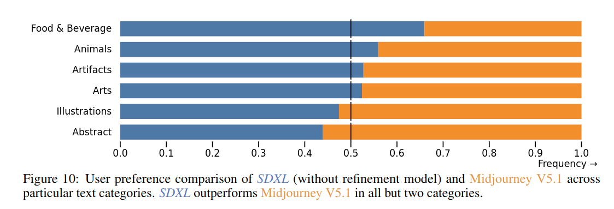

- Comparisons on PartiPrompts W/ refiner
  - $10$ 개의 category 중 $7$ 개가 동등하거나 이겼다. 

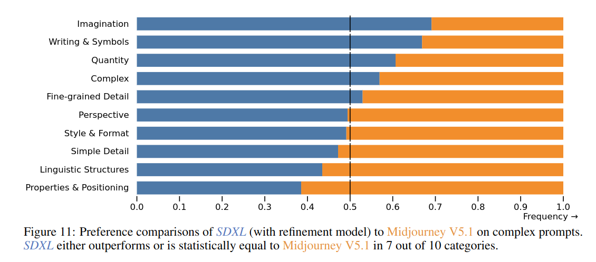

- Comparisons with baselines 

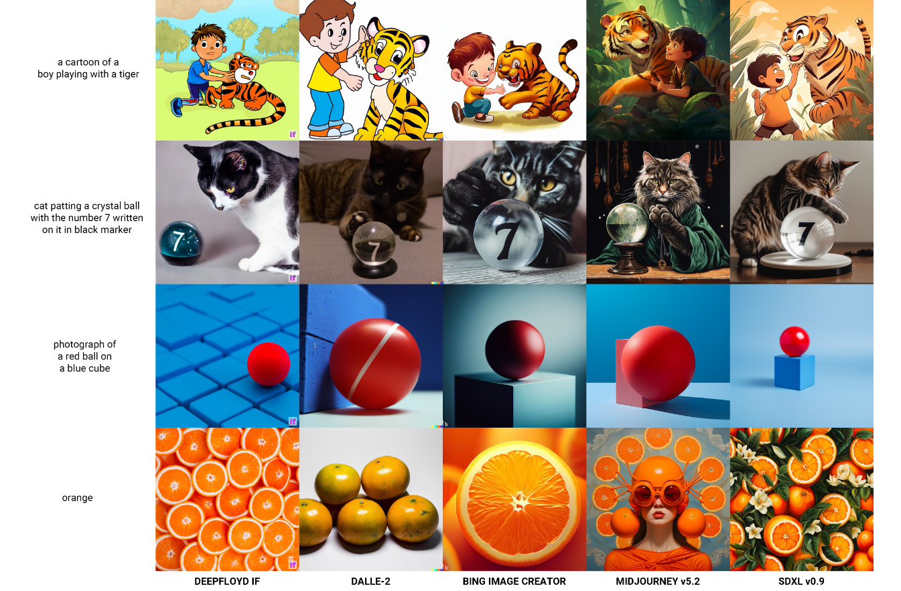

***

### <strong>Conclusion</strong>

***

### <strong>Question</strong>

