## SR3: Image Super-Resolution via Iterative Refinement
*IEEE Transactions on Pattern Analysis and Machine Intelligence(2022), 666 citation*

[Intro](#intro) 
[Related Work](#related-work) 
[Method](#method) 
[Experiment](#experiment) 
[Conclusion](#conclusion) 

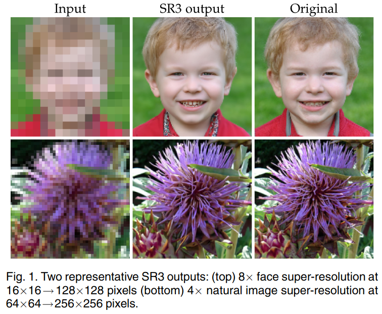

> Core Idea

<strong>"Super-Resolution via DDPM"</strong> 

***

### <strong>Intro</strong>
- DDPM(stochastic iterative denoising process) 을 이용하여 image-to-image translation (super-resolution) 을 한다. 
  - U-Net 구조 및 pure Gaussian noise, iterative refinement
  - Low-resolution image(resize 해서 high dim 으로 맞춰줌) & high-resolution image 가 concat 되어 input 으로 들어간다. 
- Face 뿐만 아니라, natural image 도 잘 작동한다.
- $8 \times$ face super-resolution task on CelebA-HQ: fool rate $50\%$ (GAN baselines: fool rate $34\%$)
> Fool rate: model 이 저해상도 입력 이미지를 고해상도로 생성할 때, 사람이 평가 시 얼마나 현실적으로 보이는지를 나타내는 평가지표이다. 이 지표는 2 개 중에 하나를 선택하는 (2AFC) 패러다임을 기반으로 한다. 즉, 높은 값이 좋다.
- $4 \times$ super-resolution task on ImageNet: baseline 과 비교했을 때, human evaluation 과 high-resolution image 로 학습된 ResNet-50 classifier 의 classification accuracy 를 능가했다. 
- $256 \times 256$ ImageNet image generation challenge 에서도 generative model 을 super-resolution model 에 연결시켜, 경쟁력 있는 FID score 를 달성.  Cascaded image generation 에서도 효율성을 입증했다. 

***

### <strong>Related Work</strong>
1. Generative models
   1. Autoregressive models
   2. Normalizing flows
   3. VAE
   4. GAN
2. Super-resoluition 
   1. MSE loss, regression

***

### <strong>Method</strong>

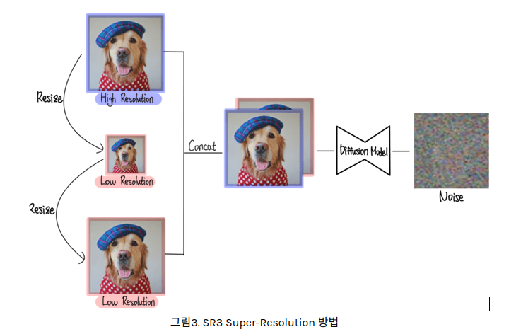

- Notation: 모든 notation 은 DDPM 으로 변환시킨다. 
  - $x$: source image, low-resolution image
  - $y$: $x$ in DDPM, 이미지
  - $y_0$: super-resolution image/ $x_0$ in DDPM  
  - $\gamma_t$: $\bar\alpha_t$ in DDPM
  - $\beta$: $\beta$ in DDPM
  - $1- \beta$: $\alpha$ 
  - $\tilde{y}$: $y_t$ in DDPM, 즉 noisy 한 이미지
- Dataset: input-output image pairs $D=\{x_i, y_i\}_{i=1}^{N}$
- Conditional distribution $p(y|x)$ 는 one-to-many mapping 이다. 즉, 많은 target image $y$ 는 여러 source image $x$ 와 일치할 수 있다.  
- 따라서, stochastic iterative refinement process 로 source image $x$ 를 target image $y$ 로 mapping 시킬 것이다. 여기에 적합한 model 이 바로 DDPM 이고 condition 을 추가하여 conditional image generation system 을 구축한다. 

$$ [forward \ process] \ q(y_t|y_{t-1}) $$

$$ [reverse \ process] \ p_\theta(y_{t-1}|y_t, x) $$

- 다시 말해, forward 는 $y$ 만 given 으로 주고 reverse process using model 은 $x$ 까지 condition 으로 줘서 denoising 을 하는 꼴이다. 어차피 model 은 이미지 자체를 예측하는 것이 아닌 noise 를 예측해서 다른 algorithm 으로 sampling 하니까 condition 으로 들어가는 게 문제가 되지 않는다. 오히려 정보를 추가적으로 제시하는 것이다.
- 원칙적으로는, $x$ 도 condition 으로 들어가는 게 맞지만, simple diffusion process 는 $x$ 에 의존하지 않는다고 논문에서 언급하고 있다.
  

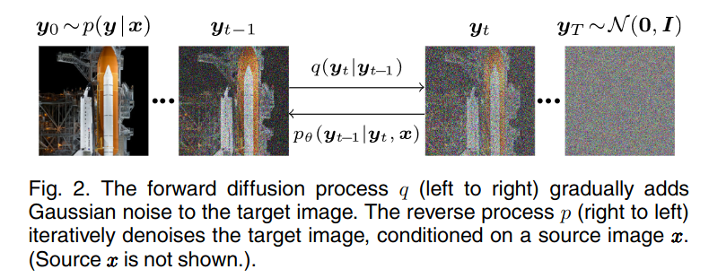

- **Training**
  - high-resolution 인 $y$ 와 low-resolution 인 $x$ 를 ($y$ 와 차원이 같음) sampling 해서, $x$, $y$, $\bar\alpha_t$ 를 model 의 입력으로 전달해서 $\epsilon$ 을 prediction 한다. 
  - 기존의 DDPM 과 다른 점은 condition 으로 $x$ 가 들어가는 것과 $\bar\alpha_t$ 가 들어가는 것이다. time step $t$ 가 아닌 $\bar\alpha_t$ 가 들어가는 것은 결국 동일하게 time info(noise level) 를 전달할 수 있기 때문이다. 
  - Low resolution image 를 condition 형식으로 (물론 input 으로 concat 해서 들어가지만) 넣어서, $y_t$ 에 들어간 noise 를 예측하는 것이다. 

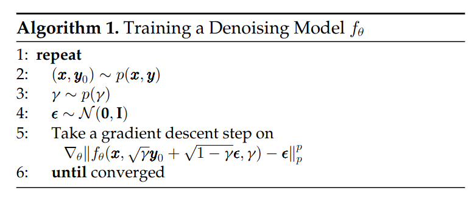

- **Inference**
  - Reparameterization trick 에서 variance 를 $\tilde{\beta_t}$ 로 하지 않고 $\beta_t$ 로 뒀다.
   

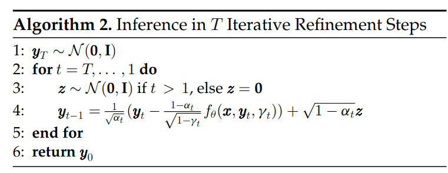

- Model Architecture
  - low-resolution image $x$ 는 bicubic interpolation 으로 $y$ 와 동일한 size 를 같게끔, up-sample 됐다.
  - 이때, low-resolution image $x$ 의 dimension 은 16x16
  - $y$ dimension 은 128x128

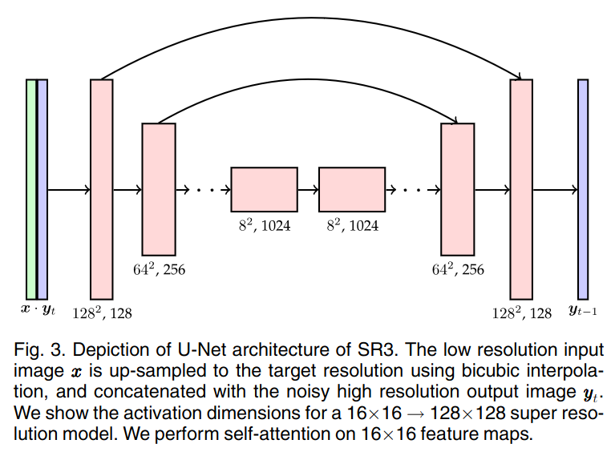

***

### <strong>Experiment</strong>
- Experiments on faces, natural images and synthetic images obtained from a low-resolution generative model.
- high-resolution image synthesis using cascaded model.
- **Dataset and Evaluation**
  - Flickr-Faces-HQ(FFHQ) for training and CelebA-HQ for evaluation
  - ImageNet 1K for train and eval
  - FID and classification accuracy
  - Human eval
  

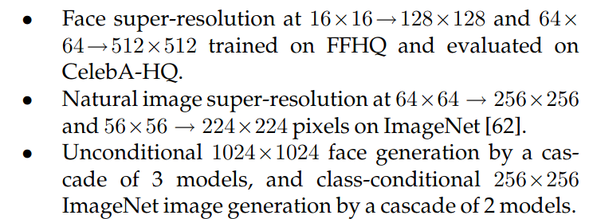

- **Details**
  - $1$ M training steps with a batch size of $256$
  - Adam optimizer with a linear warmup schedule over $10$ K training steps
  - $1e-5$ lr 
  - dropout rate of $0.2$ for 16x16 -> 128x128. O.W do not use dropout

- Regression loss 와 비교했을 때의 SR3

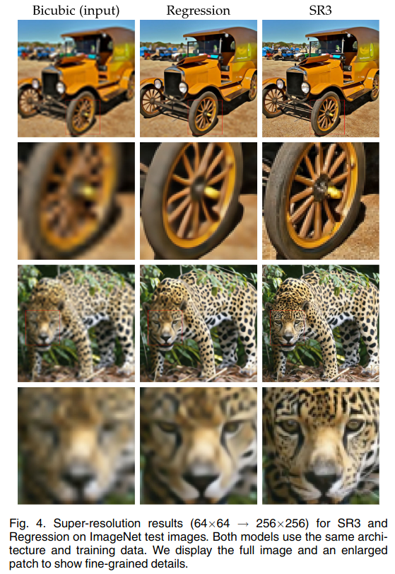

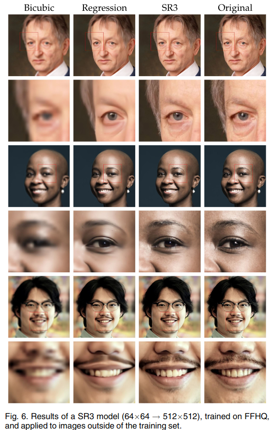

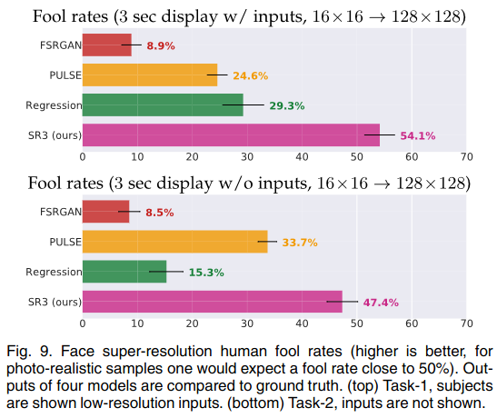

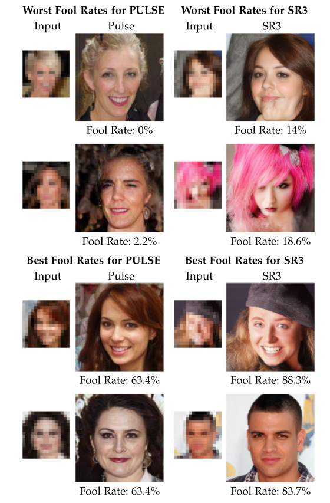

***

### <strong>Conclusion</strong>
- conditional DDPM 을 제안
- Super-resolution task 에 Diffusion model 을 활용
- cascaded model
- Fool rate 가 높은 거로 보아, 사람의 선호도 관점에서 우수한 모델이다. 

***

### <strong>Question</strong>

