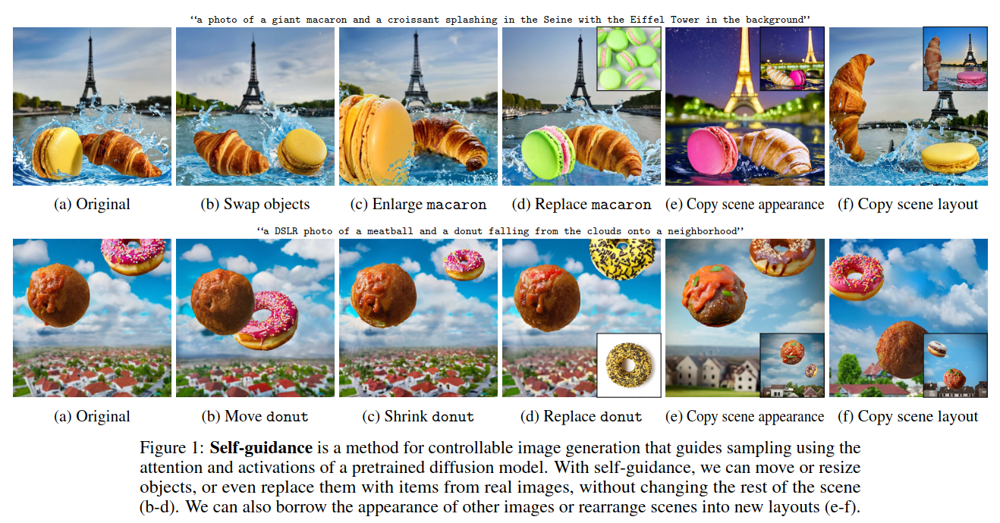
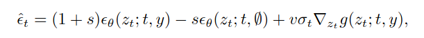
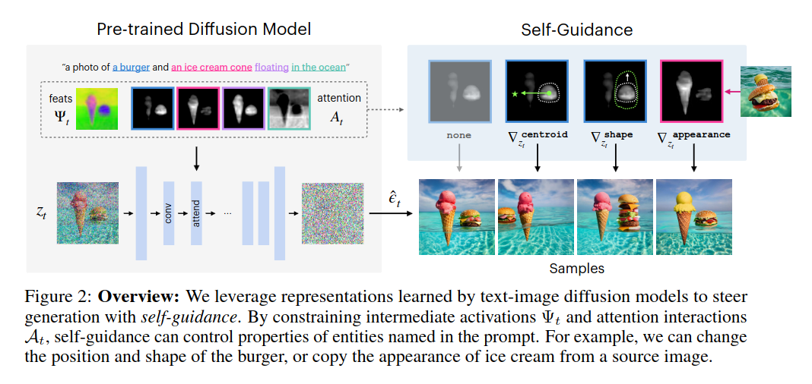
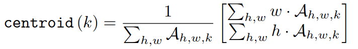

## [paper]
*NeurIPS(2023), 96 citation, UC Berkeley & Google Research, Review Data: 2024.06.20*

[Intro](#intro) 
[Related Work](#related-work) 
[Method](#method) 
[Experiment](#experiment) 
[Conclusion](#conclusion) 

> Core Idea

<strong>"Guide Sampling using the Attention and Activations of a Pretrained Diffusion Model, Self-Guidance"</strong> 

***

### <strong>Intro</strong>

$\textbf{이 주제의 정의 및 요구사항과 중요한 이유}$

- Large-scale generative model은 상세한 text description으로부터 high-quality 이미지를 생성할 수 있다. 

$\textbf{이 주제의 문제점과 기존의 노력들}$

- 하지만, 이미지의 여러 측면을 텍스트를 통해 전달하는 것은 어렵거나 불가능하다. 
- 이 문제를 해결하기위해, 
  1. Detail을 더 잘 조절하기 위해 pretrained model을 조정했다.
     1. Textual Inversion 
     2. Imagic
     3. DreamBooth
  2. Textual prompt와 함께 reference image를 공급했다. 
     1. Text2live
     2. Instructpix2pix
  3. 다른 종류의 conditioning을 공급했다.
     1. Palette
     2. ControlNet

- 그럼에도, 이러한 접근법들은 광범위한 paired data (따라서 가능한 수정 영역이 제한된다)으로 학습하거나, 몇 가지 image manipulation을 수행하기 위해 비싼 optimization process를 수행해야 했다. 
- 몇몇 방법들은 output을 설명하는 target caption을 사용하여 zero-shot으로 input image를 수정할 수 있었지만, 오직 limited control만 가능하다. 
  - Structure-preserving appearance manipulation이 제한되거나 uncontrolled image-to-image translation이다. 

$\textbf{최근 노력들과 여전히 남아있는 문제들}$

- 결과적으로, 많은 단순한 편집들이 여전히 손이 닿지 않는 곳에 남아있다. 
  - 어떠한 것도 바꾸지 않고 한 object를 움직이거나 크기를 조절할 수 있을까
  - 한 이미지의 객체 외관을 다른 이미지에 복사할 수 있을까
  - 하나의 장면 레이아웃과 다른 이미지의 외관을 결합할 수 있을까
  - 특정 아이템이 캔버스의 특정 위치에 정확한 모양으로 배치된 이미지를 생성할 수 있을까

$\textbf{본 논문에서 해결하고자 하는 문제와 어떻게 해결하는지, 그 결과들}$

- Internal representation of diffusion model을 guiding하여 생성된 이미지 전반에 걸쳐 조작하는 방법인 self-guidance를 도입한다. 
  - Shape, location, and appearance of object 와 같은 특징이 이러한 representation 으로부터 추출될 수 있고, sampling process를 조종하는데 사용할 수 있다. 
  - Self-guidance는 classifier guidance와 비슷하게 작동하지만, 추가적인 model이나 학습이 없이 pretrained model 자체에 제공된 signal을 사용한다. 

- 본 논문은 간단한 속성 집합을 구성하는 것만으로도 특정 물체의 size나 position을 수정하는 것, 한 이미지 안에 서로 다른 이미지의 layout + apperance of objects 를 결합하는 것, multiple image 로부터 물체들을 한 이미지 안에 구성하는 것 등의 image manipulation을 수행한다.
- 또한, self-guidance가 real image를 수정하는 데 사용될 수 있음을 보여준다. 

***

### <strong>Related Work</strong>

***

### <strong>Method</strong>

$\textbf{Guidance}$

- 먼저, guidance 할 수 있는 방법을 알아보자 

- 앞의 두 항은 classifier-free guidance를 나타낸다.
  - 마지막 항의 $g(z_t,;t, y)$는 energy function이다. Classifier 뿐만 아니라 diffusion sampling process를 guide할 수 있는 값이기만 하면 된다. (다른 model로부터의 energy function이어도 된다)
  - CLIP model로부터 나온 similarity score
  - Arbitrary time-independent energy as in universal guidance
  - Attention의 bounding box penalties 
  - Any attributes of the noisy images
  - $s$: classifier-free guidance strength
  - $v$: additional guidance weight for $g$
  - $\sigma_t$: score function을 $\epsilon_t$ 예측으로 변환하기 위한 scaling factor

- 그렇다면, diffusion model을 조절할 수 있는 signal은 어디에서 찾을 수 있을까
  - 최근 논문에서 U-Net의 중간 output이 생성되는 이미지의 구조나 content에 대한 가치있는 정보를 encoding함을 발견했다. 
  - 특히, Prompt-to-Prompt에서 **self-attention & cross-attention map이 종종 object position과 shape에 대한 구조적인 정보를 가지고 있음을 발견했다.**
  - 더불어서, Plug-and-Play 에서 **적절한 layer에서 추출된 network activation이 coarse appearance를 유지함을 발견했다.** (+ 구조적인 정보: layout도 가지고 있다)

$\textbf{Self-Guidance}$

- Diffusion model에 의해 학습된 rich representation에 영감을 받아, 중간 activation과 ttention map을 교체하여 sampling process를 조종하는 self-guidance를 제안한다. 

- 우리는 지금까지 forward process에서 추출된 activations $\Psi_{i,t} \in \mathbb{R}^{H_i \times W_i \times D_i}$ 와 softmax-normalized attention matrices $A_{i,t} \in \mathbb{R}^{H_i \times W_i \times K}$ 가 생성된 이미지를 조절하는데 유의미한 특성을 가지고 있음을 확인했다. 
  - Attention map $A_{i,t} \in \mathbb{R}^{H_i \times W_i \times K}$: time $t$, $i$ 번째 layer의 attention map인데, 사실상 $\mathbb{R}^{H_iW_i \times K}$ 인데 reshape해서 표현한 거 같다. $K$는 key (=text)의 sequence length
  - $D_i$: the number of channle at time $t$, layer $i$

1. Object position
   1. 물체의 위치를 표현하기 위해 각 attention channel의 질량 중심 (=중심 좌표)을 찾는다. 이 중심 좌표가 의미하는 바는 token $k$가 의미하는 물체의 attention score의 중심 좌표이다.
   2. 예를 들어, "a burger" 에 해당하는 cross attention map들만 가지고 와서: 각 좌표 $\times$ 그 좌표의 attention score 의 합을 구하면 "a burger"가 표현하고 있는 attention score들의 중심 좌표 $=$ "a burger"가 생성한 물체의 중심이 된다. 
   3. 여기서, burger의 무게 중심을 $(0.3, 0.5)$ 로 옮기고 싶다면 $(1)$ 의 수식을 
   4. Burger의 위치를 오른쪽으로 $(0.1, 0.0)$ 만큼 옮기고 싶다면 $(2)$ 의 수식을 수행하면 된다. 

$$

\parallel (0.3, 0.5) - centroid(k) \parallel_1 -(1)
\\
\parallel centrolid_{original}(k) + (0.1, 0.0) - centroid(k) \parallel_1 (2)

$$

***

### <strong>Experiment</strong>

***

### <strong>Conclusion</strong>

***

### <strong>Question</strong>

<a href="">link</a>

> 인용구
