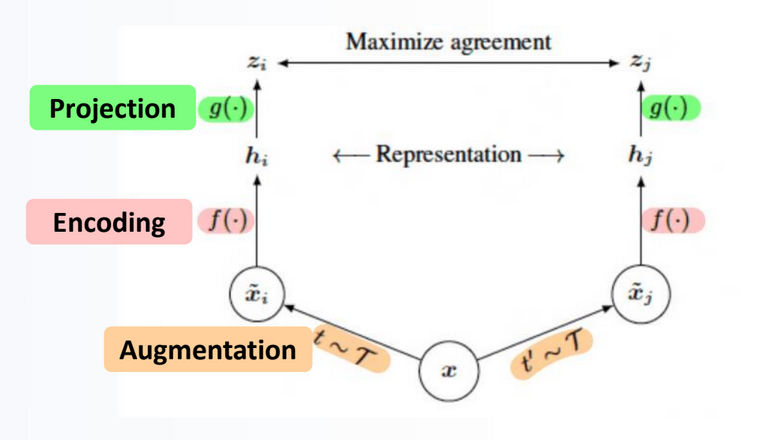
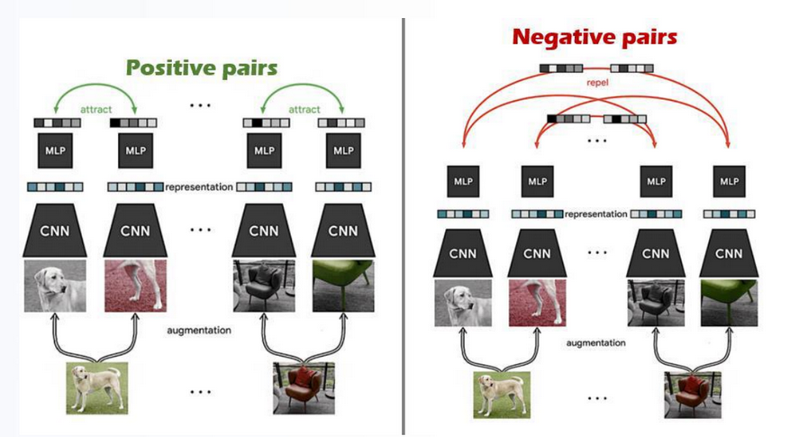
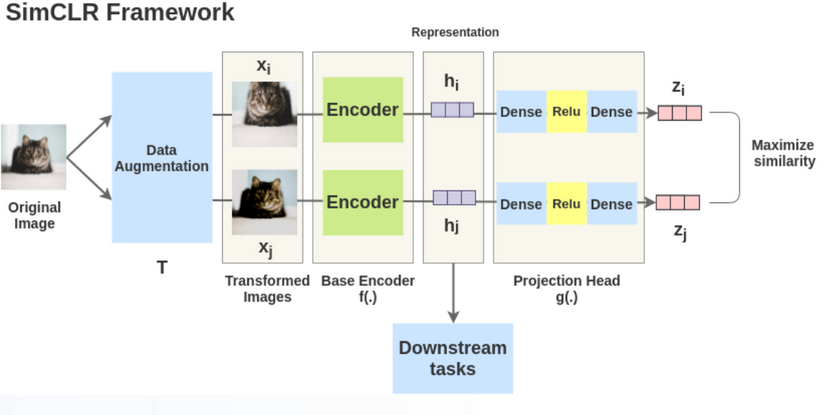
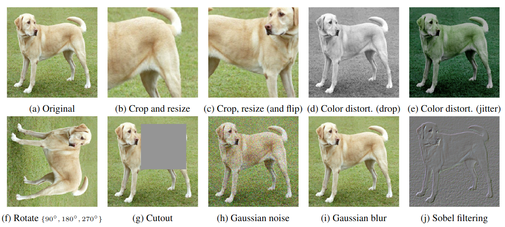
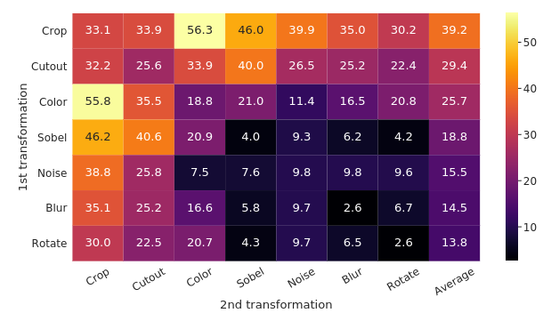
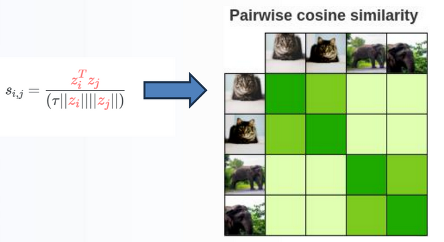
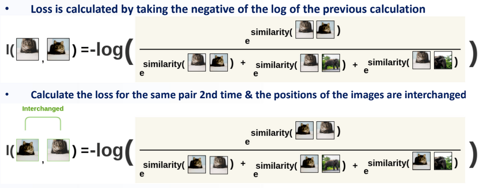
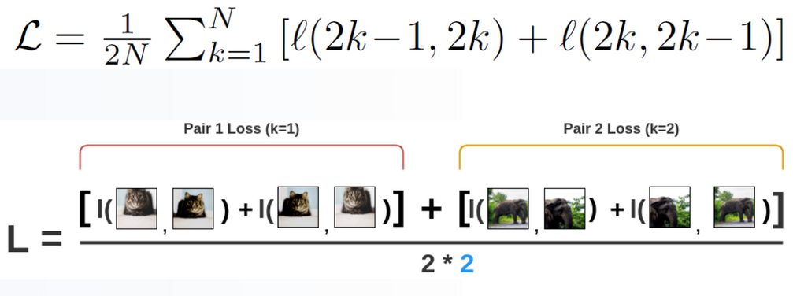
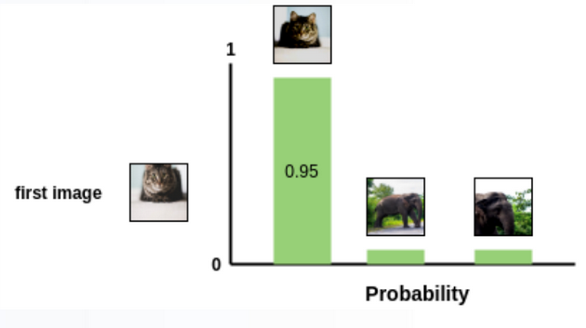
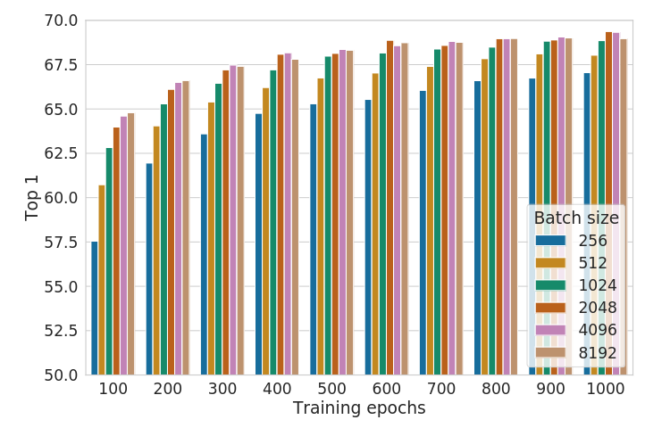

## SimCLR: A Simple Framework for Contrastive Learning of Visual Representations
*PMLR(2020), 13261 citation*

[Intro](#intro) 
[Related Work](#related-work) 
[Method](#method) 
[Experiment](#experiment) 
[Conclusion](#conclusion) 

> Core Idea

<strong>"Learn Visual Representation using Contrastive Learning(Cosine-Similarity) 

[self-supervised learning]"</strong> 

***

### <strong>Intro</strong>
- 한 장의 사진을 data augmentation 을 통해, 다른 view 를 만들어내고 해당 pair image 는 positive 라고 정의한다. 또한, 마찬가지로 다른 data 들도 같은 방식으로 pair 쌍이 존재할텐데 그 data 들은 negative data 라고 정의한다(처음 한 장의 사진에 대해서). 

***

### <strong>Related Work</strong>
- Contrastive Learning
- Representation Learning

***

### <strong>Method</strong>
- Encoder output 이 image representation 이라고 가정하고 downstream task 에 사용한다. 
- 마지막 단의 Dense layer 의 activation fuctnion 이 없는 이유는 cosine-similarity 는 음수 값이 나올 수 있기 때문이다. 

- Data augmentation 의 경우, Color distort(e) & Crop(c) 를 같이 썼을 때 성능이 가장 좋았다.

- Batch size 가 2라면 다음과 같은 matrix 가 나오고 column & row 별로 cosine-similarity 를 계산한다. 

***

### <strong>Experiment</strong>
- Batch size 가 크면 클수록 성능이 일반적으로 올라간다.

***

### <strong>Conclusion</strong>
- 유사도를 측정하는 cosine-similarity 를 사용했지만, 특정 이미지와 얼마나 다른 지는 측정할 수 없다. 
  - 밀어내는 정도를 학습하거나 지정할 수 없기 때문에..!
- Contrastive Learning 은 유사성을 고려하지 않는다. 즉, 같은 class 여도 negative pair 로 정의되기 때문에 다른 embedding 값을 가질 수 있다. 이 문제는 class 가 아닌 instance 별로 positive / negative sample 을 나눠서 발생한다. 
- 또한, contrastive learning 은 batch size 가 커야한다. 학습이 진행되면서 target 이 변하는 online 형태로 학습이 진행되기 때문이다.
  - Instance 별로 학습하기에 여러 예시를 보고 negative 를 학습해야 한다. 그렇지 않고 일부 batch 에 대해서만 학습을 진행한다면 잘못된 embedding 값으로 수렴할 수 있다. 
  - 여기서의 target 을 학습이 완료된 representation 이라고 가정해보자. 일반적인 classification 에서는 고정된 label 값에 대해서 representation 을 뽑으면 되지만 이 방법론은 정해진게 없이 contrastive learning 으로 서로 밀어내면서 특정 embedding 값으로 수렴을 할텐데 이때 예시를 많이 줘서 negative 를 충분히 고려해야한다.
  - 따라서 batch 에 따라 얼마든지 학습이 완료된 representation 이 바뀔 수 있다. 즉, batch 에 의존적이다. (일반적인 classification 에서는 학습이 완료된 representation 을 얻을 때 batch 에 의존적이지는 않다)

***

### <strong>Question</strong>

