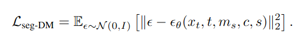
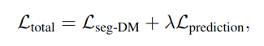
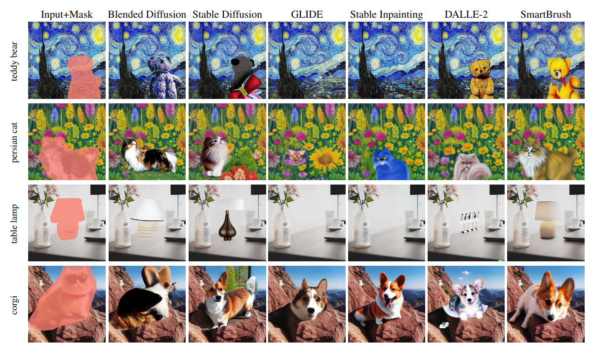
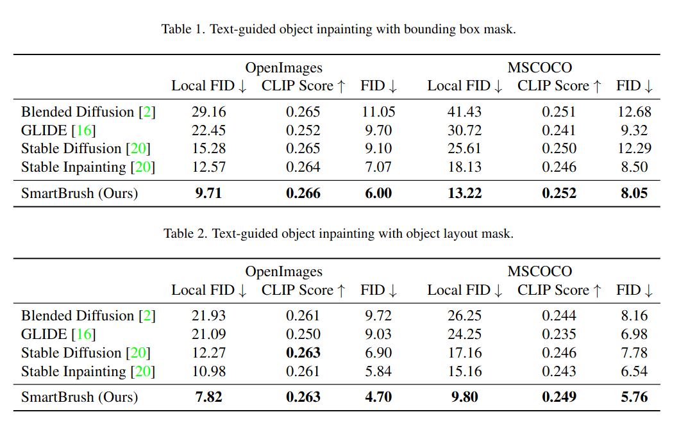
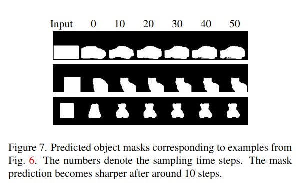

## SmartBrush: Text and Shape Guided Object Inpainting with Diffusion Model
*CVPR(2023), 83 citation, Carnegie Mellon University, Adobe Research, Review Data: 2024.04.09*

[Intro](#intro) 
[Related Work](#related-work) 
[Method](#method) 
[Experiment](#experiment) 
[Conclusion](#conclusion) 

> Core Idea

<strong>"Can Precise Image Inpainting and Coarse Image Inpainting Ability"</strong> 

***

### <strong>Intro</strong>

- 전통적인 image inpainting 은 주변 pixel 에 의존하여 이미지의 빈 부분을 채우는 것만을 목표로 한다. 
- 반면에 multi-modal inpainting 은 추가 정보를 통해 더 많은 제어를 제공한다.
  - E.g., class label, text description, segmentation map 등을 사용할 수 있다. 
  - E.g., mask 를 사용하여 inpainting 된 객체의 모양을 제한할 수도 있다. 
  - **본 논문에서는, text description 과 inpainting 할 객체의 모양에 의존하는 multi-modal inpainting task 를 고려한다.**
  - 이전의 method 들인 DALLE-2 와 Stable Diffusion 과 같은 모델은 text 로 가이드된 inpainting 을 수행했지만 shape guide 를 지원하지는 않으며 생성된 객체 주변의 배경 texture 를 수정하는 경향이 있다. 
  - 즉, 다른 모델들은 mask region 이 주어져도 object 생성에 전체를 활용하지 않는다. 주어진 영역안에서 아무렇게나 생성. 

- 본 논문에서는, text 와 shape 가이드를 지원한다. 
  - 배경 보존을 위해, diffusion U-Net 에 object mask prediction 을 추가하여 새로운 훈련 및 sampling 전략을 제안한다. 

- Accurate mask region 을 제공 $\rightarrow$ 해당 영역에 알맞게 생성
- Coarse mask 을 제공 $\rightarrow$ 더 나은 배경 보존

***

### <strong>Related Work</strong>

- Diffusion model: guidance 를 줄 수 없어서 원하지 않는 샘플이 나온다.
- GLIDE 와 Stable Inpainting: 이미지의 일부를 무작위로 지우고 해당 이미지 캡션에 대한 조건부로 masking 된 영역을 복원하기 위해 학습된다. 그러나 무작위로 지우기 때문에, masking 된 영역과 text 설명 간의 의미적 불일치로 인해 모델이 text prompt 를 정확하게 따르지 않고 배경을 채울 수 있다.
  - E.g., 맨 처음 이미지를 보면, GLIDE & Stable Inpainting 모두 masking region 에 대해 text prompt 를 온전히 받아들이지 않고, 일부만 홍학을 그리고 나머지는 배경으로 채움.
- Blended diffusion: CLIP 을 사용하여 image embedding 과 text embedding 간의 차이를 계산한 다음 sampling 과정 중에 그 차이를 주입한다. (CLIP 점수를 사용하여 출력이 text prompt 와 일치하도록 장려한다.) 그러나 CLIP model 은 전역 및 고수준의 이미지 특징을 포착하는 경향이 있으므로 **주어진 마스크와 일치하는 객체를 생성할 동기가 없다.**, 즉, CLIP 을 쓴다고 해서 일치하게끔 만드는 원인 제공을 하지는 않는다. 
- Repaint: 각 reverse process 에서 다시 sampling 하는 것을 제안하지만 text guidance 를 지원하지 않는다. 

- 본 논문에서는 이러한 도전에 대응하기 위해 mask 에 precision factor 를 도입한다. 즉, mask 뿐만 아니라 inpainting 된 객체가 마스크의 모양을 얼마나 정확하게 따르는지에 대한 정보도 받는다. 
  - 이를 위해, 정확한 instance mask 에 gaussian blur 를 적용하여 세밀한 instance mask 부터 coarse mask 까지 적용시켜 precision factor 와 함께 학습한다. 
  - 이렇게 함으로써, 사용자는 원하는 객체가 mask 내에 어디에 있든 상관없이 coarse 한 factor value 를 사용하거나 정확하게 mask region 을 채우게끔 precision factor value 를 사용할 수 있다. 
  - 특히, coarse mask 의 경우에는 masking 된 영역이 생성될 때 배경을 원래 이미지와 일관되게끔 유지하고 싶기에, 정규화 손실을 도입하여 coarse mask 에 대해서 생성할 때 배경의 일관성을 유지한다. 

***

### <strong>Method</strong>

- Image $x$, text prompt $d$, binary mask $m$ 이 주어졌을 때, 생성된 이미지 $\tilde x$ 가 $x$ 의 background 와 동일하면서 masked region $\tilde x \odot m$ 이 text prompt $d$ 와 mask $m$ 에 잘 정렬되어야 한다. 

$\textsf{Text and Shape Guided Diffusion}$

- 기존의 inpainting model 들은 random 하게 이미지의 부분을 지우고 복원하도록 학습된다. 이렇게 학습하면, masked region 이 object 의 일부분만 포함하거나 object 주변의 배경을 포함한다. 
- 따라서, 본 논문은 기존의 instance or panoptic segmentation dataset 으로부터 text 와 shape 정보를 활용하는 것을 제안한다. (아무런 근거없이 masking 하지 말자!)
- 이런 dataset 은 $N$ 개의 mask 가 존재한다. $\{ m_i \}_{i=1}^{N}$. 따라서 $x \odot m_i$ 는 하나의 object 만 남는다. 각 mask 에 대해서는 class label 도 존재한다. $c_i$ (e.g., hat or cat)
- Model 의 input 으로는 noisy input 을 넣어줘야 하는데 다음과 같이 만든다. 
  - 기존의 diffusion process 처럼 noisy $\tilde x_t$ 를 만들고 masked region 이 아닌 부분은 clean data $x_0$ 로 바꿔준다. 
  - 이렇게 함으로써, clean background 정보를 활용할 수 있고 masked region 을 채우기 위해 학습한다. 
  - Inference 시에도, 마찬가지로 진행한다. $x_T = \epsilon \odot m + x_0 \odot (1-m)$

$$ \tilde{x}_t = \sqrt{\bar \alpha_t}x_0 + \sqrt{1 - \bar \alpha_t \epsilon} $$

$$ x_t = \tilde{x_t} \odot m + x_0 \odot (1 - m) $$

$\textsf{Shape Precision Control}$

- 해당 dataset 에 존재하는 mask 를 사용하면 모델은 inference 시에 input mask 에 shape 을 정확하게 따르도록 장려된다. 본 논문은 정확한 마스크 (e.g., 고양이의 모양) 뿐만 아니라 덜 정확한 마스크 (e.g., bounding box) 를 제공할 수 있도록 서로 다른 정밀도의 마스크를 생성하기로 제안한다. 
- 이를 위해, 훈련 중에 마스크를 무작위로 변형하여 모양을 바꾼다. 
  - 구체적으로 정확한 mask $m$ 이 주어지면 mask precision indicator $s \sim [0,S]$ 를 사용하여 조절한다.
  - $k_s$: Gaussian kernel size
  - $\sigma_s$: standard deviation of the kernel 
  - $s=0$: 변하지 않는다.
  - $s=S$: bounding box $\rightarrow$ 상세한 shape 정보를 상실한다. 

$$ m_s = \text{GaussianBlur}(m, k_s, \sigma_s) $$
 
- 따라서 Diffusion model 의 기본 Loss 는 다음과 같이 구성된다.

$\textsf{Background Preservation}$

- 만일, 정확한 mask 가 아니라 coarse mask 라면 masked region 에서 생성된 background 는 바뀔 수 있다. 
  - 이상적으로는 배경을 보존하고 싶지만, 모델이 원하는 객체를 어디에 생성할 지 모르기 때문에 이는 어려운 과제이다. 이 도전 과제를 해결하기 위해 본 논문에서는 mask precision info 를 활용한다. 구체적으로, coarse mask 로부터 정확한 instance mask $m$ 을 예측하도록 한다. 

- 즉, 모델이 mask image 도 생성하게끔 channel 을 하나 더 추가해주고 model 이 예측한 정확한 mask 와 실제 mask 와의 교집합을 maximize 하도록 학습된다.
  - 여기서는 DICE loss 를 활용했다.
  - 예측된 마스크를 사용하면 masking 된 영역 내에서 객체가 생성되는 위치를 알 수 있으므로 모델이 자동적으로 생성된 객체 주변의 배경 정보를 보존할거라는 가정이다. 

$$ L_{prediction} = H(\epsilon_{\theta}(m_s), m) $$

$$ H(X,Y) = 1 - \frac{2 | X \cap Y |}{| X | + | Y |} $$

- 따라서 최종 Loss 는 다음과 같다. 
  - $\lambda=0.01$ 

***

### <strong>Experiment</strong>

- Pre-trained Stable Diffusion text-to-image model v1.2 를 finetuning 했다.
  - Class label 과 같은, 짧은 text 는 generation quality 를 하락시키기에 captioning model 인 BLIP model 을 사용하여 local segment 에 해당하는 longer caption 을 만들었다. 
  - 학습 동안에는, class label 이나 BLIP 을 번갈아 사용하며 single word text 도 가능
  - 더 많은 학습 데이터와 더 다양한 text description 및 image content 를 활용하기 위해, 동시에 text-to-image generation task 도 수행했다. LAION-Aesthetics v2 5+ subset 을 활용했다. 이때는 전체 이미지 영역이 mask 로 sepcial inpainting case 로 볼 수 있다. 
  - Inpainting task 는 $80$ %, generation task 는 $20$ % 로 수행했다. 

$\textsf{Baselines}$

- Blended Diffusion, GLIDE, Stable Diffusion, Stable Inpainting, DALLE-2
- Segmentation datasets: OpenImages, MSCOCO
- Evaluation: FID, Local FID (crop mask)

- Table $1$ 은 coarse mask 에 대한 결과이고 $2$ 는 정확한 mask 에 대한 FID 이다. 

- Model 이 예측한 정확한 mask

***

### <strong>Conclusion</strong>

***

### <strong>Question</strong>

<a href="">link</a>

> 인용구
