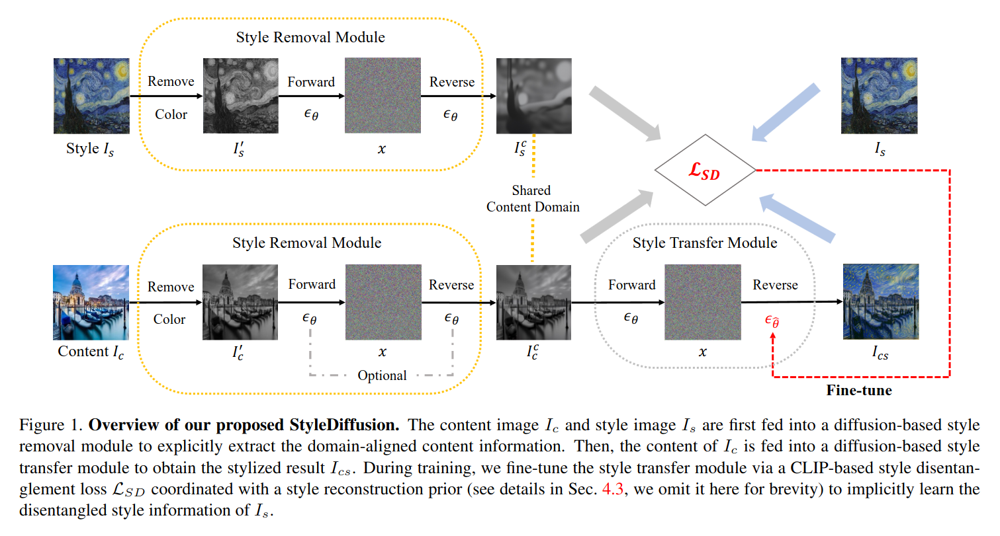
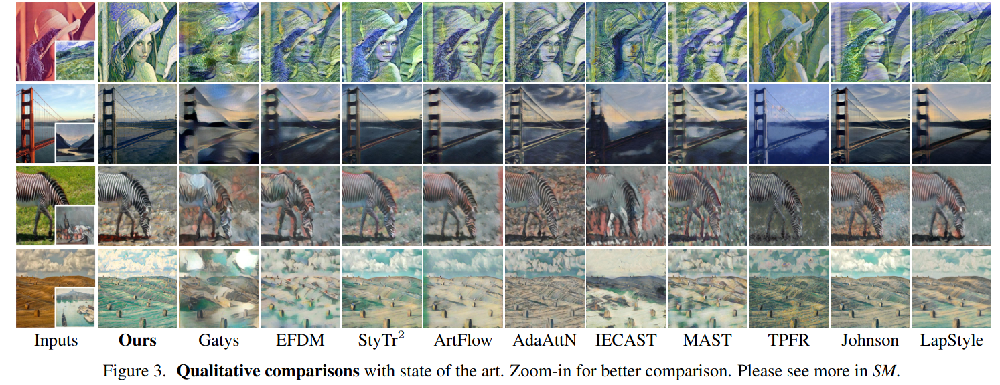

## StyleDiffusion: Controllable Disentangled Style Transfer via Diffusion Models 
*CVPR(2023), 0 citation*

[Intro](#intro) 
[Related Work](#related-work) 
[Method](#method) 
[Experiment](#experiment) 
[Conclusion](#conclusion) 

> Core Idea

<strong>"test1"</strong> 

***

### <strong>Intro</strong>
- Content and style(C-S) disentanglement 는 style transfer 의 근본적인 문제이고 중요한 과제이다.
  - Existing approaches 들은 해석 가능하지 않고 제어하기 어렵다
    - Explicit definitions: Gram matrix
    - Implicit learning: GAN
- 본 논문에서는 이러한 방법들을 사용하지 않고 style transfer 를 위한 새로운 C-S disentanglement framework 를 제안한다. 

***

### <strong>Related Work</strong>

***

### <strong>Method</strong>

***

### <strong>Experiment</strong>

***

### <strong>Conclusion</strong>
- 명시적으로 content information 을 추출하고 implicitly, style information 을 학습할 수 있다.
- 즉, 해석가능하고 제어가능한 C-S disentanglement and style transfer 를 제안했다.
- CLIP image space 에서 C-S 를 해결하기 위해 CLIP-based style disentanglement loss 와 style reconstruction prior 를 도입했다. 

***

### <strong>Question</strong>
