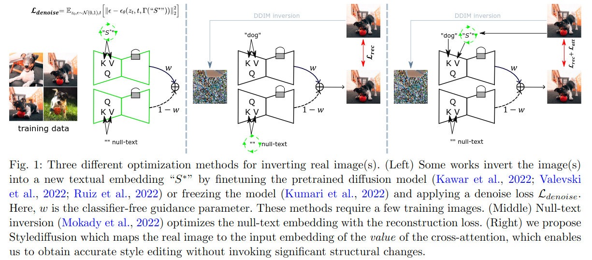
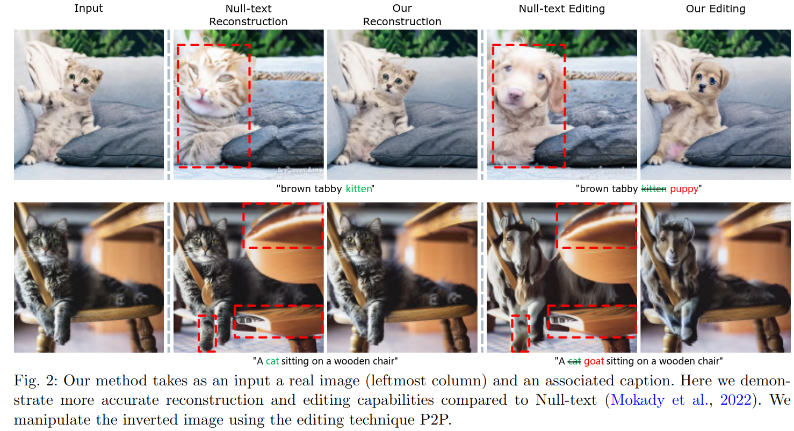
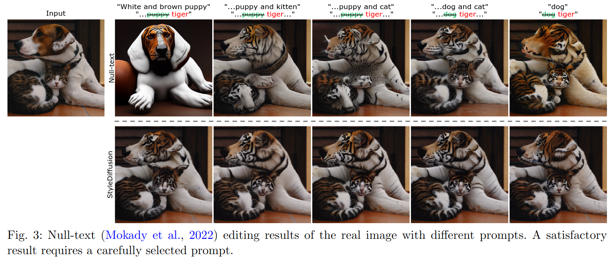
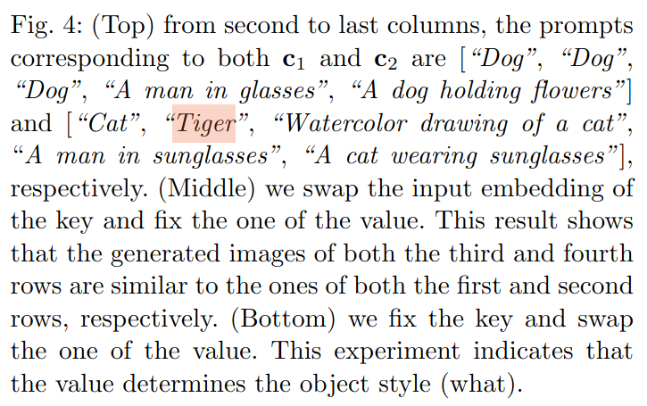
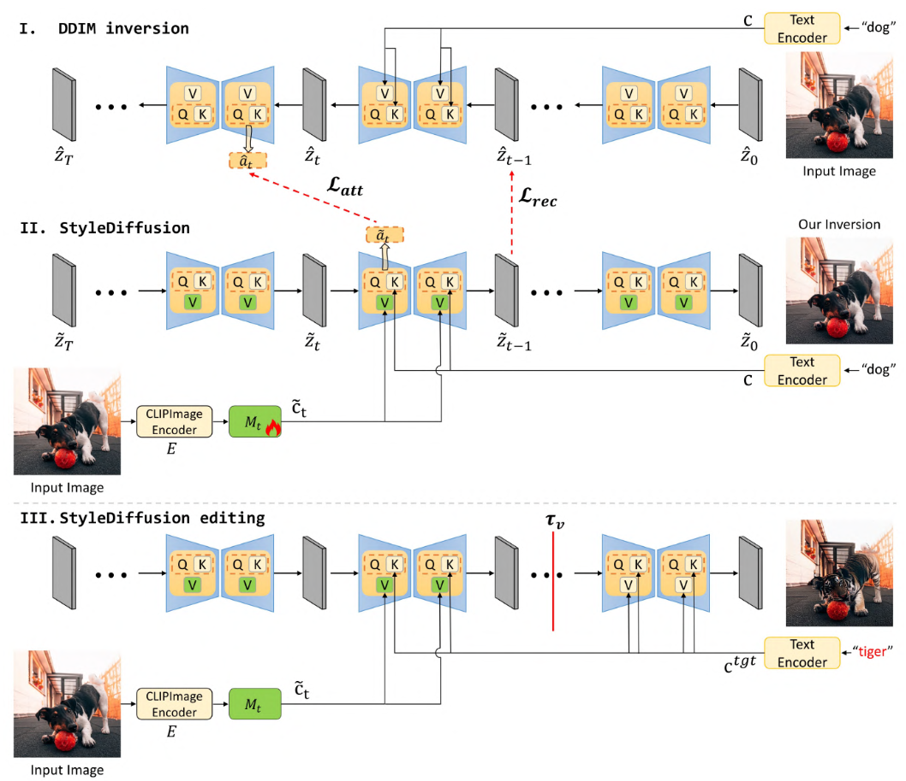
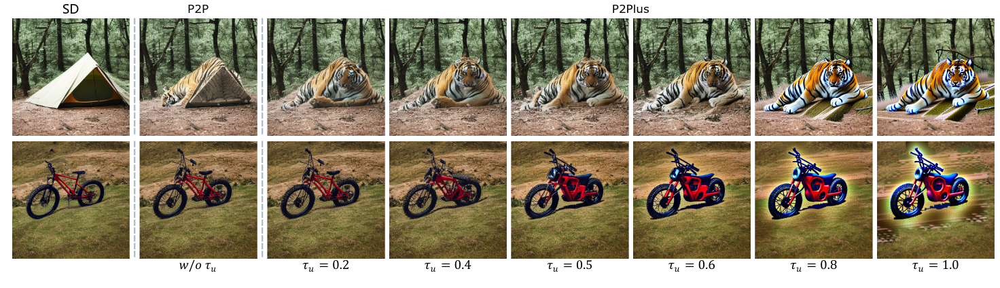

## StyleDiffusion: Prompt-Embedding Inversion for Text-Based Editing
*arXiv(2023), 29 citation, Review Data: 2024.07.11*

[Intro](#intro) 
[Related Work](#related-work) 
[Method](#method) 
[Experiment](#experiment) 
[Conclusion](#conclusion) 

> Core Idea

<strong>"test1"</strong> 

***

### <strong>Intro</strong>

$\textbf{이 주제의 정의 및 요구사항과 중요한 이유}$

- Text-based deep generative model을 활용한 image editing에서 pretrained diffusion model의 놀라운 능력을 이용하는 것에 많은 연구가 집중하고 있다. 

$\textbf{최근 노력들과 여전히 남아있는 문제들}$

- Image editing을 위해 model을 finetune하거나 pretrained model의 latent space에서 image를 invert하는 방법들이 있지만, 이런 방법들은 $2$가지의 문제점을 가지고 있다. 
  1. 선택한 영역에 대한 불만족스러운 결과 및 선택하지 않은 영역에서의 예상치 못한 변화
  2. Input image안의 모든 visual objects를 포함하는 text prompt를 필요로한다.

- Left: DreamBooth, Middle: Null-text inversion, Right: Ours
  - Ours: 실제 이미지를 cross-attention의 input embedding 중 **Value** 에 mapping하여 중요한 구조적 변화를 일으키지 않고도 정확한 스타일 편집을 가능케한다.
  - 물체를 설명하는 text description이 부족한 경우 null-text editing과 같이 구조적 정보가 보존되지 않은 형태로 생성이 된다. 

$\textbf{본 논문에서 해결하고자 하는 문제와 어떻게 해결하는지, 그 결과들}$

- 위의 $2$가지 문제점을 해결하고자 $2$가지 개선사항을 제안한다.
  1. 오직 cross-attention layer의 linear network value의 input만을 최적화하는 것만으로도 실제 이미지를 재구성하기에 충분하다
  2. Reconstruction and editing 이후에 객체와 같은 attention map을 보존하기 위해 attention regularization을 제안하여 구조적 변화를 일으키지 않고 정확한 스타일 편집을 가능하게 한다.
  3. 더불어서, prompt-to-prompt에서 사용한 classifier-free guidance의 unconditional branch에 사용되는 편집 기술을 더욱 향상시킨다. 

***

### <strong>Method</strong>

- Attention mechanism에 대한 분석을 진행했고 (특히, key, query, and value) **key** 가 output image의 구조, **value called prompt-embedding** 가 object의 style을 지배하고 있음을 관찰했다. 

- Key가 구조, Value가 object style을 결정함을 보여주는 실험이다. 
  - 예시로, 두 번째 column의 $c1, c2$는 각각 강아지와 호랑이다. 원본의 구조 및 스타일은 첫 번째, 두 번째 row (StableDiffusion)을 보면 된다. 본 논문에서 가정한대로라면, $c1$ (dog)이 key에 $c2$ (tiger)가 value에 들어갔다는 것은 dog image의 구조에 tiger가 생성되어야 한다. 이를 만족하는 figure는 value를 swap한 $5$번째 row이다. 
  - 마찬가지로 그 반대는, tiger의 구조에 강아지가 있어야하니 이를 만족하는 것도 value를 swap한 $6$ 번째 row이다. 
  - 반면에 key를 swap한 figure들은 기존의 stablediffusion과 달라지는 부분이 없다. 

- 위의 실험으로 우리는 cross-attention의 key와 value에 각각 object structure, style이 담겨져 있음을 확인했다. 
  - 따라서, 본 논문에서는 key에는 기존의 prompt를 그대로 제공하고, value에는 수정하고자 하는 이미지를 CLIP image encoder를 통해 제공한다. (?근데 이게 object structure와 style과 매칭이 잘 안된다)
  - CLIP image encoder와 MLP를 붙이고 MLP를 학습시키는 거 같다. (1)에선 DDIM inversion으로 실제 이미지를 다시 재구성을 하고 있고, (2)에서는 value를 CLIP image encoder ouptut으로 대체, query & key의 attention map을 (1)에서의 map과 동일하게, 한 step denoising한 output인 $z_{t-1}$이 서로 동일하게 학습이 되고 있다. 
  - (3)에서는 실제 editing을 할 때, $\tau_v$까지 value를 CLIP image encoder output으로 전달해준다. 

- $\tau$에 대한 실험

***

### <strong>Experiment</strong>

***

### <strong>Conclusion</strong>

***

### <strong>Question</strong>

<a href="">link</a>

> 인용구
