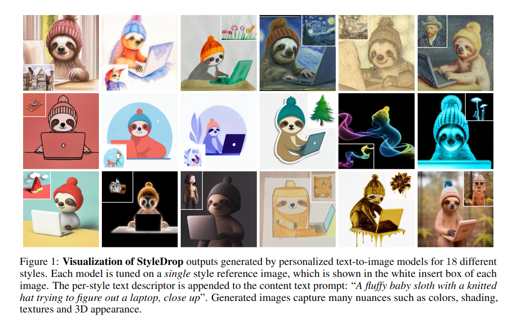
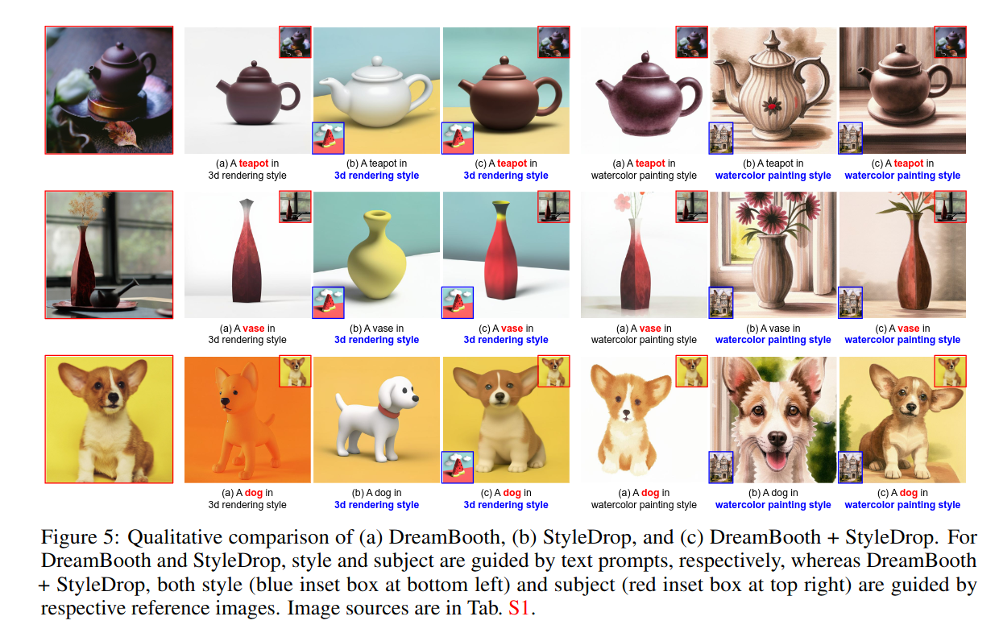
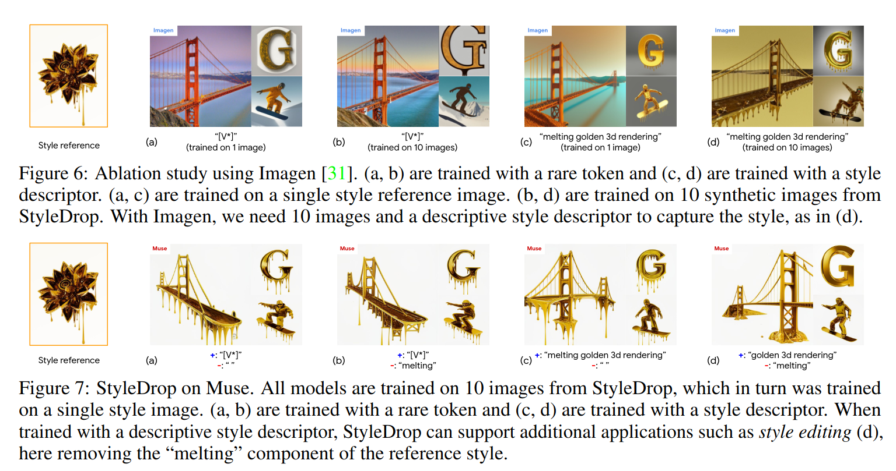

## StyleDrop: Text-to-Image Generation in Any Style
*arXiv(2023), 11 citation*

[Intro](#intro) 
[Related Work](#related-work) 
[Method](#method) 
[Experiment](#experiment) 
[Conclusion](#conclusion) 

> Core Idea

<strong>"Style Personalization via Muse"</strong> 

***

### <strong>Intro</strong>
- 자연어에 내재된 모호성(ambiguities inherent in natural language)과 out of distribution effects 로 인해서 특정 디자인 패턴, 질감 또는 재질을 활용하는 이미지 스타일을 합성하는 것은 어렵다.
- 본 논문이서는 StyleDrop 이라는 것을 소개하여, 특정 스타일을 정확하게 따르는 이미지를 생성할 수 있게 하는 것이 목적이다. 
- 매우 적은 learnable parameter(총 parameter 의 $1\%$ 미만)를 fine-tuning 하여 새로운 스타일을 효과적으로 학습한다. 또한 인간/자동 피드백을 사용하여 반복적인 훈련을 통해 품질을 향상시킨다. 
- 더욱이, 사용자가 원하는 스타일을 지정하는 단일 이미지(one reference image)만 제공해도 인상적인 결과를 제공할 수 있다.
- Muse 를 통해 구현된 StyleDrop 이 Stable diffusion/Imagen 에 적용된 DreamBooth & Textual Inversion 과 같은 다른 방법들을 앞선다는 것을 보여준다.  

***

### <strong>Related Work</strong>
- Personalized Text-to-Image Synthesis
  - Textual inversion, Hard prompt
    - 적은 양의 object 이미지로 text-to-image model 의 parameter 변화 없이 text representation 을 찾는다 (e.g., embedding, token)
  - DreamBooth
    - 관심 주제를 설명하는 몇 장의 이미지에 대해 entire text-to-image model 을 fine-tuning 한다.
    - 따라서 표현력이 풍부하며 세부적인 내용으로 주제를 캡쳐한다.
  - LoRA, Adapter tuning
    - Parameter efficient fine-tuning(PEFT) methods
  - Custom diffusion, SVDiff
    - DreamBooth 를 여러 주제에 대해 동시에 합성하도록 확장
  - StyleDrop
    - 다른 text-to-image diffusion model 과 달리 Generative vision transformer 를 기반으로 한다.
    - 다른 방법들은 painting style 에 제한되어 있지만, StyleDrop 은 a single style reference image 만을 사용하여 3D rendering, design illustration, sculpture 등 다양한 시각적 스타일을 시연한다. 

- Neural Style Transfer (NST)

- Parameter Efficient Fine Tuning (PEFT)

***

### <strong>Method</strong>
- 예를 들어, 반 고흐는 다양한 스타일의 그림을 가지고 있다. 따라서 단순히 "반 고흐" 라는 텍스트로 이미지를 뽑아낸다면 반 고흐 스타일 중 하나(랜덤으로 선택된) 또는 예측할 수 없는 여러 스타일의 혼합으로 이어질 수 있다. 
- 따라서 본 논문에서는 하나의 이미지만 제공하여 스타일화시킨다. 
- 총 $3$가지 component 로 이루어져 있다.   
  - A transformer-based text-to-image generation model
    - Muse 가 Imagen/Stable Diffusion 과 같은 diffusion-based model 에 비해 단일 이미지에서 미세한 스타일을 학습하는 데 유리하다는 것을 발견
  - Adapter tuning
    - Large text-to-image transformer 를 효율적으로 style-tuning
    - 구체적으로, content 와 style text descriptor 를 결합해, 한 장의 style reference image 의 text input 을 작성하여 content-style disentanglement 를 진행한다.
  - Iterative training with feedback
    - 이미 훈련된 adapter 에서 sampling 된 이미지로 새 adapter 를 훈련하는 iterative training framework 를 제안한다.
    - 작은 규모의 고품질 합성 이미지에 대한 훈련을 할 때, 반복적인 훈련이 이미지의 매우 적은 수 (e.g., $1$) 에 대한 text-to-image model fine-tuning 의 일반적인 문제를 효과적으로 완화한다. 
    - CLIP/human feedback 을 사용한 고품질 샘플 선택 방법을 연구

***

### <strong>Experiment</strong>

***

### <strong>Conclusion</strong>

***

### <strong>Question</strong>

