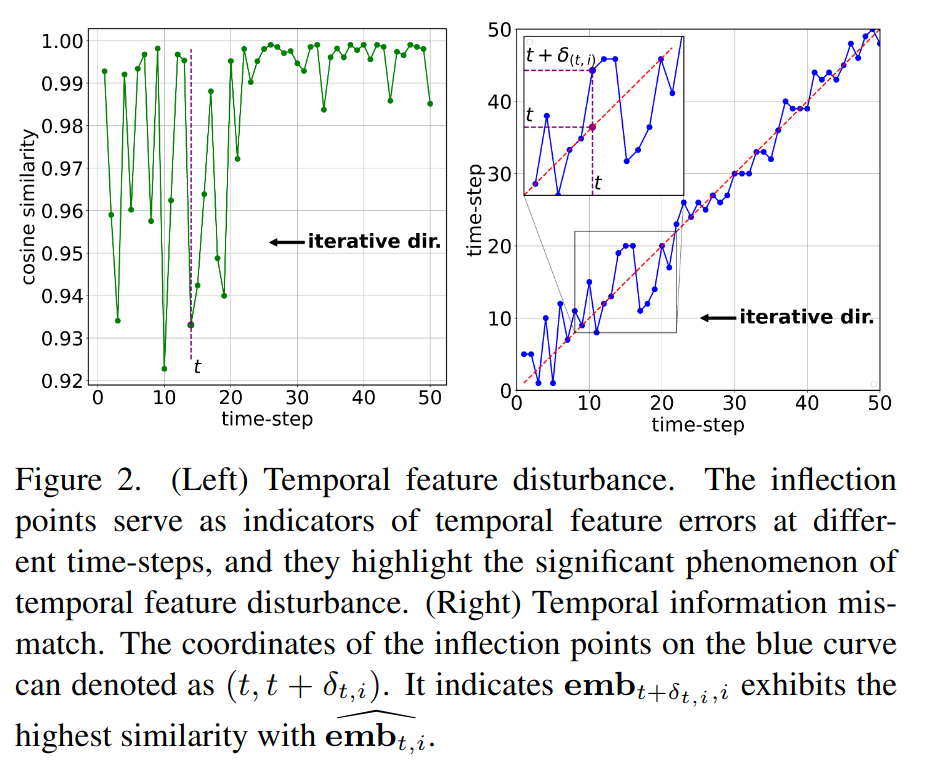

## TFMQ-DM: Temporal Featrue Maintenance Quantization for Diffusion Models
*CVPR(2024), 25 citation, Beihang University, Review Data: 2025.03.19*

[Intro](#intro) 
[Related Work](#related-work) 
[Method](#method) 
[Experiment](#experiment) 
[Conclusion](#conclusion) 

> Core Idea

<strong>"Independent Quantization of Temporal Module"</strong> 

***

### <strong>Intro</strong>

$\textbf{이 주제의 정의 및 요구사항과 중요한 이유}$

- Diffusion model의 상당한 계산 비용은 광범위한 적용을 어렵게 한다. 더욱이 이러한 계산 비용은 다음의 2가지 주요한 문제를 가진다.
  - Denoising step을 일반적으로 $100$번 필요로하기에 GAN보다 상당히 느리다: 이전 연구들은 더 짧고 더 효율적인 sampling trajectories를 찾아서 이러한 문제를 해결한다.
  - Diffuison model의 상당한 network architecture는 엄청난 시간과 메모리 자원에 의존한다. 특히 large-scale datasets e.g., LDM과 Stable Diffusion. 본 논문은 diffusion model의 압축에 집중하여 이 문제를 해결하고자 한다.

$\textbf{이 주제의 문제점과 기존의 노력들}$

- 전통적인 모델에 대한 PTQ(Post-Training Quantization)는 광범위하게 연구되어 왔지만, 이를 확산 모델에 적용할 경우 특히 저비트 설정에서 성능이 크게 저하되는 것으로 나타났다. 
  - 예를 들어, Q-Diffusion은 4비트 양자화 시 일부 데이터셋에서 심각한 정확도 저하를 보인다 [Lsun: Construction of a large-scale image dataset using deep learning with humans in the loop]. 
  - 이러한 방법들이 더 나은 결과를 얻지 못하는 이유는 모두 샘플링 데이터의 독립성과 시간적 특징의 고유성을 간과했기 때문이라고 생각한다.

- 시간적 특징은 시간 스텝 $t$에서 몇 개의 모듈을 거쳐 생성되며, 확산 모델에서 잡음 제거 경로를 제어하는 데 사용된다. 또한, 앞서 언급한 방법들에서는 시간적 특징의 교란이 모델 성능에 상당한 영향을 미친다는 점을 관찰하였다.

- 시간적 특징 교란(temporal feature disturbance)을 해결하기 위해, 먼저 시간적 특징을 생성하는 모듈들이 샘플링된 데이터와 독립적임을 발견하고, 이 전체 모듈을 **Temporal Information Block**으로 정의한다. 기존 방법들은 양자화 과정에서 이 블록을 개별적으로 최적화하지 않기 때문에, 시간적 특징이 제한된 보정 데이터(calibration data)에 과적합되는 문제가 발생한다.

- 한편, 노이즈 제거를 위한 최대 타임스텝은 유한한 정수이므로, 시간적 특징과 그 생성을 위한 활성화 값(activation)은 유한한 집합을 형성한다. 따라서 최적의 접근법은 이 집합의 각 요소를 개별적으로 최적화하는 것이다. 
  - 이러한 분석을 바탕으로, 우리는 시간적 특징을 최적화하는 새로운 양자화 재구성 방법인 **Temporal Information Aware Reconstruction (TIAR)**을 제안한다. 이는 시간적 특징 손실을 최소화하는 것을 최적화 목표로 삼으며, 네트워크 내에서 샘플링된 데이터와 관련된 구성 요소를 시간적 특징 생성 과정에서 분리하도록 설계되었다.
  - 또한, 우리는 시간적 특징과 그 생성 과정에서의 활성화 값이 유한 집합을 형성한다는 점을 활용하여, **Finite Set Calibration (FSC)**이라는 새로운 보정 전략을 도입한다. 이 전략은 서로 다른 타임스텝에 대응하는 활성화 값에 대해 개별적인 양자화 파라미터를 적용한다. 더욱이, 본 방법의 보정 속도는 기존의 주요 양자화 기법보다 빠르며, 예를 들어 LSUN-Bedrooms $256 \times 256$ 데이터셋에서 양자화 시간을 $2.0$배 단축할 수 있다. 그럼에도 불구하고, 이 전략은 추론 및 저장 오버헤드를 거의 증가시키지 않는다.

$\textbf{최근 노력들과 여전히 남아있는 문제들}$

- PTQ4DM은 확산 모델을 8비트로 양자화하려는 초기 시도로 볼 수 있으나, 실험이 제한적이고 해상도가 낮다는 한계를 가진다. 
- 반면, Q-Diffusion은 더 넓은 데이터셋 범위에서 평가되며 성능을 향상시킨다. 
- 또한, PTQD는 상관 노이즈 및 잔여(residual) 노이즈 보정을 통해 양자화 노이즈를 제거한다.
- 특히, 기존의 단일 타임스텝(single-time-step) PTQ 보정(calibration) 방법은 확산 모델에 적합하지 않다. 이는 각 타임스텝에서 활성화 분포(activation distribution)가 크게 변화하기 때문이다. 이러한 문제를 해결하기 위해, ADP-DM은 확산 모델에 대해 그룹 단위(group-wise) 양자화를 적용하였으며, TDQ는 서로 다른 타임스텝에 대해 개별적인 양자화 파라미터를 도입하였다.

- 그러나 위의 연구들은 모두 시간적 특징(temporal features)의 특수성을 간과하고 있다. 이를 해결하기 위해, 본 연구에서는 시간적 특징 교란(temporal feature disturbance)의 원인을 분석하고, 새로운 재구성 및 보정 프레임워크를 도입하여 양자화된 확산 모델의 성능을 대폭 향상시킨다.

$\textbf{본 논문에서 해결하고자 하는 문제와 어떻게 해결하는지, 그 결과들}$

- Diffusion model은 만족스러운 multi-round denoising을 달성하기 위해 time-step $t$에 의존한다.
  - 대게, 유한한 집합의 $t$는 sampling data와는 관계없이 few modules에 의해 temporal feature로 인코딩된다.
  - 하지만 기존의 PTQ methode들은 이러한 모듈을 따로 최적화하지 않는다. 그들은 부적절한 reconstruction target과 복잡한 calibration method를 적용하여 temporal feature와 denoising trajectory의 심각한 방해를 초래한다.
  - 이러한 문제를 해결하기 위해, Temporal Feature Maintenance Quantization (TFMQ)을 제안한다: sampling data와는 관련이 없고 time-step $t$와 관련된 Temporal Information Block을 기반으로하는 TFMQ Full precision temporal feature를 정렬하기 위해 1) Temporal information aware reconstruction (TIAR)과 2) 유한한 집합 calibration (FSC)을 고안했다.

- 본 논문은 대부분의 temporal information과 end-to-end generation quality를 보장한다.

***

### <strong>Related Work</strong>

*Preliminaries*

- Reconstruction on diffusion models: layer/block-wise reconstruction

***

### <strong>Method</strong>

*Notations*

- $n$: the number of Residual Bottleneck Blocks
- time embed $h(.)$: time step $t$를 `embedding (using sin & cos) -> Linear -> SiLU -> Linear`
- embedding layer $g(.)$ in each Residual Bottleneck Block: `SiLU -> Linear`
- time step $t$는 residual block에만 argument로 들어간다.
- 본 논문은 Temporal feature: $emb_{t,i}$ = $g_i(h(t))$가 temporal activation임에 주목했고, 이는 input data와는 무관하다.
- 또한, 우리는 확산 모델의 맥락에서 시간적 특징이 중요한 역할을 하며, 고유하고 의미 있는 물리적 함의를 가진다는 것을 발견하였다. 이러한 특징은 현재 이미지가 잡음 제거 경로에서 어느 시점에 위치하는지를 나타내는 시간적 정보를 포함한다. UNet 구조 내에서는 각 시간 단계가 이러한 시간적 특징으로 변환되며, 이는 각 반복에서 생성된 이미지의 특징에 적용됨으로써 잡음 제거 경로를 조정하는 역할을 한다.

$\textbf{Temporal Feature Disturbance}$

**Temporal feature error**

- Fig. 2 (Left): Stable Diffusion에서 $(T=50, i=11)$ `time embed` & `embedding layers`의 quantization 전과 후의 비교를 진행했다. 
  - Cosine similarity로 $emb_{t,i}$의 유사도를 측정했고 상당한 temporal feature error를 발견했다. 확산 모델 내에서 상당한 시간적 특징 오류로 특징지어지는 이 현상을 시간적 특징 교란 (temporal feature disturbance)이라고 정의한다.
  - 이는 time step의 고유한 시간적 특성을 고려하지 않고 quantization을 진행했기 때문이다.
  - $12-th$ ($0$부터 시작) Residual block에 대해서 $t= 0 ~ T (=50)$까지 temporal feature error를 측정한 것이다.
  - Iterative dir.: iterative direction의 약어로 시간 단계가 변화하는 과정에서 반복적으로 변하는 방향을 보여준다.

**Temporal information mismatch**

- 시간적 특징의 교란(Temporal feature disturbance)은 원래 내재된 시간 정보를 변화시킨다. 구체적으로, $emb_{t, i}$는 원래 시간 단계 $t$에 대응하도록 설계되었으나, 심각한 오류로 인해 양자화된 모델의 $\hat emb_{t,i}$는 더 이상 정확하게 $t$와 연결되지 않게 된다. 이로 인해 우리는 이를 **시간 정보 불일치(Temporal information mismatch)**라고 정의하며, 다음과 같이 표현할 수 있다:

- 또한, Fig. 2 (오른쪽)에서 볼 수 있듯이, 우리는 더욱 뚜렷한 시간 정보 불일치 현상을 관찰하였다. 특히, 양자화된 모델이 시간 단계 $t$에서 생성한 시간적 특징은 해당 시간 단계에서의 고정밀(Full-precision) 모델의 시간적 특징과 차이를 보이며, 대신 $t+ \delta_t$에 해당하는 시간적 특징과 더욱 유사해지는 경향이 있다. 이는 잘못된 시간 정보가 $t+ \delta_t$에서 유입되는 현상을 초래한다.

**경로 편차(Trajectory Deviation)**

- 시간 정보 불일치는 잘못된 시간 정보를 전달하여, 이미지의 해당 시간 위치가 노이즈 제거 경로에서 벗어나게 만든다. 결국, 다음과 같은 문제가 발생한다:

- 이는 왜곡된 시간 특징이 모델에 적용되었기 때문이다.
  - 분명히, 노이즈 제거 반복 횟수가 증가함에 따라 노이즈 제거 경로의 편차가 누적되며, 최종적으로 생성된 이미지는 $x_0$과의 정렬이 어려워진다. 
  - 이러한 과정은 아래의 그림에서 보여지며, 이때 임베딩 레이어와 시간 임베딩을 제외한 UNet은 완전 정밀도로 유지된다.

$\textbf{Inducement Analyes}$

- 명확한 설명을 위해, 이후 섹션에서는 “재구성(reconstruction)”을 최소한의 양자화 오류를 위한 가중치 조정 (weight calibration)으로, “보정(calibration)”을 활성값 보정 (activation calibration)으로 정의한다.

**Inappropriate reconstruction target**

- 기존의 PTQ 연구는 확산 모델에 대해 상당한 발전을 이루었다. 그러나 이러한 방법들은 시간 특징의 독립성과 고유한 물리적 의미를 간과하였다.
  - 이전 연구들의 재구성 과정에서는 임베딩 레이어의 최적화가 이루어지지 않았으며, 대신 보다 거친 단위인 Residual Bottleneck Block을 재구성 목표로 선택하였다.
  - 이로 인해 시간 특징 교란을 유발할 수 있는 두 가지 주요 요인이 존재한다
  - 아래의 식과 같이 재구성 목표를 설정하여 Residual Bottleneck Block의 재구성 손실을 줄이는 데 집중하였으며, 시간 특징 손실을 직접적으로 줄이는 최적화가 이루어지지 않았다.
  - 재구성 과정에서의 역전파 시, $x_t$에 대해 독립적인 임베딩 레이어가, $x_t$의 영향을 받게 되어, 제한된 보정 데이터에 대한 과적합(overfitting)이 발생하였다.

- 이를 추가로 검증하기 위해, 대표적인 재구성 방법 (weight calibration)인 **BRECQ**와 비교하며, Residual Bottleneck Block을 재구성하는 동안 임베딩 레이어의 파라미터를 고정(freeze)하고, 임베딩 레이어에 대해 Min-Max를 사용하여 초기화하는 방식을 실험하였다.
  - Tab. 1에서 볼 수 있듯이, Freeze 전략이 더 나은 FID 및 sFID 성능을 보였다. 이는 임베딩 레이어를 독립적인 최적화 대상으로 유지하는 것이 시간 특징 교란을 효과적으로 완화할 수 있음을 시사하며, 특히 저비트 환경에서 그 효과가 더욱 두드러진다.
  - 즉, Residual block의 weight를 최적화할때는 input $x_t$와는 독립적인 **Temporal Information Block**은 제외해야한다.

**Unaware of finite activations within $h(·)$ and $g_i(·)$**

- 우리는 $T$가 유한한 양의 정수일 때, 임베딩 레이어와 시간 임베드에 대한 모든 가능한 활성화 값의 집합이 유한하며, 이는 타임스텝에 엄격하게 의존한다고 관찰하였다. 
- 이 집합 내에서 동일한 레이어에 해당하는 활성화는 서로 다른 타임스텝에서 뚜렷한 범위 변화를 보인다 (부록 참조)

- 이전 방법들은 주로 $x_t$ -관련 네트워크 구성 요소의 최적 보정 방법을 찾는 데 집중하였다. 또한 첫 번째 유발 요인과 유사하게, 그들의 보정은 Residual Bottleneck Block을 대상으로 하며, 이는 최적화되지 않은 방법으로 입증되었다 (부록 참조).
  - 하지만 유한한 활성화를 기반으로, 우리는 보정 방법을 활용할 수 있으며, 특히 시간 정보와 관련된 활성화에 대해 이를 적용하여 범위 변화를 더 잘 적응시킬 수 있다.

**Conclusion about problem**

- Time-step $t$에 대한 정보는 Residual block을 통해서만 흐른다. 이때, Residual block의 weight를 최적화할때는 input $x_t$와는 독립적인 **Temporal Information Block**은 제외해야한다.
- Time-step $t$에 따라 **Temporal Information Block**의 activation 분포는 다르다.

$\textbf{Temporal Feature Maintenance}$

- 시간적 특성 교란 문제를 해결하기 위해, 우리는 시간적 특성을 유지하기 위한 새로운 **시간 정보 블록(Temporal Information Block)**을 설계하였다. 
  - 이 블록을 기반으로 **시간 정보 인식 재구성(Temporal Information Aware Reconstruction)**과 **유한 집합 보정(Finite Set Calibration)**을 제안하여 위에서 분석한 두 가지 유발 요인을 해결하고자 한다.

**Temporal information block**

- 유발 요인을 고려할 때, 각 임베딩 레이어와 Residual Bottleneck Block의 재구성 및 보정 과정을 세심하게 분리하는 것이 중요하다. 이는 양자화된 모델 성능을 향상시키기 위한 것이다. 
  - UNet의 고유한 구조를 고려하여, 우리는 모든 임베딩 레이어와 시간 임베드를 통합하여 하나의 **시간 정보 블록(Temporal Information Block)**으로 묶는다. 
 
**Temporal information aware reconstruction**

- 시간 정보 블록을 기반으로, 우리는 첫 번째 유발 요인을 해결하기 위해 **시간 정보 인식 재구성(Temporal Information Aware Reconstruction, TIAR)**을 제안한다. 재구성 과정에서 블록에 대한 최적화 목표는 다음과 같다
  - 이 재구성을 통해 가중치는 시간적 특성에 대한 교란을 최소화하는 방향으로 조정된다.

**Finite Set calibration**

- 두 번째 유발 요인에서 언급한 유한 집합 내 활성화 값의 광범위한 분포 문제를 해결하기 위해, 우리는 활성화 양자화를 위한 **유한 집합 보정(Finite Set Calibration, FSC)**을 제안한다. 
  - 이 전략은 모든 임베딩 레이어와 시간 임베드의 각 활성화 값에 대해 $T$개의 양자화 파라미터 집합을 사용한다. 예를 들어, 활성화 값 x에 대해 { $(s_T, z_T), ..., (s_1, z_1)$ }와 같은 파라미터 집합이 적용된다. 시간 단계 $t$에서, $x$에 대한 양자화 함수는 다음과 같이 정의된다.

- 또한, 보정 대상은 시간 정보 블록(Temporal Information Block)의 출력과 정렬되도록 설정된다. 유한 집합 내에서 가능한 해 공간(solution space)이 제한적이므로, 활성화 범위를 추정하는 것보다 효율적인 방법으로 Min-Max 기법을 적용하면 높은 효율성과 만족스러운 성능을 달성할 수 있음을 확인하였다.

> 즉, weight calibration은 loss함수를 이용해 Temporal Information Block의 output이 같도록 학습한다. 또한, activation calibration은 time-step마다의 $s_t, z_t$를 Min-Max로 설정하면서 동시에 Temporal Information Block의 output과 동일하도록 학습된다. 

***

### <strong>Experiment</strong>

- 본 섹션에서는 TFMQDM 프레임워크를 다양한 **확산 모델(diffusion models)**에 적용하여 이미지 생성 실험을 수행한다. 실험 대상 모델은 다음과 같다.
  - DDPM: **픽셀 공간 확산 모델(pixel-space diffusion model)**로, unconditional 이미지 생성을 수행.
  - LDM: **잠재 공간 확산 모델(latent-space diffusion model)**로, unconditional 및 클래스 조건부 이미지 생성(class-conditional image generation) 수행.
  - Stable Diffusion v1-4: **텍스트 기반 이미지 생성(text-guided image generation)**을 수행.

- 실험에는 다음 $7$가지 표준 벤치마크 데이터셋을 사용한다.
  - CIFAR-10 $(32\times32)$
  - LSUN-Bedrooms $(256\times256)$
  - LSUN-Churches $(256\times256)$
  - CelebA-HQ $(256\times256)$
  - ImageNet $(256\times256)$
  - FFHQ $(256\times256)$ 
  - MSCOCO

- 양자화 설정 (Quantization Settings)
  - 본 연구에서는 일반적인 방법을 따라 가중치는 채널 단위(channel-wise), 활성화 값은 레이어 단위(layer-wise)로 양자화한다. 실험 설정은 다음과 같다.
  - BRECQ 및 AdaRound을 사용.

- 기존 모델 양자화 기법을 고려하여, **입력 및 출력 레이어는 풀 프리시전(full precision) 유지**.
- **보정 데이터셋(calibration sets)**은 QDiffusion과 동일하게 풀 프리시전 확산 모델을 이용하여 생성.

- 가중치 양자화(weight quantization): DDPM 및 LDM에서는 미니배치 크기 32, Stable Diffusion에서는 미니배치 크기 $8$로 설정하여 $2$만 번(20k iterations) 재구성.
- 활성화 양자화(activation quantization): 모든 모델에서 **EMA(Exponential Moving Average)**를 이용해 활성화 값의 범위를 추정하며, 미니배치 크기는 $16$.

- 평가 지표 (Evaluation Metrics)
  - 각 실험에서 확산 모델의 성능을 평가하기 위해 다음 지표를 사용한다.
  - FID (Fréchet Inception Distance): 모든 실험에서 사용.
  - sFID: LDM 및 Stable Diffusion 실험에서 추가적으로 사용 (공간적 관계를 FID보다 더 잘 반영).
  - IS (Inception Score): ImageNet 및 CIFAR-10 실험에서 추가적으로 제공.
  - CLIP Score: Stable Diffusion 실험에서는 **이미지-캡션 적합성(compatibility of image-caption pairs)**을 평가하기 위해 추가 적용.
    - ViT-B/32를 백본(backbone)으로 사용하여 CLIP Score 계산.

- 모든 결과는 본 연구에서 직접 구현한 실험 결과 또는 동일한 실험 조건에서 수행된 기존 논문의 결과에서 가져왔다. 실험 수행 방식은 다음과 같다.
  - DDPM 및 LDM: 50,000개(50k) 샘플 생성 후 평가.
  - Stable Diffusion: 30,000개(30k) 샘플 생성 후 평가.
  - 모든 실험은 H800 GPU 한 개에서 실행되었으며, PyTorch 기반으로 구현되었다.

$\textbf{Unconditional Image Generation}$

- LDM 실험에서는 기본 실험 설정을 유지하며, 스텝 수, 분산 스케줄(variance schedule), 분류기-프리 가이던스(classifier-free guidance, 이하 eta 및 cfg로 표기)를 동일하게 설정하였다.

- Tab. 2에서 보이는 바와 같이, 풀 프리시전(FP) 모델과 비교한 FID 차이는 모든 설정에서 $0.7$ 이하로 유지되었다. 특히, CelebA-HQ 256×256 데이터셋에서 w4a8 설정을 적용한 결과, 기존 SOTA 대비 FID가 $6.71$ 감소하고 sFID가 $6.60$ 감소하는 성능 향상을 보였다.
  - 얼굴 데이터셋(Face Datasets)에서의 강점:
    - 기존 방법들은 4비트 또는 8비트 양자화 환경에서 CelebA-HQ 256×256 및 FFHQ 256×256 데이터셋을 사용할 경우 FP 모델 대비 큰 성능 저하를 보인다. 그러나 TFMQ-DM은 FP 모델 대비 성능 저하가 거의 없었다.
  - LSUN-Bedrooms 256×256에서의 성능 향상:
    - w4a8 설정에서, PTQD 대비 FID $2.26$ 및 sFID $7.51$ 감소하며 현저한 성능 향상을 기록했다.
  - LSUN-Churches 256×256에서의 개선:
    - LDM-8 모델을 사용할 경우, 다른 데이터셋과 비교해 개선 폭이 상대적으로 크지 않았다. 이는 LDM-8의 다운샘플링 비율(downsampling factor)이 8이기 때문에 양자화에 상대적으로 강하기 때문이라고 판단된다. 기존 방법들도 이 데이터셋에서는 이미 준수한 성능을 보였지만, 우리 방법은 FP 모델 성능에 더욱 근접했다.
  - 추가적으로, CIFAR-10 32×32 데이터셋에서 DDPM 실험도 수행하였으며, 이에 대한 결과는 부록(appendix)에 포함되었다.

$\textbf{Class-Conditional Image Generation}$

- ImageNet 256×256 데이터셋에서는 20번의 디노이징(denoising) 과정을 거쳤으며, eta = $0.0$, cfg = $3.0$으로 설정하였다.
  - PTQD 대비 FID $1.15$ 감소 (w4a32 및 w8a8 설정).
  - w4a8 설정에서 sFID $5.28$ 감소.
  - 동일 조건에서 IS(Inception Score) $7$ 이상 향상.
  - 특히, 모든 양자화 설정에서 TFMQ-DM이 FP 모델보다 낮은 FID를 일관되게 달성하며 강력한 성능을 입증했다.

$\textbf{Text-Guided Image Generation}$

- 본 실험에서는 $512\times512$ 해상도의 고해상도 이미지를 $50$ 스텝의 디노이징(downsampling) 과정을 거쳐 샘플링하였다. Stable Diffusion에서 cfg 값을 기본값인 $7.5$로 고정하여, 샘플 품질과 다양성 간의 균형을 유지하였다.
  - 기존 SOTA인 Q-Diffusion 대비 w4a8 설정에서 FID 1.13 감소.
  - w8a8에서의 FID 및 w4a32에서의 sFID는 FP 모델보다도 낮은 수치를 기록.
  - 그러나, 기존 평가 지표로는 생성된 이미지의 의미적 일관성(semantic consistency)을 충분히 평가할 수 없다.
  - 부록(appendix)에 제시된 생성 이미지들을 살펴보면, 우리 방법이 더욱 사실적인 디테일과 높은 품질의 이미지를 생성하며, 의미적 정보를 더 잘 보존하는 것을 확인할 수 있다. 또한, 생성된 이미지가 FP 모델의 효과에 더욱 근접함을 보여준다.

$\textbf{Ablation Study}$

- 제안된 각 방법의 효과를 평가하기 위해, LSUN-Bedrooms 256×256 데이터셋을 w4a8 양자화 설정에서 실험하였으며, LDM-4 모델과 DDIM 샘플러를 사용하였다. 
  - Baseline(BRECQ [24]) 한계: 실험의 기준점으로 BRECQ를 사용하였으나, 이미지 디노이징 성능이 미흡함이 확인되었다.
  - TIAR의 효과: Baseline 대비 FID $4.52$, sFID $13.44$ 감소.
    - 이는 TIAR가 시간적 정보를 효과적으로 보존함을 의미한다.
  - FSC의 효과: Baseline 대비 FID $3.29$, sFID $11.42$ 감소.

- FSC의 효율성
  - FSC에서는 활성화 함수(activations)의 범위를 평가하여 최적의 스텝 크기(step size)를 결정하는 다양한 방법이 존재한다.
  - 우리는 여러 방법을 실험하고, 이를 위한 GPU 소요 시간을 평가하였다(Tab. 6 참고).
  - 모델 성능에서 각 방법 간 개선 효과는 유사했으므로, 캘리브레이션(calibration) 시간과 효과성을 고려하여 가장 간단하고 효율적인 Min-max 방법을 채택하였다.

***

### <strong>Conclusion</strong>

- 본 연구에서는 확산 모델의 가속화를 위한 양자화 적용 가능성을 탐색하였다.
  - 이를 통해, 기존 연구에서 다루지 않은 새로운 문제인 ‘시간적 특징 왜곡(temporal feature disturbance)’을 발견하였다.

- 본 논문에서는 해당 문제의 원인을 분석하고, TFMQ-DM 양자화 프레임워크를 제안하였다.

- 향후 연구 방향:
  - Stable Diffusion에서 사용되는 텍스트 특징(textual features)도 생성 결과에 영향을 미치지만, 기존 방법에서는 이를 고려하지 않음을 발견했다.
  - 향후 연구에서는 텍스트 특징까지 반영하는 방향으로 확장이 필요하다. -> Padding과 Non-padding 분리?
  - 시간적 특징 유지(temporal feature maintenance)는 PTQ와 QAT 모두에서 유용하지만,
  - 본 연구에서는 PTQ 환경과 4-bit 양자화 달성에 초점을 맞추었다.
  - 향후 연구에서는 QAT 환경으로 확장하여 더 낮은 비트 양자화 및 추가 성능 개선을 목표로 할 필요가 있다.

***

### <strong>Question</strong>

