## TReg: Regularization by Texts for Latent Diffusion Inverse Solvers
*ICLR(2025), 16 citation, KAIST, Review Data: 2025.05.16*

[Intro](#intro) 
[Related Work](#related-work) 
[Method](#method) 
[Experiment](#experiment) 
[Conclusion](#conclusion) 

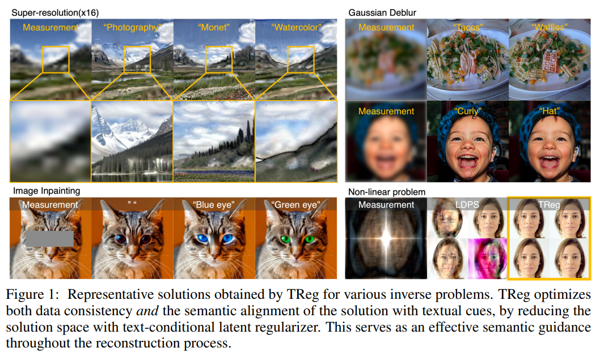

> Core Idea

<strong>"Data & Measurement Constraint + Text Conditioning + Null Text Optimization"</strong> 

***

### <strong>Intro</strong>

$\textbf{이 주제의 정의 및 요구사항과 중요한 이유}$

- Inverse problem: measurement $\mathbf{y}$로부터 $\mathbf{x}$를 복원하는 문제이다.
  - $\mathcal{A}$: forward measurement operator
  - $\mathbf{y}$: measurement 
  - $\mathbf{x}$: true image
  - $\mathbf{\epsilon} \sim \mathcal{N}(0, \sigma^2\mathbf{I})$: measurement noise

$$ \mathbf{y} = \mathcal{A}(\mathbf{x}) + \mathbf{\epsilon}$$

- Diffusion moel의 강력한 generative prior를 이용하여 inverse problem을 푸는데 상당한 진보를 이뤄냈다. 

$\textbf{이 주제의 문제점과 기존의 노력들}$

- 하지만 이러한 문제들은 본질적으로 해가 모호하거나 유일하지 않기 때문에 여전히 어려움이 존재한다.
  - ill-posed problem: 해가 없거나, 여러 개이거나, 작은 변화에 민감한 문제.
  - system symmetries: 입력이 달라도 출력이 같아지는 구조적 특성 때문에 정답을 특정하기 어려움.
    - Fourier phase retrieval에서 입력은 크기는 같지만 위상이 다른 이미지인데도 forward measurement operator를 거치면 크기만 남기 때문에 출력이 같아진다.

- 전통적으로, regularization technique들은 inverse problem의 모호함을 다루기 위해 광범위하게 연구해왔다. 
  - E.g., $L_1$ norm, total variation (TV), regularization by denoising (RED)

- 그리고, diffusion model의 등장으로 기존 inverse problem 해결 방식을 뛰어넘는 Diffusion Inverse Solvers (DIS)라는 새로운 방식이 등장했다. 
  - DIS은 prior distribution의 score function 을 학습하여 inverse problem의 본질적인 ill-posedness를 완화하고자 했다. 

$\textbf{최근 노력들과 여전히 남아있는 문제들}$

- 확산 모델 기반의 방법은 inverse problem에 큰 진전을 가져왔지만, 여전히 일부 어려운 영상 시스템에서는 ill-posedness가 완전히 해결되지 않고 있다. 
  - E.g., Fourier phase retrieval의 경우, DPS (Diffusion Posterior Sampling) 기법이 기존 방법보다 효과적으로 해를 복원하긴 하지만, 내재된 대칭성 문제는 여전히 완벽하게 극복하지 못했다. 
  - 이는 diffusion prior가 이미지 통계에 기반하기 때문에, 대칭을 깨고 유일한 해를 보장하는 데 충분하지 않기 때문이다. 

> Fourier Phase Retrieval
>> 푸리에 변환된 신호의 크기 (magnitude)만을 관측했을 때, 원래의 이미지 or 신호를 복원하는 문제이다. 즉, Fourier domain에서 phase 정보가 손실됐을 때, 이 위상 없이 원래 이미지를 되찾는 것이 핵심이다. 
>> 좌우대칭된 이미지나 이동된 이미지도 동일한 magnitude를 가질 수 있다. -> 해가 유일하지 않다.

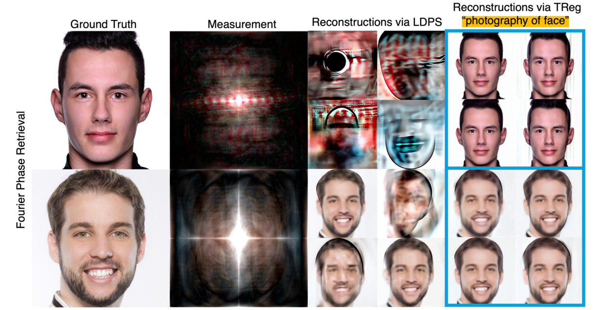

$\textbf{본 논문에서 해결하고자 하는 문제와 어떻게 해결하는지, 그 결과들}$

- 따라서, inverse solver에는 ill-posedness를 줄이고 문제를 완전히 해결하기 위해서는 추가적인 단서가 필요했고, 본 연구에서는 text description에 주목했다. 
  - Text는 sampling 과정에서의 모호성을 해소할 수 있는 맥락 정보를 제공하며, 복원된 결과에 의미 있는 semantic information을 부여할 수 있다. 

- Inverse problem의 해는 무수히 많이 존재한다. 본 논문은 solution space를 text-conditional latent regularizer로 줄이면서 ill-posedness를 완화하고자 한다.
  - 이상적으로는, text에 기술된 개념이 결과물에만 정확히 반영되어야 하지만, 수작업으로 작성된 설명은 오히려 noise를 유발해 흐릿한 결과나 artifact를 만들 수 있다. 
  - 이 문제를 해결하기 위해 adaptive negation (적응형 부정)이라는 새로운 null-text 최적화 기법을 제안한다. 
    - 이는, text guide의 영향을 동적으로 조절하여 오직 의도된 개념만이 샘플의 변화하는 상태와 정렬되도록 한다.

- 즉, 정리하면
  1. Measurement consistency로 unmasked region에 대한 반영을 효과적으로 수행한다.
  2. Data consistency + Text conditioning: measurement만 반영하는 것이 아니라, text condition도 반영하면서 생성. 즉, ill-posedness를 완화한다. 
  3. Null text optimization: text로 제한한 solution space에서 더욱 text를 반영하게끔 guide한다.

***

### <strong>Related Work</strong>

***

### <strong>Method</strong>

$\textbf{Latent Diffusion Model}$

- Decoder: $x = \mathcal{D}(z)$
- Diffusion model in VP-SDE: $\epsilon_{\theta}(\cdot, t)$ is trained to estimate the noise $\epsilon$ from $z_t$

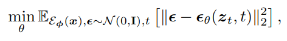

- $\epsilon$ serves as an alternative approximation of a score function as:

$$ \nabla_{z_t} \log p(z_t) = - \epsilon_{\theta}(z_t, t)  / t. $$

- In DDIM sampler,

$$ \hat z_{0 | t} = (z_t - \sqrt{1 - \bar \alpha_t}\epsilon_{\theta}(z_t, t)) / \sqrt{\bar \alpha_t} $$

$$ z_{t-1} = \sqrt{\bar \alpha_{t-1}} \hat z_{0 | t} + \sqrt{1 - \bar \alpha_{t-1}} \epsilon_{\theta}(z_t, t) $$

- Classifier-free Guidance

$$ \epsilon_{\theta}^{\omega} (z_t, c, t) = \epsilon_{\theta}(z_t, \empty, t) + \omega(\epsilon_{\theta}(z_t, c, t) - \epsilon_{\theta}(z_t, \empty, t)) $$

$\textbf{Diffusion Inverse Solvers}$

- 최근 확산 모델은 역문제를 위한 강력한 생성적 prior으로 떠오르고 있다. 초기의 역영상 기법들은 픽셀 공간 또는 측정 공간에서 노이즈 제거 단계 사이에 강한 측정 제약 조건을 적용하는 alternating projection method에 의존했다. 이후에는 확산 모델 내에서 **로그 사후분포의 그래디언트(gradient of the log posterior)**를 근사하여 비선형 문제까지 해결할 수 있는 보다 진보된 전략들이 제안됐다.

- 전통적으로 이러한 방법들은 이미지 도메인의 확산 모델을 활용해왔지만, 최근에는 오토인코더의 고정된 지점을 사용하는 latent DPS (LDPS), 히스토리 업데이트를 포함한 LDPS, Resample 기법, 그리고 **프롬프트 튜닝(prompt tuning)**을 활용한 복원 성능 향상 방법 등, 잠재 공간(latent space) 기반 확산 모델로의 전환이 일어나고 있습니다.

- 이러한 진보에도 불구하고, 정규화를 위한 텍스트 임베딩 사용은 종종 간과되고 있어, 멀티모달 잠재 공간의 잠재력을 충분히 활용하지 못하고 있습니다. 

$\textbf{Latent Optimization for Textual Constraint}$

- By the Bayes'rule:

$$ p(x|y, z) \propto p(y|x,z)p(x|z) \propto p(z|x, y)p(y|x)p(x|z) $$

- In this paper, assume $p(x|z) := \delta(x - \mathcal{D}(z))$ given a well pre-trained autoencoder 
  - 이때, 각 log-likelihood를 Guassian distribution으로 가정한다.

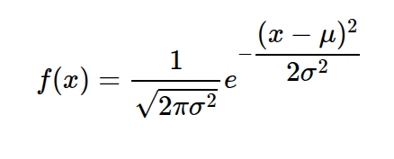

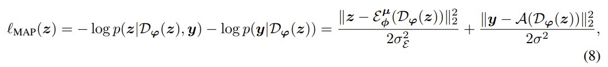

- 위의 수식은 estimated solution과 textual description간의 semantic alignment를 보장하지 않는다. 따라서, text-conditional latent regularizer를 도입하여 text condition $c$와 align되게끔 sampling trajectory를 이끈다. 

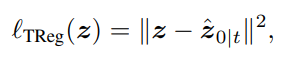

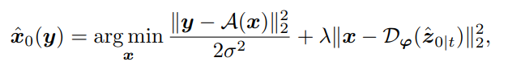

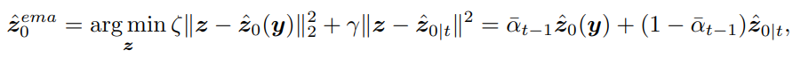

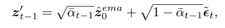

$\textbf{Adaptive Negation for Textual Constraint}$

- Text constraint로 인해 solution space를 효과적으로 줄였다. 
  - Semantic alignment를 위해 적절하게 선택된 임베딩에 condition을 거는 것은 중요하지만, 오류 가능성이 있는 수작업 prompt에 의존할 경우 최적 이하의 재구성 결과를 초래할 수 있으며 그 결과는 아래와 같다. 

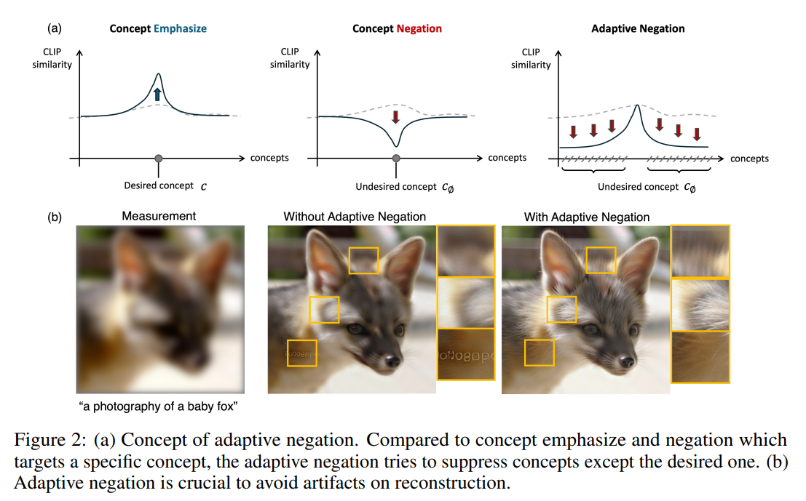

- 이 문제를 완화하기 위해, 구체적으로 본 논문에서는 concept negation을 활용하여 유효하지 않은 개념을 억제함으로써, 의도된 의미적 내용이 상대적으로 강화되도록 한다.
  - 여기서 CFG에서의 null-text embedding이 억제되어야 할 개념의 표현으로 간주된다. 
  - 즉, null-text로 인해 생성된 embedding이 measurement를 만족하지만 quality가 떨어지는 embedding으로 조절된다. 
  - 다시 말해, 우리가 최종적으로 최적화 시킨 결과는: measurement는 만족하면서 text-condition도 반영하는 이미지인데 null-text optimization까지 추가하여 (measurement만 만족하는 quality 떨어지는 결과) 상대적으로 text-condition을 더 잘 반영하는 결과로 guide한다. 

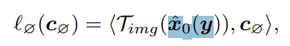

- 또한, 지금까지의 모든 optimization의 gradient는 어떠한 model을 통과하지 않기에 computational cost를 무시할 수 있다. 

- 최종적인 algorithm은 다음과 같다.

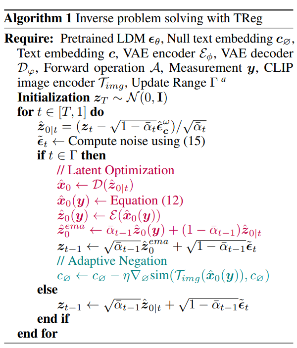

***

### <strong>Experiment</strong>

- Linear inverse problem
  - Scale factor $16$의 bicubic super-resolution
  - Kernel size $61$, $\sigma=5.0$ Gaussian blur (deblur)
  - Box inpainting: masking된 영역이 동물 또는 사람의 눈과 입을 포함하도록 설계

- Non-linear inverse problem
  - Fourier phase retrieval
  - Gamma correction
  - Measurement noise: $0.01$

- Dataset
  - 정량적 비교: Food-101 dataset, complex patterns, high ambiguity, use only $2$ class (Ice-Cream and Fried-rice)
  - 정성적 비교: ImageNet, AFHQ, FFHQ, LHQ datasets

- Models
  - DDRM, PGDM을 제외하고 모두 text를 사용한다.

$\textbf{Ambiguity reduction}$

- Text regularizer를 통해 복원 과정에서의 모호성을 줄이는 TReg의 효과를 평가한다. 
  - 복원된 다수 이미지들의 pixel-level의 분산을 정량화했다.
  - Text 설명이 없는 경우 null-text를 text description으로 사용했다. 이외의 모든 구성 요소는 유지된다. 
  - TReg는 주어진 텍스트 설명에 일관된 솔루션을 생성하는 반면, 텍스트 정규화 없이 복원된 이미지는 배경에 자동차나 침실 등이 존재하는 등 다양한 솔루션을 보인다. 
  - 이러한 차이는 픽셀 수준 분산에서도 뚜렷하게 나타난다. TReg를 적용한 경우 솔루션은 성공적으로 정제되었지만, 머리 위치나 입 모양에서 일부 불확실성이 남아 있다. 
  - 그러나 이러한 잔존 불확실성은 데이터 정합성 및 텍스트 설명을 위반하지 않으며, TReg가 텍스트를 통해 모호성을 효과적으로 해소함을 보여준다.

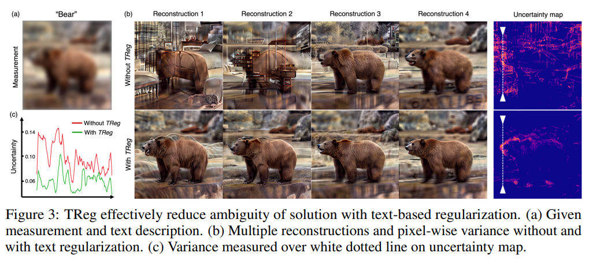

$\textbf{Accuracy of obtained solution: use true class}$

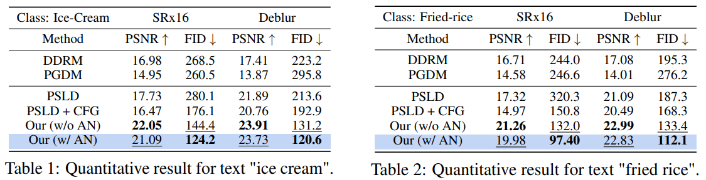

$\textbf{Accuracy of obtained solution: use different class}$

- TReg를 사용하면 주어진 텍스트 프롬프트에 따라 역문제의 솔루션을 찾을 수 있다. 이 특성을 평가하기 위해, 측정값의 원래 클래스와 다른 텍스트 설명을 제공하는 경우에 대해 앞서 언급한 문제를 해결한다. 
- 올바른 솔루션은 1) 측정값과의 데이터 정합성을 만족하고, 2) 주어진 프롬프트와 정렬되어야 한다. 획득된 솔루션의 품질은 세 가지 지표로 평가된다: LPIPS, 측정 도메인 상 평균 제곱 오차(y-MSE), 복원된 이미지와 주어진 텍스트 간의 CLIP 유사도. 
- 이 경우에는 정답 이미지가 존재하지 않기 때문에 PSNR 또는 SSIM은 평가하지 않는다.
- 일부 경우에서 PSLD가 더 낮은 LPIPS를 보이긴 하지만, 해당 솔루션은 데이터 정합성을 잃고 높은 y-MSE를 나타낸다.

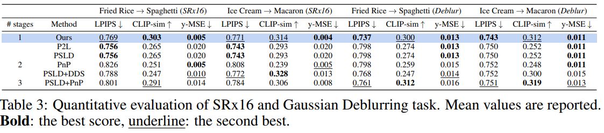

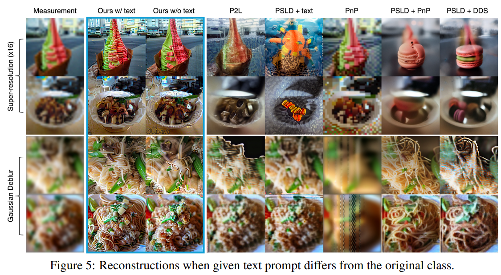

- Appendix

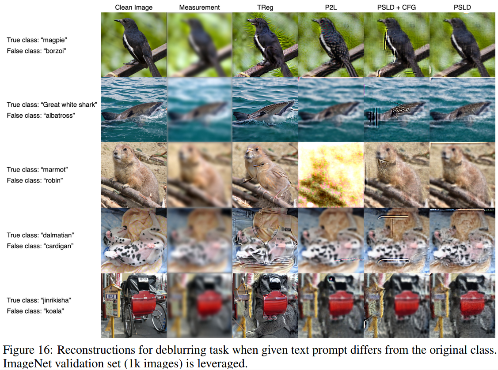

$\textbf{Non-linear inverse problem}$

- Fourier phase retrieval

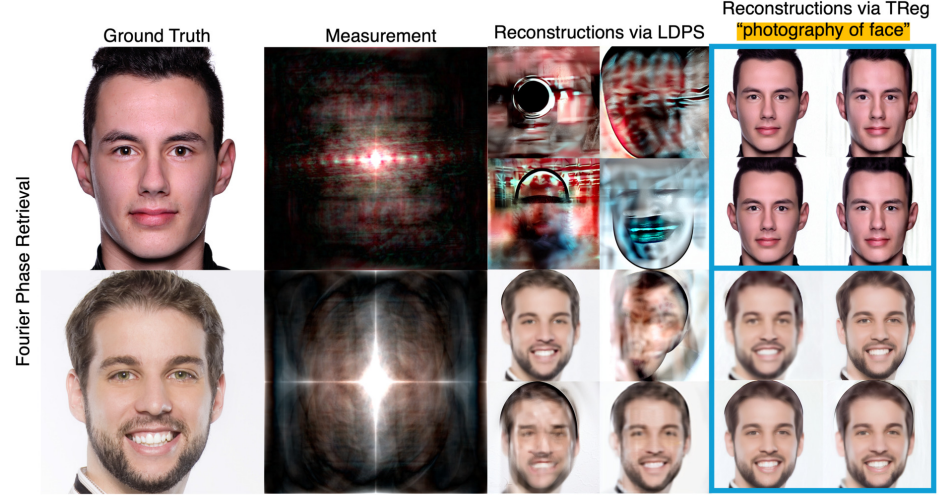

- Gamma correction

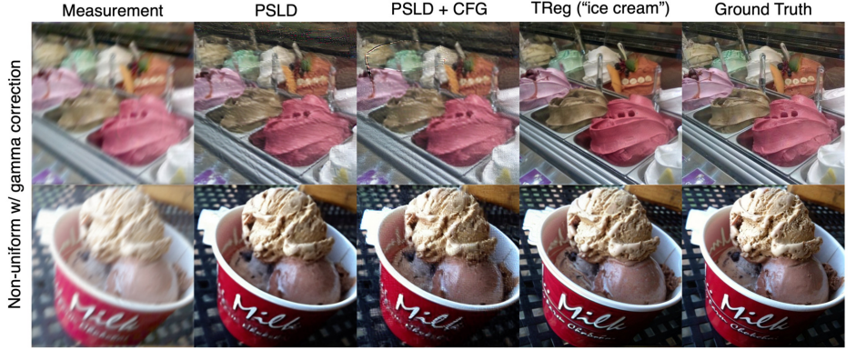

$\textbf{Image inpainting}$

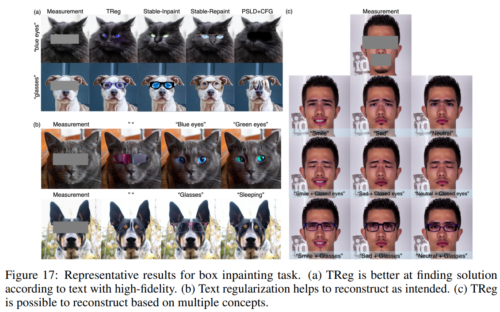

***

### <strong>Conclusion</strong>

***

### <strong>Question</strong>

<a href="">link</a>

> 인용구
