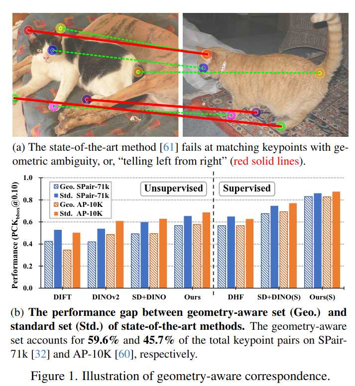
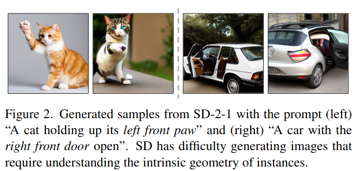
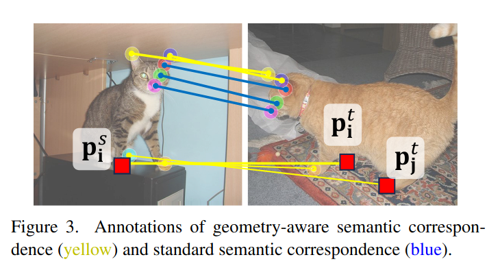
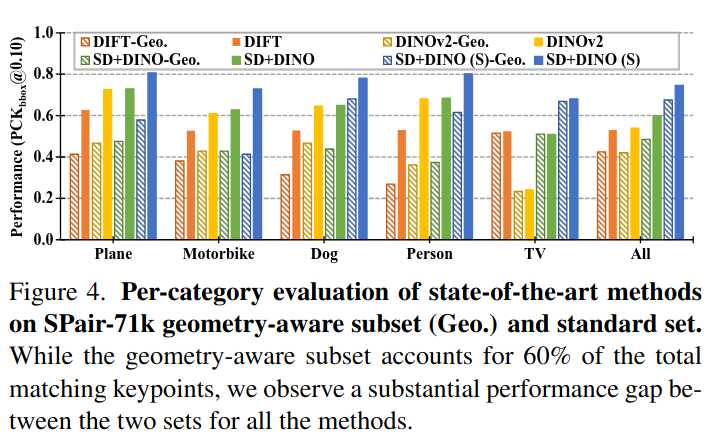
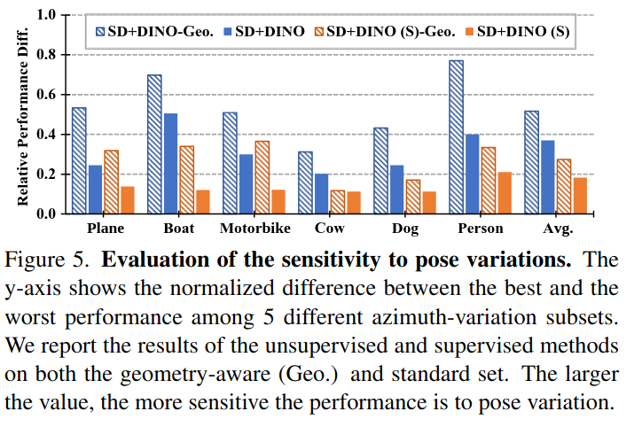
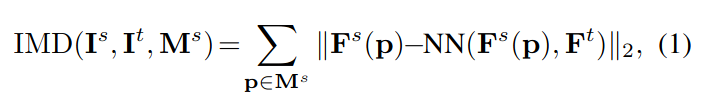
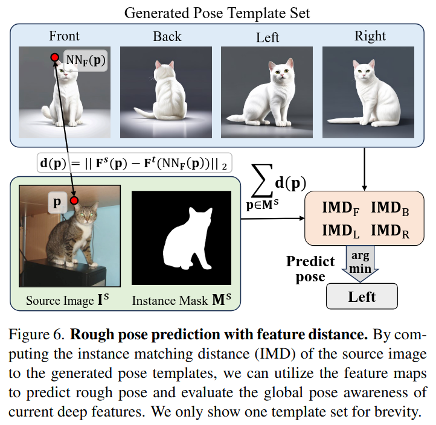
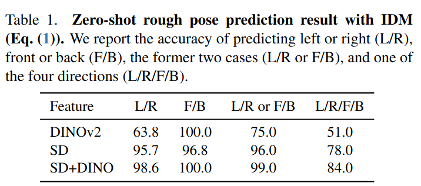
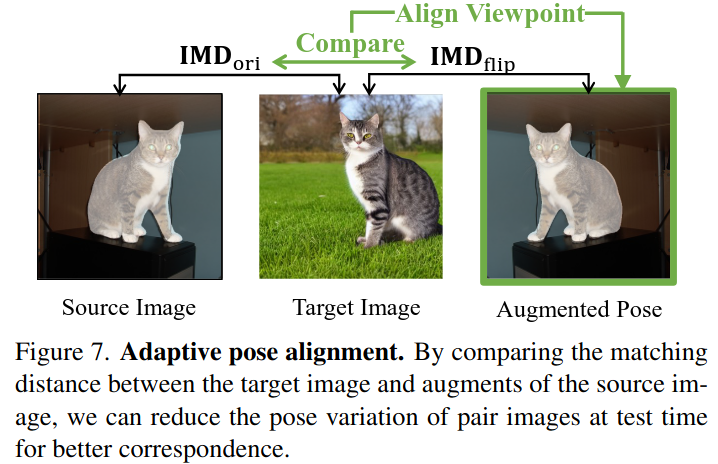
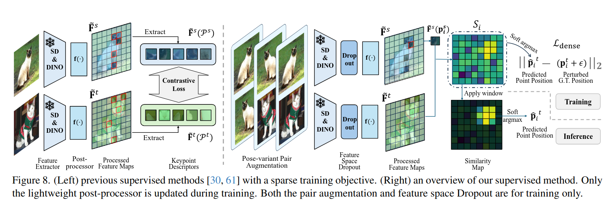

## Telling Left from Right: Identifying Geometry-Aware Semantic Correspondence
*CVPR(2024), 3 citation, Google Research, Stability AI, Review Data: 2024.07.06*

[Intro](#intro) 
[Related Work](#related-work) 
[Method](#method) 
[Experiment](#experiment) 
[Conclusion](#conclusion) 

> Core Idea

<strong>"test1"</strong> 

***

### <strong>Intro</strong>

$\textbf{이 주제의 정의 및 요구사항과 중요한 이유}$

- Text-to-image generative model과 large vision foundation model (e.g., SD, DIVO)이 무엇을 학습하고 있고 못 했는지에 대해서 관심이 커져왔다. 
- 수많은 연구들은 이러한 모델들이 depth estimation, semantic segmentation, semantic correspondence와 같은 다양한 computer vision task에 사용될 수 있는 강력한 feature embedding을 가지고 있음을 보여줬다. 
- 하지만, 모델의 약점에 대한 분석은 상대적으로 적었다. 특히, 이러한 feature들이 무엇에서 어려움을 겪는가에 대한 연구가 부족하다. 본 논문은 semantic correspondence를 test bed로 제안한다.
  - Test-bed: 새로운 기술이나 제품, 서비스의 성능이나 효과를 시험할 수 있는 환경 또는 시스템
  - 자세히 조사해보면 이러한 성능이 모든 task에서 일관되게 유지되지 않음을 알 수 있다. 
  - 특히, 이러한 foundation model feature는 기하학 인지 의미적 대응 (geometry-aware semantic correspondence)에서 크게 저하된다. (의미적 속성을 공유하지만 객체의 전체 기하학에 대해 다른 관계를 가진 대응) E.g., "왼쪽" 발톱과 "오른쪽" 발톱: 발톱이라는 의미적 속성는 하지만 기하학적으로 다르다.

- Semantic correspondence: 의미적으로 비슷한 물체에 대한 두 이미지 간의 pixel-level match를 수행

- Pre-trained large-scale vision model은 semantic correspondence에 대한 상당한 가능성을 보여준 반면, feature들은 종종 instance의 geometry와 orientation (방향)을 잡는데 고군분투한다.

- Vision Foundation model의 feature를 사용함에도, geometry-aware correspondence task에 대해서는 성능이 저하됨을 알 수 있다.

$\textbf{본 논문에서 해결하고자 하는 문제와 어떻게 해결하는지, 그 결과들}$

- 이 문제들이 foundation model feature가 가지고 있는 내재적 결함인가, 아니면 더 나은 후처리를 통해 완화될 수 있는가를 살펴보고 matching 과정에서 기하학적 모호성을 해결하는 여러 방법을 제안한다. 
  - 먼저, instance의 시점을 대략적으로 맞추어 문제를 더 쉽게 만드는 테스트 시점 정렬 전략을 도입한다. **Test-time viewpoint alignment**
  - 그런 다음, 주어진 주석이 달린 희소 키포인트를 사용하여 soft-argmax 기반의 dense training objective를 통해 vision foundation model feature의 기하학적 인식을 향상시키는 경량 후처리 모듈을 훈련시킨다. **Train lightweight post-precessing module**
  - 또한, 포즈 변형 증강 전략과 윈도우 soft-argmax 모듈을 도입한다. 

- 본 논문은 semantic correspondence에 있어서 기하학 인지의 중요성을 지적하며, 간단한 post-processing (후처리)에서 최근 foundation model의 feature의 한계를 밝힌다. 
- 이러한 정보를 통합함으로써 제로샷 및 supervised learning 환경 모두에서 의미적 대응 성능을 현저히 향상시킬 수 있는 간단하면서도 효과적인 해결책을 제시한다. 
- 또한, 기존의 동물 자세 추정 데이터셋을 바탕으로 사전 학습과 모델 검증을 위한 새로운 도전적인 의미적 대응 벤치마크를 구축한다. 

***

### <strong>Method</strong>

- 먼저 비슷한 의미적 요소의 관계를 이해하는 것을 필요로 하는 semantic correspondence의 어려운 case로서의 geometry-aware semantic correspondence에 대한 분명한 정의를 한다.
- 그 후, 해당 문제에 foundation model feature의 성능을 광범위하게 수행하고 feature가 가지고 있는 geometric information이 무엇인지 분석한다.

$\textbf{Geometry-aware semantic correspondence}$

- semantic적으로는 일치하는 반면, geometry-ambiguous matching이 안되는 경우가 존재한다. 따라서, instances' orientations or geometry의 이해가 필요하다. 
- Formal definition: 각 instance category에 대해 먼저 keypoints들을 semantic part를 기준으로 나눈다. (subgroup $\mathcal{G}_{parts}$ ) 
  - parts: ears, paws, ...
- $\mathcal{G}_{parts}$는 keypoint $P(parts,index)$의 집합으로 구성되어 있다. 
- E.g., $\mathcal{G}_{paws} =$ { $P(paws, front \ left), P(paws, rear \ left) ...$ }

- Source image $I^s$와 target image $I^t$가 주어졌을 때, geometry-aware semantic correspondence를 만족하는 keypoint set은 다음과 같다. $P_i^s, P_i^t$ 
  - 만일, $i \neq j$,  $P_i^s, P_j^t$라면, semantic correspondence는 만족해도 geometric correspondence는 만족하지 못한다. 

$\textbf{Evaluation on the Geometry-aware Subset}$

- 본 논문에서는 foundation model의 feature가 geometry-aware한지 확인하고 어떻게 어려운 task를 수행하는지 보기 위해 state-of-the art methods를 geometry-aware semantic correspondence에 평가해봤다. 

- SPair-71k dataset에 대해서 keypoint를 subgroup으로 나누고 geometry-aware correspondence를 만족하는 geometry-aware subset을 구성했다. 
  - Geo가 붙으면 geometry-aware subset
  - S가 붙으면 supervised-learning을 의미한다. 
  - 놀랍게도, standard dataset과 geometry-aware subset에 대한 성능 차이는 zero-shot의 경우 $20$ %, supervised learning은 $10$ % 정도 차이가 났다. 
  - 이는 최신 방법론들의 keypoint matching이 geometry ambiguity를 포함하고 있고 geometric awareness에 한계가 있음을 보여준다. 

$\textbf{Sensitivity to Pose Variation}$

- 하지만 pair (source-target) image간의 변화가 적은 특정 category들에 대해서 (e.g., potted plant and TV), standard와 geometry-aware set의 차이는 미미하다. 
  - 이는 pose variation이 geometry-aware correspondence의 정확도에 영향을 끼치는 key factor라고 해석된다.
  - SPair-71K의 이미지 쌍을 주석이 달린 방위각 차이에 따라 $5$개의 하위 집합으로 나눴다. $0$: 동일한 포즈 ~ $4$: 완전히 반대 방향. 그런 다음 각 범주에 대해 이 $5$개의 하위 집합에서 성능을 다시 평가했다. 

- $y$축의 값이 클수록 pose variation에 성능이 민감하게 변함을 의미한다. 즉, geometry-aware subset의 경우 standard set보다 pose variation에 민감하게 반응을 함을 알 수 있다. 

$\textbf{Global Pose Awareness of Deep Features}$

- Deep feature가 이미지 내 instance의 high-level pose (or viewpoint 시점) 정보를 인식하는지 추가로 분석했다. 
- Instance matching distance **IMD**
  - Pose prediction accuracy를 검사하기위해 이 metric을 제안했다. 
  - Source image $I^s$, target image $I^t$, normalized feature map $F^s, F^t$, source instance mask $M^s$
  - $p$: source instance mask안의 pixel 
  - $F^s(p)$: $p$에서의 feature vector 
  - $NN(F^s(p), F^t): target feature map에서 feature vector과 비슷한 feature vector
  - 즉, source image의 instance가 target image에서 있을법한 위치와의 feature distance이다. Source image와 target image간의 pose variation이 적을 수록 이 값이 작을 것이라는 가정을 한 거 같다. 
  - 이는 pose prediction에 사용한다. 두 이미지 간의 feature distance를 측정해서 두 이미지의 same instance가 global pose 측면에서 비슷한지 아닌지를 측정.

- Back의 경우, source image와의 **IMD** 값이 가장 클 것이다 라는 것 예측해 볼 수 있다. 

- Pose prediction via **IMD**
  - **IMD** metric으로 
  - 먼저 multiple pose template set을 생성한다. 그리고 IMD metric이 가장 작은 pose를 선택하여 pose prediction을 한다. 

- $100$ cat images from SPair-71k with pose labels {left, right, front, and back}의 주석을 단 후에 DINOv2, SD, fused SD+DINO로 평가해봤다. 
  - L/R: 주석의 모호함이 있을수도 있으니 
  - DINOv2의 경우 L/R 구별을 못한다. 
  - 그럼에도, SD+DINO를 보면 모든 경우에 대해 성능이 완벽에 가깝다. 이를 통해 deep feature가 global pose information을 가지고 있음을 알 수 있다. 

아래의 section은 matching에서 geometric awareness를 향상시키기 위한 (both zero-shot and supervised settings) 몇 가지 기술들이다. 

$\textbf{Test-time Adaptive Pose Alignment}$

- 우리는 위에서 pose variation이 geometry-aware semantic correspondence에 큰 영향을 줌을 확인했다. 
  - 이 문제를 해결하기 위해, 아주 간단한 test-time pose alignment를 제안한다. (학습 없이 inference시에 적용한다는 얘기이다) 이는 deep feature에 내재된 global pose information을 활용한다. 
  - source image 및 augmented source image (e.g., rotations, flip, etc)와 target image간의 **IMD** 를 계산하여 가장 작은 값이 나오는 optimal pose를 선택하는 방법이다. 

$\textbf{Dense Training Objective}$

- $F$: feature map, $f()$: post-processing model, $\tilde{F} = f(F)$: refined feature map 

- 이전의 연구들은 왼쪽과 같이 post-processing model을 학습시키기 위해, CLIP-style symmetric contrastive loss를 사용했다. 하지만, 이는 annotated keypoint에 대한 feature에만 손실 함수를 적용하기 때문에 잠재적으로 추가적인 유익한 feature는 무시한다. 

***

### <strong>Experiment</strong>

***

### <strong>Conclusion</strong>

***

### <strong>Question</strong>

<a href="">link</a>

> 인용구
