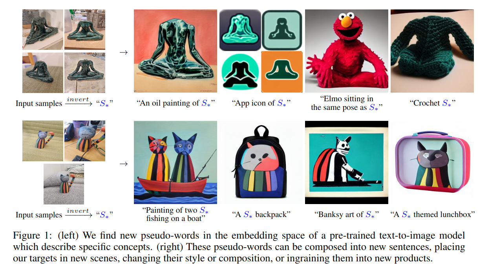
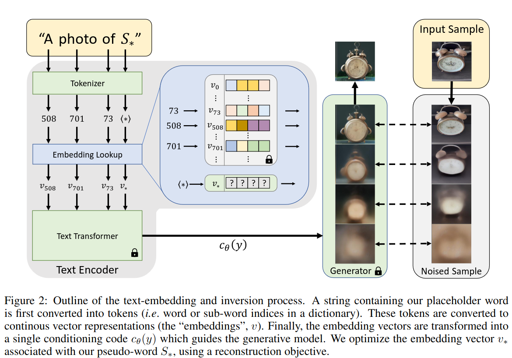
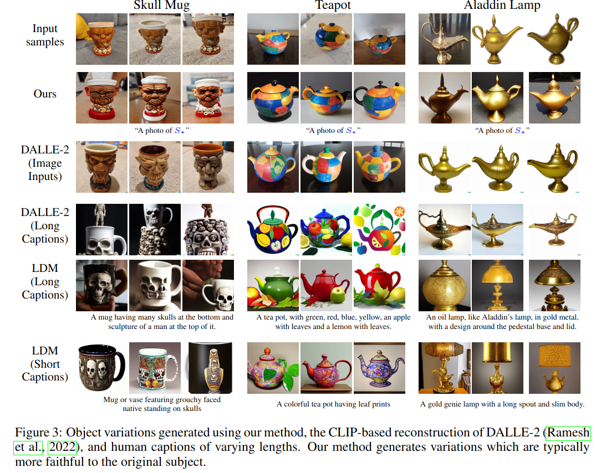
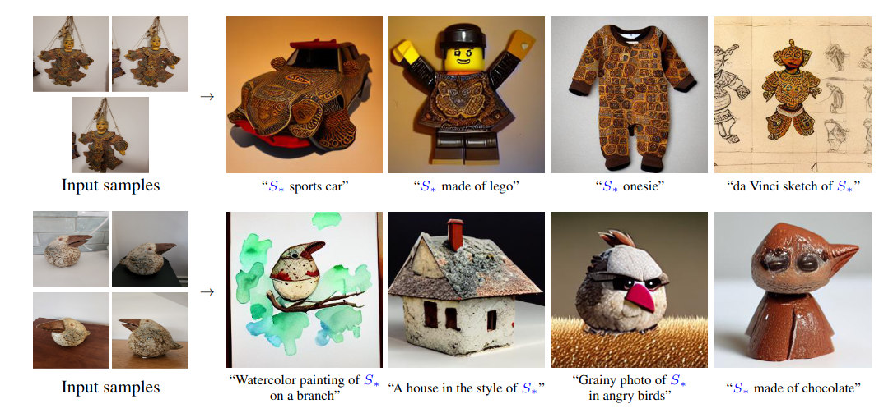
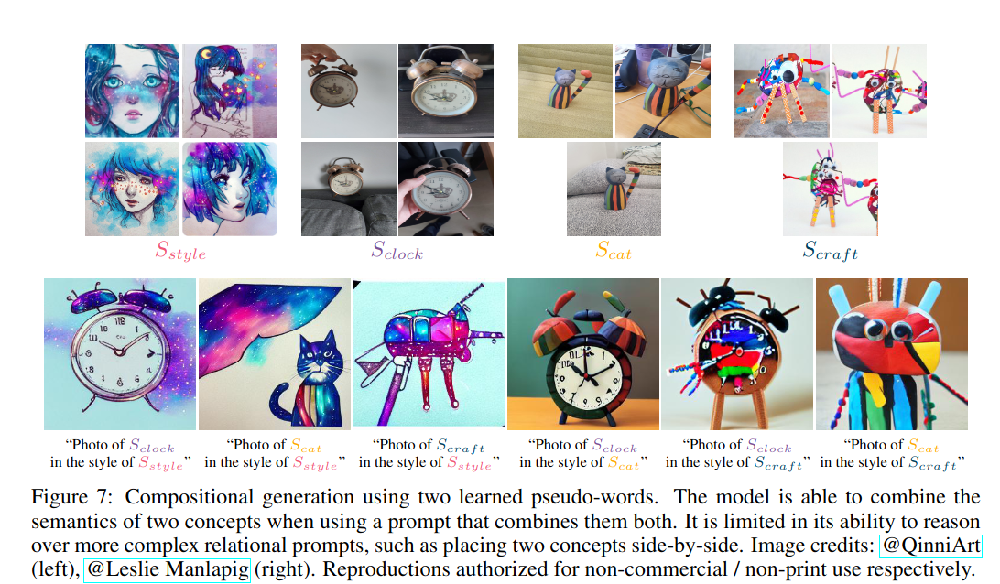

## An Image is Worth One Word: Personalizing Text-to-Image Generation using Textual Inversion
*arXiV(2022), 437 citation*

[Intro](#intro) 
[Related Work](#related-work) 
[Method](#method) 
[Experiment](#experiment) 
[Conclusion](#conclusion) 

> Core Idea

<strong>"Capture Unique and Varied Concepts via Single Word Embedding "</strong> 

***

### <strong>Intro</strong>
- Text-to-Image generation 을 개인화시키는 방법을 제시
- $3-5$ 장의 이미지로도 학습이 가능

***

### <strong>Related Work</strong>
- Text-guided synyhesis
- GAN inversion
- Diffusion-based inversion
- Personalization

***

### <strong>Method</strong>

- 학습시키고자 하는 token 의 embedding 만 학습시킨다.
- 나머지는 freeze

***

### <strong>Experiment</strong>

- Multi Concept

***

### <strong>Conclusion</strong>

***

### <strong>Question</strong>
