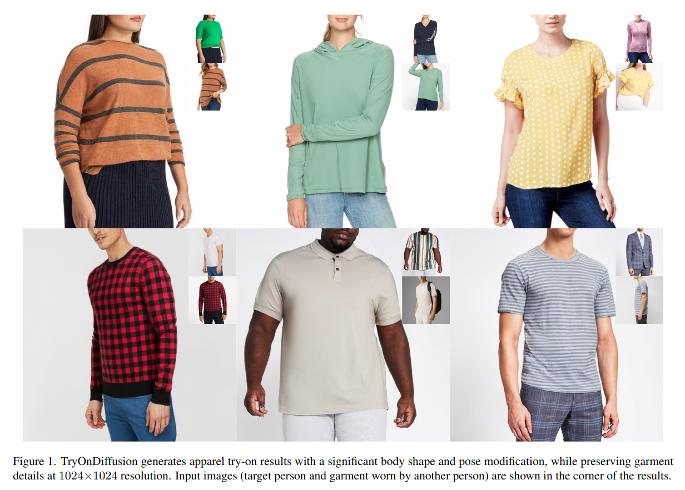
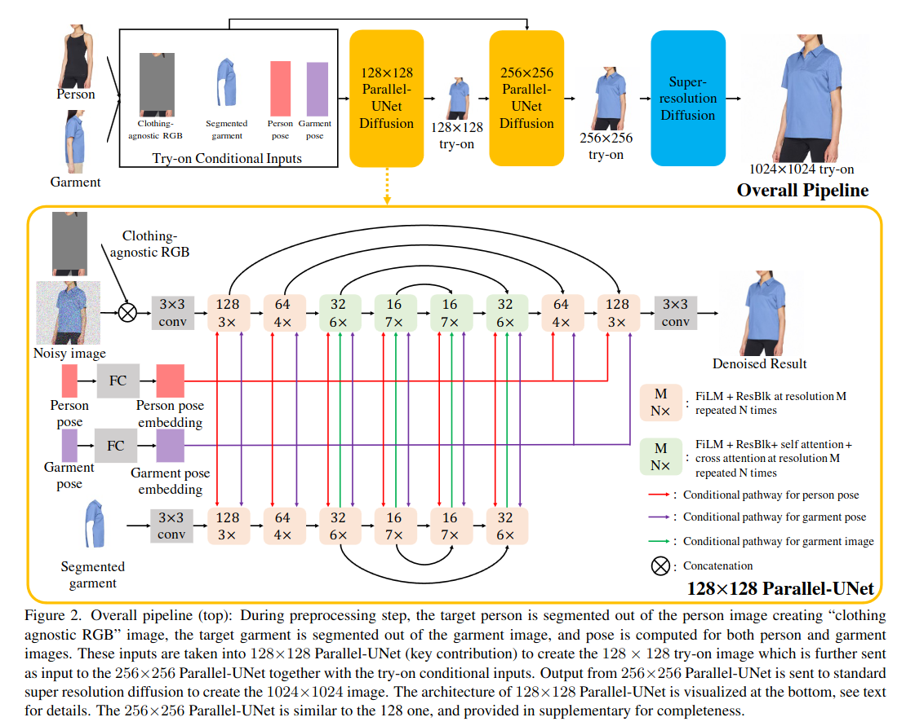
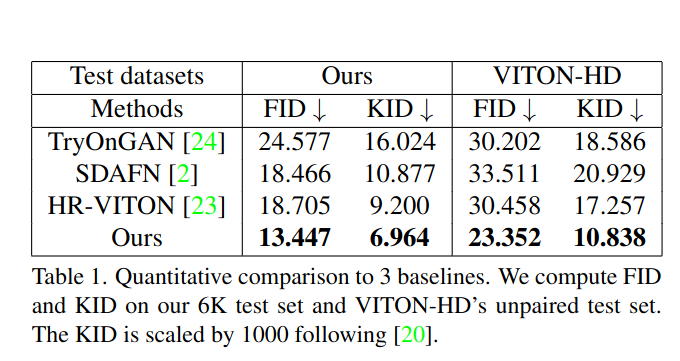

## TryOnDiffusion: A Tale of Two UNets
*CVPR(2023), 11 citation*

[Intro](#intro) 
[Related Work](#related-work) 
[Method](#method) 
[Experiment](#experiment) 
[Conclusion](#conclusion) 

> Core Idea

<strong>"Virtual Try-On using Parallel U-Net"</strong> 

***

### <strong>Intro</strong>

- 가상 의상 시착 task 를 해결하고자 한다. 
  - 가상 시착은 온라인 쇼핑 경험을 향상시킬 수 있는 잠재력이 있지만 대부분의 시착 방법은 신체 자세와 모양 변화가 적을 때만 효과가 좋다. 핵심 문제는 의상 패턴과 질감에 왜곡을 도입하지 않으면서 타겟 체형에 맞게 의상을 입히는 것이다. 

- 본 논문에서는 $1024 \times 1024$ 해상도에서 의상 디테일을 유지하면서 큰 가려짐, 포즈 변경, 체형 변경을 처리할 수 있는 *TryOnDiffusion* 을 제안한다. 
  - Target 인물 이미지와 다른 사람이 착용한 의상 이미지를 입력으로 사용하며 의상을 입은 target 인물을 출력으로 합성한다. 
  - 의상은 신체 부위나 다른 의상에 의해 부분적으로 가려질 수 있으며, 상당한 변형이 필요하다. 본 논문의 방법은 $400$ 만 쌍의 이미지로 학습된다. 각 쌍에는 같은 옷을 입은 사람이 있지만 다른 포즈로 나타난다. 

- TryOnDiffusion 은 cross attention 을 통해 통신하는 두 개의 하위 UNet 으로 구성된 *parallel-UNet* 이라는 새로운 architecture 를 기반으로 작동한다. 
  - Garment warp (의복 왜곡) & person blend 는 별도의 작업이 아닌 통합된 process 의 일부이다. 
  - 타겟 인물과 원본 의상 사이의 암시적 의복 왜곡은 장거리 대응을 설정할 수있는 여러 피라미드 레벨에서 feature 에 대한 cross attention 을 통해 달성된다. 
  - 장거리 대응은 특히 심한 가려짐과 극단적인 포즈 차이에서 잘 수행된다. 
  - 또한 동일한 네트워크를 사용하여 워핑과 블렌딩을 수행하면 두 프로세스가 pixel level 이 아닌, feature level 에서 정보를 교환할 수 있으며 이는 perceptual loss 와 style loss 에 필수적이다. 

***

### <strong>Related Work</strong>

- Image-Based Virtual Try-On.   
  - 주어진 두 이미지 (대상 인물, 원복 의복) 쌍으로부터 대상 인물이 원본 의복을 입은 모습을 생성한다. 대부분의 방법들은 시착 작업을 두 단계로 분해한다. 
    - A warping model and a blending model.
    - E.g., VITON, ClothFlow, VITON-HD, HR-VITON, SDAFN
    - E.g., TryOnGAN, StyleGAN2: 잠재 공간에서 최적화를 실행하기에 의복 세부 정보를 잃게 된다. 이는 의복에 패턴이나 포켓과 같은 세부 정보가 있는 경우에 더욱 명백해진다. 

- 본 논문에서는 암시적 왜곡과 블렌딩을 단일 네트워크 path 에서 수행하는 새로운 모델 구조를 제안한다.
- Heacy occlusions 과 다양한 몸의 포즈 및 형태에도 불구하고 의복의 세부 정보를 보존할 수 있다. 

***

### <strong>Method</strong>

- 구체적으로, parallel-UNet 기반 diffusion 은 $128 \times 128$, $256 \times 256$ 해상도에 사용되고, 그 output 을 super-resolution diffusion network 에 입력으로 넣어 최종적으로 $1024 \times 1024$ 이미지를 생성한다. 

- 사람 $p$ 의 이미지 $I_p$ 와 의상 $g$ 를 입은 다른 사람의 이미지 $I_g$ 가 주어지면 의상 $g$ 를 입은 사람 $p$ 의 시착 결과 $I_{tr}$를 생성한다.
  - 학습 과정: $I_p$ 와 $I_g$ 는 같은 사람이 같은 옷을 입고 있지만, 포즈가 다른 이미지 쌍에 대해서 학습
  - 추론 과정:  $I_p$ 와 $I_g$ 는 서로 다른 옷을 입고 서로 다른 포즈를 취하는 두 사람의 이미지로 설정된다. 

***

### <strong>Experiment</strong>

$\textsf{Dataset}$
- Pre-trained model 을 이용하는 것이 아니기에, train dataset 이 많이 필요하다.
- $4$ Million sample 을 학습 데이터로 활용 
  - Pair (same person wearing the same garment in two different poses)
- Test: $6$ K unpaired samples
  - Different people wearing different garments under different poses

$\textsf{Implementation details}$
- Batch size: $256$
- Iter: $500$ K
- Adam Optimizer
- LR: linearly increase from $0$ to $10^{-4}$
- Classifier-free guidance: $10$ % uncond prob
- Base diffusion model: $256$ steps using DDPM, 
- SR diffusion model : $128 \times 128 \rightarrow 256 \times 256$, $128$ steps using DDPM
- Final SR diffuison model: $256 \times 256 \rightarrow 1024 \times 1024$, $32$ steps using DDIM
- T: $U([0,1])$

$\textsf{Comparison methods}$
- TryOnGAN, SDAFN, HR-VITON
- Fair comparison 을 위해, 위의 $3$ 개의 method 들을 $4$ Million sample 로 re-train
- Resolution 도 다르다. 각 방법들의 resolution 으로 결과를 낸다.
  - SDAFN: $256 \times 256$
  - TryOnGAN: $512 \times 512$
  - HR-VITON $1024 \times 1024$

$\textsf{Metric}$
- FID, KID

***

### <strong>Conclusion</strong>

- Limitation
  - 정체성의 일부만 보존될 수 있다.
    - E.g., 문신이 보이지 않거나 특정 근육 구조가 보이지 않는다.
  - 훈련 데이터 셋이 대부분 깨끗하고 균일한 배경이 존재하므로 더 복잡한 배경에서 이 방법이 어떻게 수행될지 모른다. 
  - 상반신 의류에만 집중했으며 전체 body 에 대한 시도는 실험하지 않았다. 

***

### <strong>Question</strong>

