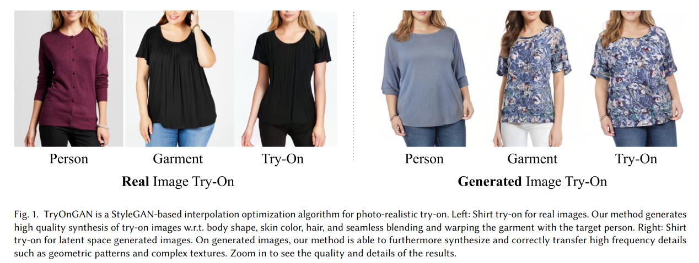

## TryOnGAN: Body-Aware Try-On via Layered Interpolation
*ACM Transactions on Graphics (TOG)(2021), 81 citation, Google Research, Review Data: 2023.2.27*

[Intro](#intro) 
[Related Work](#related-work) 
[Method](#method) 
[Experiment](#experiment) 
[Conclusion](#conclusion) 

> Core Idea

<strong>"Attention to Body Shape, Skin Color, and High-Resolution via Modified StyleGAN2"</strong> 

***

### <strong>Intro</strong>

- VITON 은 high quality visualization 을 필요로 한다. 
- StyleGAN 에서 영감을 받아서 clothing segmentation branch 와 함께 2D human body pose 를 condition 으로 받는 수정된 StyleGAN2 를 설계헀다. 
  - 이 모델은 $100$ K unpaired fashion image 에 대해서 학습됐다.
- 자동적으로 layer 마다, 최적의 interpolation 계수를 찾는 search 를 제안한다. 

- 본 논문은 사람이 옷을 입은 이미지로 학습된 clothing segmentation branch 와 pose conditioned StyleGAN2 architecture 를 설계했다. (TryOnGAN)
  - 한 번 학습되면, latent space interpolation 을 통해 skin color 나 target body shape 을 보존하면서도 다른 사람으로부터 의복 정보를 전송할 수 있다. 
  - $512 \times 512$ resolution 에 대해서 생상한다. 

***

### <strong>Related Work</strong>

- 이전 연구는 주로 *paired data training* 을 통한 texture transfer 에 집중했고, 몸의 형태 변형, 피부색, 의복과 사람 사이의 매끄러운 혼합은 간과했다. 
  - VITON: original VITON method, coarse try-on 을 먼저하고 후에 refine 및 thin plate splines 을 통해 warping 한다. 
  - CP-VTON: 전송되는 의복의 detail 을 향상시키기 위해 geometric alignment 를 추가했다. 
  - PIVTONS, GarmentGAN, SieveNet, ACGPN, SwapNet, M2E Try-On Net, etc.

> 본 논문은 (1) 몸의 형태 변형, (2) 피부색, (3) 의복과 사람 사이의 매끄러운 혼합 에 대해 중점을 두면서도 unpaired data 로 학습이 가능하다. 

***

### <strong>Method</strong>

- 본 방법론에서는 paired image (target person & garment) 가 주어졌을 때, (1) StyleGAN2 로 생성 (2) interpolation 을 어떻게 최적화시켰는지에 대해 주로 다룬다. 

$\textsf{Modified StyleGAN2}$

- 기존의 StyleGAN2 와 다르게 constant input (일반적인 특징이 담긴) 대신, Pose heatmap 이 encoding 되어 첫 번째 style block 에 입력으로 들어간다. 
  - Pose condition 이 없으면, latent space entangle 이 pose 와 style 에 존재하여 생성하는 동안 pose 가 변경된다.
 
- Output 은 각 layer 에서의 RGB image 와 image 의 clothing segmentation 이다.
  - clothing segmentation 을 생성하는 Segmetation brach 는 disentanglement 를 향상시키기 위한 보조적인 task 이다. 

- Pose heatmap 의 output 은 $4 \times 4$ 부터 $64 \times 64$ 까지 존재한다. 
  - PoseNet 을 사용하여 $17$ pose keypoints 와 keypoint confidence socre 를 구할 수 있다. 즉, $17$ channel.
  - 마지막 encoder layer 의 output 인 $4 \times 4$ 는 $\frac{1}{\sqrt{2}}$ 에 곱해진 후, StyleGAN2 의 input 으로 들어간다. 
  - 나머지 output 은 $8 \times 8$ style block 부터 각 style block 들어간다. 이때, 각 output 은 up-sampling 되어 concatenate 된다. 

$\textsf{Train}$

1. First step: 2D pose skeleton 이 주어졌을 때, photorealistic image 를 만들어낼 수 있는 pose conditioned StyleGAN2 를 학습시키는 것.
   1. 이 모델은 RGB image 뿐만 아니라 image 의 garment 와 person segmentation 도 생성할 수 있다. 
2. Second step: model 학습이 완료되었다면, 각 layer 에 대해서 최적의 interpolation coefficient 를 찾는 것.

- 다음은 pose conditioned StyleGAN2 가 생성한 RGB image 와 segmentation 이다. 

- Oveall Model Architecture
  - Pose heatmap 을 기본적인 골자로써, pose 와 body shape 에 대한 정보를 제공
  - 그 위에, 사람에 관련된 $Z$ 와 옷에 관련된 $Z$ 를 interpolation 하여 각 Style Block 에 넣어준다. 

$\textsf{Discriminators}$

- 두 가지 discriminator 를 사용했다 for pose and segmentation. 
  - Pose discriminator 는 입력으로 real RGB image & pose heatmap pair 또는 모델의 입력인 conditional pose heatmap & 그 입력으로 생성된 RGB image 를 받는다.
    - 즉, (real RGB image, pose heatmap) or (conditional pose heatmap & generated RGB image)
  - Segmentation discriminator 는 real or generated RGB image 에다가 segmentation pairs 를 입력으로 받는다. 
    - 즉, (real RGB image, real segmentation), (generated RGB image, generated segmentation)
  - 훈련 중에 두 개의 discriminator 는 동등하게 학습된다. 
    - Style 에 너무 과적합되는 것을 막기 위해, (1) heatmap 을 생성하기 전에 정규화된 keypoint 에 가우시안 노이즈를 추가하고 (2) 확률이 $0.4$ 보다 낮은 keypoint 는 삭제한다.   

$\textsf{Optimal Interpolation Coefficients}$

- FUTURE WORKS,,,

***

### <strong>Experiment</strong>

$\textsf{Dataset}$

- 각 column 은 pose 와 body shape 이 고정이고, row 는 style vector (즉, 옷이 고정) 가 고정이다. 

- Comparison with baseline models 

***

### <strong>Conclusion</strong>

***

### <strong>Question</strong>

