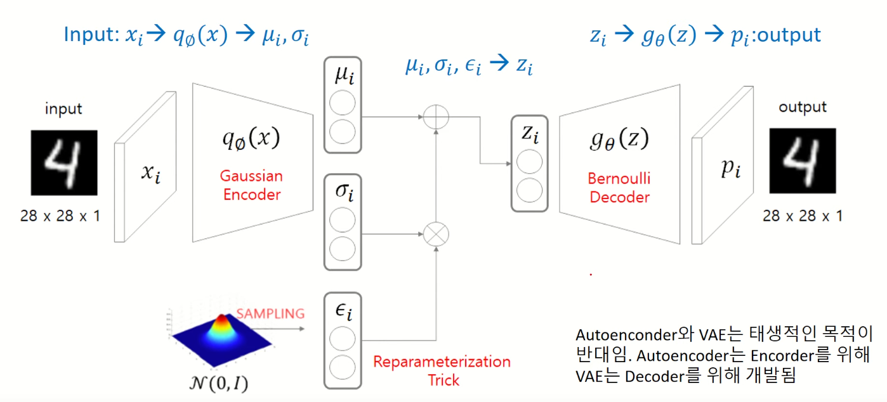

## Auto-Encoding Variational Bayes
*arXiv(2013), 32062 citation*

[Intro](#intro) 
[Related Work](#related-work) 
[Method](#method) 
[Experiment](#experiment) 
[Conclusion](#conclusion) 

> Core Idea

<strong>"Approximate Posterior Distribution via Bayes's Rule & Use ELBO"</strong> 

***

### <strong>Method</strong>

- VAE 는 $p(x)$ 를 모른다. 
  - $\int p(x|z)p(z) dz$ 로 찾기엔 모든 $z$ 에 대해서 적분하는 게 intractible 하다. (GAN 에서는 MC 로 근사)
  - Bayes's rule 로 전개해도 마찬가지로, 사후 확률을 (분모) 구할 수 없는데 이 사후 확률을 neural network model 로 근사하고자 한다.  

$$ p(x) = \frac{p(x|z)p(z)}{p(z|x)} $$

- Encoder 는 차원 축소 (다변량 가우시안 분포)
- Decoder 는 생성모델 (다변량 베르누이 분포/다변량 가우시안 분포)
- Encoder: $x$ 를 encoding 했을 때, 각 pixel 이 가우시안 분포를 따른다고 가정한다. 즉, latent vector $z$ 가 다변량 가우시안 분포라고 가정한다. 
  - 데이터의 특징을 파악하는 데 유리하다. [representation learning]

- 간단한 정의를 마쳤으니, 이제 목적 함수에 대해 살펴보자.
  - 다변량 가우시안 분포로 가정하면 MSE 로 수식이 전개되고
  - 다변량 베르누이 분포로 가정하면 Cross Entropy 로 전개된다.

- 우리는 $p(x)$ 를 찾고자 한다. 따라서 내가 modeling 한 $p_{\theta}(x)$ 로 $p(x)$ 를 추정하고 했고, 결국 $p_{\theta}(x)$ 를 maximize 하는 문제로 바뀐다.

$$ \max_{\theta} - D_{KL}[\frac{p(x)}{p_{\theta}(x)}] = \max_{\theta} \ p_{\theta}(x) $$

- $p(x)$ 에 $\log$ 를 씌운다.

$$ \log p_{\theta}(x) $$

- $q_{\phi}(z|x)$ 에 대해서 기댓값을 구한다. 이때, $\int q_{\phi}(z|x) dz= 1$ 이고 $p(x)$ 는 $z$ 에 대해서 독립이기 때문에 상수취급이다.
  - **$q_{\phi}(z|x)$ 에 대해서 기댓값을 구하는 이유는 일종의 trick 이다. 기댓값으로 표현해야, 추후에 KL-Divergence 로 표현하여 풀 수 있기 때문이다.**
  - 기댓값으로 표현하지 않으면 그냥 나눗셈이 된다.
  - 이때, $q_{\phi}(z|x)$ 로 sampling 한 $z$ 에 대한 기댓값이라는 것을 주의해야 한다.

$$ \log p_{\theta}(x) =  \log p_{\theta}(x) \int q_{\phi}(z|x) dz = \int \log (p_{\theta}(x))  q_{\phi}(z|x) dz $$

- 베이지 룰로 $p(x)$ 를 전개한다.

$$ \int \log{(\frac{p_{\theta}(x|z)p_{\theta}(z)}{p_{\theta}(z|x)})}q_{\phi}(z|x) dz  $$

- $\log$ 안에 $\frac{q_{\phi}(z|x)}{q_{\phi}(z|x)}$ 를 곱해준다.

$$ \int \log{(\frac{p_{\theta}(x|z)p_{\theta}(z)}{p_{\theta}(z|x)}\frac{q_{\phi}(z|x)}{q_{\phi}(z|x)})}  q_{\phi}(z|x) dz  $$

- 적절하게 분리해준다. $\log$ 는 곱셈을 덧셈으로 분리해주기에 $q_{\phi}(z|x)$ 가 다 곱해진다.

$$ \int \log{(p_{\theta}(x|z))}q_{\phi}(z|x) dz - \int \log(\frac{q_{\phi}(z|x)}{p_{\theta}(z)})q_{\phi}(z|x) dz + \int \log(\frac{q_{\phi}(z|x)}{p_{\theta}(z|x)})q_{\phi}(z|x) dz$$

- Expectation 으로 변환해준다. 

$$ E_{z \sim q_{\phi}(z|x)} [\log{p_{\theta}(x|z)}] -  E_{z \sim q_{\phi}(z|x)} [\log \frac{q_{\phi}(z|x)}{p_{\theta}(z)}] + E_{z \sim q_{\phi}(z|x)} [\log \frac{q_{\phi}(z|x)}{p_{\theta}(z|x)}] $$

- KL 로 변환

$$ E_{z \sim q_{\phi}(z|x)} [\log{p_{\theta}(x|z)}] -  D_{KL} (q_{\phi}(z|x)||p_{\theta}(z)) + D_{KL}(q_{\phi}(z|x)||p_{\theta}(z|x)) $$

- 첫 번째 항 $E_{z \sim q_{\phi}(z|x)} [\log{p_{\theta}(x|z)}]$
  - $z$ 는 model 로 sampling 을 해야 한다. 계산량이 많이 든다는 얘기이다.
  - 적분을 하기엔 여전히 intractible 해서 이건 Monte Carlo 로 근사하고 했다. 하지만, $x_i$ 가 주어지고 encoder 로 $z$ 를 여러 번 ($L$) sampling 해서 평균 내는 것 자체가 계산량이 많기 때문에 한 번 sampling 한 게 대푯값이라고 가정하고 expectation 을 푼다. 

$$ E_{z \sim q_{\phi}(z|x)} [\log{p_{\theta}(x|z)}] \simeq \log p_{\theta}(x|z) $$

- 두 번째, KL term 이니까 확률 분포 함수를 직접 구해서 식을 풀거다.

- 세 번째 항에서의 $p_{\theta}(z|x)$ 는 여전히 표현할 수 없는 분포이기 때문에 $D_{KL}$ 이 항상 0 보다 크거나 같다는 점을 이용하여 삭제한다. 

- 다시 Loss function 을 써보면 다음과 같다.

$$ \log p_{\theta}(x) \geq  \log{p_{\theta}(x|z)} -  D_{KL} (q_{\phi}(z|x)||p_{\theta}(z)) \ \ [\text{ELBO}] $$

- Gradient descent 고려하면, (minimize 니까 음수를 곱한다)

$$ \text{arg min}_{\theta,\phi} \sum_i - \log{p_{\theta}(x_i|z)} +  D_{KL} (q_{\phi}(z|x_i)||p_{\theta}(z)) $$

- 즉, $\log{p_{\theta}(x|z)} -  D_{KL} (q_{\phi}(z|x)||p_{\theta}(z))$ 를 maximize 하는 게 $\log p_{\theta}(x)$ 를 정확히는 추정 못해도 근사는 할 수 있다

- 두 번째 항을 다시보자.
  - $q_{\phi}(z|x_i)$ 가 $p_{\theta}(z)$ (사실 parameterize 가 안 되어있기 때문에 $p(z)$) 의 분포와 같아야 한다. 
  - 우리는 encoder output 이 multivariate gaussian distribution 으로 가정했기 때문에, $q_{\phi}(z|x_i) \sim N(\mu_i, \sigma_i^2 I)$ 가 $p(z) \sim N(0,I)$ 의 분포를 따라야 한다.
  - <a href='https://simpling.tistory.com/33'>KLD for Gaussian Distribution</a>

- 세 번째 항은 다음과 같이 풀어쓴다.
  - $D$: Decoder output dimension
  - $i$: Data sample $i$-th

