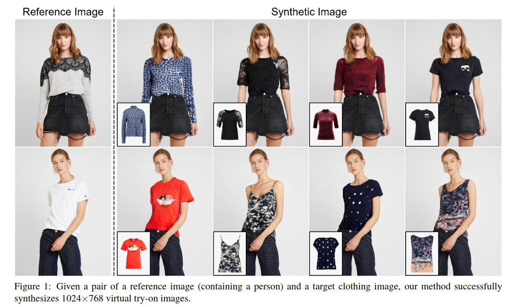
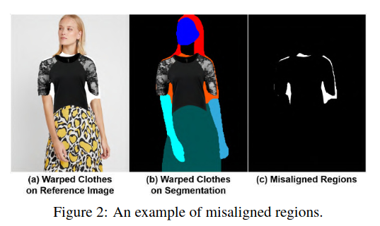
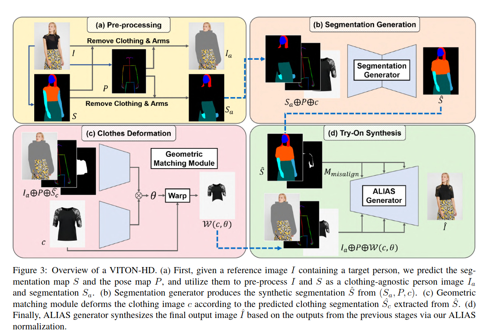
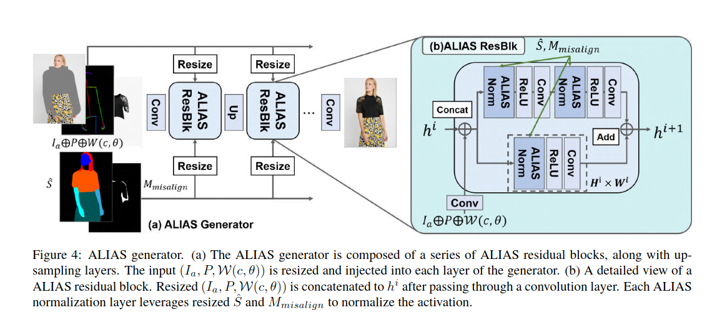
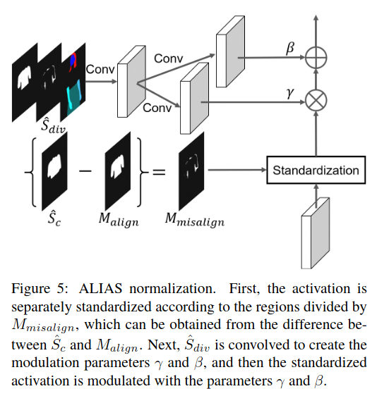
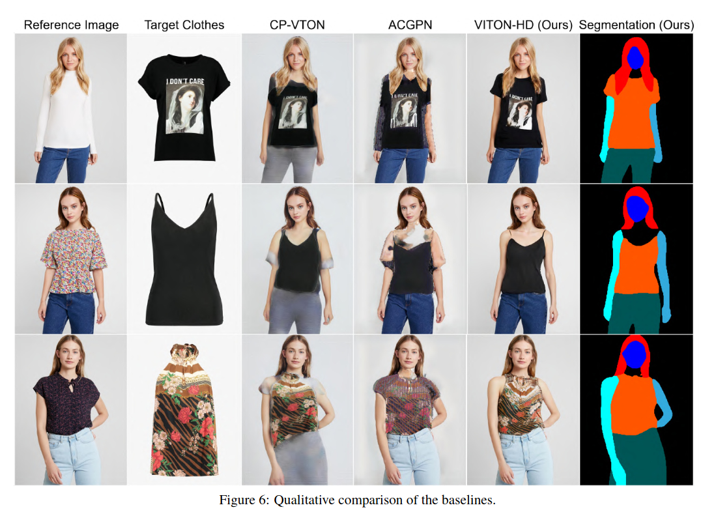
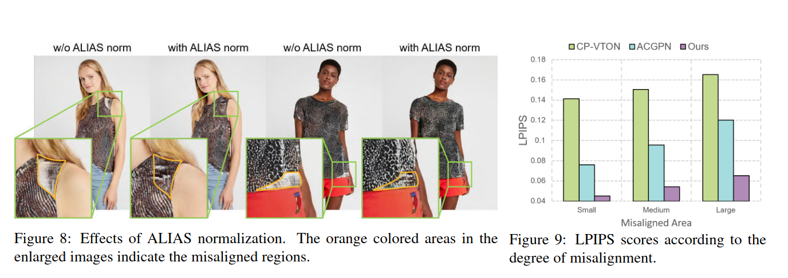

## VITON-HD: High-Resolution Virtual Try-On via Misalignment-Aware Normalization
*CVPR(2021), 121 citation*

[Intro](#intro) 
[Related Work](#related-work) 
[Method](#method) 
[Experiment](#experiment) 
[Conclusion](#conclusion) 

> Core Idea

<strong>"test1"</strong> 

***

### <strong>Intro</strong>

- 이전의 연구들은 생성된 이미지의 해상도가 $256 \times 192$ 로 여전히 낮아, 온라인 소비자를 만족시키기에는 한계가 있었다. 
- 본 연구에서는, resolution 을 증가시키면서 (up to $1024 \times 768$) warped cloth 와 clothing region 간의 misalign 의 artifacts 를 해결하고자 한다. 
  - 1. segmentation map 을 준비 
  - 2. Roughly fit the target clothing item to a given person's body
  - 3. ALIgnment-Aware Segment (ALIAS) normalization 과 ALIAS generator 를 제안 (misaligned area 와 detail 을 보존하기 위해)

***

### <strong>Related Work</strong>

***

### <strong>Method</strong>

- Method
  - (a): Target person $I$ 이 주어지면, segmentation map $S$ & Pose map $P$ 를 예측 $\rightarrow$ 그 정보를 가지고 clothing agnostic person image $I_a$ 와 semgentation $S_a$ 를 pre-process 한다.
  - (b): Segmentation generator 에게 ($S_a, P, c$) 를 input 으로 줘서, synthetic segmentation $\hat{S}$ 를 만든다. 
    - $c$: clothing image 
  - (c): $I_a, P, \hat{S_c}, c$ 를 이용하여 clothing image $c$ 를 deform (변형) $\rightarrow$ $W(c,\theta)$
    - $\hat{S_c}$: $\hat{S_c}$ 로부터 추출된 clothing segmentation
  - (d): $\hat{S}, M_{misalign}, I_a, P, W(c, \theta)$ 를 입력으로 ALIAS generator 를 통해 output image $\hat{I}$ 를 만든다.

***

### <strong>Experiment</strong>

$\textsf{Dataset}$
- $13,679$ frontal-view woman 과 top clothing image pair 를 online shopping mall website 에서 crawling 했다.
  - Train: $11,647$
  - Test: $2,032$

***

### <strong>Conclusion</strong>

***

### <strong>Question</strong>
