## VITON: An Image-based Virtual Try-on Network
*CVPR(2018), 545 citation*

[Intro](#intro) 
[Related Work](#related-work) 
[Method](#method) 
[Experiment](#experiment) 
[Conclusion](#conclusion) 

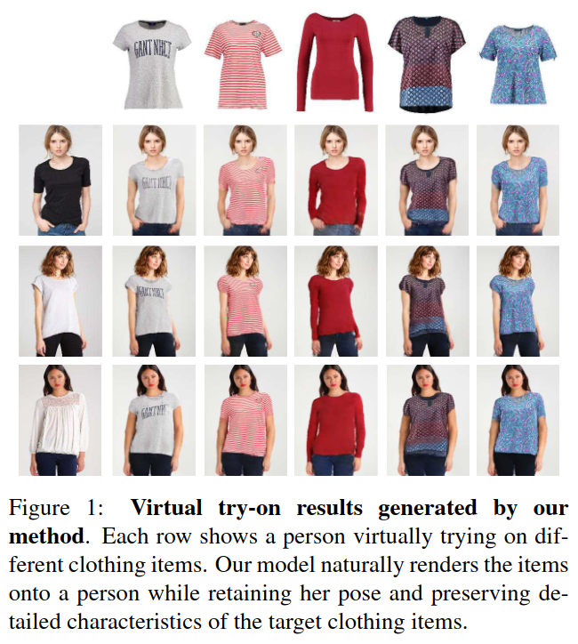

> Core Idea

<strong>"Improve Coarse Synthesis Image via Refinement Network"</strong> 

***

### <strong>Intro</strong>

***

### <strong>Related Work</strong>

***

### <strong>Method</strong>

- 본 논문에서는, $3$ D 정보 없이, image-based virtual try-on network 를 제안한다. 
  - $2$ -step 으로 나뉘는데
  - $1$ step: 같은 포즈의 같은 사람에 대해 target clothing item 을 overlaid 하는 coarse synthesized image 를 만든다. 
  - $2$ step: Refinement network 로 initial blurry clothing area 를 강화한다. 

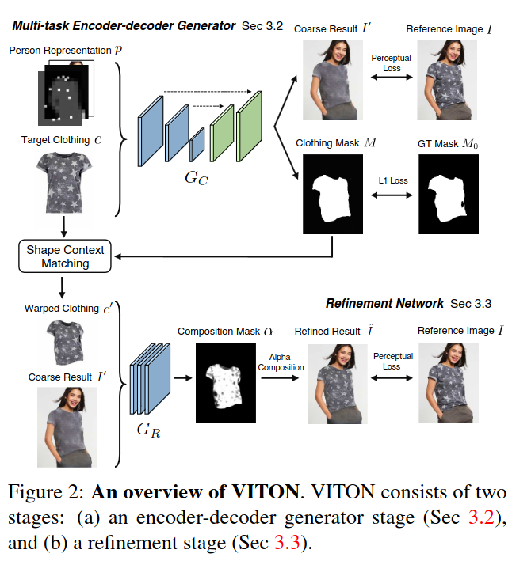

- 먼저 Person Representaion $P$ 를 만드는 방법을 알아보자
  - Reference image $I$ 에서 Pose map, Body shape, Face and hair 를 추출한다. 
  - Pose heatmap
    - 1. State-of-the-art pose estimator 를 사용하여 pose information 을 추출한다.
      - Using *Realtime multi-person 2d pose estimation using part affinity fields. In CVPR,2017*
    - 2. $18$ keypoints coordinates 를 가지는데, 각 key-point 의 $11 \times 11$ neiborhood 는 $1$ (white) 로 채우고 나머지는 $0$ 으로 채운다. 즉, 최종 차원은 다음과 같다. { $0,1$ } $\in R^{h \times w \times 18}$
  - Human body representation
    - 1. State-of-the-art human parser 를 사용하여 human segmentation map 을 추출한다.
      - 팔이나 다리는 다른 segmentation 으로 표현이 되는데 본 논문에서는 $1$ channel 을 가지는 binary mask 로 만든다. 
      - Body shape 과 target clothing 이 맞지 않을 때의 artifacts 를 피하기 위해서 $16 \times 12$ 로 downsampling 된다. 즉, { $0,1$ } $\in R^{16 \times 12 \times 1}$
      - Using *Look into person: Self-supervised structure-sensitive learning and a new benchmark for human parsing. In CVPR, 2017.*
  - Face and hair segment 
    - Person 의 identity 를 유지하기 위해 사용된다. (e.g., skin color, hair style, etc.)
    - 1. Human body representation 에서 사용한 model 을 통해 RGB channel 의 face & hair region 뽑아낸다. 즉, $R^{h \times w \times 3}$
  - 마지막으로 방금 뽑은 $3$ 개의 feature map 을 같은 해상도로 resize 하고 concatenate 한다. 
  - 최종 차원은 다음과 같다. $p \in R^{m \times n \times k}$ ($m = 256, n =192, k =22$)

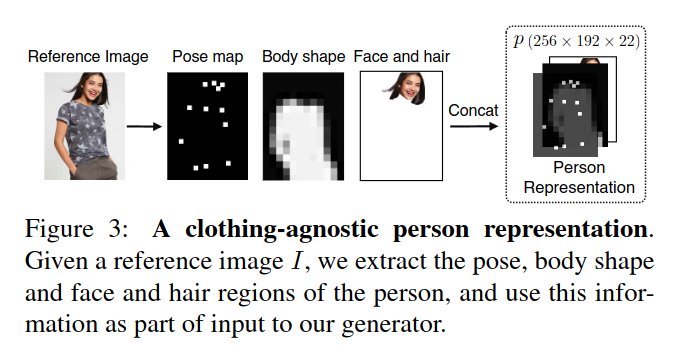

- 다음은, Multi-task Encoder-Decoder Generator 이다. 
  - Person representation $P$ 와 target clothing image $c$ 가 주어졌을 때, Coarse synthesized image 와 clothing mask $\in R^{m \times n \times 4}$ 를 만든다. 
  - U-Net 구조이다. 
  - Binary mask 간의 $L_1$ loss 를 사용한다. 
    - Color 가 아닌 binary 이기 때문에 형체만 복원할 수 있다.
    - $L_1$ loss 는 blurry image 를 만드는 경향이 있다.
  - 생성된 이미지 $I$' 와 실제 이미지 $I$ 간의 perceptual loss
    - $\phi_i(y)$: ImageNet 으로 pre-trained 된 VGG $19$ 에 image $y$ 를 input 으로 넣었을 때의, $i$-th layer 의 feature map
    - Utilize 'conv1_2', 'conv2_2', 'conv3_2', 'conv4_2', 'conv5_2'
    - Perceptual loss 를 통해 ground truth image RGB value 와 activation 값이 같게 함으로써 realistic pattern 을 학습시키고자 했다. 
  - 생성된 이미지는 *pose, body parts, identity in the original image* 는 보존하지만, text, logo, texture 등의 detail 은 생성하지 못했다. 
  - 본 논문에서는 current state-of-the-art generator 능력의 한계라고 보고 있다. 따라서, 추가적으로 coarse result $I$' 을 향상시키기 위해 refinement network 를 사용한다. 

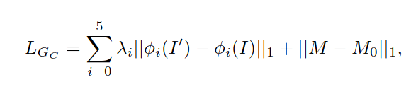

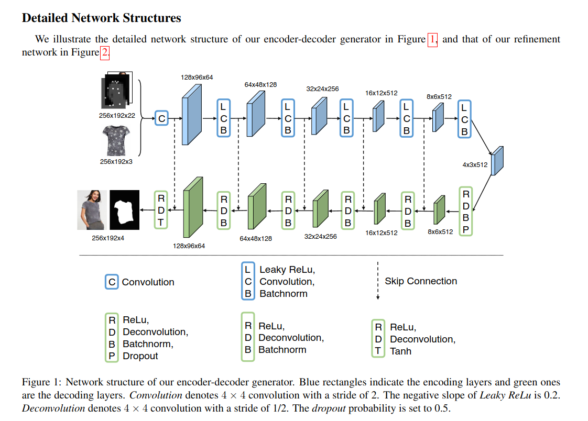

- Refinement Network
  - **Warped clothing item**: shape context matching 을 활용하는 *thin plate spline (TPS)* transformation 을 예측함으로써, clothing item 을 warp 한다. $c$' 생성.
  - $c$' 과 $I$' 을 입력으로 refinement network 에 넣었을 때, 합성된 이미지 $I$' 에 $c$' 을 clothing region 과 완벽하게 결합하고, 몸 앞에 팔이나 머리가 있는 경우에도 occlusion 을 적절하게 처리하는 것을 기대한다. 
  - Output: $1$ -channel composition mask $\alpha \in (0,1)^{m \times n}$
    - $c$' 과 $I$' 에서 얼마나 많은 정보가 사용되는 지를 나타낸다. 
    - 최종적으로는 둘의 composition 으로 표현된다. 
    - Using sigmoid activation fucntion
  - Loss
    - 1. $L_{perc}$: perceptual loss 
      - $\phi$: VGG $19$ 의 'conv3_2', 'conv4_2', 'conv5_2' 를 사용한다. 
      - VGG 앞단은 image 의 내용보다는 디테일한 pixel-level 의 정보에 더 관심을 가지므로 $I$ 와 $I$' 의 작은 이동에도 lower layer ('conv1' and 'conv2') 에서는 불일치를 일으킬 수 있다. 따라서 큰 VGG $19$ 의 앞 단을 사용하지 않는다. 
    - 2. $L_1$: refinement network 가 warping clothing image 로부터 더 많은 정보를 활용하고 더 많은 detail 을 rendering 하도록 장려한다. 
    - 3. Total-variation (TV): 공간적으로 부드럽게 만들어주어, 변형된 영역에서 거친 결과로의 전환이 더 자연스러워 보이도록 한다. 

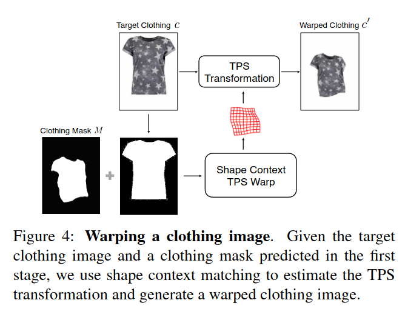

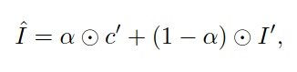

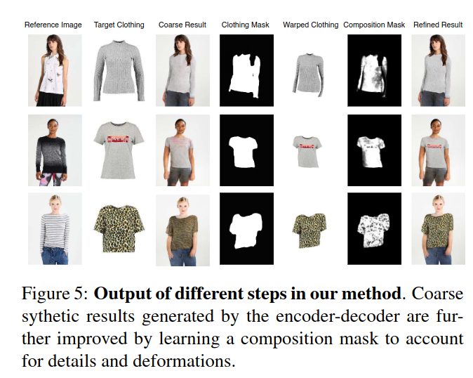

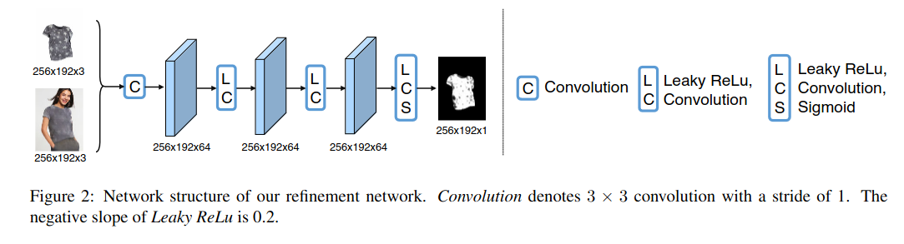

***

### <strong>Experiment</strong>

$\textsf{Dataset}$

- Zalando dataset: 본 논문에서 새롭게 제안한 dataset 이다. $256 \times 192$ 해상도를 가진다. 
  - $16,253$: $14,221/2,032$

$\textsf{Training setup}$

- Adam optimizer with $\beta_1 = 0.5, \beta_2 = 0.999$
- Fixed LR: $0.0002$
- Encoder-decoder/Refinement network: $15$ K/$6$ K steps with a batch size $16$
- Resolution: $256 \times 192$
- $\lambda_{warp} = 0.1, \lambda_{TV} = 5e-6$

- Ablation study
  - Importance of pose, body shape

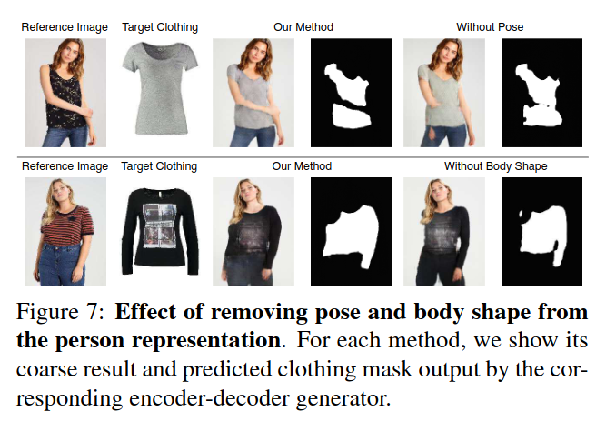

- Wild results
  - COCO datasets by cropping human body regions

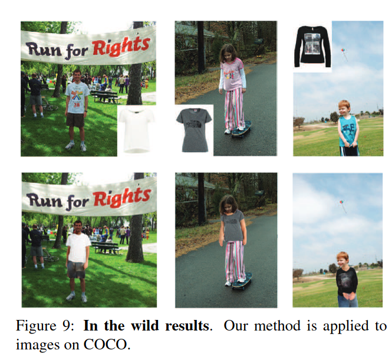

- Quantitative eval

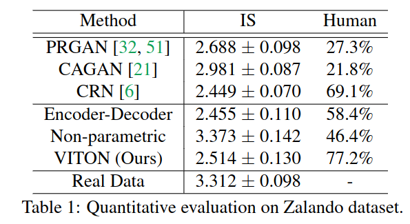

- Qualitative comparisons
  - 본 논문의 method 도 Neck line 의 결함이 있다.

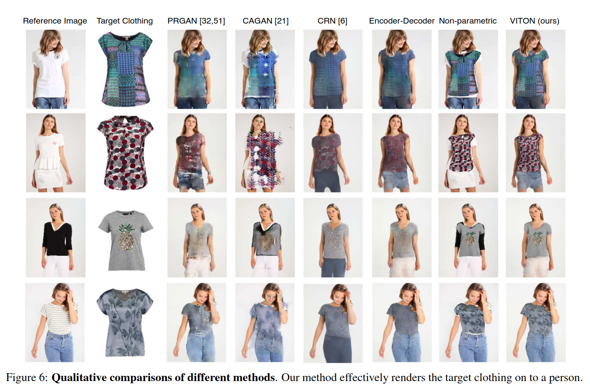

***

### <strong>Conclusion</strong>

$\textsf{Limitation}$

- Original clothing shape 에 따라, cloth detail 이 손실된다.
  - E.g., neck line, arm line 
  - 간단한 FCN (Fully convolutional network) model 을 활용하여 제거할 수도 있다. ($2,000$ 개의 이미지에 대해 주석을 달아서 학습)
  - 하지만, 공정한 비교를 위해 이러한 세분화 전처리 단계 없이 결과를 도출했다.

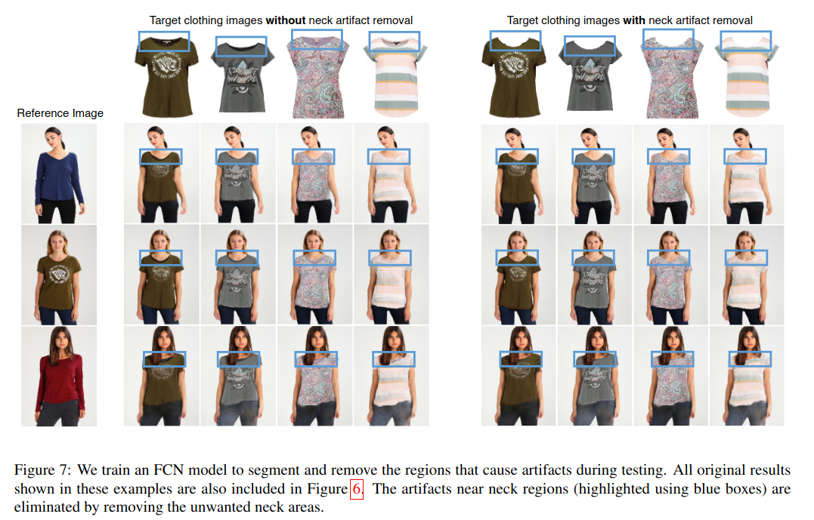

- 흔하지 않은 pose 나 target clothing shape 이 original clothing shape 가 크게 다르면 실패한다.

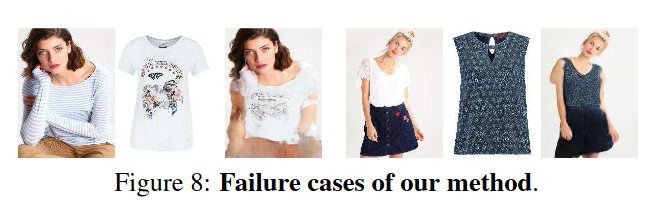

***

### <strong>Question</strong>

