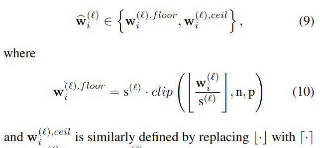

## AdaRound: Up or Down? Adaptive Rounding for Post-Training Quantization
*International conference on machine learning. PMLR(2020), 597 citation, Qualcomm AI, Review Data: 2024.03.03*

***

### <strong>Intro</strong>
  
- Neural network를 quantizing할 때, 각 floating-point weight를 nearest fixed-point value로 할당하는 것이 널리 퍼진 방법론이다. 
- 본 논문은 nearest rounding이 최선이 아니라, 여기서 제안한 **AdaRound**가 **post-training quantization**에서의 더 나은 weight-rounding mechanism이라고 주장한다.
- AdaRound는 빠르고 network의 추가적인 학습을 필요로하지 않는다. 오직 적은 양의 unlabelled data만을 사용한다. 
- 본 논문은 먼저 이론적으로 rounding problem을 분석한다.
- Taylor series expansion으로 task loss를 근사함으로써, rounding task를 quadratic (이차) unconstrained binary optimization problem (**QUBO**)으로 정의한다. 이를 layer-wise local loss로 단순화하고 soft relaxation을 활용하여 최적화하는 방법을 제안한다. 
- AdaRound는 단순한 반올림 방식보다 성능이 크게 향상될 뿐만 아니라, 여러 네트워크와 task에서 post-training quantization의 state-of-the-art를 달성한다. 
- Fine-tuning없이도 ResNet18 및 ResNet50의 가중치를 $4$-bit로 양자화하면서도 정확도 손실을 $1$ 이내로 유지했다.

$\textbf{Notation}$

- $x, y$: input and target variable 
- $\mathbb{E}$: expectiation operator
- $\mathbf{W}_{i,j}^{(l)}$: weight matrix (or tensor)
- $\mathbf{w}^{(l)}$: flattened version of $W^{(l)}$
- All vectors: column vectors and small bold letters $\mathbf{z}$ 
- All matrices (or tensors): capital bold letters $\mathbf{Z}$
- Functions $f()$
- Task loss $L$
- Constant $s$

***

### <strong>Motivation</strong>

- Rounding-to-nearest가 왜 optimal이 아닌지에 대한 직관적인 이해를 위해 pretrained model의 weight를 perturb시켰을 때 무슨 일이 발생하는지를 알아보자.
- Neural network가 flattened weights $\mathbf{w}$에 의해 parameterized됐다고 가정하자.
  - $\Delta \mathbf{w}$: a small perturbation
  - $L(x, y, \mathbf{w})$: task loss that we want to minimize
  - (a): second order Taylor series expansion
  - $g^{(\mathbf{w})}, H^{\mathbf{w}}$: expected gradient and Hessian of the task loss

- Pre-trained model이고 loss는 $\mathbf{w}$에 대한 함수이다.  
  - $\Delta w$: quant > dequant (rounding)으로 인해 발생한 perturbation으로 보자. 즉, calibration 이후의 loss 값과 실제 loss 값 사이의 차이를 줄이면 성공적인 calibration인 것이다.
  - $\mathbf{w}$에 대한 함수이니, $x, y$는 상수 취급한다.
  - 우리가 알고 싶은 건 $\mathbf{w}$의 근처 $\mathbf{w}+\Delta \mathbf{w}$에서의 loss값이라고 해보자.
  - $L(x, y, w)$를 왼쪽 항으로 옮기면 위와 동일하다.

$$ L(x, y, w+\Delta w) \approx L(x, y, w) +  L'(x,y,w)\Delta w + \frac{1}{2}L''(x,y, w)\Delta^2w$$ 

- Taylor series expansion에서 고차 항을 무시하는 것은 $\Delta w$가 너무 크지 않은 경우에 좋은 근사법이다. 
  - 네트워크가 수렴하도록 훈련됐다고 가정하면, 그래디언트 항은 $0$에 가까워지므로 이를 무시할 수 있다. (수렴에 주목하자)
  - 따라서 $\mathbf{H}^{(\mathbf{w})}$는 task loss $L(x,y, w + \Delta w)$에 대한 영향을 기준으로 서로 다르게 perturbed 된 가중치 간의 상호 작용을 정의한다. 다음의 간단한 예시는 반올림 방식이 최적이 아닐 수 있음을 보여준다.

- 이 예시에서 앞의 두 항은 perturbation의 크기만 중요하다. 
  - 즉, 대각선 항 (앞의 두항)만 고려할 때 rounding-to-nearest는 최적이다.
  - 하지만, 세번째 항 (비대각선 항)은 perturbation의 부호가 중요하며, 두 perturbation의 부호가 반대일 때 손실이 개선된다. 
  - Quantization이 task loss에 미치는 전체적인 영향을 최소화하려면 대각선 항과 비대각선 항의 기여도 사이에서 균형을 맞춰야 한다. 
  - Rounding-to-nearest는 비대각선 기여도를 무시하므로 종종 최적이 아니다.

- 이전 분석은 모든 매개변수화된 시스템의 양자화에 유효하고 이 효과가 신경망에도 적용된다는 것을 보여준다. 
  - 이를 설명하기 위해, Resnet18의 첫 번째 층에 대해 100개의 확률적 반올림 선택을 생성하고, 첫 번째 층만 양자화한 네트워크의 성능을 평가한다. 
  - 100번의 실행 중, 48개의 확률적으로 샘플링된 반올림 선택이 반올림-가장 가까운 방식보다 더 나은 성능을 보였음을 알 수 있다. 이는 반올림-가장 가까운 방식보다 더 나은 반올림 솔루션이 많다는 것을 의미한다. 
  - 또한, 이 100개의 확률적 샘플 중 최상의 선택은 네트워크의 정확도를 10% 이상 향상시킨다는 것을 보여준다. 
  - 모든 값을 우연히 올리거나 내리는 것이 치명적인 영향을 미친다는 것을 알 수 있습니다. 
  - 이는 PTQ에서 가중치를 신중하게 반올림함으로써 많은 이점을 얻을 수 있음을 의미한다.

***

### <strong>Method</strong>

- Post-training quantization에서의 새로운 rounding procedure인 AdaRound를 소개하기 전에, 다양한 가정의 전제하에 $2$가지의 목적 함수를 소개한다. (나중에 비교할거임)

- Pretrained NN을 quantization할 때, 우리의 목표는 quantization으로 인한 performance 손실을 최소화하는 것이다. 
- Per-layer weight quantization으로 가정하고 quantized weight를 $\hat w_i^{(l)}$라고 하자.
  - 여기서의 quantized는 `quantization -> dequantization`까지이다.
  - Scaling factor는 고정

- 그렇다면, $\Delta w_i^{(l)} = w^{(l)} - \hat w_i^{(l)}$이 된다. (quantization으로 인한 perturbation)

- Optimal rounding precedure을 찾는 과정은 다음의 binary optimization problem으로 공식화된다. 

- 위의 식의 cost를 평가하려면, 최적화 과정 중에 새로운 $\Delta w$에 대해 input sample에 대한 forward pass가 필요하다. 
  - 데이터에 대한 반복적인 forward pass를 수행하는 computational overhead를 피하기 위해, 본 논문은 second order Taylor series approximation을 사용한다. 
  - 또한, 서로 다른 층에 속하는 가중치들간의 상호작용은 무시한다. 즉, Hessian matrix에서 다른 층에 있는 weight와의 상호작용을 담당하는 element 값을 $0$으로 가정한다. (Hessian matrix를 하나의 block이 한 layer를 나타내는 여러 개의 block Hessian matrix으로 구분짓는다)
  - 이는 결과적으로 block diagonal $\mathbf{H}(w)$에서 non-zero block은 하나의 층에 해당한다는 의미이다. 즉, per-layer optimization problem으로 보겠다. (각 층에 대한 최적화 문제를 개별적으로 다룰 수 있다)

- QUBO (Quadratic (이차) Unconstrained Binary Optimization) Problem
  - $\Delta w_i^{(l)}$이 binary variable이다.
    - 이 값은 원본 값과 양자화된 값 간의 차이를 나타내지만, 양자화 과정에서 각 가중치를 어느 값으로 반올림할지 결정하는 이진 선택이 있기에 이진 변수로 취급하는 것 같다.

- Pre-trained model이 잘 학습되어 수렴한 상태로 가정했기에
  - Gradient matrix(or tensor)는 $0$이다.

- $100$ stochastic rounding과 nearest rounding의 비교이다. 
  - 우리가 최적화하고자 하는 문제인 QUBO과 accuracy간의 상호관계를 보여준다. 즉, quantization 이후의 task loss와 실제 loss사이를 나타내는 objective를 줄이면 성능에도 긍정적인 영향을 준다.

- QUBO를 최적화하면 성능이 크게 향상되지만, 그 적용에는 $2$ 가지 문제가 있다. 
  - $\mathbf{H}^{w^{(l)}}$는 계산 복잡도와 메모리 복잡도 모두에서 문제가 발생한다. 
  - QUBO는 NP-hard 최적화 문제이다. 이를 해결하는 복잡도는 $\Delta w^{(l)}$의 차원에 따라 급격히 증가하며, 이로인해 중간 크기의 층에도 적용하는 것이 불가능해진다. 
  - 이를 해결하기 위한 방법을 소개한다.

- 여기까지가 첫 번째 목적 함수인 $\mathbf{H}^{(w)}$ task loss이다.
  - 총 $2$개의 가정이 들어간다.
  - 

$\textbf{From Taylor Expansion to local loss}$

- $\mathbf{H}^{w^{(l)}}$와 관련된 complexity의 원인을 이해하기 위해 다음의 two weights를 살펴보자.
  - $\Delta_{\mathbf{z}^{(l)}}^2 L$ 가 주요 원인임을 알 수 있다. 이는 $l$ layer 이후의 layer들을 통해 구해야 한다. 

- 계산 복잡도를 해결하기위해 preactivation에 대한 task loss의 Hessian을 diagonal matrix로 가정한다. 

- 위의 식에서 표현된 $\mathbf{H}^{w^{(l)}}$는 diagonal matrix가 아님에 주목해야 한다. 이를 다시 QUBO에 대입시키면 optimization problem을 independent sub-problem으로 세분화할 수 있다. 
  - 각 weight의 row별로 분리시킨다. 
  - $k-th$ row weight는 $x^{(l-1)}$과 만나 $l$ layer의 $k-th$ node (= preactivation $z_k^{(l)}$) 하나를 만드는데, 이는 다른 weight와는 독립적으로 생성된 node이다. 따라서, $k-th$ row weight마다 독립적으로 최적화해도 동시에 고려한 것과 동일하다. 이때, $k-th$ row weight마다 $\Delta_{z^{(l)}}^2 L_{k,k}$가 동일하지만, 사실 input에 따라 달라지는 값이니 고정되어 있지 않다. 
  - 하지만, 본 논문에서는 input data sample과 독립적인 상수값으로 가정하고 제거한다.
  - 따라서 (20)을 최적화하는 것은 후속레이어와 task loss에 대한 정보 없이 단순히 양자화로 인해 발생한 preactivation $z^{(l)}$의 MSE를 최소화하는 것이다.
    - $z^{(l)} = W^{(l)}x^{(l-1)}$
  - (20)의 최적화 문제는 $\mathbb{E}[x^{(l-1)}x^{(l-1)^T}]$를 미리 계산한 후 $\Delta W_{k,:}^{(l)}$에 대해 최적화를 수행하거나, 하나의 레이어에 대해서 forward pass 직후에 수행할 수 있다.
  - 추후 실험에서 $\Delta_{z^{(l)}}^2 L$을 constant diagonal approximation으로 가정한게 성능에 부정적인 영향을 주지 않음을 경험적으로 검증한다.

- 여기까지가 두 번째 목적 함수이다. (Local MSE loss)

- 여기까지한 총 가정은 다음과 같다.
  - (13): $\mathbf{H}^{(w)}$ task loss
    - Pre-trained model이 잘 학습되어 수렴한 상태여서 gradient matrix(or tensor)가 $0$이다.
    - Hessian matrix를 block diagonal로 가정: 다른 layer의 weight와의 상호작용은 고려하지 않는다. 계산 복잡도 문제가 해결됨 
  - (20): Local MSE loss
    - Pre-trained model이 잘 학습되어 수렴한 상태여서 gradient matrix(or tensor)가 $0$이다.
    - preactivation에 대한 task loss의 Hessian은 diagonal matrix로 가정 
    - input data sample과 독립적인 상수값으로 가정하고 preactivation에 대한 task loss의 Hessian을 제거한다.

가정이 너무 많고, 여전히 어려운 최적화 문제이므로 목적 함수를 수정한다.

***

### <strong>AdaRound</strong>

- 식 (20)을 푸는 과정에서 $\mathbf{H}(w^{(l)})$와 관련된 복잡성 문제는 발생하지 않지만, 여전히 NP-hard한 discrete optimization problem (가중치의 올림, 내림)이다. 최적화 변수의 개수가 많아질수록 합리적인 계산 복잡도 내에서 좋은 (sub-optimal) 해를 찾는 것은 어려울 수 있다. 
  - 이를 해결하기 위해, 본 논문은 식 (20)을 연속적인 최적화 문제로 완화 (relax)하며, 이를 소프트 양자화 변수 (soft quantization variables)를 기반으로 다음과 같이 정의한다. (지금까지 다룬 내용은 잊어도 좋음)
  - 한 마디로, 이전에 다뤘던 목적 함수는 풀기 어려우니 목적 함수와 동일한 역할을 제공하면서 더 쉬운 새로운 목적 함수를 다시 설계한 것이다.
  - Convolutional layer의 경우, 행렬 곱셈 $Wx$는 합성곱 연산으로 대체된다. 
  - 또한, $V_{i,j}$는 우리가 최적화하는 연속적인 변수이며, $h(V_{i,j})$는 $0$과 $1$사이의 값을 가지는 미분 가능한 함수로 정의된다. I.e., $h(V_{i,j}) \in [0,1]$.
  - $V_{i,j}$ 와 $h(V_{i,j})$가 연속적이고 미분가능이니 gradient를 통해 학습이 가능하다.
  - 추가적인 항 $f_{\text{reg}}(V)$는 미분 가능한 정규화 항 (regulaizer)으로, 최적화 변수 $h(V_{i,j})$가 $0$ 또는 $1$로 수렴하도록 유도하는 역할을 한다. 즉, 최적화가 수렴했을 때 $h(V_{i,j}) \in$ { $0,1$ }

- $h(V_{i,j})$가 $f_{\text{reg}}(V)$로 인해 $0$ or $1$ 값을 가지게 된다면, $\tilde W$에서 $W$는 유연하게 올림, 내림을 선택할 수 있다. 
  - 즉, Quantization의 목표가 `quan > dequan` 했을 때 original FP value와 유사해야 하니 optimization problem을 $Wx$와 $\tilde Wx$의 차이를 최소화하는 방향으로 설정하고, rounding-to-nearest가 최선의 방법이 아니니 rounding을 유연하게 만들기 위해 $V$라는 연속적인 변수를 최적화시켜서 유연한 rounding을 구현한다.
  - $h(V_{i,j})$는 $[0,1]$의 값을 만족해야하는데, 논문에서는 rectified sigmoid 함수를 사용한다. 
    - $\sigma$: sigmoid function
    - $\zeta, \gamma$: stretch parameters. 각각 $1.1$과 $-0.1$로 고정이다. 
    - Rectified sigmoid는 일반적인 sigmoid와 달리 $0$ or $1$에 가까워질 때도 기울기가 사라지지 않으므로 $h(V_{i,j})$가 극단적으로 이동하도록 유도해도 학습이 원활하다. 

- 정규화 함수 $f_{\text{reg}}(V)$는 다음과 같이 정의된다.
  - $||^{\beta}$는 절대값을 취한 값의 $\beta$ 제곱이다.
  - $h(V_{i,j})$의 값이 $0$ or $1$이 되야 최소로 만들수가 있는데, 초기에는 $\beta$ 값을 크게 설정한다. 이로인해, $h(V_{i,j})$의 값이 $0$과 $1$이 아닐때의 모든 경우에 대해 그 결과가 비슷하게 만듦으로써, $h(V_{i,j})$ 값이 최적화 동안 자유롭게 움직일 수 있다. 
  - E.g., $h(V_{i,j})$가 $0.9$여도 $1$로 가는 게 아니라 $0$으로도 갈 수 있다. 
  - 최적화가 진행됨에 따라 $\beta$ 값을 낮춰 $h(V_{i,j})$가 $0$ 또는 $1$로 수렴하도록 유도한다. 

- 이는 $\beta$가 클수록 $h(V_{i,j})$가 $0$과 $1$이 아닌 값에 대해서 결과가 비슷하기에 $h(V_{i,j})$ 값이 자유롭게 움직일 수 있음을 보여준다. 
  - $\beta$가 작아지면 $h(V_{i,j})$에 따른 결과 차이가 분명해지므로 $0$ or $1$에 수렴할 것이다.

- 이는 최적화 전의 $h(V_{i,j})$ ($x$ 축)과 최적화 후의 $h(V_{i,j})$ ($y$ 축)값 변화를 보여준다.
  - 초기의 $\beta$값이 크기에 초기 $h(V_{i,j})$값이 $0$ 근처더라도 $1$로 수렴할 수 있음을 보여준다. 
  - 또한, 최적화 후에 모든 $h(V_{i,j})$값이 $0$ or $1$에 수렴함을 보여준다.

- 모델 전체를 양자화하기 위해 본 논문은 식 (21)을 layer 단위로 순차적으로 최적화한다. 그러나 이 방식은 이전 층에서 발생한 양자화 오차를 반영하지 못하는 한계가 있다. 
  - 깊은 신경망에서 양자화 오차가 누적되는 문제를 방지하고, activation function의 영향을 고려하기 위해 다음과 같은 비대칭 재구성 **(asymmetric reconstruction)** 방식의 최적화 문제를 사용한다. 
  - $\hat x$는 해당 층의 입력으로, 모든 이전 층이 양자화된 상태이며, $f_a$는 활성화 함수이다. 
  - 이 목적 함수가 최종 AdaRound이다.
  - 특이한 건, 초기에 scaling factor와 zero-point를 다른 방식으로 초기화한 후에 $V$에 대해서만 다시 최적화를 하는 것이다.

***

### <strong>Experiments</strong>

- Symmetric $4$-bit weight quantization을 사용하며, layer-wise quantization (layer별로 scaling factor가 존재)이다. 
  - Scaling factor $s^{(l)}$는 AdaRound를 적용하기 전에 pre-defined되며, 이는 rounding-to-nearest로 양자화된 가중치 $\bar W$와 원래 가중치 $W$간의 MSE를 최소화하도록 설정한다.

- "First layer"의 경우 첫 번째 레이어만 양자화한 결과이다. 그 외의 경우 네트워크 전체 가중치를 $4$-bit로 양자화한 것이다. 별도 언급이 없는 한, 모든 activation value는 FP32로 유지된다. 
- 대부분의 실험은 torchvision에서 제공하는 ResNet-18을 사용한다. 이때의 기본 성능은 $69.68$ %이다. 모든 실험에서 서로 다른 $5$개의 seed를 사용하여 ImageNet validation (top-1 accuracy)의 평균 및 표준편차를 계산한다.
- AdaRound를 최적화하기 위해 ImageNet 학습 세트에서 sampling한 $1024$개의 unlabeled image를 사용했다. 
- 최적화 과정은 Adam optimizer의 기본 hyper-parameter를 적용하였으며, batch size는 $32$, 총 $10,000$번의 iteration을 수행한다. 
- ResNet-18에 AdaRound를 적용하는 데 걸리는 시간은 Nvidia GTX 1080 Ti 단일 GPU에서 단 10분밖에 소요되지 않는다.

$\textbf{Ablation Study}$

- From task loss to local loss: 이전에 AdaRound의 목적 함수전까지 다양한 근사와 가정을 했다. 
  - (13)
    - Pre-trained model이 잘 학습되어 수렴한 상태여서 gradient matrix(or tensor)가 $0$이다.
    - Hessian matrix를 block diagonal로 가정: 다른 layer의 weight와의 상호작용은 고려하지 않는다. 계산 복잡도 문제가 해결됨 
  - (20)
    - Pre-trained model이 잘 학습되어 수렴한 상태여서 gradient matrix(or tensor)가 $0$이다.
    - preactivation에 대한 task loss의 Hessian은 diagonal matrix로 가정 
    - input data sample과 독립적인 상수값으로 가정하고 preactivation에 대한 task loss의 Hessian을 제거한다.
  - (13)은 rounding-to-nearest보다 성능 향상에 도움이 된다.
  - 마찬가지로 (13)에서 (20)으로 변형하는 것은 강한 가정이 필요하지만, 성능 저하는 일어나지 않는다. 
  - (21) - AdaRound는 최적화 시간을 몇 시간에서 몇 분으로 단축시키는 동시에 성능을 약간 향상시킨다. 

- Design choices for AdaRound: 
  - 다른 논문에서 제안된 implicit regularization인 temperature(온도) annealing $T$와 기본적인 sigmoid와 비교한다.
  - AdaRound의 명시적인 정규화항의 효과가 더 좋고 (분산 감소), Rectified Sigmoid가 일관되게 성능 향상을 제공한다.

- 여기서의 asymmetric은 이전 레이어들이 모두 quantization된 상황을 얘기하는 asymmetric reconstruction이고, 거기에 + ReLU는 activation을 통과한 값을 최적화하는 것이다. 

- Influence of quantization grid: 이번엔 scaling factor를 어떻게 정하고 (Quantization grid), 이후 학습을 뭐로했는지에 따른 결과이다. (Nearest vs AdaRound)
  - Nearest는 quantization grid에 따른 성능 차이도 심한데다가 AdaRound보다 결과가 좋지 않다.
  - Quantization grid와는 독립적으로 AdaRound는 rounding-to-nearest보다 성능이 일관적으로 향상된다.
  - MSE 기반의 quantization grid 방법들은 Min-Max 보다는 좋지만 둘의 우열을 가릴 수 없기에, AdaRound는 첫 번째 MSE 방법을 사용한다.

- Optimization robustness to data
  - AdaRound가 좋은 성능을 달성하기 위해 필요한 최소한의 데이터 양을 조사했다. 
  - 최적화에 필요한 이미지 수에 대해 강건함을 보여준다. 단 $256$개의 이미지만 사용해도 원본 FP32 정확도의 2% 이내로 모델을 최적화 할 수 있다. 
  - 또한, 원본 학습 데이터에는 포함되지 않지만 유사한 도메인의 이미지를 사용할 경우에도 경쟁령 있는 성능을 유지한다. 

- ImageNet 실험
  - 여러 최신 post-training quantization 기법과 비교했다. 
  - 실험 환경은 동일하나, AdaRound는 $2048$개의 이미지를 사용하여 $20,000$번의 iteration을 거친다. 
  - ResNet18, ResNet50에 대한 4-bit 양자화에서 AdaRound는 FP32 정확도와 유사하다.
  - 심지어 다른 경쟁 기법들은 channel-wise quantization (vs layer-wise in AdaRound) 방식을 사용하고 첫 번째 및 마지막 층을 양자화하지 않는 등의 유리한 조건을 가졌음에도 불구하고 AdaRound가 더 나은 성능을 보였다. 
  - 또한, Inception, MobileNet과 같은 보다 어려운 네트워크에서도 우수한 결과를 얻었다. 
  - Activation의 양자화를 포함한 결과도 보기 위해 8-bit로 양자화한 결과도 보고한다. 이 경우, activation의 scaling factor는 Min-Max를 사용했고 결과에 큰 영향을 미치지 않았다.

***

### <strong>Question</strong>

<a href="">link</a>

> 인용구
