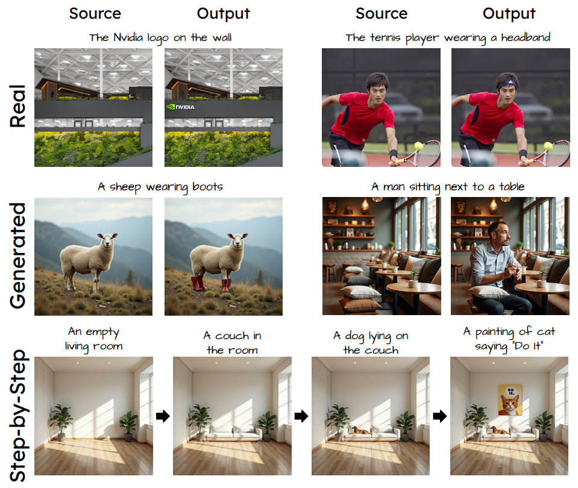

## Add-it: Training-Free Object Insertion in Images with Pretrained Diffusion Models
*arXiv(2024), 15 citation, NVIDIA, Review Data: 2025.10.16*

[Intro](#intro) 
[Related Work](#related-work) 
[Method](#method) 
[Experiment](#experiment) 
[Conclusion](#conclusion) 

> Core Idea

<strong>"Weighted Extended-Attention Mechanism of Add-it Preserves a Structual Consistency and Fine Details While Ensuring Natural Object Placement"</strong> 

***

### <strong>Intro</strong>

$\textbf{이 주제의 정의 및 요구사항과 중요한 이유}$

- Adding Object: text instruction을 기반으로 이미지에 새로운 object를 추가하는 것은 semantic image editing에서 어려운 작업이다. 이는, 원본 장면을 보존하면서 새로운 객체를 적절한 위치에 원활하게 통합하는 것 사이의 균형이 필요하다.
  - Creator는 복잡한 시각적 장면을 반복적으로 만들기위해 사용할 것이다.
  - Autonomous driving researchers는 그들의 car-perception system을 학습하기위해 새로운 시나리오에 보행자들을 넣고 싶을 것이다.

$\textbf{이 주제의 문제점과 기존의 노력들}$

- 몇몇 연구들은 최근 text-to-image diffusion model을 활용하여 이 task를 수행하고자 했다. 하지만 다양한 editing task를 잘 수행하는 반면 adding object의 성공률은 낮았다. 
- 이에 따라, 더 직접적인 learning approach를 통해 (training on large image editing datasets) 달성하려고 했지만 out-of data에 대해 generalization이 부족했다. 

- 광범위한 노력에도 불구하고, 기존의 모델들은 이 balance에 대해서 어려움을 겪고있는데, 특히 복잡한 장면에서 물체를 자연스러운 위치에 넣기가 어렵다. 
- Adding object task (Image Additing)를 수행하기 위해선 *affordance*를 이해해야한다. 이는 합리적인 위치로 object를 위치시키기 위해, 사람과 물체간의 상호작용의 deep semantic knowledge를 의미한다. 

$\textbf{최근 노력들과 여전히 남아있는 문제들}$

$\textbf{본 논문에서 해결하고자 하는 문제와 어떻게 해결하는지, 그 결과들}$

- 본 논문에서는 생성된 이미지, text prompt, scene image로부터 정보를 통합하기 위해 diffusion model의 attention mechanism을 확장하는 training-free approach인 **Add-it**을 제안한다. 
  - 이 weighted extended-attention mechanism은 structual consistency와 fine details를 유지하면서 자연스러운 객체의 위치를 보장한다. 

$\textbf{본 논문의 주요 기여점}$

- Task-specific fine-turning없이 Add-it은 real and generated image insertion benchmark 모두 최고 성능을 달성했다. 

***

### <strong>Related Work</strong>

***

### <strong>Method</strong>

$\textbf{Preliminaries: Attention in MM-DiT Blocks}$

- SD3와 FLUX와 같은 modern Diffusion Transformers (DiT)은 unified multi-modal self-attention blocks (MM-DiT blocks)를 통해 concatenated textual prompt와 image patch token를 처리한다. 
  - 구체적으로, FLUX는 $2$ 가지 타입의 attention block을 가진다
    - Multi-stream blocks: text와 image token에 대해서 분리된 projection matrices $W_K, W_V, W_Q$ 를 사용한다. 
    - Single-stream blocks: 같은 projection metrices를 사용한다. 
    - 두 가지 block 모두 concat된 token들에 대해서 attention을 계산한다. 
  - 주목할 점은, Flux는 여러 개의 Multi-stream 블록과 그 뒤를 잇는 Single-stream 블록들로 구성되어 있다는 것이다.

$\textbf{Weighted Extended Self-Attention}$

$\textbf{Structure Transfer}$

$\textbf{Subject Guided Latent Blending}$

***

### <strong>Experiment</strong>

***

### <strong>Conclusion</strong>

***

### <strong>Question</strong>

<a href="">link</a>

> 인용구
