## ART-UP: A Novel Method for Generating Scanning-Robust Aesthetic QR Codes
*ACM transactions on multimedia computing, communications, and applications (TOMM) (2021), 50 citation, Zhengzhou University, Review Data: 2026.01.13*

[Intro](#intro) 
[Related Work](#related-work) 
[Method](#method) 
[Experiment](#experiment) 
[Conclusion](#conclusion) 

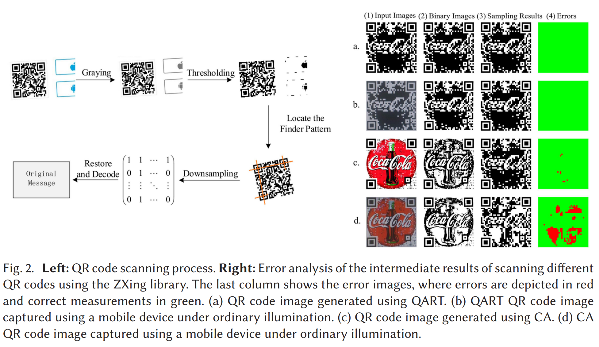

> Core Idea

<strong>"test1"</strong> 

***

### <strong>Intro</strong>

$\textbf{이 주제의 정의 및 요구사항과 중요한 이유}$

- QR (Quick Response) code는 일반적으로 다양한 환경에서 스캔되기에 조명, 크기, 적용 범위, 카메라 각도의 variation에 대해서 강건해야 한다. 
- Aesthetic QR code는 visual quality는 향상시키지만 appearance의 미묘한 변화는 스캔 실패를 초래할 수 있다. 

- 스캐닝 오류는 임계값(Thresholding) 오류와 샘플링(Sampling) 오류로 분류된다. 이에 따라 오류 모델을 구축하고, 각 모듈(module)을 올바르게 샘플링할 확률을 추정한다.

- 그 다음, 이러한 확률 추정 모델들을 결합하여 각 모듈의 휘도(luminance)를 국소적으로 조정하는 반복적 휘도 조절(iterative luminance adjustment) 기법을 사용함으로써, 올바르게 샘플링될 확률을 높이고 스캐닝 견고성(robustness)을 향상시킨다.

- 또한 더 나은 시각적 품질을 확보하고 수정 효과를 높이기 위해, 이미지의 시각적 주목도(saliency)를 해당 확률 제약(probability constraint)과 결합한다. 그 결과, 스캔에 강인하면서도 시각적으로 잘 꾸며진(미적으로 개선된) QR 코드를 생성할 수 있다.

$\textbf{본 논문에서 해결하고자 하는 문제와 어떻게 해결하는지, 그 결과들}$

- 본 논문에서는 visual quailty와 scanning robustness 사이의 tradeoff를 효과적으로 다루는 module-based scanning probability estimation model을 제안한다.  
- 본 논문의 방법론은 성공적인 sampling의 확률을 추정함으로써 각 모듈의 휘도 (luminace)를 지역적으로 조절한다.
- Hierarchical한 방법론으로 visual quailty를 향상시키기 위한 coarse-to-fine strategy를 채택한다. 이는 순차적으로 다음의 코드를 생성한다. 
    - Binary aesthetic QR code -> Grayscale aesthetic QR code -> final color aestheti QR code 
- 몇 가지 초기의 parameter를 조절하면 다른 visual style의 QR code를 생성할 수 있다. 

***

### <strong>Related Work</strong>

- QR code는 초기에 제조 과정에서 자동차나 그 부품을 tracking 하기 위해 발명됐다. 

- 기존의 기초 알고리즘과 함께 사용된 aesthetic QR code를 생성하는 방법을 4가지로 구분할 수 있다. 
    - Embedding icons: icon을 심는 것은 구현이 매우 쉽지만 QR code의 잠재적인 error correction capacity에 의존해야 한다.
    - Replacing colors: 의미 정보를 첨부하기 위해 색상을 교체하는 것은 종종 수작업이 필요하며 처리하기 어렵다.
    - Chaning the module shape: 모듈 모양을 변경하는 것은 종종 수작업이 필요하며 처리하기 어렵다.
    - Adjusting codewords: codeword를 조절해서 QR을 생성하는 것은 대게 scanning robustness를 달성하지만 visual quality가 떨어지거나 그 결과가 일관되지 않는다.

- 최근 연구에서는 일반화된 방법을 구하기 위해 임의의 input image와 함께 QR code module을 섞는 걸 시도하고 있다.
    - Cox: Gauss-Jordan elimination과 Reed-Solomon code의 특성을 결합하는 QR code encoding의 원리를 살펴봤다.
        - Binary image와 비슷한 결과 이미지를 만드는 encoding 절차를 통해 QR code의 codeword를 조절하는 복잡한 방법론이다. 
        - 하지만 이 방법론은 URL data only encoding에 특화되어 있다. 
    - Halftone QR code: 각 module을 $3 \times 3$ sub-module로 나누고 module color를 중앙 sub-module color에 binding한다.
        - 그러나 이 알고리즘은 비선형 최적화 절차를 채택하고 있어 비효율적이며, 시각적 결과 품질이 낮아지는 문제가 있다. 

- 이후 Garateguy는 하프톤을 이용한 새로운 알고리즘을 제안했다. 이는 halftoning mask와 삽입된 이미지로 인해 발생하는 왜곡을 예측하는 확률 모델을 사용하여 수정할 픽셀 집합을 선택하는 방식에 기반한다. 
    - 이 방법은 일부 스캐닝 견고성(robustness)을 희생하는 대신 시각적 품질을 향상시킬 수 있지만, 생성된 이미지에는 여전히 많은 영상 잡음(image noise)이 남는다.

- 시각적 품질을 더 개선하기 위해, 
    1. 삽입 이미지의 주목도 (saliency)를 고려하여 픽셀을 보다 효과적으로 수정함으로써 고버전 QR code의 시각적 품질을 크게 향상시켰어나, 저버전 코드의 개선 효과는 제한적이었다. 
    2. Gauss-Jordan 소거 절차에 기반해 QR code의 모듈 순서를 조정하여 입력 이미지와의 전역적 유사도를 유지하고, 이후 가중치 맵에 따라 입력 이미지를 QR code에 블렌딩하는 렌더링 메커니즘을 설계하여 더 나은 시각적 품질을 얻었다. 다만 스캐닝 견고성이 심각하게 저하되는 문제가 있었다. 

***

### <strong>Method</strong>

Scanning robustness를 겸비한 aesthetic QR code를 생성하기 위해 먼저 전체적인 scanning과 decoding process의 세부사항을 분석하고 scanning에 영향을 주는 error-generating factor를 결정한다. 

$\textbf{Decoding Algorithm}$

- QR code는 특정 encoding rule에 의해 순서가 있는 white/black module들로 구성되어 있다. 각 모듈은 while(0)/black(1)를 표현하고 8 bit는 codeword를 구성한다. 
- 또한 이 codeword는 다시 2가지로 나눌 수 있다: data codeword & error correction codewords
- 일반적으로 스캐닝 과정은 단말 장치가 카메라를 통해 화면 또는 인쇄물로부터 QR code image를 획득한 뒤, 영상 처리 기술을 이용해 흑백 모듈 위치를 탐지하고 샘플링하는 절차를 포함한다. 
    - 샘플링된 정보를 바탕으로 QR code image는 행렬로 변환되며, 이후 디코딩 알고리즘을 통해 해독된다. 

- 가장 널리 알려진 QR code 생성 및 스캐닝 방식에 따라, 오픈소스 라이브러리 (Sean Owen. 2013. ZXing. Zebra Crossing.)를 기반으로 스캐닝 과정을 **전처리, 검출, 인식**의 세 단계로 구분한다.
    - 전처리: RGB 이미지를 grayscale 이미지로 변환한 다음, 256단계 그레이 레벨 이미지에서 이진 이미지로 변환
    - 검출: QR code의 정확한 위치를 찾고 확인하는 단계
    - 인식: 아래 그림과 같이 다운샘플링과 디코딩으로 구성된다. 

- 전처리 (Preprecessing)
    - 먼저 camera에 포착된 RGB 이미지를 grayscale image로 변환한다.
        - $\alpha=0.299, \beta=0.587, \gamma=0.114$
    - 변환된 이미지는 일반적으로 thresholding에 기반하여 binary image로 변환된다. 
        - $H_x, t_x$: binary result, threshold at position $x$
    - 적절한 threshold를 찾는 것이 QR code detection의 성능에 영향을 준다. ZXing은 hybrid local block averaging method를 사용했다. 즉, 입력 이미지를 먼저 서로 겹치지 않도록 $8 \times 8$ 크기의 블록들로 분할한 뒤, 각 블록의 평균값을 계산한다. 그 다음, 각 블록 주변에 $5 \times 5$ 블록 집합 (해당 블록을 중심으로 한 이웃 블록들)을 구성하고, 이 블록들의 평균값들을 이용해 최종 임계값을 계산한다. 

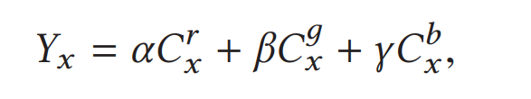

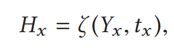

- Hybrid local block averaging method
    - $i$-th block의 임계값을 정할 때, $5 \times 5$ 주변 block들에 대해서 모든 grayscale 값들을 평균낸 값을 임계값으로 사용한다. 
    - 일반적인 QR code에서는 이 임계값 방식이 특히 조명 환경이 다양한 경우 스캐닝 오류를 줄이는 데 도움이 된다. 하지만 미적 QR 코드에서는 삽입된 이미지의 색상/명암이 임계값 계산에 크게 영향을 주어, 임계값이 지나치게 높거나 낮게 계산되면서 예상치 못한 이진화 결과가 쉽게 발생한다. 따라서 이러한 영향을 줄이는 것이 스캐닝 견고성(robustness)을 유지하는 핵심 요인이다.

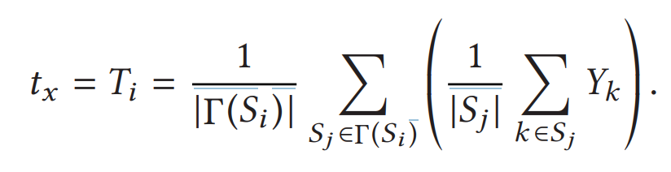

- 검출 (Detection)
    - 전처리 후 생성된 이진 이미지로부터 QR code의 위치를 찾아낸다. Finder pattern을 찾기 위해 패턴 매칭이 사용된다. 
    - Finder pattern은 QR code 이미지에서 세 모서리에 위치하며, 각 구성 요소는 서로 동심을 이루는 세 개의 정사각형으로 구성된다. 이 정사각형은 각각 검은색 $7\times7$, 흰색 $5\times5$, 검은색 $3\times3$ 모듈로 형성된다. 
    - 검출 과정에서는 파인더 패턴의 단면에 해당하는 검-흰-검-흰-검 패턴을, 비율 1:1:3:1:1로 매칭하여 QR 코드의 존재 여부를 빠르게 식별한다. 마지막으로, 세 개 파인더 패턴의 상대적 위치 관계를 기반으로 이미지의 정확한 위치와 방향(orientation)을 확정한다.

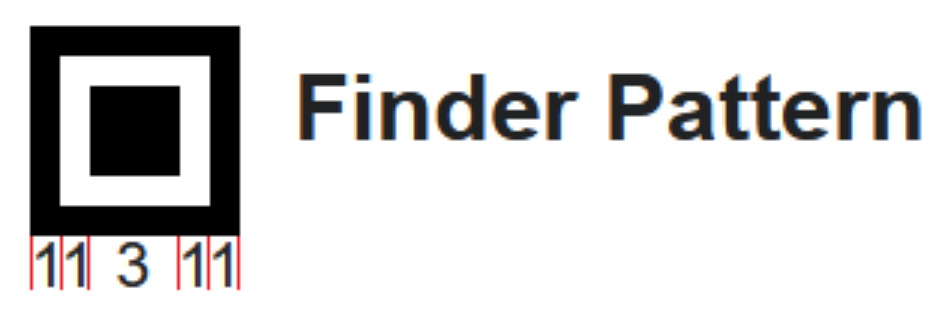

- 인식 (Recognition)
    - QR 코드를 인식하는 과정은 주로 **샘플링(sampling)**과 **디코딩(decoding)**으로 구성된다. 샘플링이란 먼저 각 모듈(module)의 크기를 추정한 뒤 모듈의 개수(배열 크기)를 파악하는 것을 의미한다. 이후 각 모듈의 중심 픽셀을 샘플링하여 해당 모듈 전체의 정보를 얻고, 모든 모듈에 대해 샘플링이 완료되면 최종적으로 하나의 행렬(matrix)이 형성된다.
    - 반면 디코딩 과정은 샘플링 단계에서 얻어진 행렬을 검사하고 그 안에 포함된 정보를 해석하는 절차이다. 이는 데이터 마스크(data masks), 코드워드 재배열(codeword rearrangements), 오류 정정(error correction), 복호(decoding) 등 QR 인코딩 규칙에 따라 역으로 복원해 나가는 과정을 포함한다. QR 인코딩에는 리드-솔로몬(Reed–Solomon) 알고리즘이 사용되므로, 디코딩 시 오류 정정을 수행하기 위해서도 해당 알고리즘이 필요하다. 한 블록에서 오류가 과도하게 발생하면 원본 데이터를 복구할 수 없게 되어 QR 코드 해독이 실패하게 된다.

$\textbf{Scanning Error Analysis}$

- QR 코드가 정확히 위치 검출되고, 최종적으로 얻어진 데이터 매트릭스(data matrix)가 올바르게 디코딩되면, 우리는 해당 코드를 **인식 성공(accepted)**으로 간주한다. 그러나 실제 스캐닝 과정에서는 다양한 종류의 잡음과 오류가 발생할 수 있다. 
    - 스캐닝 과정에서 발생하는 여러 오류를 추가로 분석하고 보여주기 위해, 대표적인 미적 QR 코드 구현 두 가지인 **QART**와 **CA**를 대상으로 실험을 수행했다. 아래 그림과 같이, ZXing 라이브러리를 사용하여 실험 중간 결과(intermediate results)를 비교·유지함으로써 오류를 추가로 식별할 수 있도록 했다.
    - (a) - QART, (c) - CA: 원본 이미지의 스캐닝 과정 
    - (b), (d): 모바일 기기를 사용해 촬영 (일반적인 조명 환경)
    - 2번째 열은 ZXing 라이브러리로 처리한 뒤 얻어진 이진화 결과이다.
    - 3번째 열은 검출 이후 QR code의 다운샘플링 결과, 즉 샘플링 결과로 구성된 행렬을 나타낸다. 
    - 4번째 열은 샘플링 결과 행렬을 정답 행렬과 비교했다. 오류는 빨간색, 정상적으로 식별된 값은 초록색이다. 
    - 결과: QART로 생성된 QR code가 스캐닝 견고성을 보여준다. 
    - 스캐닝 원리에 따르면, 샘플링 결과 행렬에 오류가 존재할 경우 리드–솔로몬(Reed–Solomon) 코드와 같은 데이터 오류 정정(error correction)을 통해 이를 수정해야 한다. 생성된 오류의 비율이 일정 임계값을 초과하면 오류 정정이 실패할 수 있으며, 그 결과 스캐닝 자체가 실패한다.
    - 본 논문은 생성 과정에서 각 모듈(module) 내에서 발생할 수 있는 오류의 확률을 추정하고, 오류 발생을 방지하기 위한 조치를 취하는 방법을 제안한다.

$\textbf{ART-UP}$

- Generation process: binary aesthetic stage > grayscale aesthetic stage > color aesthetic stage 
    - Binary aesthetic stage: visual saliency와 Gauss-Jordan 소거법을 이용해 코드워드를 조정하고 모듈의 순서를 입력 이미지의 이진화 결과와 일치하도록 조정하여 전역적으로 시각적 충돌을 방지한다.
    - Grayscale aesthetic stage: 일반 스캐너의 스캐닝 과정을 분석하여 임계값 처리(thresholding)와 다운샘플링(downsampling) 과정을 모사하고, 이를 바탕으로 임계값 오류(thresholding error) 및 샘플링 오류(sampling error) 모델을 구축한다. 이러한 방식으로 각 모듈이 올바르게 샘플링될 확률을 추정할 수 있으며, 이 확률은 생성 과정을 개선하고 스캐닝 견고성(robustness)을 보장하기 위한 피드백으로 활용된다.
    - Color aesthetic stage: 컬러 미적 단계에서는 선형 기반 해(linear-based solution)를 구축하여 각 채널의 픽셀 값을 정확하게 계산함으로써 컬러 미적 QR 코드를 생성한다. 이 과정은 원본 이미지의 휘도(luminance)를 조정하여 그레이스케일 QR 코드와 일치시키는 방식으로 수행된다.

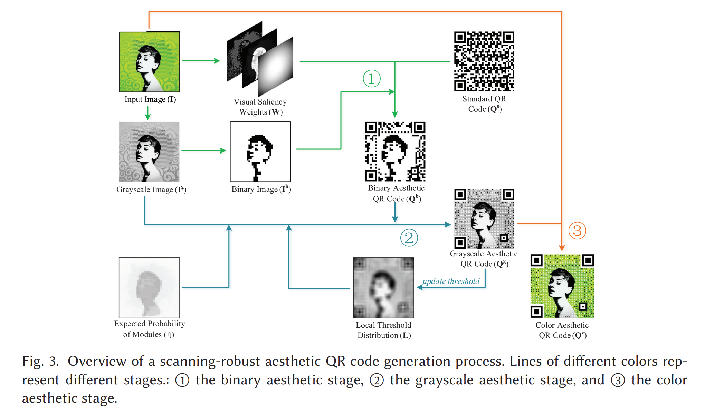

$\textbf{Binary Aesthetic QR Codes}$

- 이 단계에서는 구조적 시각 효과를 직접적으로 결정한다. 먼저 원본 이미지에 기반하여 grayscale 이미지를 생성하고, 이어서 모듈 기반 임계값 알고리즘으로 이진 이미지를 생성한다. 그 다음 원래 QR code의 코드워드를 우선순위 가중치 $W$에 따라 조정하여 목표 이진 미적 QR code를 생성한다.

- 모듈 기반 이진화 
    - 그레이스케일의 이미지 한 변의 길이를 $n$ 이라고 할 때, 보통 개별 모듈의 길이보다 훨씬 크다. 
    - 그렇다고, 그레이스케일 이미지를 rescale해서 대응시키는 건 시각적 효과가 만족스럽지 않다.
    - 따라서 그레이스케일 이미지의 모듈별로 나눌 건데, 한 변의 모듈 개수가 QR과 동일하게끔 $l=4\times V + 17$로 맞추기 위해 모듈 한 변의 길이를 $a = \frac{n}{l}$ 로 설정한다. 
    - 그 후, 그레이스케일의 이미지 각 모듈에 대해서 이진화를 진행하면 크기만 다르고 모듈 개수는 원본 QR과 동일한 이진 이미지가 만들어진다. 즉, grayscale의 각 모듈이 QR module과 매칭됨.
    - 이때, 사용하는 이진화 방법은 모듈 내의 모든 픽셀을 동일하게 보지 않고, 모듈 내 중앙에 가까운 픽셀일수록 중요하게 보고 가우시안 분포로 설정한다. 

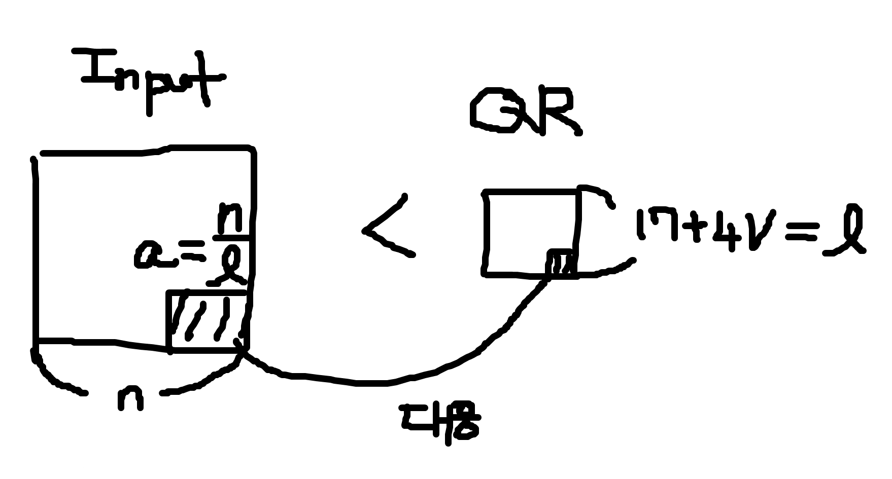

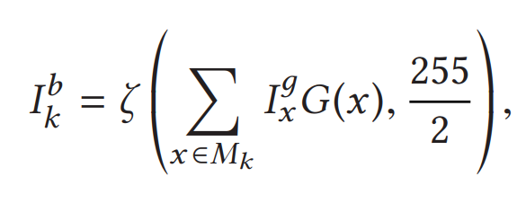

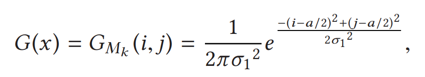

- 코드워드 조정
    - QR 코드 스캐닝 원리를 분석하면, 오류 정정 단계를 통과할 수 있는 한 스캐너는 해당 QR 코드를 인식 성공(accepted)으로 처리한다는 점을 알 수 있다. QR 코드는 Reed–Solomon 인코딩을 사용하며, 다음과 같은 성질을 갖는다.
        - 시스템틱(systematic) 코드로서 입력 데이터가 최종 인코딩 결과에 포함된다. 즉, 앞부분은 원래 입력 코드이고, 뒷부분은 오류 정정 코드이다.
        - 서로 다른 두 Reed–Solomon 인코딩 블록을 XOR(배타적 논리합)한 결과 역시 유효한 Reed–Solomon 인코딩 블록이 된다.
    - 인코딩 과정에서 각 블록은 독립적인 Reed–Solomon 코드이며, 하나의 블록은 세 영역으로 나눌 수 있다. 하나는 입력 데이터 비트 영역, 하나는 패딩(padding) 비트 영역, 나머지는 정정(correction) 비트 영역이며, 각각의 길이를 $m, p, c$라 하자. QR 인코딩 규칙에 따르면 QR 코드의 버전과 오류 정정 레벨이 정해지면 $m+p$와 $c$는 고정 상수이지만, $m$ 과 $p$는 입력 데이터 크기에 따라 달라질 수 있다. 
    - 코드워드 조정 과정을 명확히 설명하기 위해 아래 그림을 예로 든다. 첫 번째 행에는 원래 정보가 들어 있다. 이진 미적 QR 코드를 이진 이미지와 유사하게 만들기 위해, 블록 내 $k$ 번째 (padding data; $k>m$ and $k <= m+p$) 자리를 $1$ 에서 $0$ 으로 조정해야 한다고 가정하자. 그러면 $k$번째 자리가 $1$이고, 입력 데이터 및 패딩 비트 영역의 다른 자리는 0인 **특수 연산자(operator)**를 구성한다. 정정 비트는 Reed–Solomon 코딩의 검사 규칙에 따라 생성된다. 성질 2에 의해, 이 특수 연산자와 원래 코드를 XOR하면 유효한 Reed–Solomon 코드 블록이 얻어진다. 생성된 코드는 입력 데이터 영역과 패딩 영역의 다른 자리들은 유지하면서, $k$번째 자리만 반전된다. 
    - 앞서 설명한 방식으로, 그림에 보인 것처럼 연산자 집합 A를 구성할 수 있다. A에는 $a_1, a_2, ..., a_p$로 표시된 $p$개의 연산자가 있으며, 각 연산자에서 해당 자리 $m+1, m+2, ..., m+p$는 1이고, 입력 데이터 영역과 패딩 영역의 나머지 자릿값은 $0$이다. 
    - 즉, 패딩 데이터 영역에서 제어 가능한 각 모듈마다 1이 있는 행이 정확히 하나씩 존재하며(그림에서는 빨간색으로 표시), 이 연산자 집합을 이용해 현재 데이터에 $a_{k-m}$를 XOR 함으로써 다른 제어 가능한 모듈에는 영향을 주지 않고 $k$번째 자리를 원하는 값으로 조작할 수 있다. 집합 A로 조정된 중간 결과는 그림 (c)이다.
    - 입력 데이터 비트를 변경하지 않으면서 오류 정정 비트를 갱신하려면, 제어 가능한 모듈을 패딩 데이터 영역 ($k>m$ and $k <= m+p$) 으로 제한해야 한다. 그러나 Gauss-Jordan 소거법을 사용하면 이러한 제약을 완화하여 더 높은 유연성을 확보할 수 있다. 
    - 즉, 집합 A의 연산자들을 결합하여 새로운 연산자 집합 B를 만들고, 연산자들 간 XOR을 통해 **데이터 비트와 오류 정정 비트를 ‘교환(trade)’**하는 새로운 기저(basis) 연산자를 생성할 수 있다. 이 방식으로 제어 불가능한 모듈들이 분산되고, 잡음 픽셀(noise pixels)이 캔버스 전반에 분포하게 되며, 그 결과가 그림 (d)에 제시되어 있다. 
    - 마지막으로, 이 과정에서 입력 데이터 비트(종료 표시자(ending indicator) 포함)는 변경되지 않았으므로, 성질 1에 따라 QR 코드에 포함된 정보는 코드워드 조정에 의해 영향을 받지 않는다. 이는 올바른 디코딩 결과를 보장하기 위해 필수적이다.

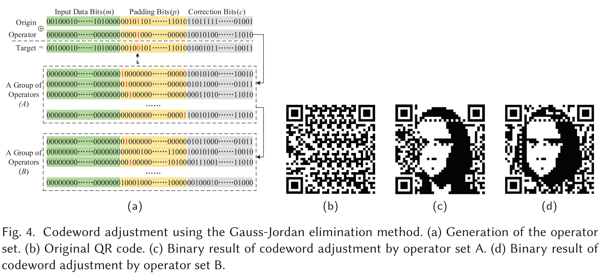

- Visual Saliency Optimization
    - 앞의 코드워드 조정 과정에서는 QR code의 인코딩 규칙 제약 때문에 제어 가능한 모듈 (controllable modules)을 일정 범위 내에서만 이동시킬 수 있으며, 새로운 모듈을 추가할 수는 없었다. 
    - 각 블록에서 $p$개의 제어 가능한 모듈의 색상은 자유롭게 제어할 수 있지만, 그 외 영역은 입력 데이터와 검사 알고리즘의 영향을 받는다. 따라서 어떤 제어 가능한 모듈을 선택할지에 대한 우선순위 알고리즘을 제안한다. 
    - 본 연구에서는 각 모듈에 대한 우선순위를 결정하기 위해 saliency (시각적 중요도), edge (경계) 검출, 그리고 휴리스틱 제약을 선형 결합한 가중치 $W$를 사용한다. 
    - 여기서 Edge와 Sal은 각각 이미지 $I$에 대해 수행한 에지 검출 결과와 시각적 살리언시 결과이다.
    - $W$와 원본 QR code $Q_s$의 크기를 동일하게 만들기 위해 mean-pooling 연산을 수행한다. Heu는 휴리스틱 규칙을 정의하며, 두 모듈의 Edge와 Sal 값이 유사한 경우 이미지 중심에 더 가까운 모듈이 더 큰 가중치를 갖도록 한다.
    - $l$은 QR code 한 변에 있는 모듈의 개수이며, 즉 $l=4V +17$ 이다. 본 연구에서는 에지 검출과 살리언시 영역 추출을 위해 각각 Canny와 Region-Based Contrast(RC) 방법을 채택했다. Edge, Sal, Heu를 정규화한 뒤, 실험에서 $\lambda_1, \lambda_2, \lambda_3$ 값은 각각 $0.67, 0.23, 0.1$로 설정했다. Heu의 가중치는 작지만, 사용자가 제공하는 대부분의 이미지(예: 로고, 사람 얼굴)에서는 제어 가능한 모듈의 선택이 최종 결과에서 항상 핵심적인 역할을 한다.

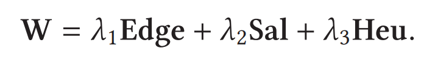

$\textbf{Grayscale Aesthetic QR Codes}$

- QR 코드의 디테일을 더 풍부하게 표현하기 위해서는, 이미지를 결합하여 그레이스케일 QR 코드를 생성함으로써 시각적 효과를 최적화할 필요가 있다.
- 먼저 그레이스케일 이미지 $I_g$와 이진 미적 QR code $Q_b$를 바탕으로 초기 국소 임계값 분포 $L$를 사전 추정한다. 
- 다음으로, 모듈 기반 휘도(luminance) 수정 알고리즘을 사용하여 대응되는 그레이스케일 이미지 $I_g$에서 각 모듈에 해당하는 픽셀들을 조정하고, 기대 확률 분포 $\eta$에 따라 스캐닝 강건성을 보장한 뒤, 이를 $Q_b$와 결합하여 그레이스케일 QR code $Q_g$를 생성한다.
- 그 후 실제 이미지에 대한 국소 임계값 분포 $L$을 $Q_g$를 통해 다시 계산하여 갱신하고, 휘도 수정으로 $Q_g$를 재생성한다. 이러한 반복을 통해 국소 임계값 분포가 점차 안정화되면 최종 $Q_g$를 얻는다.

- 모듈 기반 스캐닝 확률 추정 (Module-Based Scanning Probability Estimation)
    - 일반적인 QR 코드 스캐너는 **하이브리드 국소 블록 평균(hybrid local block averages)**에 기반한 임계값 처리 방법을 사용한다. 이론적으로는 어떤 픽셀에 적용되는 임계값이 임계값 처리 과정에서 해당 픽셀이 속한 블록과 인접 픽셀들에만 의존한다. 그러나 현실에서는 임계값 문제가 복잡하며 다음 요소들을 고려해야 한다.
    - 첫째, 대부분의 실제 상황에서 촬영된 이미지의 색상은 환경 조건의 영향을 받아 원본과 달라질 수 있다. 
    - 둘째, 하이브리드 국소 블록 평균 기반 임계값 처리에서는 먼저 촬영 이미지를 서로 겹치지 않는 블록들로 나누고, 동일 블록 내에서는 동일한 임계값을 적용한다. 하지만 실제로는 이미지 속 QR 코드의 위치와 각도가 미지이므로, 블록 분할 과정에서 픽셀의 정확한 위치를 확정할 수 없다.
    - 셋째, 이론적으로 블록 크기는 정확히 정의되지만, 실제로는 스캔 거리 및 이미지 스케일링 때문에 블록 크기와 QR 모듈 크기의 상대 비율이 고정되지 않는다.
    - 즉, 이론적으로 훌륭한 임계값 처리 방법이 존재하지만, 이를 현실 세계에 적용하려고 보니 카메라 각도, 거리 등의 외부적 요인으로 인해서 각 픽셀의 값도 달라지고 을 블록 단위로 정확히 나누기 어렵고 모듈 단위로도 나누기 어렵다.
    - 픽셀의 실제 임계값을 정확히 결정하기는 어렵지만, 특정 가정 하에서는 비교적 좋은 추정이 가능하다. 
        - 첫째, 색상 편차 문제에 대해, 일반적으로 촬영된 색은 실제 색과 유사하다고 볼 수 있다. 색 임계값 처리의 제한을 무시하면, 촬영 색이 실제보다 더 진하거나 더 연할 확률이 같다고 가정할 수 있으며, 변화 폭이 커질수록 그 확률은 점차 감소한다고 볼 수 있다. 
        - 둘째, 이미지 내에서 QR 코드의 위치와 각도가 무작위이므로 블록 분할에 따른 픽셀 위치도 무작위가 된다. 따라서 픽셀이 항상 블록 중심에 위치한다고 가정할 수 있다. 그러면 하이브리드 국소 블록 평균 기반 임계값 처리는 국소 평균(local average) 기반 임계값 처리로 대체될 수 있는데, 즉 주변 픽셀 평균으로 임계값을 결정할 수 있다. 또한 픽셀이 블록 중심에 있지 않더라도, 국소 영역에서 색의 연속성이 있다고 가정하면 주변 영역을 통해 실제 임계값을 추정할 수 있다. 더불어 스캔 거리 및 스케일링이 실제 임계값에 미치는 영향은 사용자 스캐닝 방식에 따라 달라지는 무작위 요인이며, 이미지에 포함되는 QR 코드 비율도 불명확하지만 보통 일정 범위에 군집하므로 임계값도 해당 범위 내에서 변화한다고 볼 수 있다.

- 요지는 “스캐너의 이진화(thresholding)가 현실에서는 들쭉날쭉하니, 그 불확실성을 확률 모델로 근사해서 ‘어떤 픽셀/모듈이 얼마나 잘 읽힐지’를 계산하고, 그에 맞게 그레이스케일 값을 조정하자" 이다.
    - 실제 임계값은 "기대 임계값" 근처에서 흔들린다고 가정하고 확률 모델로 근사한다. 
    - 환경/카메라/블록 경계 불확실성 등 모든 잡음을 분산 $\sigma^2$ 하나로 흡수한다. 
    - $R(x)$ 는 중심 픽셀 $x$ 주변의 픽셀 집합을 의미한다. 본 연구에서는 $R(x)$는 한 변의 길이가 $3a$인 정사각형 영역이며, $a$는 QR 모듈 한 변의 길이이다. 
    - 기존의 임계값 선정 방식은 한 이미지를 블록마다 나누고 특정 블록의 임계값을 정할 때 근처 블록과 함께 평균을 내서 임계값을 정했다면, 본 논문에서는 외부적 요인으로 인해 특정 픽셀이 어느 블록에 속하는지 특정하기 어려우니, 특정 픽셀의 임계값을 국소 주변 영역 평균으로 근사하고(기대 임계값), 실제 임계값은 그 주변에서 확률적으로 변동한다고 본다. (국소 평균 기반 임계값)

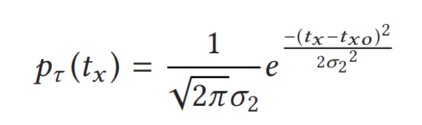

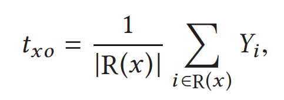

- 확률변수 임계값 $t_x$ 값이 실제 grayscale pixel 값 $Y_x$보다 작을 확룔과 클 확률을 나타낸 것이다. 
    - 이 두 확률의 합이 $1$이 아니다. 
    - 이때, 전체 적분 범위를 $[0,255]$로 잘랐는데, 사실 $p_{\tau}(t_x)$는 가우시안 분포를 가지기 때문에 $(-inf,\inf)$에 정의되어 있다. 따라서 꼬리 확률이 남아있다. 

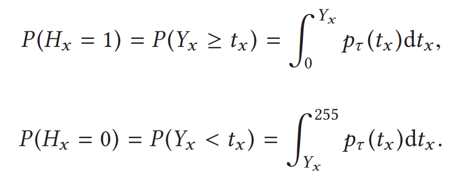

- 확률들의 합이 $1$이 아니니, 이를 보정하기 위해서 정규화를 한다. (조건부 확률처럼 재정의)
    - 픽셀 $x$가 속한 모듈 $M_k$의 목표 이진값이 $Q_k^b$라고 할 때, 픽셀이 올바르게 이진화될 확률을 정의한다. 
    - $t_x$가 $[0,255]$ 범위 안에 있다고 가정했을 때 올바르게 판정될 확률이다. 
    - 단조 관계 (monotonic)이란 말은 픽셀 $x$ 주변의 평균 임계값 $t_{x0}$와 $\sigma$가 고정이면, 목표 이진값 $Q_k^b$가 $1$일 때, $Y_x$가 커질수록 $P(t_x <= Y_x)$는 증가 $p_x^t$도 증가. 반대도 마찬가지라는 얘기이다. 
    - 즉 grayscale에서의 픽셀값을 조정하면 $p_x^t$를 올릴 수 있다. > 이걸 모듈 단위 확률 $P_{M_k}$로 올려서 $\eta_k$를 만족시키도록 휘도를 조정하는 것이 핵심이다. 

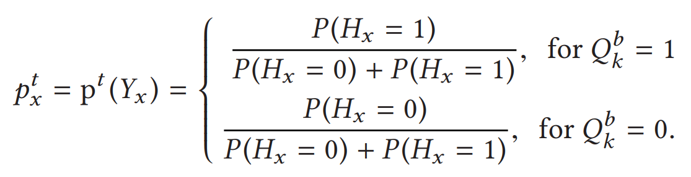

- 샘플링 측정 오류 (Sampling error estimation)
    - 이전에 언급한 인식 (Recognition) section에서는 이상적인 조건에서 스캐닝 과정은 다운샘플링 결과가 모듈 중심 픽셀에만 의존한다라고 했다. 
    - 그러나 실제 환경에서는 카메라가 촬영한 이미지가 회전, 스케일링, 심지어 형태 변형(transfiguring) 등의 영향을 받아 원본과 달라질 수 있으며, 이로 인해 샘플링 오류는 주변 픽셀의 영향을 받는다.
    - 또한 이러한 샘플링 오류를 현실적으로 모사하려면 다양한 환경과 대량의 실험이 필요하므로 쉽지 않다. 본 연구에서는 합리적인 가정으로, 모듈 내부에서 어떤 픽셀이 샘플링될 확률이 가우시안 분포를 따른다고 가정한다. 그림 (왼쪽)과 같이, 모듈 내에서 중심에 가까울수록 샘플링될 가능성이 높다.

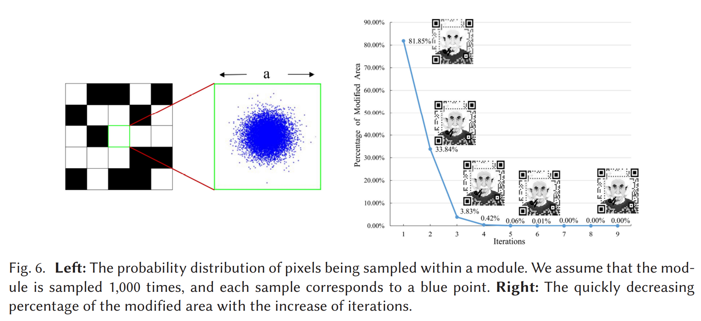

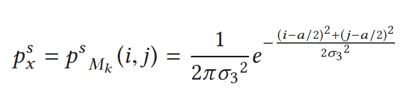

- 모듈을 올바르게 스캔할 확률(Probability of correctly scanning a module)
    - 스캐닝 과정 분석에서 유추할 수 있듯이, 임계값 처리(thresholding)와 다운샘플링(downsampling)은 서로 다른 단계에서 수행되며, 한 픽셀의 임계값 처리 결과는 샘플링과 독립적이다. 따라서 샘플링 과정에 따라 어떤 픽셀이 샘플링 결과로 선택될 때, 그 픽셀이 올바른 결과로 선택될 확률은 다음과 같다:

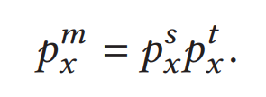

- 따라서 모듈 $M_k$가 올바르게 스캔될 확률은 다음과 같다:

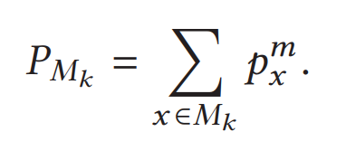

- 휘도 조정(Luminance Adjustment)
    - 미적 QR 코드의 스캐닝 강건성과 시각적 품질 사이의 균형을 맞추기 위해, 본 절에서는 이진 미적 QR 코드 $Q_b$와 grayscale image $I_g$를 조화시키기 위한 모듈 내부 휘도 수정 알고리즘을 제안한다. 또한 반복(iterative) 알고리즘을 통해 픽셀들의 **기대 임계값(expected threshold)**을 설정한다. 이러한 과정을 통해 최종적으로 그레이스케일 미적 QR 코드 $Q_g$를 얻는다. 

- 휘도 수정 알고리즘(Luminance modification algorithm)
    - QR 코드는 많은 모듈(module)로 구성된다. 단일 모듈이 올바르게 스캔될 확률을 추정하면, 샘플링 결과 행렬에서의 오류 확률을 간접적으로 계산하고 조정할 수 있다. QR 코드의 스캐닝 강건성을 보장하려면, 오류 정정(error correction)으로 복구 가능한 수준이 되도록 이 확률을 적절히 수정해야 한다.
    - 본 절에서는 임계값 처리(thresholding) 과정에서 각 픽셀의 기대 임계값 $t_x^0$ 가 이미 주어진(알려진) 값이라고 가정한다. 그러면 위의 식에 따라 해당 픽셀의 올바른 임계값 처리 확률 $p_x^t$를 계산할 수 있다. 마찬가지로 그레이스케일 미적 QR 코드에서 각 모듈이 올바르게 스캔될 확률 $P_{M_k}$도 계산할 수 있다. 
    - 전체 QR 코드의 스캐닝 강건성을 유지하려면, 각 모듈이 올바르게 스캔될 확률은 다음 제약을 만족해야 한다:
        - $eta_k$: $k$ 번째 모듈이 기대 수준으로 올바르게 스캔되기 위한 최소 확률 제약이다. 초기값으로 예를 들어 75% 같은 고정값을 줄 수 있으며, 이 값의 선택은 이후에 논의한다.

$$ P_{M_k} \ge \eta_k  $$

- QR 코드 이미지의 크기와 버전이 정해지면 모듈 내부에서 각 픽셀의 샘플링 확률 $p_x^s$는 사실상 고정값이다. 
    - 만약 $P_{M_k} < \eta_k$ 라면 (즉, 모듈이 올바르게 스캔될 확률이 기대값보다 낮다면) 모듈 내부 픽셀의 올바른 임계값 처리확률 $p_x^t$를 증가시켜 $P_{M_k}$가 제약을 만족하도록 조정해야 한다. 이를 위해 모듈 내 임계값 처리 확률을 업데이트 하는 다음 식을 구성한다. 

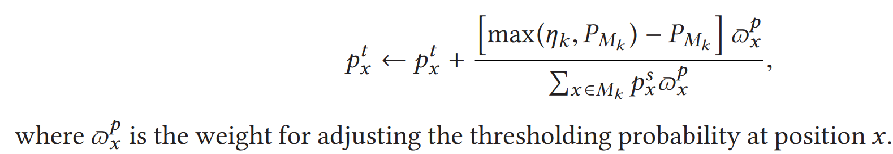

- 임계값 추정 알고리즘(Threshold estimation algorithm)
    - 조정된 휘도가 “가정한 기대 임계값”과 일관되도록 만드는 적절한 임계값을 찾기 위해, 본 연구는 **반복적 임계값 추정 알고리즘(Algorithm 2)**을 설계하였다. 이 알고리즘은 기대 임계값을 추정하고 목표 값으로 점진적으로 수렴한다.
    - 아인슈타인 그림에서 보이듯이, 각 반복 라운드에서의 조정 폭은 점점 작아지며, 변화가 다음 라운드로 넘어갈 만큼 유의미하지 않게 되면 안정 상태(stable state)에 도달한다. 실험 결과, 이 알고리즘은 효과적으로 수렴함을 보였다. 예를 들어 512×512 이미지의 경우 약 10회 반복만으로 안정 상태에 도달한다. 반복 횟수가 증가할수록 업데이트가 필요한 픽셀의 비율은 빠르게 감소하고, QR 코드의 외관 역시 점차 안정화된다.
    - 또한 종료 조건은 Algorithm 2의 11번째 줄에서 수정할 수 있다. 예컨대 최대 반복 횟수를 설정하거나, $L$과 $L_{old}$ 간 분산이 고정값보다 작아질 때 반복을 종료할 수 있다. 

$\textbf{Color Aesthetic QR Codes}$

- 그레이스케일 QR 코드 생성이 완료되면, 휘도(luminance)는 변하지 않도록 유지한다는 제약 하에서 이를 컬러 미적 QR 코드로 변환해야 한다. 식 (1)에서 알 수 있듯이 RGB에서 그레이스케일로의 매핑은 **다대일(many-to-one)**이므로, 3채널 컬러 이미지를 1채널 그레이스케일 이미지로 변환하는 방법은 여러 가지가 존재한다.

- 컬러 미적 QR 코드를 생성할 때에는 휘도를 유지하는 것뿐 아니라, 생성된 컬러 이미지 $Q_c$가 시각적 효과를 보장하기 위해 원본 이미지 $I$와 유사해야 한다. 일반적인 방법은 먼저 $I$를 RGB 공간에서 다른 색공간 (e.g., HSL, LAB)으로 변환한 뒤, 다른 채널은 고정한 채 휘도 채널만 조정하여 해당 그레이스케일 이미지가 $Q_g$와 같아지도록 만들고, 마지막에 다시 RGB 공간으로 변환하는 방식이다. 그러나 색공간 변환 과정에서는 색 표현 범위가 제한되는 경우가 많아, 단순히 휘도만 조정해서는 일부 경우 기대한 결과를 만족하지 못할 수 있다. 또한 휘도 조정은 보통 최적화 문제로 바뀌어 계산 비용이 증가한다.

- 본 연구에서는 이러한 문제를 완화하기 위해, 쌍선형 보간(bilinear interpolation) 알고리즘에서 영감을 받아 선형 기반 휘도 조정 알고리즘을 제안한다. 이 방법에서는 휘도 조정 과정을 선형 보간(linear interpolation) 과정으로 취급한다. 편의상, 위치 $x$에서의 최소 또는 최대 휘도 값을 나타내는 $C_m(x)$를 먼저 정의한다. 

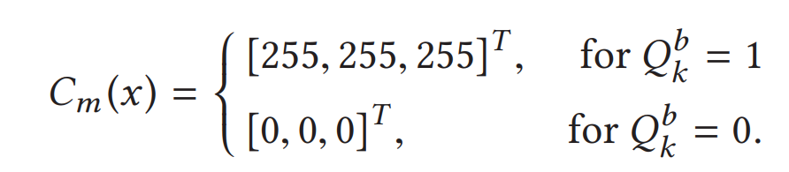

***

### <strong>Experiment</strong>

***

### <strong>Conclusion</strong>

***

### <strong>Question</strong>

- Binary: “디코딩 가능한 범위에서 최대한 이미지처럼 보이게”

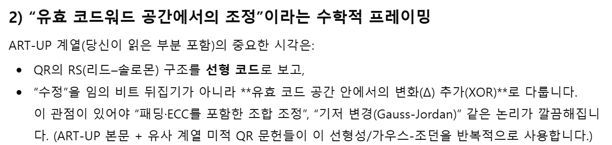

- Grayscale: “스캐닝 강건성(robustness)을 확률 제약으로 걸고 휘도 조정”

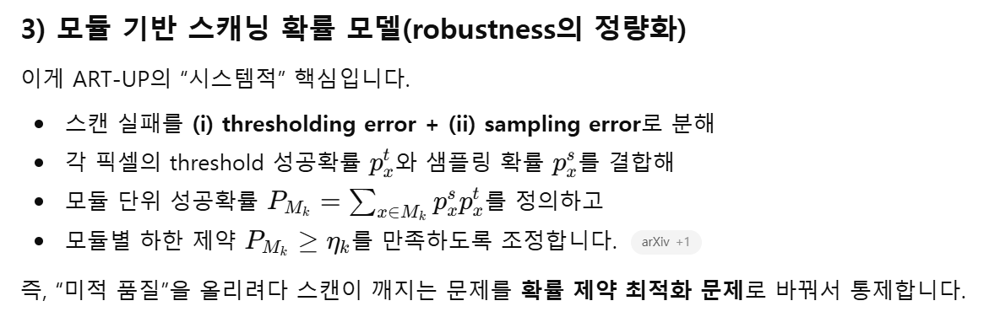

- Color: “휘도(=스캔 성능에 직접 영향)는 고정, 색만 원본에 가깝게”
    - 휘도는 변하면 안된다. (즉, grayscale -> color -> gray로 가도 gray는 동일해야 한다.)

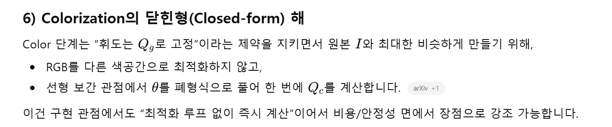

> 인용구
