## ArtCoder: An End-to-End Method for Generating Scanning-robust Stylized QR Codes 
*CVPR(2021), 19 citation, State Key Lab of VR Technology and System, School of Computer Science and Engineering, Beihang University, Review Data: 2026.01.16*

[Intro](#intro) 
[Related Work](#related-work) 
[Method](#method) 
[Experiment](#experiment) 
[Conclusion](#conclusion) 

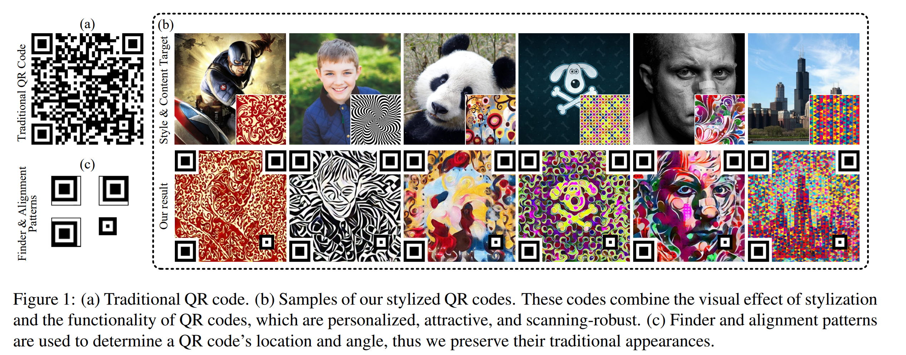

> Core Idea

<strong>"test1"</strong> 

***

### <strong>Intro</strong>

$\textbf{이 주제의 정의 및 요구사항과 중요한 이유}$

- QR code는 2차원 코드로, 전세계에서 사용되는 코드 중 하나이다. 
- 전통적인 QR code는 balck-and-white module의 랜덤 조합으로 나타나지만 visual semantics와 aesthetic elements가 부족하다. QR code의 외관을 아름답게 만드는 최근 work에 영감을 받았다.
- 하지만, 이러한 work들은 고정된 알고리즘을 적용하고 pre-defined style로만 생성이 가능하다.

$\textbf{이 주제의 문제점과 기존의 노력들}$

- Xu et al.은 NST (Neural Style Transfer)로 먼저 style을 입히고 그 과정에서 발생한 모든 error module을 post-processing algorithm으로 고쳤다. 
    - 이는 stylized QR code를 제공할 수는 있지만 repaired module을 보면 전체적인 이미지와 어울리지는 않는다. (h)-top

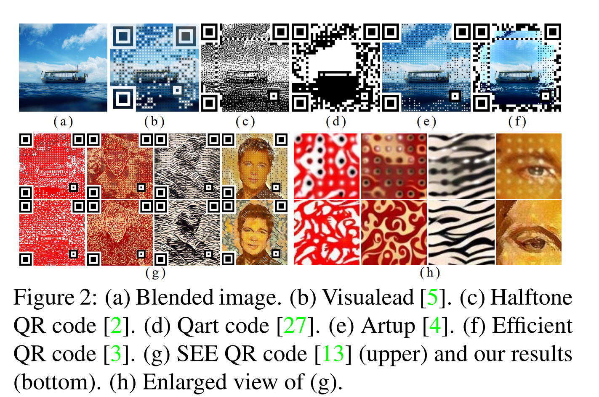

$\textbf{최근 노력들과 여전히 남아있는 문제들}$

$\textbf{본 논문에서 해결하고자 하는 문제와 어떻게 해결하는지, 그 결과들}$

- 본 논문에서는 Neural Style Transfer technique을 결합하여 ArtCoder라는 개인화되고, 다양하고, 흥미를 이끄는 동시에 scanning-robust한 stylized QR code를 생성한다.
    - 생성된 이미지의 인식 강건성을 보장하기 위해 **Sampling-Simulation layer, a module-based code loss** 를 제안한다. 

- 이전의 Xu et al.과는 다르게 ArtCoder는 end-to-end method이다. 
    - Scanning robustness와 visual quality를 향상시키기 위해 본 논문은 3가지 향상점을 제안한다. 
    1. Conv layer와 QR code reader의 sampling process 사이의 관계를 분석하고 Sampling-Simulation (SS) layer를 제안하여 QR code의 encoding message를 추출했다.
    3. Stylized Qr code의 scanning-robustness를 조절하기 위해 module-based code loss를 제안했다. 
    3. 성능을 향상시키기 위해 visual quality와 scanning-robustness사이의 competition mechanism을 제안했다. 

***

### <strong>Related Work</strong>

- Neural style transfer 

- Aesthetic QR code
    - Module-deformation
        - 모듈 변형 기반 방법의 핵심 아이디어는 먼저 정사각형 모듈 영역을 변형하고 줄인 다음, 그로 인해 비워진(확보된) 영역에 이미지를 삽입하는 것이다. 대표적인 연구로는 Visualead와 Halftone QR codes가 있다.
        - **Visualead**는 모듈을 변형하면서도 **모듈과 혼합 이미지 사이의 대비(contrast)**를 유지함으로써 QR 코드를 미적으로 개선한다(그림 (b)).
        - **Halftone QR codes**는 각 모듈을 3×3 서브모듈로 분할하되 중앙 서브모듈의 색상은 유지하고, 나머지 서브모듈은 혼합 이미지의 **하프톤 맵(halftone map)**에 맞추어 조정한다(그림 (c)).
    - Module-reshuffle
        - 최근의 모듈 재배치 기반 방법들은, 가우스-조던 소거(Gauss-Jordan Elimination) 절차를 이용해 모듈 위치를 재배치하여 혼합 이미지의 특징을 만족시킬 수 있다고 제안한 선행 연구인 Qart code에서 영감을 받았다(그림 (d)). 
        - 이후 QR 코드의 시각적 품질을 높이기 위해, 후속 연구들은 서로 다른 이미지 특징을 활용하여 모듈을 재배치하는 다양한 전략을 설계했다. 예를 들어 관심 영역(region of interest), 중앙 시각적 두드러짐(central saliency) (ART-UP), 전역 회색값(global gray values) 등을 이용한다.
    - NST-based method 
        - Xu 등은 처음으로 NST(Neural Style Transfer, 신경 스타일 전이) 기법을 도입하여 스타일이 적용된 QR 코드를 생성하고, 개인화 가능하면서도 기계 판독 가능한 SEE(Stylized aEsthEtic) QR 코드(그림 (g) 상단 행)를 제안했다. 이 방법은 스타일 전이가 **스캔 견고성(scanning-robustness)** 을 저해할 수 있다는 문제를 다루지만, 스타일링으로 인해 발생한 **오류 모듈(error modules)** 은 후처리 알고리즘으로 복구한다. 다만 이 후처리 과정에서 생성되는 모듈은 전체 이미지와 자연스럽게 잘 융합되지 못하는 ‘거슬리는(distracting)’ 모듈이 될 수 있다(그림 (h) 상단 행).

***

### <strong>Method</strong>

- Overview
    - Stylized QR code $Q$를 만드는 것은 Style image $I_s$, content image $I_c$, message $M$을 입력으로 하는 어떠한 function으로 볼 수 있다. 
        - $Q = \Psi(I_s, I_c, M)$
    - Style feature와 semantic content와 scannability를 결합하는 꼴이다. 

$$ \mathcal{L} = \lambda_1 \mathcal{L}_{style}(I_s, Q) + \lambda_2\mathcal{L}_{content}(I_c, Q) + \lambda_3 \mathcal{L}_{code}(M,Q) $$

- Style과 content의 feature는 VGG-19에 의해 추출된다. 
- QR code feature는 논문에서 제안한 Sampling-Simulation (SS) layer로 추출된다. 
    - 각 optimization iteration마다, stylized result $Q$는 각 module이 error인지 correct인지 판별하기 위해 가상의 QR code reader $\mathcal{R}_{QR}$ 으로 인식한다. 
    - $k$ 번째 module인 $M_k$가 error/correct 라면, $k$ 번째 module에 해당하는 손실함수인 $\mathcal{L}_{code}^{M_k}$ 를 activate/inactivate시키기 위해 activation map $\mathcal{K}$를 조절한다. 

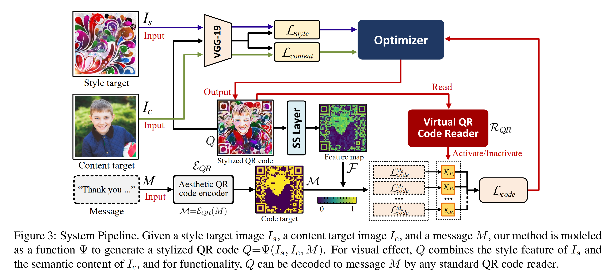

$\textbf{Losses of style and content}$

- Style loss $\mathcal{L}_{style}$과 content loss $\mathcal{L}_{content}$는 이 연구에서 중요한 요점은 아니다. 따라서 기존 문헌의 방법을 그대로 사용한다. 
    - Style은 gram matrix를 사용
    - $Q$를 optimization한다. 

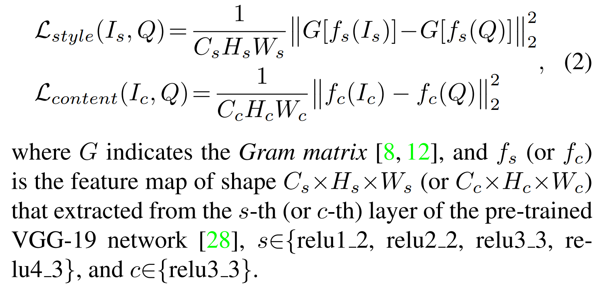

$\textbf{Sampling-Simulation layer}$

- **Sampling of QR codes**
    - QR decoding: zxing
        - QR 코드를 디코딩할 때, 가장 널리 쓰이는 프로젝트인 Google ZXing에서는 QR 코드 리더가 QR 코드의 각 모듈(module)에서 중심 픽셀(center pixel)만 샘플링한 뒤, 그 픽셀들을 이진화(binarize) 해서 디코딩한다고 본다.
        - 즉, 원래의 정사각형 모듈들을 더 작은 동심(동심원/동심 정사각형 형태의) 모듈들로 모두 교체하더라도 QR 코드는 여전히 읽힐 수 있다.
        - 한편, 정확한 픽셀이 샘플링될 확률은 고정값이 아니며, 스마트폰으로 QR 코드를 스캔할 때의 외부 요인(예: 카메라 해상도, 스캔 거리) 때문에 모듈 크기에 비례해 달라진다. 이를 이론화하기 위해, ART-UP에서는 모듈 중심에 가까운 픽셀일수록 샘플링될 확률이 더 높고, 그 확률이 가우시안 분포 $G$를 따른다고 제안한다.

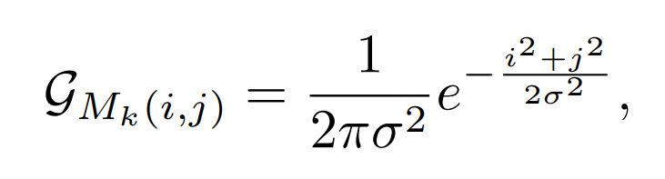

- **Sampling Simulation**
    - QR 코드 리더의 샘플링 과정을 컨볼루션(convolution) 레이어로 모사한다면, 손실의 역전파(back propagation)를 통해 QR 코드의 강인성(robustness) 을 제어할 수 있다. 이를 위해, 우리는 컨볼루션과 샘플링 사이의 관계를 분석하고, 나아가 Sampling-Simulation(SS) 컨볼루션 레이어 $l_{ss}$를 설계한다. 
    - 그림에 보인 것처럼, $a \times a$ 크기의 모듈로 이루어진 $m\times m$ 모듈 격자 형태의 스타일 QR code $Q$에 대해 $l_{ss}$는 커널 크기 $a$, stride $a$, padding $0$을 사용하도록 설계되며, 커널 가중치는 가우시안 가중치를 따르도록 고정된다. $Q$를 $l_{ss}$에 입력하면, 커널은 $Q$의 각 모듈에 대해 정확히 한 번씩 컨볼루션을 수행하고, $m \times m$ 크기의 특징 맵 $F = l_{ss}(Q)$를 출력한다. 이 $F$는 $Q$의 sampling 결과이다. 
    - 즉, 이 각 모듈을 sampling한 결과값이 $F_{M_k}$ 값이 실제 모듈의 값과 동일해야 한다.

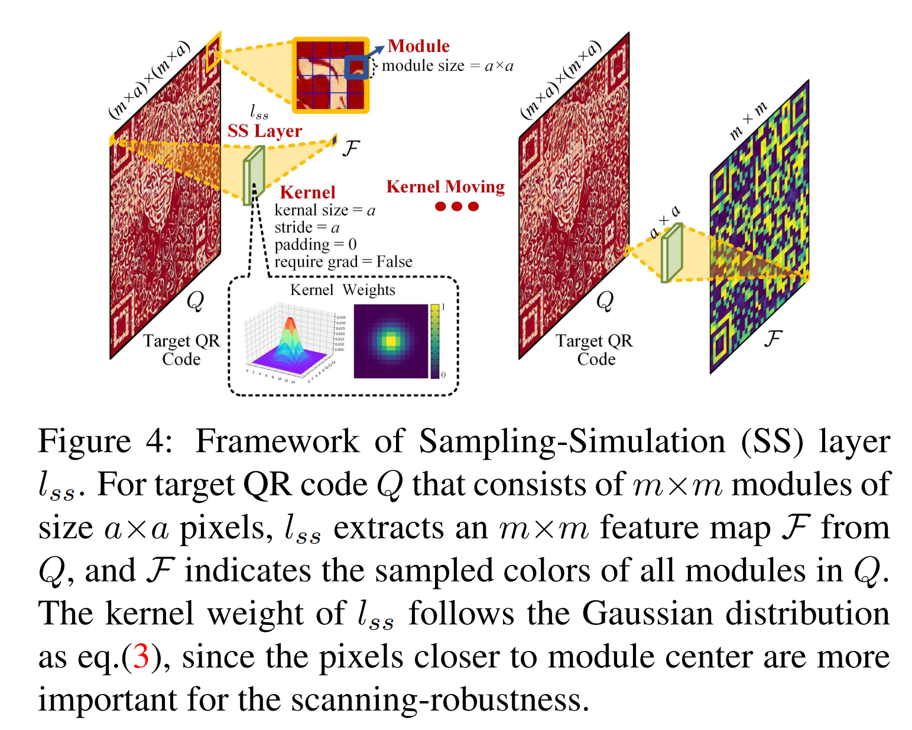

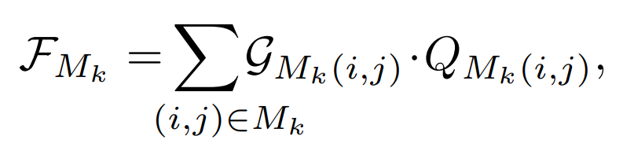

$\textbf{Code loss and competition mechanism}$

- Code loss 
    - Stylized QR code $Q$의 module 단위로 loss를 계산한다. 

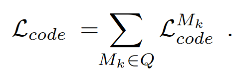

- 각 QR module에 대해서 실제 값과 다르면 loss를 적용한다.
    - Activation map $\mathcal{K}$는 stylized QR code를 virtual QR code reader에 통과시켜서, 무슨 값으로 인식되는지에 대한 결과 값이다. 
    - 즉, 지금 생성중인 QR code를 QR code reader로 인식시켰을 때의 값과 실제 QR module 값과 동일하다면 손실 계산을 하지 않고, 다르면 계산한다. 

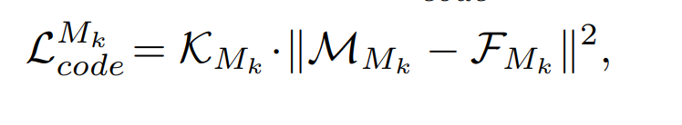

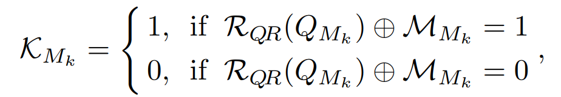

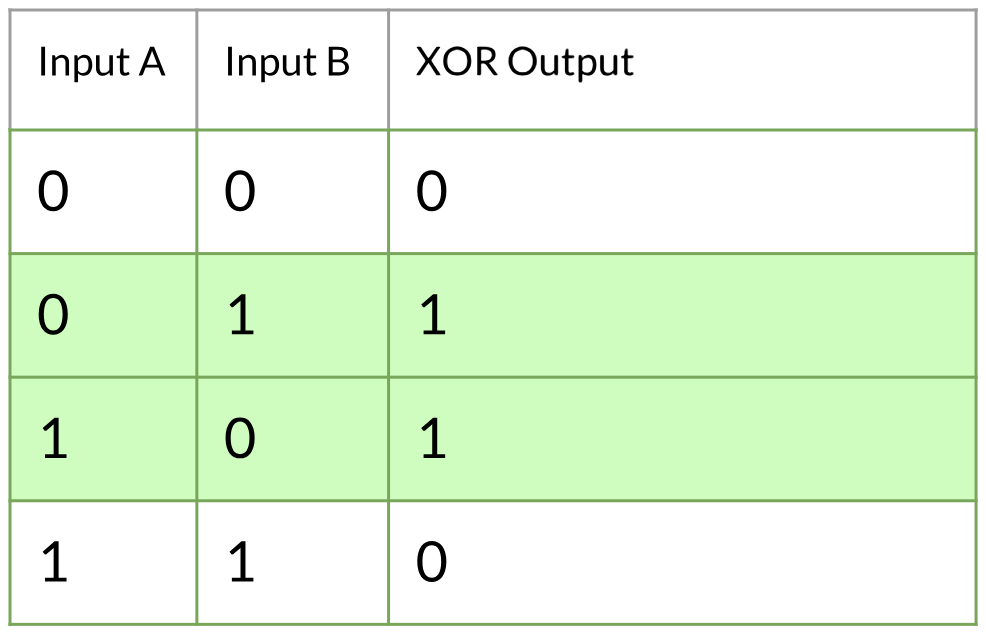

$\textbf{Virtual QR Code Reader}$

- QR code reader는 각 모듈이 정확한지 여부를 판별하도록 설계된다. 
    - 여기서 각 module을 이진화하기 위해 사용되는 가상 임계값은 $\tau$ 이다. 
    - 이 가상 임계값이 실제 임계값의 거리가 강건성과 비례한다. 즉, visual quality와 robustness간의 trade-off가 있다.  

***

### <strong>Experiment</strong>

- Setting
    - 모든 QR code는 27-inch, 144Hz, $2840\times2160$ IPS-panel monitor screen에 표시된다. 
    - MSCOCO로 학습된 VGG-19로 feature map이 추출되어 style and content loss에 사용된다. 
    - Adam optimizer
    - $\lambda_1 = 10^15, \lambda_2=10^6, \lambda_3=10^20$
    - LR = $0.001$, $\eta = 0.6$
    - QR version 5, $592 \times 592$ ($37\times 37$ modules, each module of size $16\times16$)

***

### <strong>Conclusion</strong>

1. Style, Content, QR image가 주어진다.
2. QR code image는 기존의 ART-UP과 같은 module-reshuffle method를 사용해서 content image와 비슷한 layout을 갖는 QR code로 변환시킨다. 
3. 우리가 optimization을 할 대상은 stylized QR code이다. 
4. Style + Content loss는 전통적인 style transfer method인 VGG network의 feature map을 이용한 Gram matrix for style와 feature map for content 의 거리를 사용한다.
5. Optimized QR code (stylized QR code)는 module size (a)만큼의 kernel size와 stride를 갖는 kernel로 conv layer를 만들어서 각 stylized QR module에 대해, 그 모듈이 무슨 값으로 인식될지를 계산한다. $m \times m$ 만큼의 크기를 지니는 feature map이다. 
6. Optimized QR code의 각 module이 어떤 값으로 인식될지를 나타내는 feature map을 구했으니, 실제 QR module 값과의 차이를 손실함수로 설정해서 실제 QR code module 값과 동일하도록 가이드한다.
7. 이때, Opitmized QR module을 virtual QR code reader에 통과시켜서 실제 QR module 값과 동일하면 제외한다. 

***

### <strong>Question</strong>

<a href="">link</a>

> 인용구
