## Common Diffusion Noise Schedules and Sample Steps are Flawed
*WACV(2024), 83 citation, Chinese, Review Data: 2024.07.25*

[Intro](#intro)</br>
[Related Work](#related-work)</br>
[Method](#method)</br>
[Experiment](#experiment)</br>
[Conclusion](#conclusion)</br>

<p align="center">
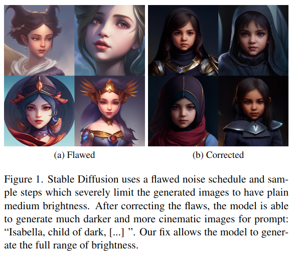
</p>

> Core Idea
<div align=center>
<strong>"SNR set to 0, rescale CFG, v loss, edit sampler"</strong></br>
</div>

<a href='https://github.com/Max-We/sf-zero-signal-to-noise/blob/main/common_diffusion_noise_schedulers_are_flawed.ipynb'>Implementation Code</a>

***

### <strong>Intro</strong>

$\textbf{이 주제의 문제점과 기존의 노력들}$

1. Noise schedules
   1. Clean data에서 noise를 $T$까지 추가해 pure Gaussian noise를 만든다는 것이 가정인데, 실제로 다른 model들에서 이를 만족하지 않는다.
   2. Signal-to-Noise ratio를 측정하여 이를 보여줬다. $0$이어야 만족
   3. Inference 시에는 pure Gaussian noise로부터 denoising을 하니, 결국 학습과 추론 간의 불일치가 발생한다.
2. Sampler
   1. 최근의 sampler들로 인해, $T$을 모두 거치지 않고 일부 time step만으로 fast sampling이 가능해졌다.
   2. 하지만 이 sampler들의 구현을 보면, $T$부터 denoising을 하지 않는다. 
      1. 예시로, <a href='ldm/modules/diffusionmodules/util.py'>SD ddim sampling step code</a> 에서 'make_ddim_timesteps'를 보면 $T$는 없다. 
      2. Pure Gaussian noise가 model의 입력으로 들어갈 때, $t=T$가 아니라 $t=T-20$이 model의 condition으로 들어가는 것이다. 
      3. 이는 model이 pure Gaussian noise를 입력으로 받아도 pure Gaussian noise로 생각하지 않고 처리한다는 얘기가 된다. 

```
def make_ddim_timesteps(ddim_discr_method, num_ddim_timesteps, num_ddpm_timesteps, verbose=True):
    if ddim_discr_method == 'uniform':
        c = num_ddpm_timesteps // num_ddim_timesteps
        ddim_timesteps = np.asarray(list(range(0, num_ddpm_timesteps, c)))
```

$\textbf{본 논문에서 해결하고자 하는 문제와 어떻게 해결하는지, 그 결과들}$

1. $T$에서의 SNR을 $0$으로 만들기위해, noise schedule을 rescale한다. 
2. v-prediction & v-loss로 training
3. Sampler가 항상 $T$부터 시작하도록 수정한다. 
4. Over-exposure (값의 범위를 벗어나서 나중에 clip할 때 흑백이 되거나 흰색으로만 구성됨)를 방지하기 위해 CFG rescale을 제안한다. 

이로 인해, (1) FID 및 IS 성능이 증가, (2) medium brightness만 생성되는 것이 아닌, full range of brightness를 생성할 수 있게 됐다. 

$\textbf{본 논문의 주요 기여점}$

***

### <strong>Related Work</strong>


***

### <strong>Method</strong>

1. $T$에서의 SNR을 $0$으로 만들기위해, noise schedule을 rescale한다. 

- Data에 noise를 더하는 수식과 이를 통해 얻는 SNR

<p align="center">
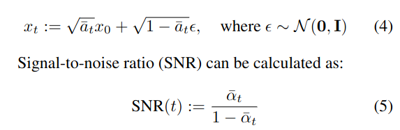
</p>

- 기존 model들의 noise scheduling과 SNR 측정

<p align="center">
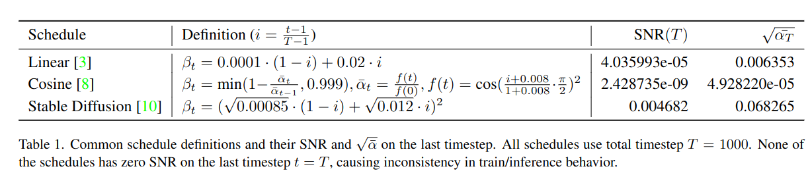
</p>

- SD에 실제 대입해보면 $T$에서도 original data의 low frequency information이 남아있다. 
  - E.g., overall mean of each chan

<p align="center">
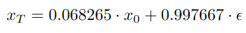
</p>

- 본 논문에서 제안한 방법을 쓰면 SNR을 $0$으로 보낼 수 있다. 

<p align="center">
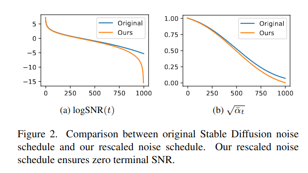
</p>

- SNR을 $0$으로 보낼 껀데, $\sqrt{\bar \alpha_t}$의 값을 조정할 거다. $t=1$일때의 값은 유지, $t=T$일때의 값은 $0$으로 만들어서 $T$에서의 SNR이 $0$을 만족하게 한다.
  - 나머지 값들은 linearly rescaling
  - 이 방법은 non-cosine schedule에만 적용 가능. 

2. v-prediction & v-loss로 training
   1. SNR에 민감하게 반응하지 않는다. 

- $\lambda_t = 1$이면 eps prediction loss와 유사한 성능을 보인다. 
  - 논문에서는 $1$로 했는데 유기적으로 조정하는 것을 추천함 

<p align="center">
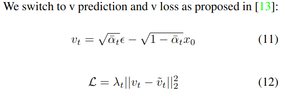
</p>

- $T$에서 SNR을 $0$으로 만들었기 때문에, 식을 수정해야 한다. 
  - 먼저 DDPM에 대한 수식 수정
  - (17): (11)을 이용해서 $v$를 풀면, 동일함을 보일 수 있다. 
  - (18): $\sqrt{\bar \alpha_t}|_{t=T}$ 가 $0$이므로 zero division error가 발생한다. 따라서 (20)으로 대체 
  - (19): (20)을 구하려면 (19)를 알아야 하는데 이는, (11) 수식에서 $x_0$에 대해서 표현한 뒤, $\epsilon$에 (17) 수식을 넣으면 구할 수 있다. 
  - 그 후, DDIM sampling의 경우 다음과 같이 수정한다. 
    - 모델 output이 $v$이므로 다시 $\epsilon$으로 구해서 predicted $x_0$를 구하면 된다. 
    - $\epsilon$은 (17) 수식으로 구하고 
    - Predicted $x_0$는 (19) 수식으로 구한 뒤, (21) 수식을 통해 최종적으로 denoising한다.

<p align="center">
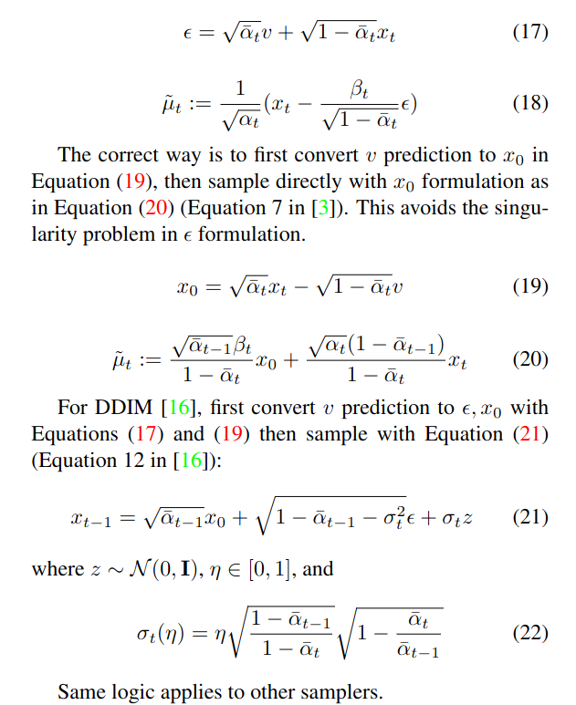
</p>


3. Sampler가 항상 $T$부터 시작하도록 수정한다. 

- 기존의 DDIM 및 PNDM은 $T$를 포함하지 않는다. 따라서 Linspace/Trailing으로 바꿔주면 됨

<p align="center">
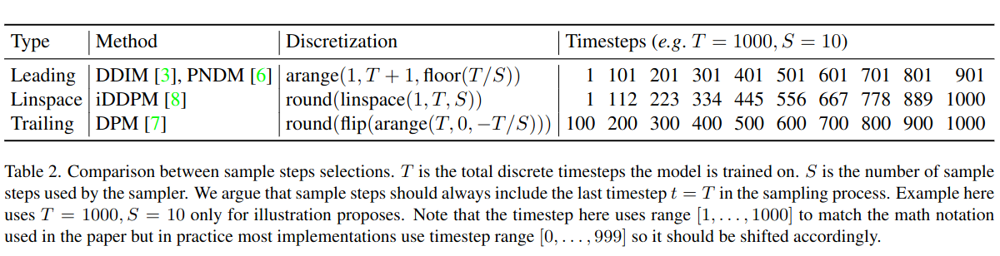
</p>


4. Over-exposure (값의 범위를 벗어나서 나중에 clip할 때 흑백이 되거나 흰색으로만 구성됨)를 방지하기 위해 CFG rescale을 제안한다. 

- Over-exposure의 예시 from Imagen
  - (a)가 예시이다.
  - Imagen에서는 dynamic thresholding으로 완화했지만, 이 방법은 latent space가 아닌 pixel-space에서 적용가능한 방법이다. 
  
<p align="center">
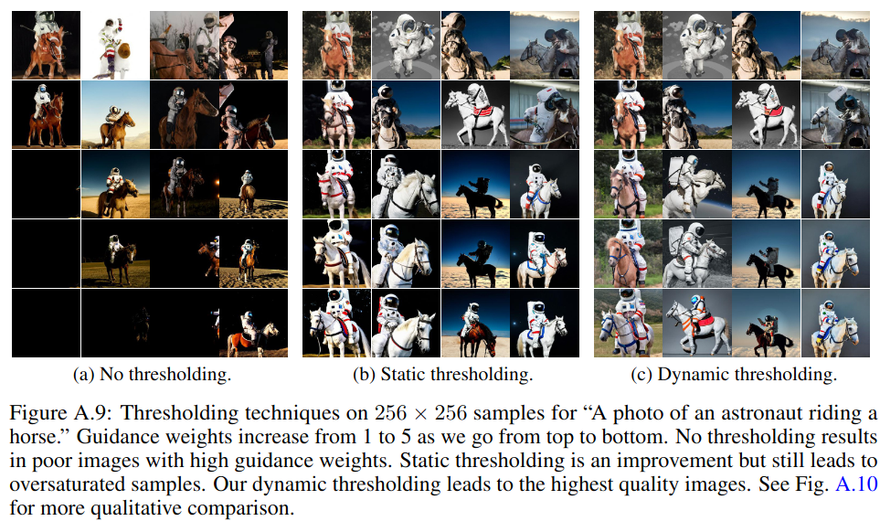
</p>

<p align="center">
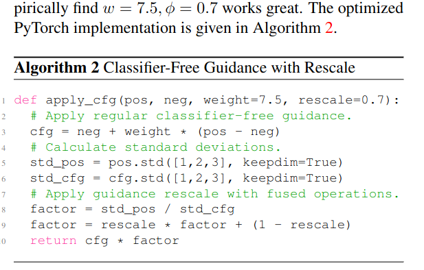
</p>

<p align="center">
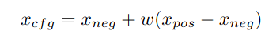
</p>

<p align="center">
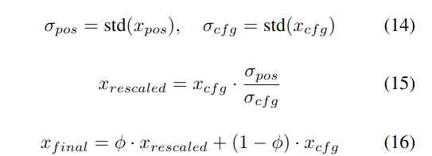
</p>


$\textbf{Implementation}$

- 실제 구현에서는 time step이 $[1,1000]$가 아니라 $[0,999]$에서 uniform하게 sampling 한 후에, DDPM으로 학습을 진행한다. 
- 즉, 수식으로 보면 $x_0$가 처음 step의 이미지가 아니라 $x_{-1}$이 처음 step에서의 이미지 (clean image)라고 볼 수 있다. 
- 모델은 $t=0$부터 $t=999$까지 조건으로 받으면서 학습이 되는 꼴이고, sampling할 때에는 마지막에 모델이 $t=0$을 받고 $\epsilon$이나 $v$를 예측함으로써 그 값을 가지고 $x_{-1}$을 예측하게 된다.
- 그리고, DDIM code에서 논문과는 다르게 pred $x_0$를 return하지 않는데, 그 이유는 $\bar \alpha_0 = 1$로 setting을 해주면서 결국 $x_{t-1}$과 pred $x_0$가 동일하게 되기 때문이다. 

***

### <strong>Experiment</strong>

<p align="center">
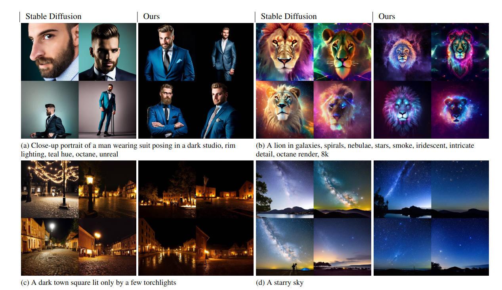
</p>

<p align="center">
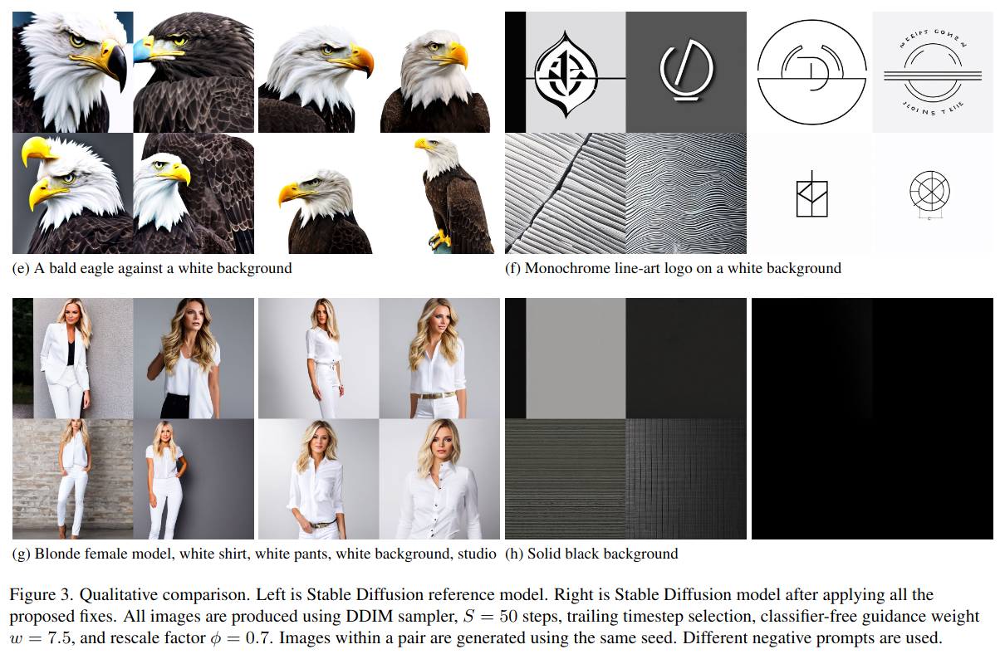
</p>

<p align="center">
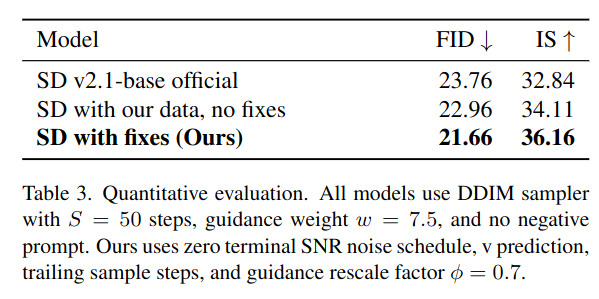
</p>

- Sampler는 Trailing으로 하면 적은 sampling step으로도 좋은 결과를 얻는다. 
  - $t=1$에 가까울수록

<p align="center">
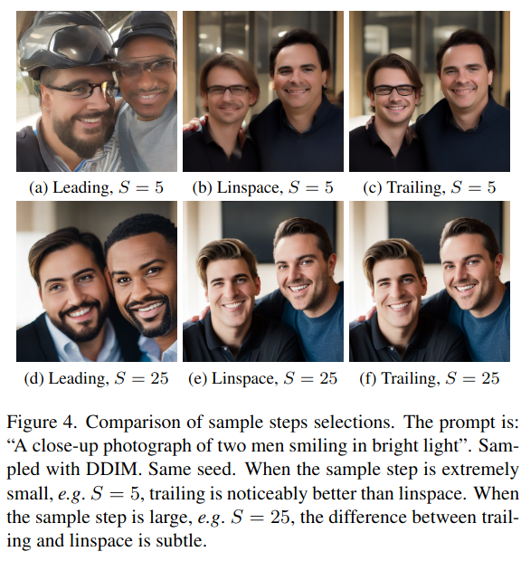
</p>


***

### <strong>Conclusion</strong>


***

### <strong>Question</strong>


<a href="">link</a>


> 인용구
