## FAM Diffusion: Frequency and Attention Modulation for High Resolution Image Generation with Stable Diffusion 
*CVPR(2025), 2 citation, Samsung AI Center-Cambridge-UK, University of Surrey-UK, Review Data: 2025.12.09*

[Intro](#intro) 
[Related Work](#related-work) 
[Method](#method) 
[Experiment](#experiment) 
[Conclusion](#conclusion) 

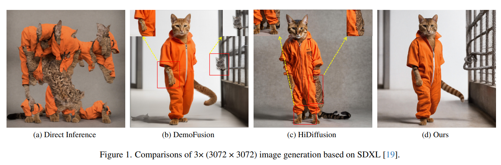

> Core Idea

<strong>"test1"</strong> 

***

### <strong>Intro</strong>

$\textbf{이 주제의 정의 및 요구사항과 중요한 이유}$

- Inference at Scaled-Resolution with Diffusion Model 
    - Diffusion model은 high-quality image 생성에 뛰어나다. 초기에는 $256 \times 256$ 이었지만, 점차 $512 \times 512$ SD v1.5, $1024 \times 1024$ SDXL까지 생성이 가능해졌다. 하지만 오직 학습 중에 사용된 resolution (해상도)에 대해서만 생성할 때만 효과적이다. 

$\textbf{이 주제의 문제점과 기존의 노력들}$

- 배율이 조정된 해상도 (e.g., 4K)에 대해서 추론을 하면 반복적인 패턴과 구조적인 왜곡을 초래한다. 
- 이를 해결하기 위해 더 높은 해상도에서 재학습을 하는 것은 엄청난 cost를 요구한다. 
- 따라서 pre-exisiting diffusion model이 flexible test-time resolution이 가능하게 하는 것은 중요하다. 

$\textbf{최근 노력들과 여전히 남아있는 문제들}$

- $2$ 가지 track으로 나눌 수 가 있다.
- Native resolution (원래 훈련된 해상도)에서 생성된 이미지를 기반으로 고해상도 이미지를 유도 (b)
    - 전역적 구조 (global structure) 일관성을 향상시키는 것을 목표로 한다. 
    - 하지만, 세세부 디테일 quality 저하, local texture 불일치, 객체 반복 문제가 지속된다. 
    - 패치 기반 (patch-based) 방식으로 이미지를 작은 패치 단위로 나누어 생성한다: 중복 및 겹치는 forward pass로 인해 처리 속도가 느리고 높은 지연 (latency overhead)가 발생한다. 

- 패치 분할 없이 한 번에 전체 이미지를 생성하는 one-pass 전략 (c)
    - UNet 등 모델 구조를 직접 변경하여 빠른 생성을 추구
    - 속도는 빠르지만 이미지 품질 및 구조 왜곡 문제가 발생한다. 

- 이전 연구들은 빈번한 artifact를 겪고 있고 종종 large latency overhead (추가적인 지연 시간)를 초래한다. 

$\textbf{본 논문에서 해결하고자 하는 문제와 어떻게 해결하는지, 그 결과들}$

- 본 논문은 위의 $2$ 가지 방식을 절충하여, native resolution image를 기반으로 생성 가이드를 하면서도 패치 기반이 아닌 단일 패스로 처리해 속도와 품질을 동시에 잡는 방법을 제안한다.  
- 본 논문에서는 $2$ 가지 간단한 module을 통해 이러한 문제를 해결한다. 
    - 반복적인 패턴 (e.g., object repetition) 및 구조적인 왜곡 (e.g., unrealistic local patterns)
    - Local artifacts 
    - Latency overhead 

- Frequency Modulation (FM): global structure consistency를 향상시키기 위해 Fourier domain을 활용한다. 
- Attention Modulation (AM): 이전 연구에서 간과된 local texture pattern의 consistency를 향상시킨다. 
- 해당 방법론들은 model-agnostic 하면서 어떠한 추가 학습도 없다. 

***

### <strong>Related Work</strong>

- 초기 연구에서는 겹치는 패치를 사용해서 원본 해상도의 이미지 조각들을 생성 후, 결합해 연결하는 방식을 제안했음. 하지만 이 방식은 패턴 반복 및 전역 구조 불일치 문제가 자주 발생.

- MultiDiffusion: 겹치는 패치를 각각 diffusion model에 통과시켜서 생성 

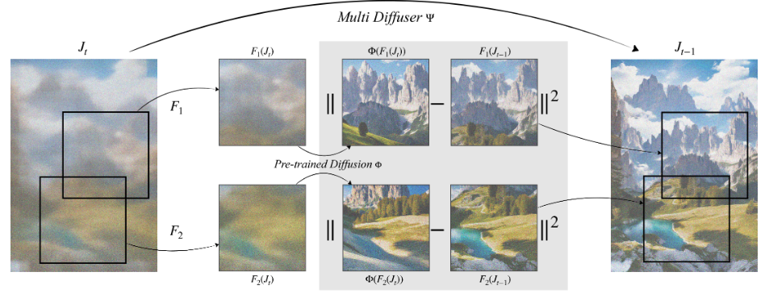

- 이를 개선하려는 방법들이 등장했는데, 예를 들어 DemoFusion은 패치 단위 생성에 skip residual, 점진적 업샘플링 같은 메커니즘을 도입해 구조적 일관성을 유지하려 시도함.

- DemoFusion: unscaled image와의 interpolation을 진행하고 있다. 

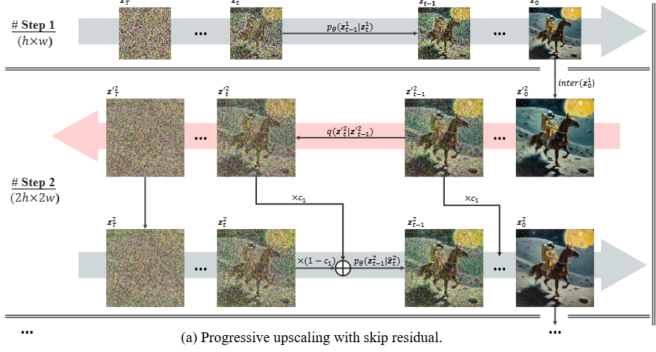

- AccDiffusion는 지역화된 프롬프트를 이용해 네이티브 해상도 이미지와 고해상도 이미지 간의 일관성을 강화.
- 그러나 이러한 패치 기반 방법들은 여전히 국소 패턴 반복 문제와 전역적 일관성 문제를 완전히 해결하지 못했고, 여러 번의 백워드 패스가 필요해 계산 비용과 지연이 큼.

- 지연 문제를 줄이기 위해 UNet 아키텍처를 변경해 한 번에 고해상도 이미지를 생성하는 방법도 있음.
- ScaleCrafter는 dilated convolution으로 수용 영역을 조절.
- HiDiffusion은 denoising 과정 중에 특징 맵 크기를 동적으로 조정.

- HiDiffusion

- 그러나 아키텍처 변경 방식은 더 빠르긴 하지만 이미지 왜곡이 발생하는 단점이 있음.

***

### <strong>Method</strong>

- Notation
    - $s$: scaling factor
    - $m$: $sh \times sw$
    - $n$: $h \times w$
    - $\mathbf{z}_0^{n} \in \mathbb{R}^{c \times h \times w}$: low resolution image
    - $\mathbf{z}_0^{m} \in \mathbb{R}^{c \times sh \times sw}$: high resolution image

$\textbf{Frequency-Modulated Denoising (FM)}$

- Train & Test

$$ q(\mathbf{z}_t | \mathbf{z}_{t-1}) := \mathcal{N}(\mathbf{z}_t | \sqrt{1 - \beta_t} \mathbf{z}_{t-1}, \beta_t \mathbf{I}) $$

$$ p_\theta (z_{t-1} | z_t) := \mathcal{N} (z_{t-1} | \mu_\theta (z_t, t), \Sigma_\theta (z_t, t)) $$

- Naive approach: start from random noiseat the target resolution
    - Frequent artifacts and object duplication - (a)

$$ \mathbf{z}_T^{m} \sim \mathcal{N}(0,I) \in \mathbb{R}^{c \times sh \times sw} $$

- DemoFusion: improve global consistency
    - Start from the output of the denoising process at native resolution $\tilde{\mathbf{z}}_0^m = \mathcal{U}(\mathbf{z}_0^n, s)$
    - $\mathcal{U}$: upsampling function 
    - We can get the noisy latents using $\tilde{\mathbf{z}}_{t=1...T}^{m}$ forward process
    - $f_t$: 노이즈 제거 과정을 조향하고 고해상도와 저해상도 이미지 간의 일관성을 개선하는 역할을 담당
        - DemoFusion에서는 단순 가중 선형 조합 (simple weighted linear combination)으로 정의된다. (Skip residual)

$$ p_\theta (\mathbf{z}_{t-1}^m | f_t(\tilde{\mathbf{z}}_t^m, \mathbf{z}_t^m)) $$

- Skip residual은 global structure 보존에는 효과적이나 high-resoltuion noisy latent에 무차별적으로 정보를 전달하여 세밀한 질감이나 고주파 디테일 생성에는 부정적 영향을 줄 수 잇다. 
    - 따라서 주파수 필터 $\mathcal{K}(t)$를 사용하여 고주파 성분은 고해상도 노이즈 제거 과정에서 자유롭게 생성하고, 저주파 성분만 저해상도 확산에서 선택적으로 받아들이도록한다. 

$$ f_t(\tilde{z}_t^m, z_t^m) = \mathit{IDFT}_{2D} \left( K(t) \odot \mathit{DFT}_{2D}(z_t^m) + (1 - K(t)) \odot \mathit{DFT}_{2D}(\tilde{z}_t^m) \right), $$

- 이때, 실제 구현에서는 high-dim Fourier 변환을 매번 하기에는 비용이 크기에, 아래 수식처럼 공간 도메인의 convolution 형태로 구현하여 빠른 CNN 연산으로 처리한다. 

$$ f_t (\tilde{z}_t^m, z_t^m) = z_t^m + \kappa(t) \circledast (\tilde{z}_t^m - z_t^m), $$

- FM module에서 주파수 영역에서 정의된 조작을 어떻게 시간 영역에서 수학적으로 등가적인 표현으로 바꿀 수 있었는지 확인해보자.
    - 쉽게 말해, 주파수 영역에서 처리하는 수식이 시간 영역에서는 어떤 형태의 합성곱 연산과 동일한지를 보여준다. 
    - 즉, “저주파 부분만 $\tilde{z} - z$ 로 교체되는 구조”가 공간 도메인에서의 convolution으로 나타난다.
    - 행렬 곱과 Hadamard product (원소곱)은 선형 연산이라 분배 법칙이 가능하다. 
    - Frequency domain에서의 곱셈 = 공간 domain에서의 convolution
    - 2D Discrete Fourier Transform(2D DFT)는 이미지를 주파수 도메인으로 변환하는 함수이다. 

- $\boldsymbol{Z}$: Fourier transform of $z$
    - $\boldsymbol{W}_r, \boldsymbol{W}_c$: the row- and column-wise Fourier transform matrices 

$$ \boldsymbol{Z} = (\boldsymbol{W}_r z \boldsymbol{W}_c), $$

- 주파수 영역에서의 수식 풀이

$$ \hat{\mathbf{Z}} = \mathcal{K} \odot \text{DFT}_{2D}(\mathbf{z}) + (1 - \mathcal{K}) \odot \text{DFT}_{2D}(\tilde{\mathbf{z}}) $$

$$ = \mathcal{K} \odot (\mathbf{W}_r \mathbf{z} \mathbf{W}_c) + (1 - \mathcal{K}) \odot (\mathbf{W}_r \tilde{\mathbf{z}} \mathbf{W}_c) $$

$$ = \mathbf{W}_r \mathbf{z} \mathbf{W}_c + (1 - \mathcal{K}) \odot (\mathbf{W}_r (\tilde{\mathbf{z}} - \mathbf{z}) \mathbf{W}_c) $$

- The inverse DFT of $\hat{\mathbf{Z}}$

$$ \hat{\mathbf{z}} = \text{IDFT}_{2D}(\hat{\mathbf{Z}}) $$

$$ = W_r^{-1} \left(W_r \mathbf{z} W_c + (1 - K) \odot \left(W_r (\tilde{\mathbf{z}} - \mathbf{z}) W_c\right)\right) W_c^{-1} $$

$$ = W_r^{-1} W_r \mathbf{z} W_c W_c^{-1} + W_r^{-1} \left((1 - K) \odot \left(W_r (\tilde{\mathbf{z}} - \mathbf{z}) W_c\right)\right) W_c^{-1} $$

$$ = \mathbf{z} + \left(W_r^{-1} (1 - K) W_c^{-1}\right) \circledast \left(W_r^{-1} W_r (\tilde{\mathbf{z}} - \mathbf{z}) W_c W_c^{-1}\right) $$

$$ = \mathbf{z} + k \circledast (\tilde{\mathbf{z}} - \mathbf{z}), $$

- Time-varying high-pass filter definition
    - High-pass filter를 정의할 때, 어느 정도의 low-resoltuion을 cut off 할 것인지를 정해야한다. 이를 논문에서는 time-dependent하게 정의했다.
    - $\rho$ 1에 가까우면, low-resolution의 low-frequency 정보를 적게 사용한다. 0에 가까우면 많이 주입한다.   
    - 초기에 이미지를 생성 시에는, low-frequency의 범위가 작게 정의된다. $\rho$ 가 1에 가까우므로 약하게 주입한다. 즉, 좁은 범위에 약하게 주입
    - 반대로 $t \rightarrow 0$ (denoising)으로 갈수록, low-frequency의 범위는 증가하면서 upsampled latent의 global structure 정보를 많이 주입한다. 즉, 더 넓게 (height, width가 커짐) 강하게 ($\rho$ 는 작아짐.),  반영한다. 

$$ \rho(t) = \frac{t}{T} $$

$$ \tau_h (t) = h \cdot c \cdot (1 - \rho (t)) $$

$$ \tau_w(t) = w \cdot c \cdot (1 - \rho(t)) $$

$$ K(t) = \begin{cases}
    \rho(t),  \text{if } |x - x_c| < \frac{\tau_w(t)}{2} \\
     \quad , |y - y_c| < \frac{\tau_h(t)}{2} \quad , \\
    1,  \text{otherwise}
\end{cases} $$

$\textbf{Attention Modulation (AM)}$

- FM module은 전역 구조 및 객체 중복 문제를 잘 해결하지만, 고해상도에서의 지역 구조 (e.g., 입 모양, 옷깃의 털 질감)이 훈련 시의 해상도와 달라 불일치가 나타난다. 
- 이러한 문제를 고해상도 노이즈 제거 과정에서의 self-attention map이 정확하지 않기 때문이라고 저자들은 가정했다. 

$$ \text{Att}(\mathbf{z}) = \operatorname{softmax}\left(\frac{Q \cdot K^T}{\sqrt{d}}\right) V = M \cdot V $$

$$ \bar{M}^m = \left( \lambda \cdot \mathcal{U}(M^n, s) + (1 - \lambda) \cdot M^m \right) $$

- 모든 UNet 레이어에 적용하면 과도한 규제로 성능이 저하될 수 있어, layout 정보를 잘 보존하는 up-block 계층에만 적용하는 것이 효과적이며, 특히 up block 0에서 최대 이점을 보인다. 
- 결과적으로, AM은 입이나 옷깃같은 지역적 세부의 왜곡과 불일치를 줄여 더 자연스럽고 일관된 이미지 생성이 가능하게 한다.

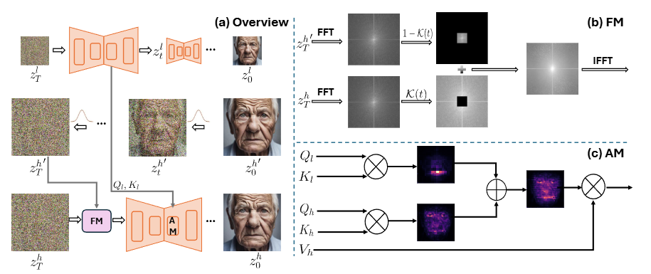

***

### <strong>Experiment</strong>

- Model: SDXL $1024 \times 1024$
- UNet 구조를 바꾸는 방법론인 HiDiffusion과도 결합하여 실험했다.
- Appendix에는 종횡비가 다르거나 다른 SD model에 대한 결과도 포함하고 잇다.
- Dataset: Laion-5B $10,000$ 개의 이미지를 무작위 sampling 및 $1,000$ 개의 text caption으로 구성된다. 
- Metric: FID, KID
    - FID는 $299 \times 299$ size로 resize해야 돼서 원본 해상도 평가에 한계가 있다. 따라서 패치 단위 평가 (FID_c, KID_c)를 위해 각 이미지에서 $10$ 개의 랜덤 패치를 추출해 계산한다.
    - Nvidia A40 GPU에서의 latency를 측정하여 비교한다. 

- Main results
    - FID_c, KID_c, CLIP 점수 모두에서 가장 우수한 성능을 보여준다.
    - Scale factor가 커질수록 FAM diffusion의 FID, KID 지표 성능 향상이 두드러진다. 
    - 낮은 scale factor에서도 DemoFusion과 비슷한 결과를 보여주며, 기본 성능에서도 안정적임을 보여준다. 
    - 성능 지표는 이미지를 낮은 해상도로 resize하여 측정하기에 미세한 디테일은 잘 반영되지 않는 한계가 있다. 
    - FAM Diffusion 을 추가해도 latency가 크게 늘지 않는다. 

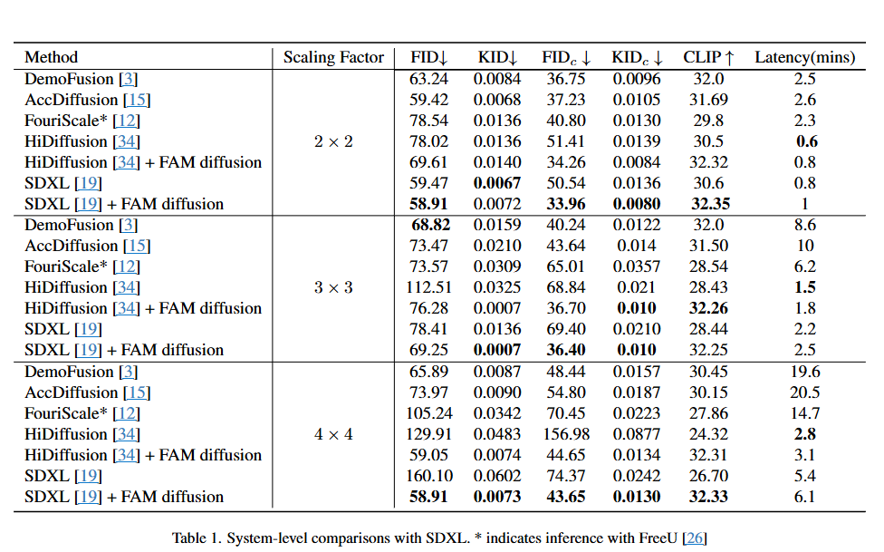

- Figure 6: DemoFusion은 패치 기반 생성 방식 때문에 반복적인 콘텐츠와 부적절한 지역 구조를 가진 아티팩트(예: 우측 상단 이미지에서 생성된 두 개의 작은 고양이 머리)를 생성하는 경향이 있습니다. FouriScale과 HiDiffusion은 시각적으로 매력적이지 않은 구조와 광범위한 불규칙 텍스처 영역을 생성하여 전반적인 시각적 품질을 크게 저하시킵니다.

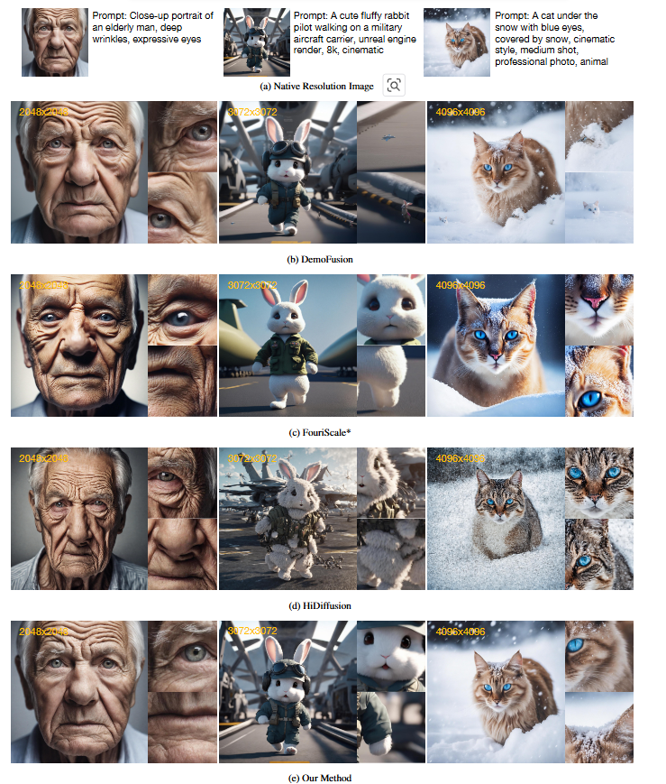

- Figure 5에서 볼 수 있듯이 초해상도 접근 방식인 BSRGAN과도 비교합니다. FAM diffusion은 원본 이미지에 존재하지 않던 고주파 디테일을 효과적으로 도입하거나 수정하면서 구조 정보를 보존하여, 더 매력적이고 상세한 이미지를 생성함을 관찰할 수 있습니다.

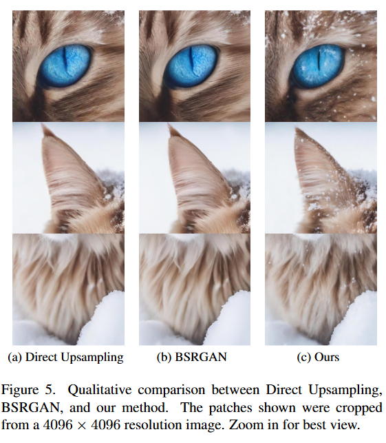

$\textbf{Ablation Study}$

- $2 \times 2$ 스케일 팩터 설정을 가진 SDXL을 사용

- Figure 3
    - (1) 무작위 노이즈로부터의 직접적인 추론과 원본 해상도의 확산된 잠재 표현으로부터의 직접적인 추론 모두 구조 왜곡과 반복 패턴을 가진 출력을 생성합니다. 
    - (2) DemoFusion의 Skip Residuals는 이미지의 전역 구조를 유지하는 데 도움이 되지만, 여전히 아티팩트와 좋지 않은 지역 패턴을 생성합니다. 
    - (3) Skip Residuals와 비교했을 때, FM은 원본 해상도의 이미지 저주파 정보를 활용하여 바람직하지 않은 지역 패턴을 줄여주며, 더 나은 구조적 가이던스를 제공합니다. 
    - (4) Attention Modulation은 원본 해상도의 attention map을 활용하여 지역 패턴과 전역 구조 간의 불일치를 해결하며, 잠재 토큰 간의 의미론적 관계에 대한 강력한 가이던스를 제공합니다. 전반적으로, FM과 AM은 고해상도 이미지에서 구조 왜곡과 지역 패턴 불일치를 효과적으로 해결하여, FAM diffusion의 의미 있는 기여를 강조합니다.

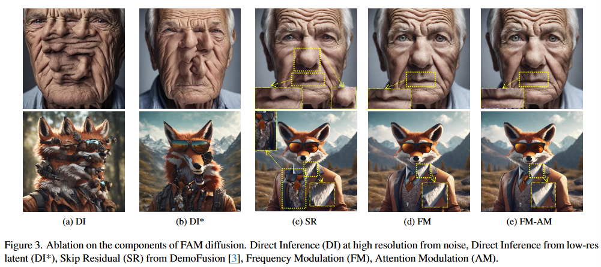

- FM 모듈에 대한 Time-aware Formulation의 효과
    - Figure 7a에 설명된 바와 같이, FM의 시간 가변(time-varying) Formulation의 효과를 보여줍니다. 구체적으로, FM 모듈은 각 스텝 t에서 해당 확산된 잠재 표현의 저주파 정보를 통합합니다. 대신, 이러한 시간 가변성을 피하고 업샘플링된 잠재 표현을 단일 정적 참조로 활용할 수 있습니다. 하지만 이 접근 방식은 이미지가 눈에 띄게 흐릿해지고 고주파 정보와 관련된 미세한 디테일을 잃게 만드는 결과를 낳으며, 이는 노이즈 제거 과정 전반에 걸쳐 FM 모듈의 동적 특성의 중요성을 강조합니다.

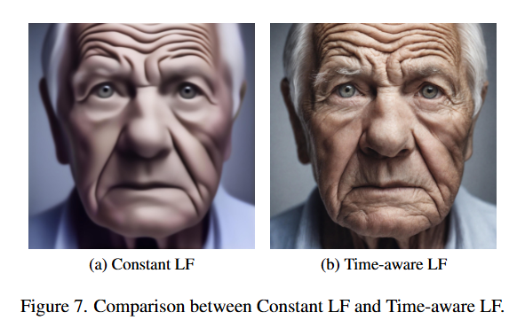

- Attention Modulation 분석
    = AM 모듈을 뒷받침하는 원리를 더 잘 이해하기 위해, Figure 4에서 쿼리로서 입 영역(별표로 표시)의 한 토큰과 키 및 값으로서 모든 토큰을 사용하여 self-attention map을 시각화합니다. 저해상도 잠재 표현을 사용하여 계산된 결과 attention map은 이미지 부분 간의 의미론적 관계에 대한 거친 정보를 주로 인코딩하지만, 얼굴 전체에 걸친 세밀한 맥락 정보는 부족합니다. 대신, 고해상도의 attention map은 더 상세하지만, 의미론적 관련성을 포착하지 못합니다(예: 입 영역이 강조되지 않음). AM을 적용한 후, attention map은 향상된 세밀한 디테일과 함께 지역-전역 관계를 효과적으로 통합합니다. 이 분석은 AM이 어떻게 지역 패턴의 불일치를 복구하여 더 일관된 전역 구조에 기여하는지에 대한 시각적 통찰력을 제공합니다.

- 다양한 SD 백본

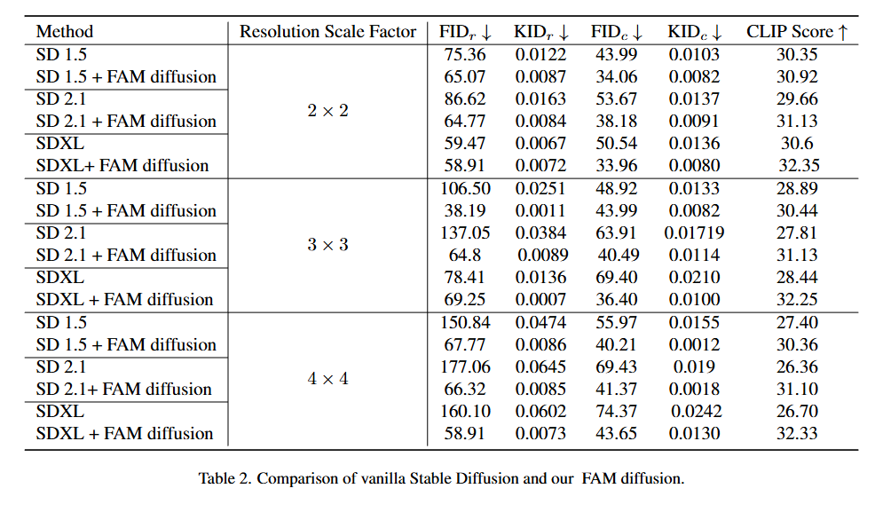

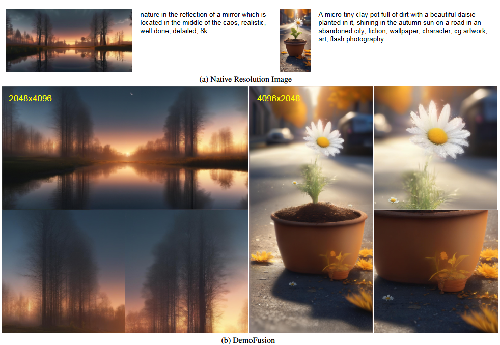

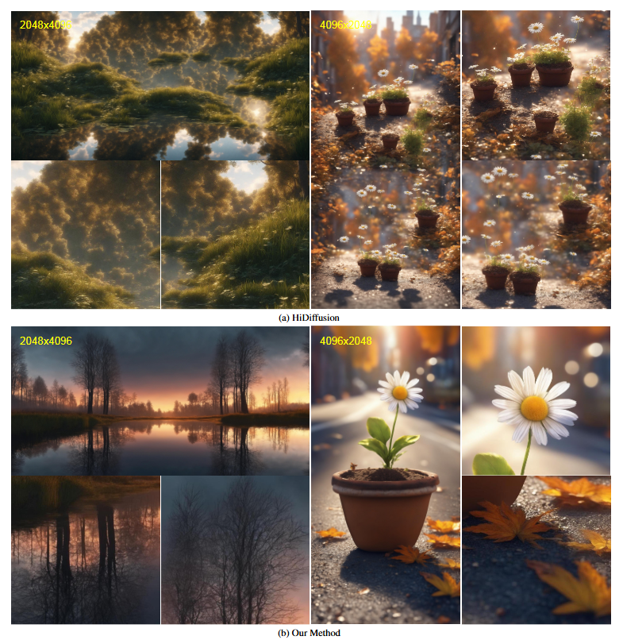

- 다양한 종횡비

***

### <strong>Conclusion</strong>

***

### <strong>Question</strong>

<a href="">link</a>

> 인용구