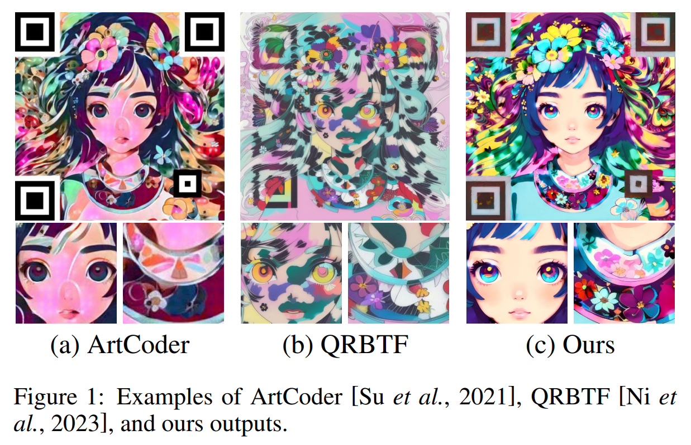
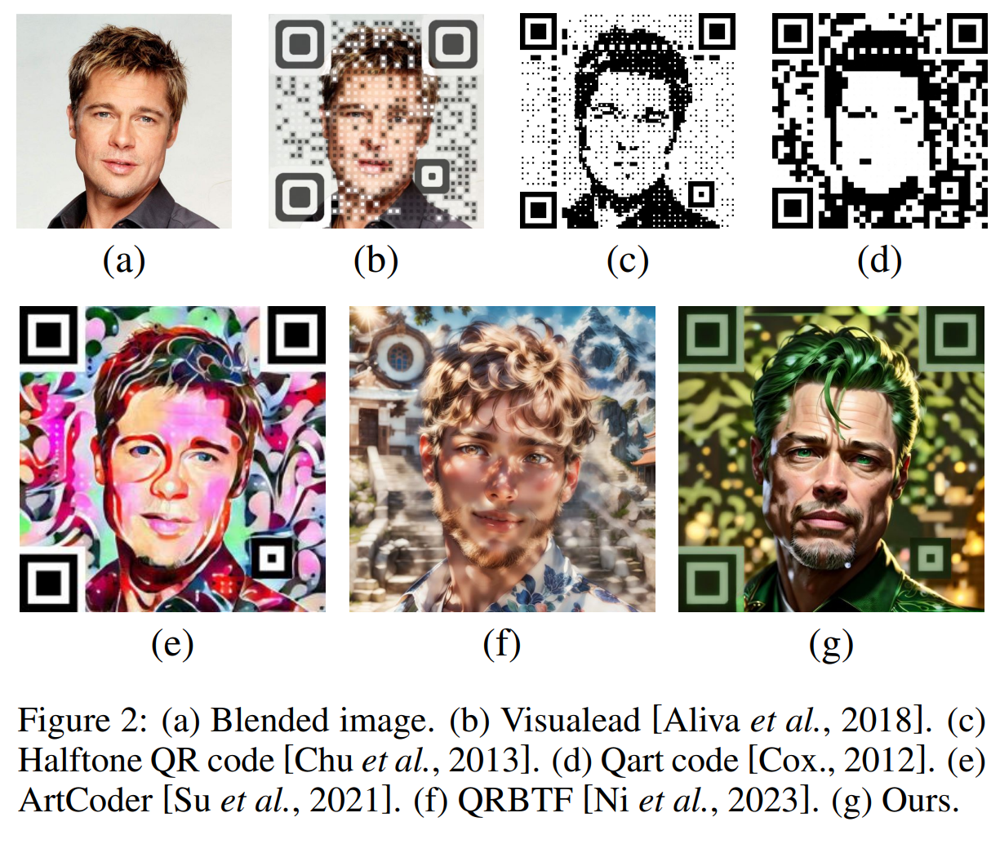
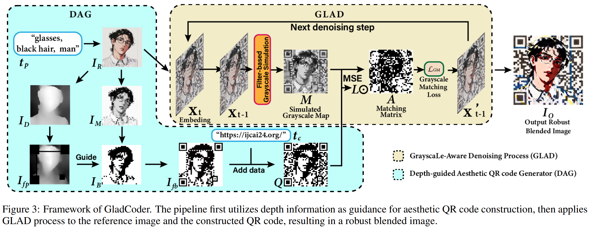
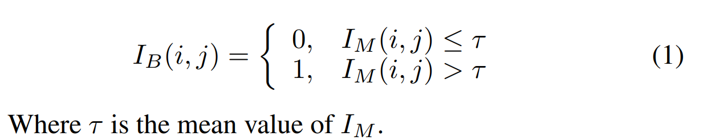

## GladCoder: Stylized QR Code Generation with Grayscale-Aware Denoising Process
*IJCAI(2024), 4 citation, Huawei Manufacturing, Review Data: 2026.01.26*

[Intro](#intro) 
[Related Work](#related-work) 
[Method](#method) 
[Experiment](#experiment) 
[Conclusion](#conclusion) 

> Core Idea

<strong>"test1"</strong> 

***

### <strong>Intro</strong>

- 오늘날 QR 코드(Quick Response Code) [ISO, Geneva Switzerland ISO/IEC 18004:2000]는 명함, 모바일 결제, 광고 등 매우 다양한 응용 분야에서 활용되고 있다. 전통적인 QR 코드는 검은색과 흰색의 정사각형 모듈로 이루어진 행렬 형태로 구성되어 있으며, 인간의 시각적 인지 관점에서는 미적으로 매력적이지 않고 의미 또한 전달하지 못한다.

- 이들 연구 중 대부분은 사전에 정의된 생성 규칙이나 스타일에 기반하고 있어 유연성과 개인화 측면에서 한계를 가진다. 최신 스타일화 QR 코드 생성 기법인 ArtCoder는 신경망 기반 스타일 전이(Neural Style Transfer) 네트워크를 사용하여 결과를 생성한다. 그러나 이러한 특성으로 인해 ArtCoder는 자연스럽고 고품질의 이미지를 생성하는 데 어려움이 있다. 그림 1에서 보이듯이, ArtCoder의 결과물에는 시각적 인지에 부정적인 영향을 미치는 뚜렷한 흑백 픽셀들이 존재한다.

- 최근 이미지 생성 모델(예: Stable Diffusion, DALL·E)의 발전은 매우 유연하고 사실적인 이미지를 생성할 수 있는 뛰어난 능력을 보여주며, 고품질 스타일화 QR 코드 생성의 가능성을 열어주었다. 
    - ControlNet을 활용하여 확산 모델이 생성한 이미지에 QR 코드를 삽입하는 QRBTF 기법도 존재한다. 
    - 그러나 그림 1에서 볼 수 있듯이, QRBTF로 생성된 이미지에는 이미지 품질을 저해하는 눈에 띄는 흑백 블록들이 여전히 존재한다. 
        - 이러한 문제는 두 가지 주요 원인에서 비롯된다. 
            - 첫째, QR 코드 내 흑백 패턴의 무작위 분포로 인해 생성된 이미지에서 밝고 어두운 영역이 불규칙하게 나타나며, 이는 인물이나 객체를 근접 촬영한 이미지에서 특히 두드러진다. 
            - 둘째, QR 코드 이미지 생성 과정에서 Brightness ControlNet을 사용함으로써 이미지와 QR 코드 간의 그레이스케일 일관성을 우선시한 나머지, 시각적 품질에 대한 고려가 부족해진다.

- 개인화되면서 자연스럽고 text로 생성하는 Stylized QR codes 방법론인 GladCoder를 제안한다. 
    - Depth-guided Aesthetic QR code Generator (DAG): image foreground의 quality를 향상시킨다.
    - GrayscaLe-Aware Denoising (GLAD): scanning robustness를 강화한다. 
    - 전체적인 파이프라인은 diffusion model에 기반한다. 

- 먼저 텍스트 프롬프트를 기반으로 확산 모델을 사용해 초기 이미지를 생성하고, 이를 참조 이미지로 활용한다. 
- QR 코드의 무작위 패턴이 이미지의 시각적 품질에 미치는 영향을 줄이기 위해, 우리는 깊이(depth) 정보를 활용한 미적 QR 코드 생성 방법을 제안한다. 
- 깊이 추정을 통해 이미지의 전경 영역을 추출하고, 해당 영역에는 낮은 QR 우선순위를 부여한다. 이후 부여된 우선순도에 따라 QR 패턴을 생성함으로써, 고우선순위 영역에는 QR 패턴을 집중시키고 저우선순위 영역(즉, 이미지 전경)에는 QR 패턴의 출현을 최소화한다.

***

### <strong>Related Work</strong>

- 모듈 변형(module deformation), 모듈 재배치(module reshuffling), 신경망 스타일 전이(Neural Style Transfer, NST), 그리고 확산 모델(Diffusion Model) 기반 방법로 나눴다. 

- 모듈 변형(Module-Deformation)
    - 모듈 변형 기반 방법은 QR 코드의 정사각형 모듈이 차지하는 영역을 재형상화하거나 축소한 뒤, 이렇게 확보된 영역에 이미지를 삽입하는 방식이다. 대표적인 예로는 Visualead [Aliva et al., 2018]와 Halftone QR codes [Chu et al., 2013]가 있다. Visualead [Aliva et al., 2018]는 모듈을 왜곡하면서도 모듈과 삽입 이미지 간의 명확한 대비를 유지함으로써 QR 코드의 시각적 완성도를 높인다(그림 2(b)). 반면, Halftone QR codes [Chu et al., 2013]는 각 모듈을 3×3 서브모듈로 분할하고, 중앙 서브모듈의 색상은 유지한 채 나머지 서브모듈들을 결합된 이미지에 대응하는 하프톤 맵에 정렬한다(그림 2(c)).

- 모듈 재배치(Module-Reshuffle)
    - 모듈 재배치에 초점을 둔 최근의 접근법들은 선구적인 연구인 Qart code [Cox, 2012]에서 영감을 받았다. Qart code는 가우스–조르당 소거법(Gauss–Jordan Elimination Procedure)을 사용해 모듈의 위치를 재배치함으로써, 결합된 이미지의 특징과 정렬되도록 하는 방법을 제안한다(그림 2(d)). 이후 연구들에서는 QR 코드의 시각적 품질을 향상시키기 위해, 관심 영역(region of interest) [Xu et al., 2021], 중심부 살리언시(central saliency) [Lin et al., 2015], 전역 그레이스케일 값(global grayscale values) [Xu et al., 2019] 등 다양한 이미지 특징에 기반한 모듈 재배치 전략들이 제안되었다.

- NST 기반 방법(NST-Based Method)
    - Xu 등[Xu et al., 2019]은 스타일화 QR 코드 생성을 위해 신경망 스타일 전이(NST) 기법을 최초로 도입하였다. 이들은 개인화되면서도 기계 판독이 가능한 SEE(Stylized aEsthEtic) QR 코드를 제안하였으며, 스타일 전이가 스캔 신뢰성에 미칠 수 있는 부정적 영향을 완화하는 데 초점을 맞추었다. 이후 Su 등[Su et al., 2021]이 제안한 ArtCoder는 블렌딩된 이미지를 QR 코드에 보다 효과적으로 통합하면서도 스캔 강인성을 유지하도록 개선하였다(그림 2(e)). 그러나 이러한 방법들은 원본 이미지, 스타일 이미지, 그리고 QR 코드 이미지 간의 정렬 정도에 크게 의존하기 때문에, 사용자가 원하는 특정 스타일을 구현하기가 어렵다. 또한 생성된 이미지에는 여전히 뚜렷한 흑백 픽셀들이 존재하여, QR 코드임을 쉽게 인지할 수 있다는 한계가 있다.

- 확산 모델 기반 방법(Diffusion-Model-Based Method)
    - 본 연구에서 제안하는 방법은 확산 모델을 사용해 출력 이미지를 생성하는 새로운 범주에 속한다 [Zhang et al., 2023; Jiang et al., 2024]. 확산 모델을 위한 다양한 제어 가능 이미지 생성 기법들이 제안됨에 따라 [Dong et al., 2022; Shi et al., 2023; Xie et al., 2023; Kim et al., 2023; Zhang and Agrawala, 2023; Ye et al., 2023], 확산 모델로 생성된 이미지에 QR 코드를 결합하는 것이 가능해졌다. Ni 등[Ni et al., 2023]은 그레이스케일 이미지를 컬러 이미지로 변환할 수 있는 ControlNet 모델 [Zhang and Agrawala, 2023]을 학습시키는 새로운 방법을 처음으로 제안하였으며, 이 모델은 생성 이미지에 QR 코드를 삽입하는 데에도 활용될 수 있다. 그러나 ControlNet만을 사용해 생성된 이미지들은 일반적으로 이미지 품질과 스캔 가능성 간의 트레이드오프 문제에 직면하며, 그 결과 많은 직사각형 형태의 요소들이 무질서하게 배치된 출력이 생성되는 경향이 있다.

***

### <strong>Method</strong>

- 입력으로는 두 개의 텍스트 문자열을 받는다. 
    - $t_p$: text prompt 
    - $t_c$: QR code message 
    - 목적은 사람의 시각으로 봤을 때 $t_p$와 의미적으로 조화로우면서, $t_c$로 안정적으로 인식될 수 있는 scanning-robust한 이미지를 생성하는 것이다. 

$\textbf{Depth-Guided Aesthetic QR Code Generator}$

- 참조 이미지 $I_R$과 QR code message $t_c$를 입력으로 받아 $t_c$가 인코딩된 미적 QR code $Q$를 생성하는 process이다. 

- 기본 아이디어는, 동일한 텍스트 콘텐츠에 대해서도 실제로는 여러 가지 가능한 QR 코드 배치가 존재하며, QR 코드의 모듈들이 공간적으로 균등하게 배치되지 않는다는 점에 있다. 이러한 특성을 활용하여, 본 방법은 이미지의 전경(foreground) 영역에 보다 부드러운 QR 모듈을 배치함으로써 전반적인 시각적 품질을 향상시킨다.

- 무작위로 분포된 QR 코드 패턴과 특정 유형의 자연 이미지 간의 불일치를 해결하는 것을 목표로 한다.

- 참조 이미지 $I_R$이 주어지면, 일련의 이미지 처리 과정을 적용하여 $I_R$의 grayscale version을 $M_{num} \times M_{num}$ 크기로 resize한 행렬 $I_M$을 얻는다. 이후 $I_M$은 다음 식에 따라 이진 이미지 $I_B$로 변환된다. 

- 한편, 참조 이미지 $I_R$은 depth estimation을 거쳐 depth image $I_D$를 추출한다. 이후 탐색 패턴(finder), 타이밍 패턴(timing), 정렬 패턴(alignment), 그리고 버전·포맷 정보에 해당하는 고정 모듈들을 모두 $0$으로 설정한 뒤, GladCoder는 이후 QR 코드 생성을 유도하기 위한 채움 우선순위 맵 $I_{fp}$를 계산한다. 

- $I_{fp}$ 값이 큰 모듈들을 $I_B$에서의 값과 동일한 비트로 설정한다. 유연 모듈을 모두 소진한 이후에는, 남은 모듈들을 QArt에서 제안된 방법에 따라 message $t_c$를 기반으로 계산하여 설정한다. 

- 정리
    - Diffusion model로 이미지 생성 
    - Grayscale $\rightarrow$ resize $\rightarrow$ Binary image 
    - 참조 이미지를 depth estimation으로 depth image 추출 
    - Depth image를 guidance로 사용
    - QArt를 이용하여 message encoding 

$\textbf{GrayscaLe-Aware Denoising (GLAD)}$

- 이 과정의 핵심 아이디어는 최종 출력 이미지를 생성할 때 모든 픽셀을 제어할 필요가 없다는 점에 있다. QR 코드 리더는 각 모듈의 값을 판별할 때 중앙 픽셀만을 사용하므로, 나머지 픽셀들은 흑/백 제약의 영향을 계속 받을 필요 없이 자유롭게 생성될 수 있다.

- GLAD 과정은 이미지-투-이미지 확산(image-to-image diffusion) 과정을 변형한 방식이다. 각 디노이징 단계에서 잠재 변수 $x_t$가 갱신된 뒤, grayscale mathing loss $L_{RM}$을 계산하고 이를 $x_{t-1}$에 역전파한다. 

- 구체적으로, latent variable $x_{t-1}$을 얻은 뒤 이를 decoding하여 이미지 $O$를 생성하고 이 이미지를 $a \times a$ 모듈로 구성된 이미지로 간주한다. 이후, 이미지 $O$에 대해 grayscale image map을 추출하기 위한 conv layer를 적용한다. (가우시안 커널)

***

### <strong>Experiment</strong>

***

### <strong>Conclusion</strong>

***

### <strong>Question</strong>

<a href="">link</a>

> 인용구
