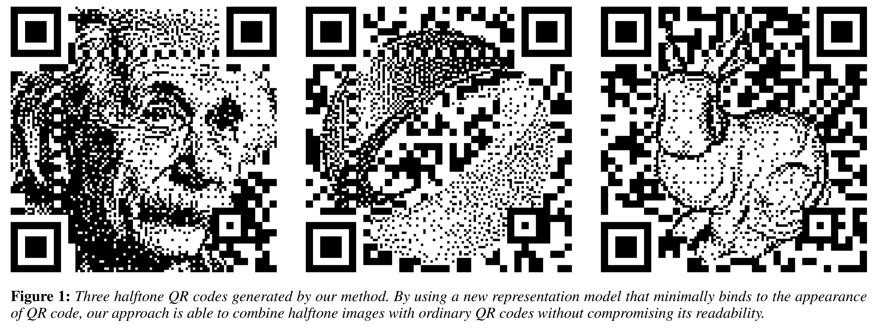
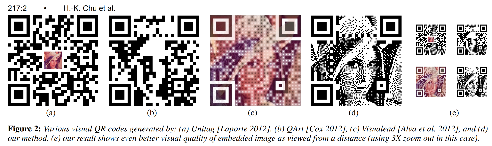
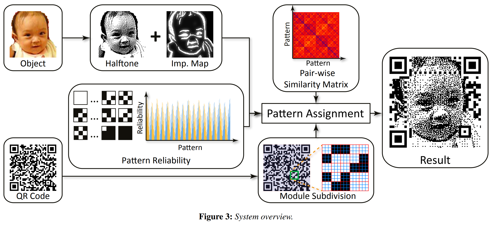
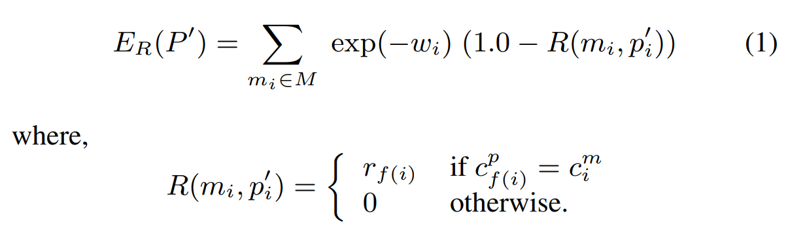
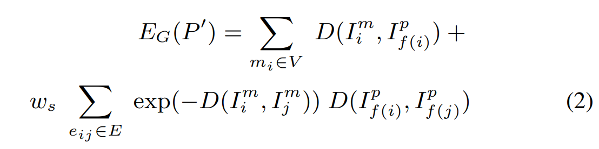
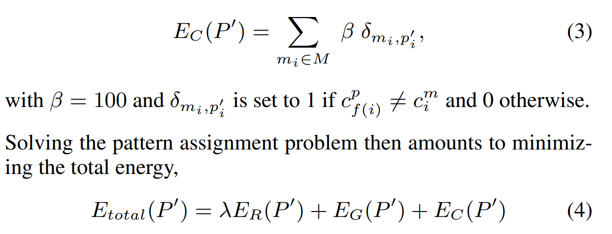
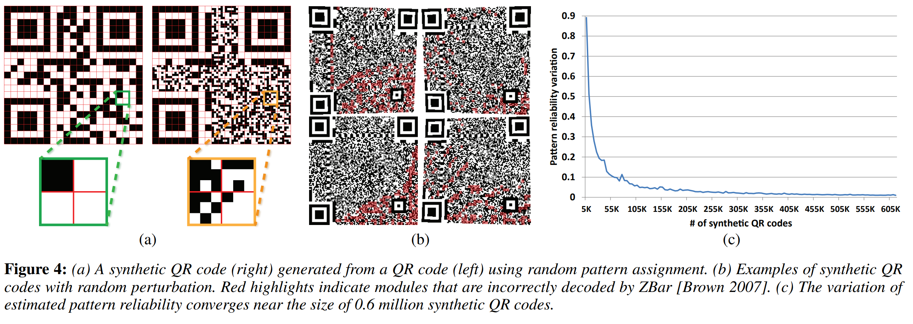

## Halftone QR Codes
*ACM transactions on graphics (2013), 200 citation, National Tsing Hua University, Review Data: 2026.01.26*

[Intro](#intro) 
[Related Work](#related-work) 
[Method](#method) 
[Experiment](#experiment) 
[Conclusion](#conclusion) 

> Core Idea

<strong>"test1"</strong> 

***

### <strong>Intro</strong>

- QR 코드는 제품에 정보를 태깅하거나 광고를 연결하는 데 널리 사용되는 바코드 패턴의 한 형태이다. 
- 한편으로는 패턴이 기계로 읽힐 수 있도록 유지하는 것이 필수적이지만, 다른 한편으로는 패턴에 작은 변화만 생겨도 쉽게 판독 불가능해질 수 있다. 
- 따라서 별도의 계산적(컴퓨팅) 지원이 없으면 QR 코드는 검은색/흰색 모듈이 무작위로 모여 있는 것처럼 보이며, 시각적으로도 종종 불쾌하게 느껴진다. 
- 본 논문은 기계 판독성을 유지하면서도 고품질의 시각적 QR 코드를 생성하는 접근법을 제안하며, 이를 “하프톤(halftone) QR 코드”라고 부른다. 
    - 먼저, 어떤 모듈을 어떤 다른 모듈로 대체할 수 있는지에 대한 확률분포를 학습하여 패턴의 판독 가능성을 평가하는 함수를 구축한다. 
    - 그다음, 텍스트 태그가 주어지면 학습된 사전을 이용해 입력 이미지를 표현함으로써 원본 텍스트를 인코딩한다.
    - 다양한 입력과 여러 왜곡 효과 조건에서도 제안한 방법이 고품질 결과를 생성함을 보인다.

- QR 코드는 원래 자동차 산업을 위해 Denso Wave에서 설계되었으나, 디지털 콘텐츠를 빠르고 효과적으로 삽입하는 수단으로 빠르게 확산되어 제조, 마케팅 등 다양한 분야에서 광범위하게 사용되고 있다. 기계 판독 측면에서는 매우 우수한 형식이지만, 시각적으로는 QR 코드는 검은색과 흰색 사각형이 뒤엉킨 형태로 남아 있어, 적용되는 제품의 미적 가치를 쉽게 해칠 수 있다.

- 비주얼 QR 코드를 생성하는 일반적인 전략은 QR 코드에 내장된 오류 정정(error correction) 능력을 활용하여 일부 모듈이 손상되거나 누락되더라도 복원 가능하도록 하는 방식이다(그림 (a) 참조). 
    - 그러나 적절한 분석적·계산적 지원이 없는 상황에서 이러한 접근은 시행착오를 반복해야 하며, 최종 결과의 품질을 거의 제어할 수 없다. 그 결과, 해상도와 품질은 QR 코드 생성 시 사용한 설정에 크게 의존하고, 그 범위 내로 제한된다. 
- 또 다른 휴리스틱 방법은 각 모듈의 중심 영역은 그대로 유지하면서 외곽 영역의 외관만 변경하고, 인접 영역을 코드 모듈과 균일하게 블렌딩하는 방식이다(그림 (c) 참조). 
    - 그러나 이러한 블렌딩 기반 접근은 QR 코드의 외관에 지나치게 강하게 결합되어 있어, 두드러진 이미지 특징이 훼손되거나 동일한 이미지라도 서로 다른 QR 코드에 대해 출력 품질이 크게 달라지는 등의 아티팩트가 발생하는 문제가 있다. 이러한 방법들은 사용자 제어가 거의 없으며, 결과 역시 대체로 평범한 수준에 머무른다.

- 본 논문에서는 하프톤 이미지와 QR 코드를 결합한 새로운 유형의 비주얼 QR 코드인 ‘하프톤 QR 코드(halftone QR code)’를 자동으로 생성하는 알고리즘을 제안한다(그림 1 및 그림 2(d) 참조).
    - 앞서 언급한 문제들을 해결하기 위해, 핵심 아이디어는 원래의 모듈에 대한 결합을 최소화하면서도 목표 하프톤 이미지에 유연하게 적응할 수 있는 표현 모델에 있다. 
    - 제안하는 방법에서는 각 모듈을 $3 \times 3$의 서브모듈로 분할하고, 모듈의 색상은 중앙 서브모듈에만 고정시켜 나머지 8개의 서브모듈은 독립적으로 외관을 변경할 수 있도록 한다. 
    - 이러한 자유도를 활용해, 우리는 모듈의 외관을 이진 패턴들의 집합으로 표현한다. 또한 각 이진 패턴에 대해, 해당 패턴으로 모듈을 대체했을 때 판독성이 유지될 확률을 의미하는 패턴 신뢰도(pattern reliability)를 평가한다.     
        - 구체적으로는, 이진 패턴을 이용해 자동으로 생성한 합성 QR 코드 데이터베이스로부터 학습을 수행하고, 바코드 리더를 사용해 패턴의 신뢰도를 통계적으로 평가함으로써 그 확률을 추정한다. 
    - 마지막으로, 하프톤 QR 코드를 생성하기 위해, 신뢰도와 정규화라는 두 경쟁 항을 균형 있게 고려하여 각 모듈에 이진 패턴을 할당하는 새로운 최적화 방법을 제안한다. 
        - 여기서 신뢰도 항은 높은 판독 신뢰도를 가진 패턴을 선호하도록 유도하고, 정규화 항은 모듈의 외관이 목표 하프톤 이미지에 가깝도록 유도하는 역할을 한다.

***

### <strong>Related Work</strong>

- 아티스트들이 QR 코드를 커스터마이징할 때 흔히 사용하는 전략으로는 모듈에 색상을 추가하거나, 날카로운 모서리를 둥글게 처리하거나, QR 코드에 작은 이미지를 삽입하는 방식이 있다. 이때 삽입된 이미지는 QR 코드에 내장된 오류 정정 능력에 의존하여 누락된 모듈을 복원한다(그림 2(a) 참조). 이러한 시도들은 일반적으로 시행착오를 반복하는 방식으로 수작업 수정이 필요하며, 이후 판독 가능성 검증 과정을 거쳐야 한다.

- Cox [2012]는 QR 코드를 생성하는 데이터 인코딩 단계에서 이진 이미지를 QR 코드에 삽입하는 복잡한 알고리즘을 제안하였다. 그는 QR 코드의 내부 구조와 데이터 인코딩 논리를 면밀히 분석한 뒤, 그림 2(b)에 나타난 것처럼 원래 데이터 뒤에 중복된 숫자 문자열을 추가하는 방식으로 이미지 콘텐츠를 인코딩하는 알고리즘을 설계하였다. 
    - 그러나 이 기법은 URL 형태의 데이터 문자열에만 적용 가능하며, 삽입되는 이미지의 품질 역시 인코딩된 URL 길이에 의해 제한된다. 유사하게, Duda [2012]는 제약 코딩(constrained coding) 기법을 사용해 하프톤 이미지를 QR 코드에 삽입하려는 시도를 했다. 이미지 픽셀을 삽입하기 위한 자유 비트(freedom bits)에 대한 정교한 분석을 제시했지만, 현재로서는 단조로운 형태의 이미지에만 적용 가능하며 결과 역시 평범한 수준에 머문다. 보다 섬세한 하프톤 이미지로의 확장 가능성은 다루어지지 않았다.

***

### <strong>Method</strong>

- 그림 3은 본 논문에서 제안하는 하프톤 QR 코드 합성 과정의 전체 워크플로우를 보여준다. 
    - 먼저, ISO 표준 [ISO/IEC 18004 2006]을 따르는 데이터 인코딩 라이브러리 [Kentaro 2006]를 사용해 QR 코드를 생성한다. QR 코드 생성 시 사용되는 설정은 세 가지 매개변수로 구성된다. 
        - 첫째는 **데이터 문자열(data string)**로, 인코딩될 정보를 나타내며 QR 코드의 외형을 결정한다. 
        - 둘째는 **심볼 버전(symbol version)**으로, QR 코드의 크기를 제어한다. 
        - 셋째는 **오류 정정 레벨(error correction level)**로, QR 코드의 오류 정정 능력을 결정한다. QR 코드는 검은색 또는 흰색의 정사각형 모듈들로 이루어져 있으며, 기능에 따라 두 가지 범주로 분류할 수 있다. 
            - 첫 번째 범주는 입력 데이터나 오류 정정 코드를 표현하는 **데이터 모듈(data modules)**이고, 
            - 두 번째 범주는 정렬, 보정 등 판독 성능을 향상시키기 위해 사용되는 **기능 모듈(function modules)**이다. 
            - QR 코드의 판독성은 두 번째 범주에 속한 모듈의 정확성에 매우 민감하기 때문에, 본 알고리즘은 이러한 모듈들은 그대로 유지하고 데이터 모듈만을 조작한다. 

- 본 논문은 각 모듈을 3×3의 서브모듈로 분할하고, 모듈의 색상은 중앙 서브모듈에만 고정시키는 반면, 나머지 8개의 서브모듈은 독립적으로 외관을 변경할 수 있도록 하는 모델을 제안한다. 
    - 이렇게 분할된 모듈을 3×3 픽셀의 이진 이미지로 렌더링하면, 총 512 (2^9)개의 이진 패턴(이하 단순히 패턴이라 칭함)을 얻을 수 있으며, 이는 모듈의 외관을 특징짓는 데 사용된다. 
    - 각 패턴에 대해, 우리는 **패턴 신뢰도(pattern reliability)**라는 새로운 항을 도입하는데, 이는 해당 패턴으로 모듈을 대체했을 때 QR 코드의 판독성이 손상되지 않을 확률로 모델링된다. 
    - 이 신뢰도는 대규모 합성 QR 코드 데이터베이스를 통해 평가된다. QR 코드의 판독성을 변화 조건 하에서 정량화할 수 있는 분석적 함수가 존재하지 않기 때문에, 패턴 신뢰도는 제어 가능한 판독 수준을 달성하기 위해 패턴 간 선호도를 특성화하는 역할을 한다.

- 우리는 하프톤 QR 코드 합성을 최적화 문제로 정식화하며, 이 과정에서 각 모듈에 패턴을 할당하기 위해 **신뢰도(reliability)**와 **정규화(regularization)**라는 두 항으로 구성된 목적 함수를 계산한다. 
    - 신뢰도 항은 모듈의 판독성을 극대화하기 위해 높은 신뢰도를 가진 패턴을 선택하도록 유도하고, 
    - 정규화 항은 유사도 거리 측정 지표를 이용해 모듈의 외관이 목표 하프톤 이미지에 가깝도록 제어한다.

- 먼저 객체 이미지를 *"Structure-aware error diffusion"* 로 halftone image로 변환한다. 
- 이후 *"Image abstraction by structure adaptive filtering"* 를 적용하여 객체 이미지의 중요도 맵 (importance map) $I_m$을 생성한다. 
    - 이미지에서 두드러진 특징을 강조하며, 이후 QR code 생성 과정을 유도하는 데 사용된다. 

- 각 모듈을 $M= \{m_i = (I_i^m, c_i^m, w_i) | i=1,...,n \}$ 로 정의한다.
    - $I_i^m$: 하프톤 이미지 $I_f$로부터 추출한 모듈 $m$에서의 $3 \times 3$ 이미지 패치
    - $c_i^m$: 해당 모듈의 색상
    - $w_i$: 중요도 맵 $I_m$에서의 모듈 $m$에 대해 값을 평균하여 계산한 중요도 가중치 

- 각 모듈의 서브 모듈 $9$개에 대한 패턴의 집합은 다음과 같이 정의한다. 
    - $I_i^p$: 중심 픽셀의 색상이 $c_i^$인 $3\times 3$ 이진 이미지 패턴
    - $r_i$: $[0,1]$ 범위의 패턴 신뢰도 (값이 클수록 높은 판독 신뢰도)

$$ P = \{ p_i = (I_i^p, c_i^p, r_i) | i=1,...,512  \} $$

- 목표는 각 모듈에 대하여 집합 $P$에서 하나의 패턴을 할당하되, 신뢰도와 정규화라는 두 에너지 항이 균형을 이루도록 하는 것이다. 모듈에 할당된 패턴 집합을 다음과 같이 정의한다. 
    - $f(i)$: 모듈 $m_i$에 할당된 패턴의 인덱스

$$ P' = \{ p_i' = (I_{f(i)}^p, c_{f(i)}^p, r_{f(i)}) | i=1,...,n  \} $$

$\textbf{Reliability energy}$

- 이 신뢰도 항은 scannability를 위한 항이다. (최소화를 해야 된다)
- 모듈의 판독성을 극대화하기 위해 높은 신뢰도를 가진 패턴이 선택되도록 유도한다. 또한, 모듈이 이미지 내에서 차지하는 중요도가 서로 다를 수 있으므로, 중요도 값에 따른 조절을 반영한다. 

- $w_i$가 높아지면 energy $E$ 값은 낮아진다. 즉, 중요도가 높은 모듈이면 energy가 작아진다. 
- 서브 중앙 모듈의 색상이 실제 모듈의 값과 같으면 패턴 신뢰도인 $r_{f(i)}$ 를 할당한다. 이 값이 높으면 역시나 energy 값이 낮아진다.  

$\textbf{Regularization energy}$

- 이 정규화 항은 appearance에 대한 항이다. Target halftone image와 생성되는 QR code 간의 차이를 최소화하는 것을 목표로 한다. 
    - 이를 위해 할당된 패턴과 대응되는 하프톤 패치 간의 모듈 단위 차이를 최소화하는 동시에, 인접한 패턴들 사이의 부드러움을 선호하도록 정의한다. 
    - 구체적으로 유사도 거리 함수 $D$는 SSIM을 사용하며 구조적으로 하프톤 이미지와 동일하도록 설계된다. 뒤의 항은 인접한 모듈 $4$개에 대해서도 계산한다. 

$\textbf{Binding constraint}$

- 최종적으로 할당된 패턴이 원래 모듈의 데이터(색상)를 중앙 픽셀에 정확히 유지하도록 하기 위해, 색상이 맞지 않는 패턴 할당에 페널티를 부여하는 결합 제약을 도입한다.

- 패턴 할당 문제는 다음의 전체 에너지를 최소화하는 문제로 귀결된다.

***

### <strong>Experiment</strong>

***

### <strong>Conclusion</strong>

***

### <strong>Question</strong>

<a href="">link</a>

> 인용구
