## Hyper-Connections
*ICLR(2025), 14 citation, Seed-Foundation-Model Team & ByteDance, Review Data: 2026.02.10*

[Intro](#intro) 
[Related Work](#related-work) 
[Method](#method) 
[Experiment](#experiment) 
[Conclusion](#conclusion) 

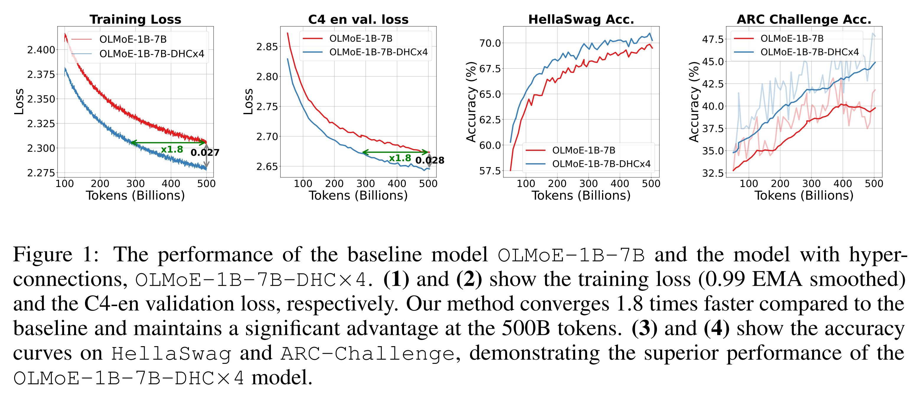

> Core Idea

<strong>"test1"</strong> 

***

### <strong>Intro</strong>

- Residual connection은 transformer와 CNN을 포함한 현대 신경망 아키텍처에서 핵심적인 역할을 제공해왔다. 
    - 그래디언트 소실 문제를 완화하여 매우 깊은 네트워크의 효과적인 학습을 가능하게 한다. 
    - 그러나 잔차 연결이 완전무결한 해결책은 아니며, 여전히 해결되지 않은 한계점들을 지니고 있다. 
    - 잔차 연결의 두 가지 주요 변형인 **Pre-Norm**과 **Post-Norm**은 각각 그래디언트 소실과 표현 붕괴 사이에서 서로 다른 trade-off를 가진다. 
        - Pre-Norm: 잔차 블록 이전에 정규화 연산을 적용함으로써 그래디언트 소실 문제를 효과적으로 해결한다. 하지만 이 방식은 네트워크가 깊어질수록 깊은 layaer의 hidden feature가 서로 매우 유사해지는 표현 붕괴 현상을 초래할 수 있다. (representation collapse)
        - Post-Norm: 잔차 블록의 출력 이후에 정규화를 적용하여, hidden feature가 이후 layer에 미치는 영향을 줄인다. 이는 representation collapse를 완화할 수는 있지만 gradient vanishing 문제를 다시 야기한다. 

- Residual connection 
    - 항등 행렬 $I$가 있어서 최소한의 전달되는 길이 생긴다. 
    - 즉, 이 항등 행렬이 살아있어야 gradient vanishing 문제를 완화할 수 있다. 

$$ \textit{Residual,} h_{l+1} = h_l + F(h_l) $$

$$ \frac{\partial h_{l+1}}{\partial h_{l}} = I + J_F $$

- Post-Norm 
    - 편미분을 해보면, 항등 행렬이 온전히 나오는 게 아니라 자코비안 행렬과 곱해진다. 
    - 즉, 레이어가 깊을 수록 감쇠/왜곡이 발생할 수 있다. 

$$ \textit{Post-Norm,} h_{l+1} = \text{Norm}(h_l + F(h_l)) $$

$$ \frac{\partial h_{l+1}}{\partial h_{l}} = J_{LN}\cdot (I + J_F) $$

- Pre-Norm
    - Normalization이 layer에 들어가는 input에 적용된다. 이때, re-centering > 분산 정규화 > affine transformation으로 normalization을 분해할 수 있고 re-centering과 affine transformation은 이전 layer와 다음 layer에 통합시킬 수 있어서, affine만 통합시킨다고 가정하자.
    - 그렇다면, layer input의 평균을 0 분산을 1 근처로 맞추니까 layer는 항상 비슷한 스케일/ 비슷한 통계의 입력을 받게 되고 출력도 구조적으로 비슷해지기 쉬워진다. 
    - 이는 의미없는 파라미터 낭비, 레이어가 깊어질 수록 다양한 표현을 해야 일반화 능력과 성능이 올라갈텐데 그 능력이 떨어져서 성능 저하

$$ \textit{Pre-Norm,} h_{l+1} = h_l + F(\text{Norm}(h_l)) $$

$$ \frac{\partial h_{l+1}}{\partial h_{l}} = I + J_F\cdot J_{LN} $$

- Residual connection의 대안으로 사용할 수 있다. 
    - Residual connection variants에서 흔히 관찰되는 단점인, gradient vanishing과 representation collapse 사이의 seesaw effect와 같은 문제를 구체적으로 해결한다. 
    - Post-Norm & Pre-Norm 모두 학습 불가능한 특정 형태의 hyper-connectio으로 표현할 수 있다. 

- 본 논문에서 제안하는 hyper-connection은 다른 depth에 위치한 feature간의 연결 강도를 네트워크가 스스로 조절할 수 있도록하며, 계층들을 동적으로 재배열할 수 있게 한다. 
    - 신경망이 성능 향상을 위해 연결 강도의 최적값을 스스로 학습할 수는 없는가? 
    - 핵심 아이디어는 learnable depth-connection과 width-connection을 도입하는 것이다. 
 

- Large language model & vision model 모두 유사한 성능 개선을 관찰했다. 
    - 주로 LLM 사전학습에 초점을 맞추고 있지만, vision task로도 확장해서 보여줌
    - 계산량과 파라미터 증가가 거의 없음에도 현저한 성능 향상을 달성

- Pre-Norm을 baseline으로 OLMoE에서 HC의 이점을 보여준다. 
    - DHC (dynamic hyper-connection)을 적용한 모델은 500B token으로 학습된 baseline model 대비 1.8배 빠르게 수렴하였고, (같은 loss에 도달하는데 약 500B/1.8 ~ 280B token만 필요 즉 덜 학습했는데도 같은 수준으로 똑똑해졌다.) 
    - x 축이 token 수라서 헷갈릴 수 있다. 왜냐면 모델은 학습 전에 사용한 단어 수를 vocab으로 정하기 때문이다. 하지만 여기서의 x 축은 token 수로써, 중복을 포함한 모델이 학습 중 지금까지 본 모든 토큰의 개수이다.
    - ARC challenge benchmark에서 6%의 성능 향상을 보였다. 

- Pre-Norm은 인접 계층 간 특징 유사도가 매우 높은 representation collapse 경향을 보인다. 
    - 반면 HC (Hyper-Connection)을 적용한 모델은 인접 계층 간 특징 유사도가 현저히 낮고, 더 넓은 유사도 분포를 나타낸다. 이는 각 계층의 기여도가 강화되었음을 시사한다. 

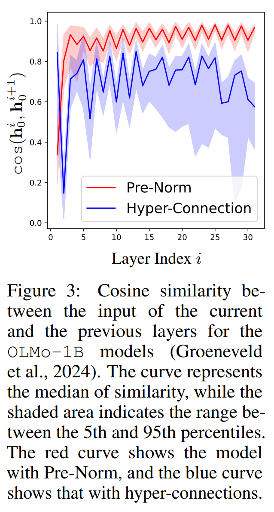

***

### <strong>Related Work</strong>

***

### <strong>Method</strong>

- 각각의 $\alpha, \beta$는 learnable scalar (network가 예측한) or scalar (depending on the specific HC version)이다. 

$\textbf{Static Hyper-Connections}$

- $k$-th layer의 input: $h^{k-1} \in \mathbb{R}^{d\times 1}$
    - 초기 입력은 $h^{0}$
    - $n$ (expansion rate) 개 복제한 hyper hidden matrix: $H^{k-1} = (h_1^{k-1}, h_2^{k-1},...h_n^{k-1}) \in \mathbb{R}^{n \times d}$ 
    - 마지막 hyper hidden matrix는 row-wise sum을 통해 최종 hidden vector를 구하고, final projector를 거쳐 최종 network output을 만든다. 

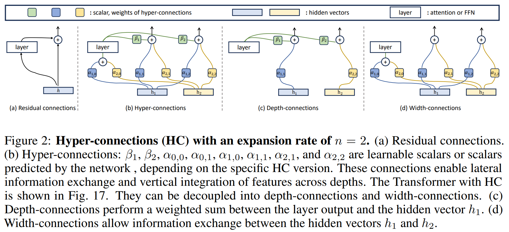

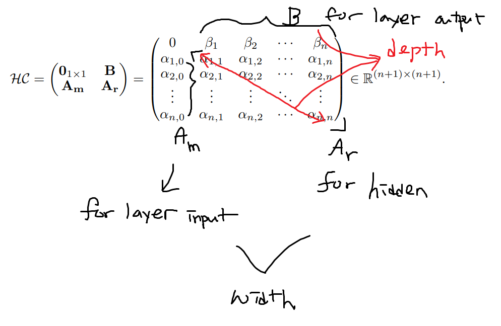

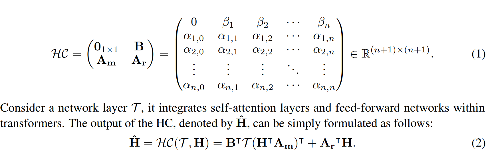

- Static HC의 초기값은 다음과 같다. 
    - 이때, 임의로 초기 주력 hidden vector를 선정해서 layer 입력으로 정보를 온전히 주지만, 이는 초기의 경로일뿐 학습과정에서 얼마든지 경로가 바뀔 수 있다. 

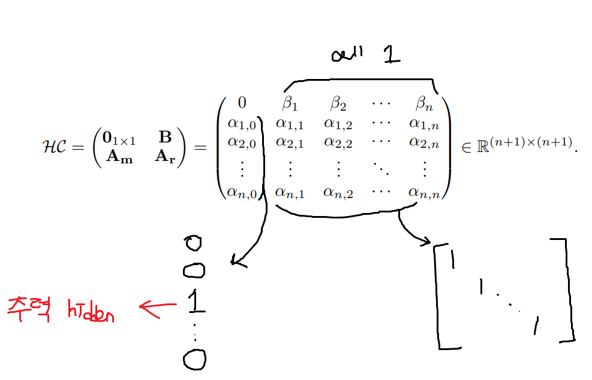

$\textbf{Dynamic Hyper-Connections}$

- Hyper-connection matrix $HC$의 각 원소는 입력 $H$에 동적으로 의존할 수 있으며, dynamic hyper-connection (DHC)는 다음과 같이 정의된다. 
    - 실제 구현에서는 정적 행렬과 동적 행렬을 결합하여 DHC를 구성한다.
    - 동적 파라미터들은 linear transformation을 통해 계산된다. 학습 과정을 안정화하기 위해, 선형 변환 이전에 **정규화(normalization)**를 적용하고, 이후 tanh 활성화 함수를 적용한 뒤 작은 초기 학습 가능 스케일 계수로 이를 조정한다.

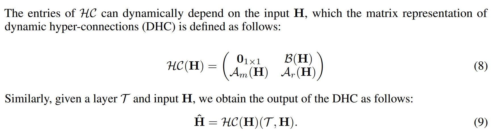

- DHC는 hidden vector의 함수이기 때문에 동일한 레이어라도 토큰·문맥·시간에 따라 다른 routing이 발생하며 이 때문에 더욱 주력 경로가 고정되지 않는다. 
    - 즉, 일반화가 더 잘된다?
    - 초기값으로 인해, 학습 초기에는 static처럼 작동한다. 

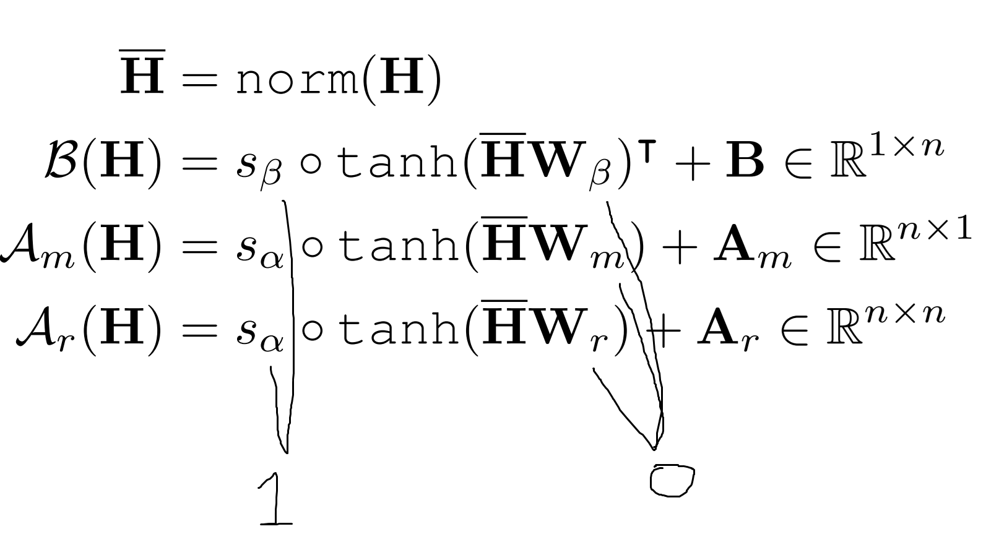

$\textbf{Sequential-Parallel Duality}$

- 일련의 신경망 모듈들이 주어졌을 때, 우리는 이들을 순차적으로 또는 병렬적으로 배치할 수 있다. 그러나 HC는 이러한 계층들을 순차적, 병렬적 배치를 혼합한 형태로 재배열하도록 학습할 수 있는 접근법을 제공한다. 

- $n=2$로 가정

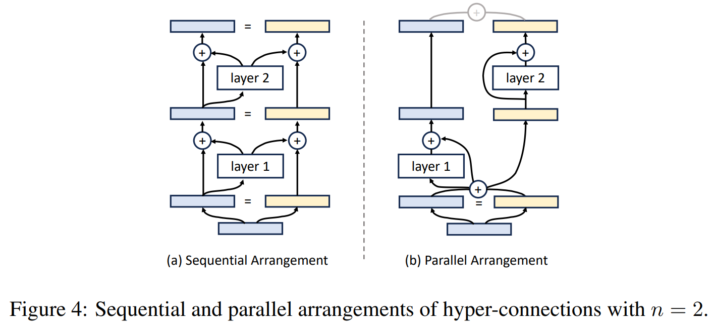

- HC가 다음과 같이 학습될 경우, 신경망은 순차적 구조로 배치된다. 
    - 이는 그림의 (a)와 같이 residual connection으로 퇴화한다.

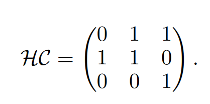

- 하지만 각 계층이 (홀수, 짝수 계층마다) 다음의 HC matrix로 학습되면 신경망은 두 개의 연속된 계층마다 병렬적으로 배치된다. 
    - 이는 transformer의 병렬 블록 배치와 유사하다. 
    - 따라서 다양한 형태의 HC matrix를 학습함으로써, 기존의 순차적 또는 병렬적 구성 방식을 넘어서는 계층 배치 구조를 만들 수 있으며, 이는 소프트 혼합 (soft-mixture) 혹은 더 나아가 dynamic arragement로까지 확장될 수 있다. 
    - 정적 하이퍼-커넥션의 경우, 학습이 완료된 이후에는 네트워크 내의 계층 배치가 고정된다. 반면, 동적 하이퍼-커넥션은 토큰마다 계층 배치를 동적으로 적응시킬 수 있다.

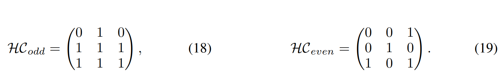

- $\beta$: residual strength
- $\alpha$: layer arrangement

***

### <strong>Experiment</strong>

$\textbf{Experiment Settings}$

- 본 연구에서는 LLM을 pre-training하는 것을 중점으로 실험을 수행했으며, dense model인 OLMo와 MoE model은 OLMoE를 사용한다. 

- Dense/MoE dataset: dolmap-v1.5-sample / OLMOE-MIX dataset
    - MoE (Mixture-of-Experts): 전체 파라미터에서 활성화된 파라미터만 일부만 사용하여 비용과 성능의 균형을 개선 
    - 즉 dense는 모든 파라미터를 사용하여 계산을 하고, MoE는 네트워크 내부에 여러 개의 "전문가 네트워크"가 있다고 가정하고 입력이 들어오면 그 중 일부만 사용하는 것이다. 
    - 실험에서는 MoE 7B 중, 1.3B만을 activate한다고 되어있다. 

- 모든 실험은 500B token으로 학습됐다. 

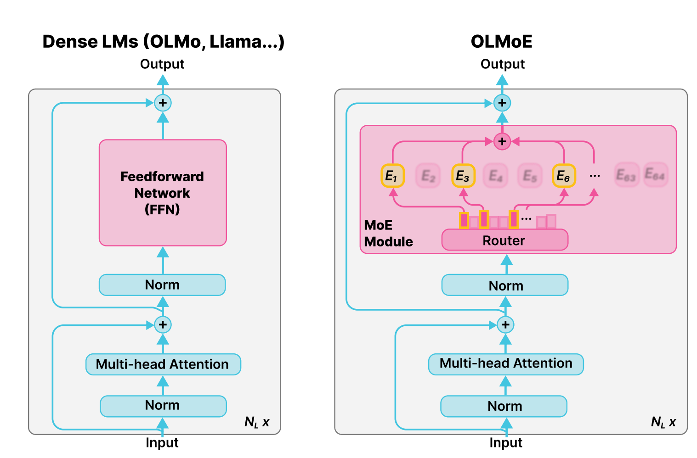

$\textbf{Implementation}$

- Baseline model의 학습 설정을 유지한 채, residual connection을 hyper-connection으로 대체했다. 

- Static 구성 요소에는 weight decay를 적용하지 않았으며 dynamic 구성 요소에는 이를 적용했다. 

- 최종 transformer block의 hyper hidden vector들이 궁극적으로 합산되므로 최종 layernorm 및 unembedding 이전 출력의 표준편차가 기존 모델과 일관되도록 보장하였다. 

- OLMo의 방법론에 따라, V2 및 V3 검증 세트에서의 **평균 퍼플렉시티(PPL)**와 loss, 그리고 다운스트림 벤치마크에 대한 제로샷 평가의 평균 지표를 보고한다

- MoE 모델의 경우, OLMoE의 설정에 맞추어 V3 검증 세트의 loss와 다운스트림 벤치마크 정확도를 함께 제시한다

$\textbf{Ablation study}$

- Ablation: 1B 규모의 모델로 수행 (7B은 method의 효과 평가로 사용)
- 기본 설정으로 확장 비율 (expansion rate) $n=4$인 DHC (동적 하이퍼 커넥션)을 사용하며, `tanh` 함수를 포함한 경우를 **-DHC** 로 표기한다. 
- 한편, **-SHC** 는 static hyper connection을 의미한다. 

- $n=1$ 인 경우 DHC의 성능은 baseline 보다 낮다. 그러나 $n >1$ 일 때 DHC는 기준 모델을 유의미하게 능가했으며, 특히 $n=4$ 에서 가장 우수했고 $n=8$로 증가시키면 추가적인 성능 향상은 거의 없었다. 
    - 특히 `tanh` 를 제거한 OLMo-1B-DHC x 8 W/O tanh 모델은 V2 및 V3 val set 모두에서 우수한 성능을 보였다. 

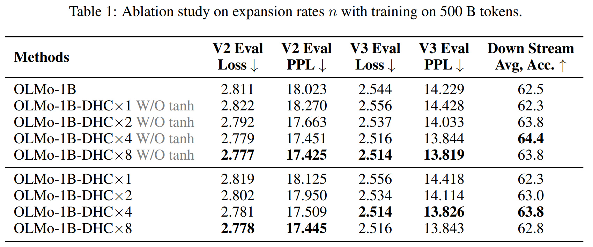

- $n \geq 2$ 인 DHC의 학습 손실 감소 속도는 baseline보다 더 가파르게 나타났으며, 모든 DHC 실험에서 loss spike (급격한 손실 증가 현상) 가 관찰되지 않아 더 높은 학습 안정성을 보였다. 

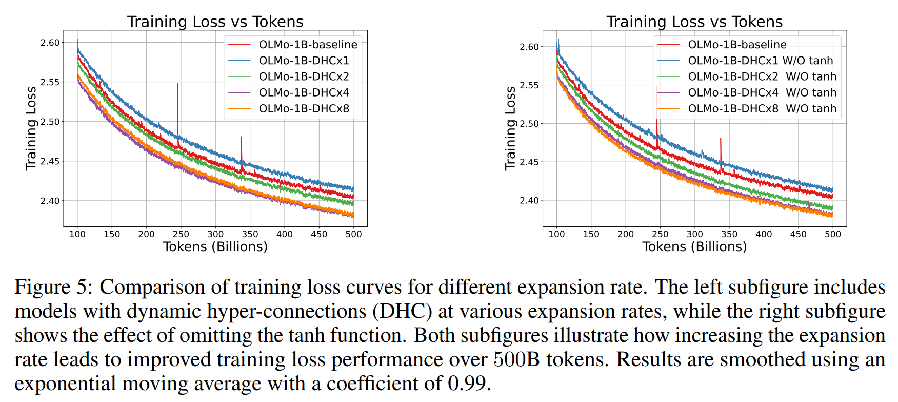

- Static and dynamic hyper connections 
    - 모든 HC 변형이 baseline을 유의미하게 능가했다. 
    - $n=2$는 DHC와 SHC의 성능 향상이 비슷하지만, $n=4$일 경우 DHC가 SHC보다 현저히 우수하다.

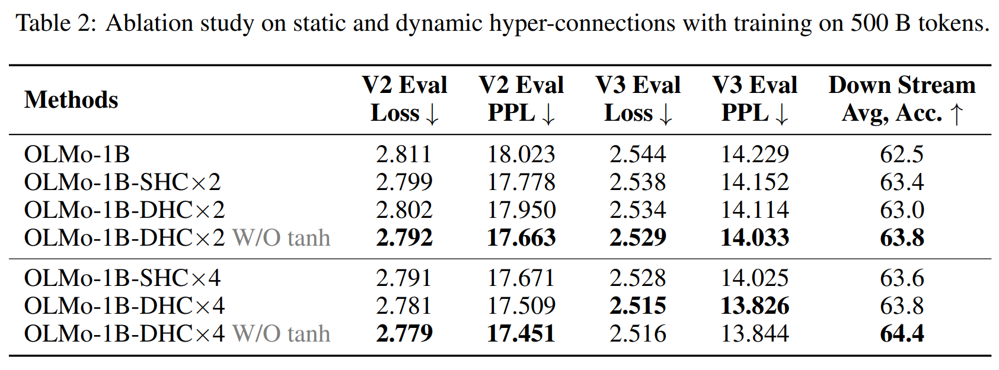

- Importance of B (residual strength) and WC (width-connection)
    - WC를 학습하지 않을 경우 성능이 유의미하게 저하된다. 구체적으로, 아래 표의 4번째 줄과 6번째 줄을 비교하면 V2 손실은 0.021 증가하고, V3 손실은 0.017 증가하는 것을 확인할 수 있다. 
    - 반면, B를 학습하지 않을 경우 그 영향은 상대적으로 덜 두드러진다. (V2 Eval PPL은 잘못 표기되어 있는 거 같다, 5, 6번째 줄 비교)
    - 어쨌든 WC와 B를 모두 학습 가능하도록 유지하는 게 중요하다.

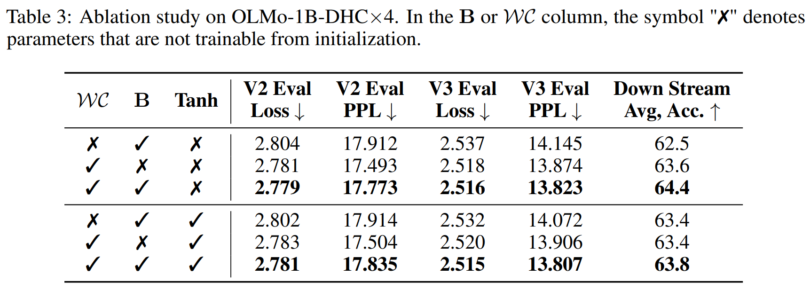

- Comparison with related works
    - OLMo에 Altup 및 ResiDual 방법을 구현했다. 
    - Altup: hidden dimension을 확장하면서도 계산 비용을 낮게 유지하기 위해, hidden state의 일부만 transformer block에 전달하는 방식으로 제안됐다. 
    - ResiDual: Pre-Norm과 Post-Norm을 두 개의 stream 구조로 결합하기 위해 제안됐다. 
    - 두 방법 모두 hidden size를 $n$ 배 확장시키면서도 계산 오버헤드는 거의 증가하지 않는다. 이 중 ResiDual은 hidden size를 정확히 $2$배로 확장한다. 
    - 따라서 본 연구도 이 실험에서는 $n=2$를 사용한다. 
    - 이들 방법은 학습 초기에는 성능 향상을 보였지만, 시간이 지나 점차 baseline에 의해 성능이 역전되는 경향을 보였다. 

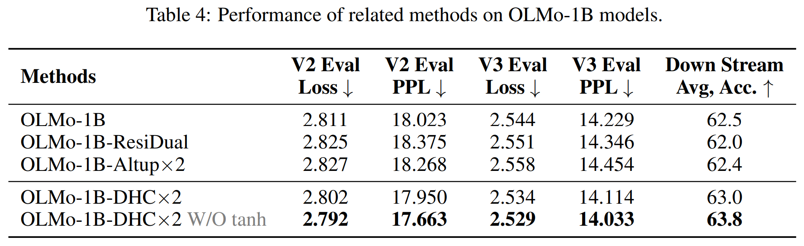

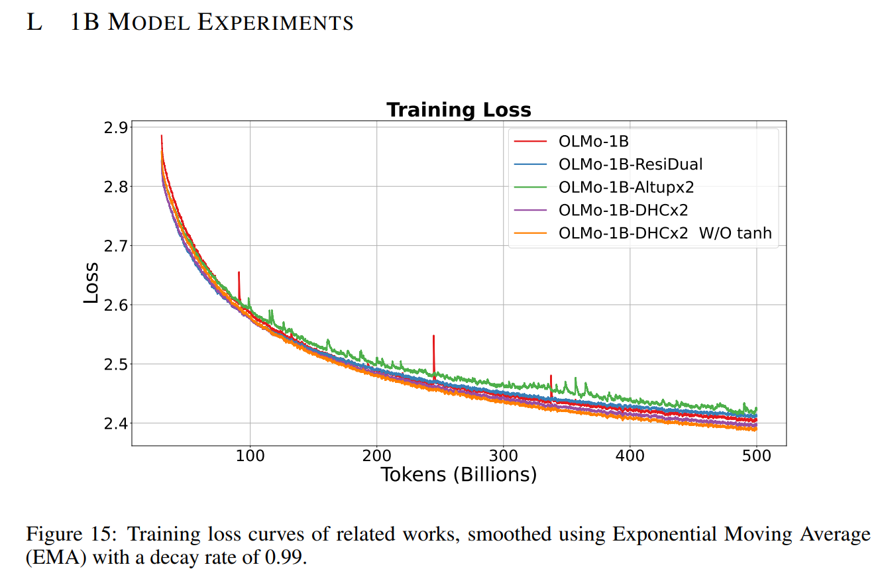

$\textbf{7B Models}$

- 7B model에서의 HC 평가를 위해, $n=4$ 를 적용하여 DHC model을 학습했으며 이를 OLMo-7B-DHC x 4로 표기한다. 
    - 표에 따르면, 모든 평균 지표에서 기준 모델인 OLMo-7B를 유의미하게 능가한다. 

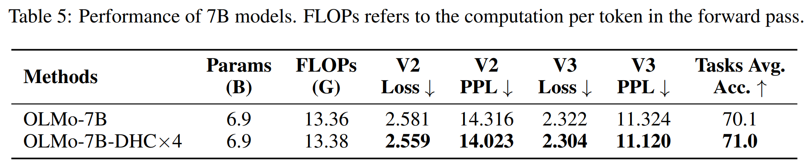

- 연산량이 굉장히 많아보이지만, 실제로 그림을 보면 layer의 입력으로 들어갈때 모두 합치기 때문에 dim이 실제로 늘어나지는 않는다. 즉 FLOPs 차이가 별로 없는 것도 이해가 됨. 

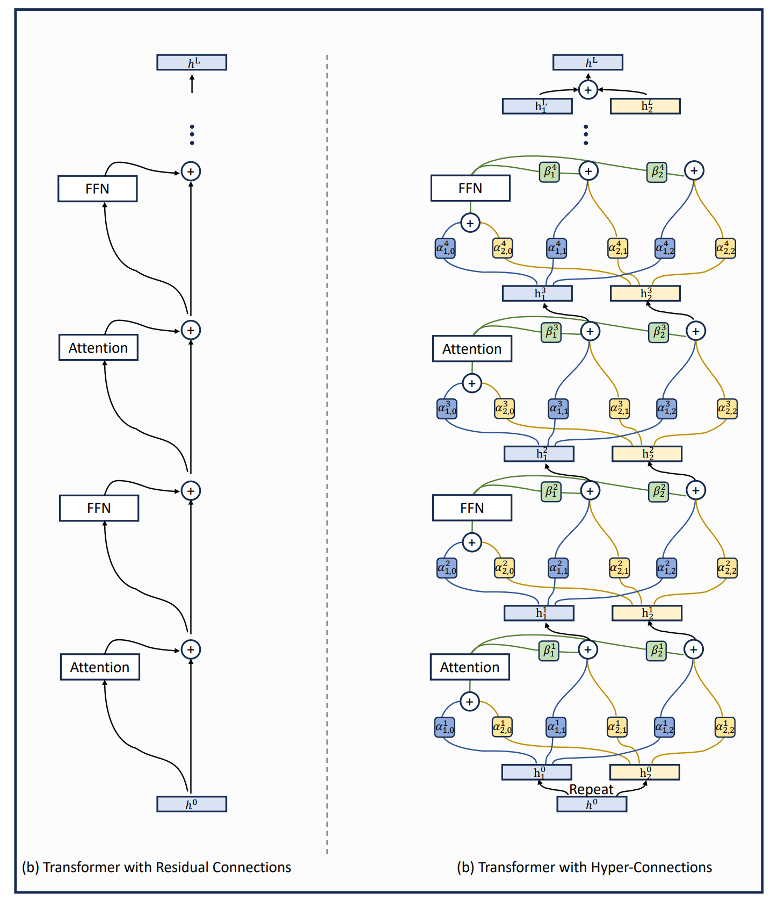

- 그림을 보면, OLMo-7B-DHC×4 모델은 학습 및 검증 손실, 그리고 다운스트림 벤치마크 정확도 측면에서 일관되게 기준 모델보다 우수한 성능을 보인다. 
    - 특히 400B 토큰 이후에도 성능 향상이 유지되며 감소하지 않는다. 
    - 이는 OLMo-7B-DHC×4 모델이 높은 토큰 수 구간에서도 지속적으로 loss 감소 효과를 제공함을 의미한다.
    - **기준 모델은 학습 과정에서 빈번한 loss spike(손실 급등 현상)**를 보이는 반면, DHC를 적용한 모델은 학습 전반에 걸쳐 spike가 관찰되지 않는다. 이는 본 방법이 더 낮은 loss를 달성할 뿐만 아니라, 학습 안정성 또한 향상시킴을 보여준다.

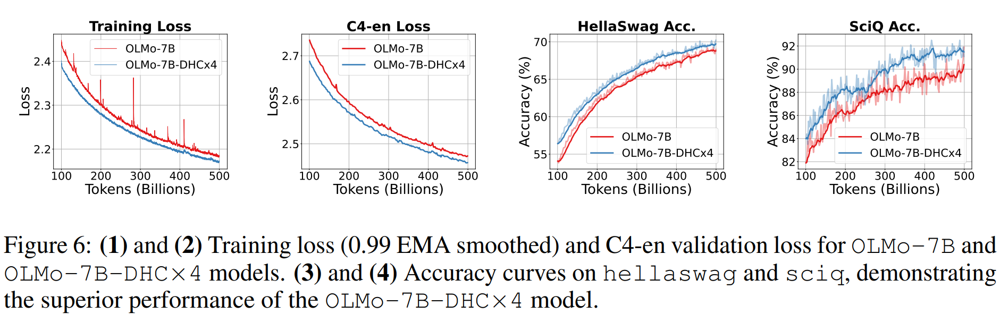

$\textbf{MoE Models}$

- MoE 모델에서 HC 효과를 평가했다. Baseline model은 기존의 OLMoE-1B-7B model을 재학습했으며, residual connection을 $n=4$인 DHC로 대체한 모델도 함께 학습했다.
    - 대부분의 지표에서 HC가 residual 보다 더 우수한 성능을 보였다. 
    - baseline이 도달한 성능에 도달하기 위해 필요한 학습 토큰 수의 절반만으로도 같은 성능을 달성했다. 
    - 표는 일부 대표적인 결과를 보여준다. 

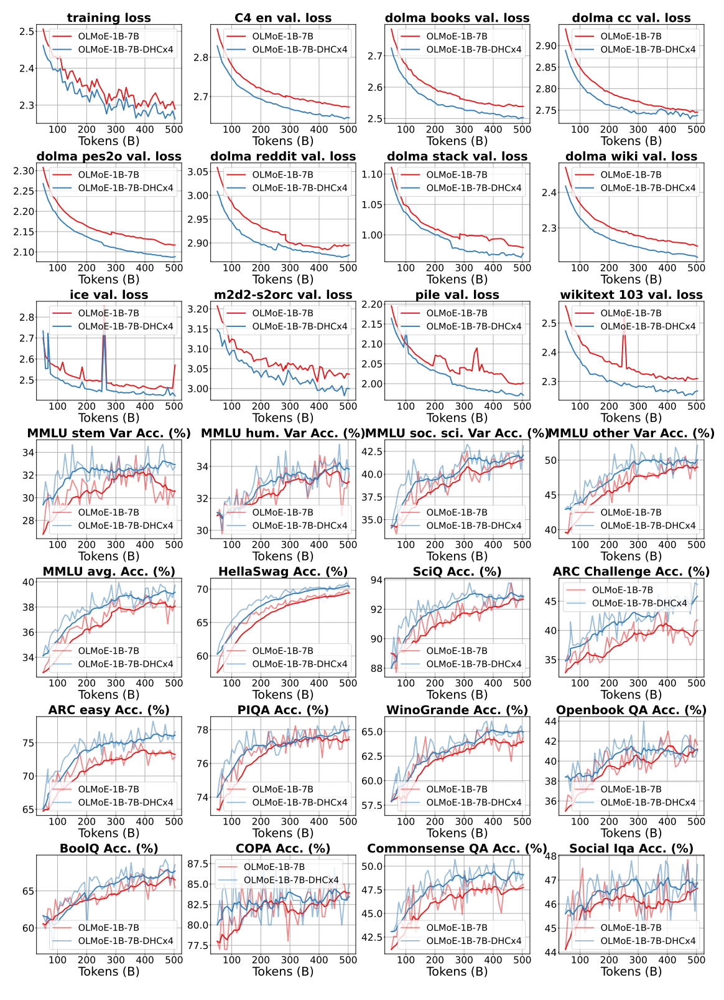

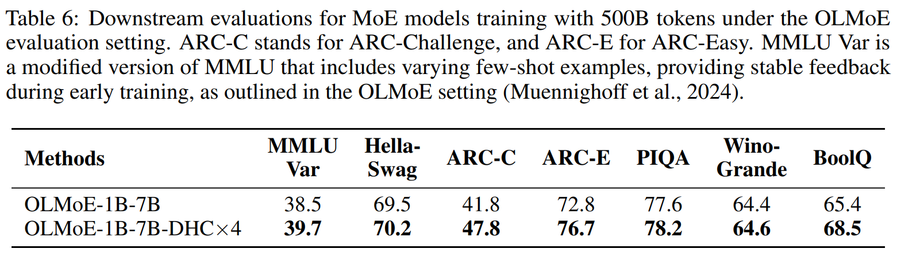

$\textbf{Visualization Analysis}$

- 학습된 HC weight를 분석하여 이전 레이어의 출력이 이후 레이어에 어떻게 기여하는지를 살펴본다. 

- 이를 이해하려면 일단 Pre-Norm과 Post-Norm을 hyper-connection의 수식의 형태로 일반화 시켜야 한다. 

$\textbf{Derivation of Non-Trainable Hyper-Connection Matrix for Residual Connections}$

- 결론적으로 HC로 표현하면 $n=1$이고, $2 \times 2$의 HC matrix가 나온다. 

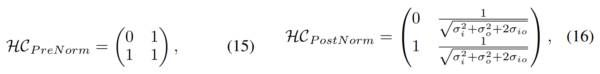

- Pre-Norm은 LN이 $\tau$ 에만 작용하기에 합성 함수로 묶었고, Post-Norm은 LN이 residual 합 전체에 작용하기에 일부만 흡수했다. 

- 이전 레이어가 다음 레이어에 미치는 기여도를 일반화한 식이다. 
    - 이를 Pre-Norm과 Post-Norm에 대해서 값을 넣어보면 아래의 figure의 값이 나온다. 

- OLMo-1B-DHC x 4 model
    - 500B token에서의 ckechpoint를 선택하고, 무작위 validation text를 forward하여 DHC weight를 추출했다. 
    - 첫 번째 열을 보면, 입력 embedding 성분이 대부분의 레이어에 기여하지만, 마지막 레이어에는 거의 기여하지 않는다. 마지막 레이어는 next token prediction을 담당하는 layer이다. 입력 embedding 성분이 그대로 남아있으면 예측 성능에 악영향을 줄 수 있다. 
        - 단어 정보 자체는 최종 출력에서 의미 추론이 아니라 특정 단어와 유사한 토큰의 점수가 높아지는 꼴이다. 
    - 하위 attention layer (green tick marks)를 보면 장기 연결 기여도가 거의 없으며, 이러한 경향은 layer 17까지 지속된다. 즉 attention 출력은 다음 FFN 입력에만 기여하고 주요 residual 경로에는 직접 합쳐지지 않는다. 
    - HC는 pre-norm과 같은 장기 유지 경로와 post-norm과 같은 감쇠 경로를 동시에 학습하고 필요에 따라 병렬 블록 구조까지 형성하며, 입력 embedding의 불필요한 잔존까지 제거한다. 

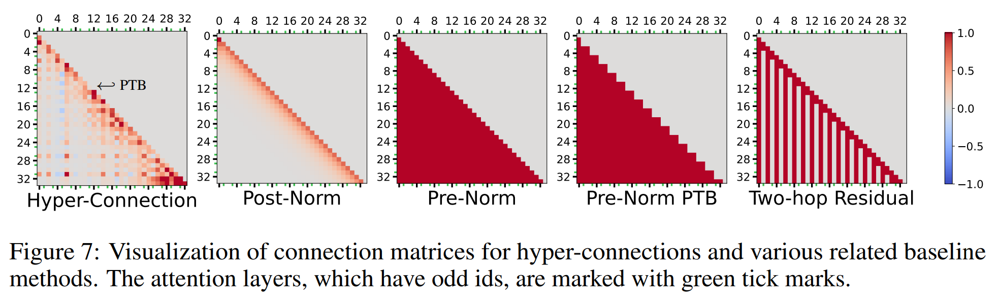

$\textbf{Vision Experiments}$

- ILSVRC-2012 ImageNet dataset with 1k classes and 1.3M images for image generation and classification

- Model: DiT, 1400 epoch

- 실험 결과, HC를 적용한 DiT model은 파라미터 수가 50% 더 많은 기존 DiT 모델과 동등한 성능 지표를 보였다. 
    - 이는 모델 크기를 증가시키지 않고도 성능을 향상시킬 수 있다는 점에서 HC의 효율성과 효과를 입증하는 결과이다. 

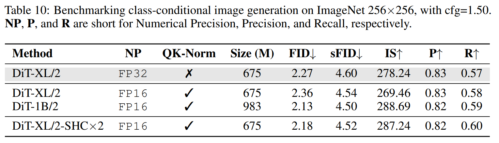

- Classification 
    - ViT/16-Base & ViT/16-Large 
    - Resolution: 224 x 224
    - $n=2$

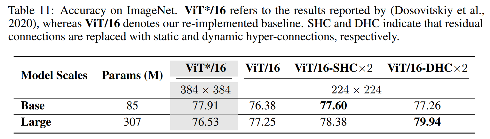

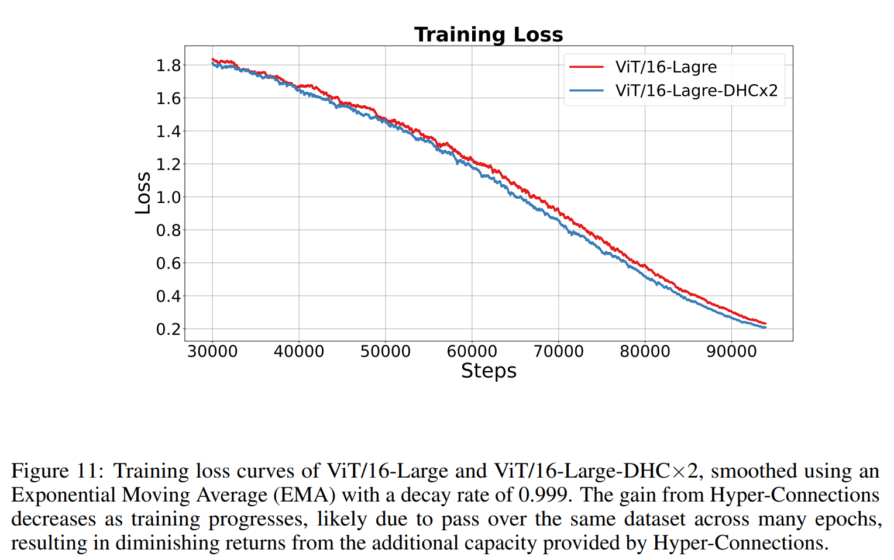

***

### <strong>Conclusion</strong>

***

### <strong>Question</strong>

<a href="">link</a>

> 인용구
