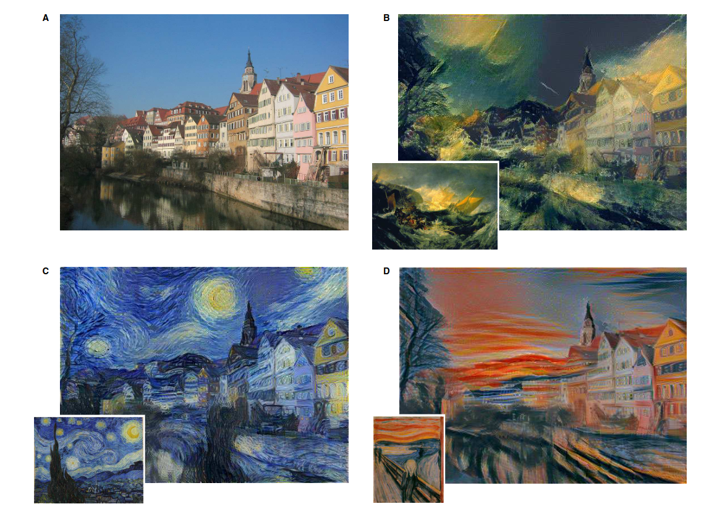
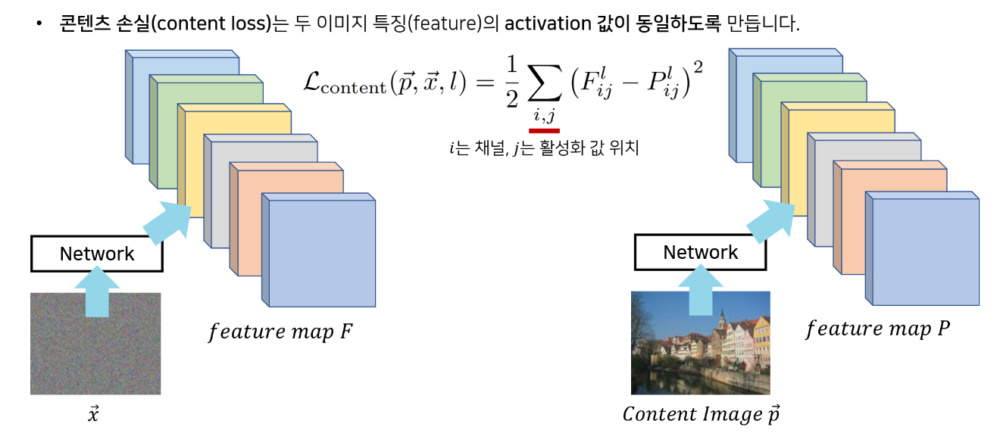
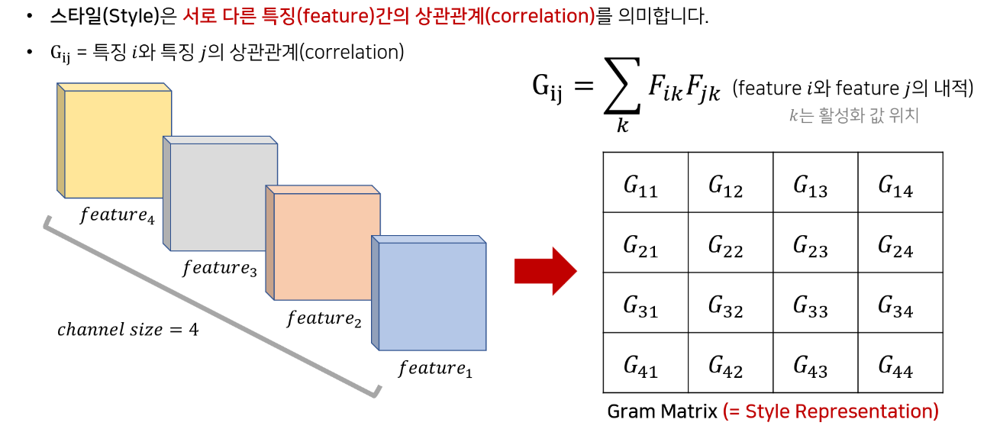
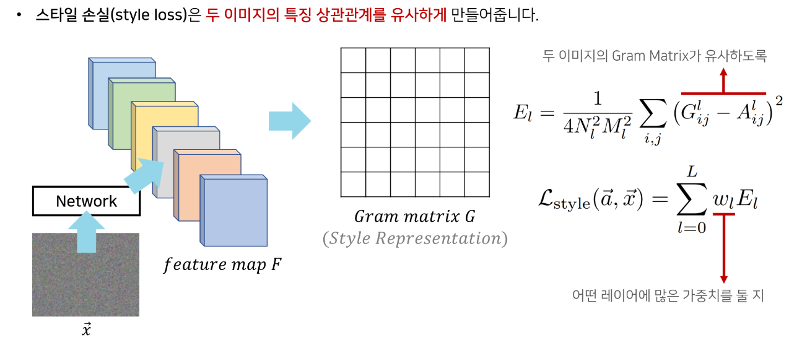
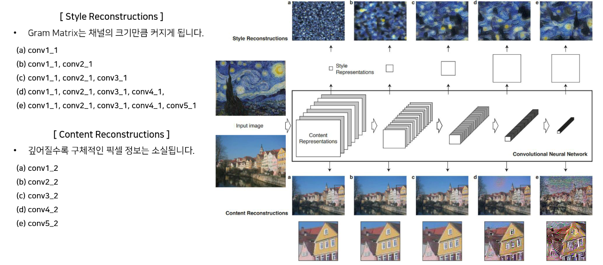
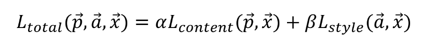
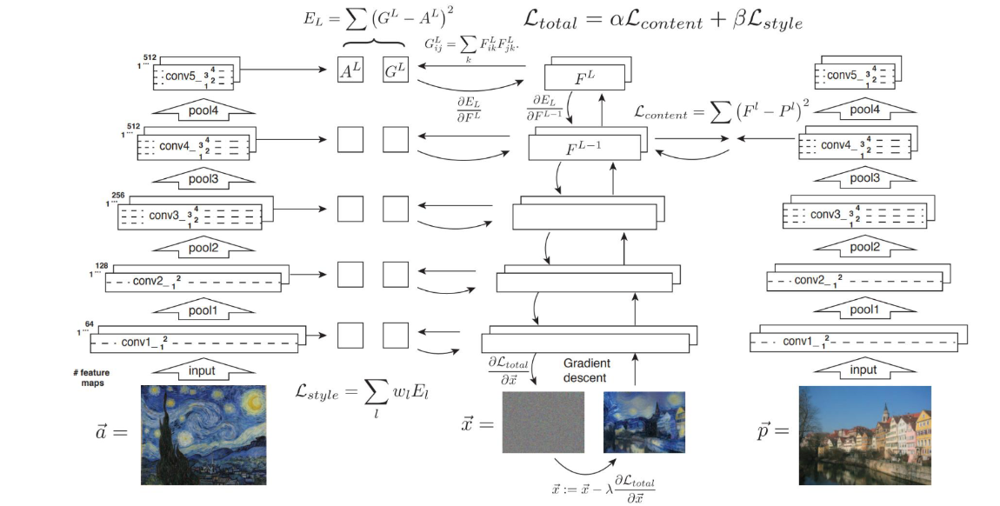
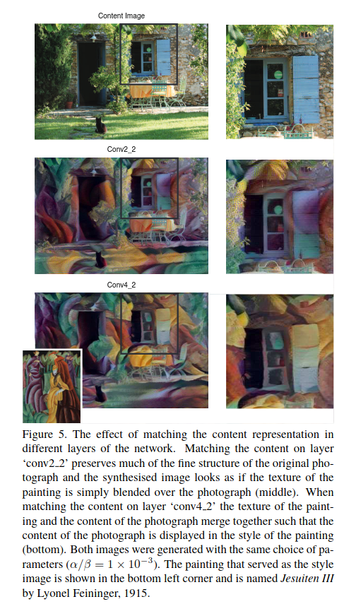

## Image Styler Transfer using Convolutional Neural Networks
*CVPR(2016), 5556 citation*

[Intro](#intro) 
[Related Work](#related-work) 
[Method](#method) 
[Experiment](#experiment) 
[Conclusion](#conclusion) 

> Core Idea

<strong>"Style Transfer using CNN with Explicit Definitions(Gram Matrix-Content and Style Disentanglement)"</strong> 

***

### <strong>Intro</strong>
- 이미지를 다른 스타일로 변환시키는 것은 어려운 과제이다. 지금까지는 style 과 content 를 분리를 가능하게 하는 representation 이 부족했다.
- 이 분리를 CNN 으로 해보겠다는 접근. CNN 으로 추출한 feature representation 으로 texture 를 합성하도록 하겠다.

***

### <strong>Related Work</strong>

***

### <strong>Method</strong>
- CNN 의 filter 는 서로 다른 feature 값을 추출하도록 학습된다.
- 
- Content representation 

- Style representation

***

### <strong>Experiment</strong>

***

### <strong>Conclusion</strong>

***

### <strong>Question</strong>

