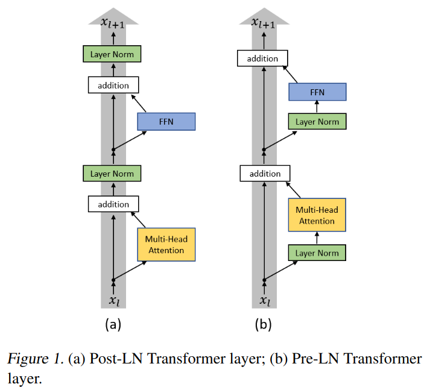
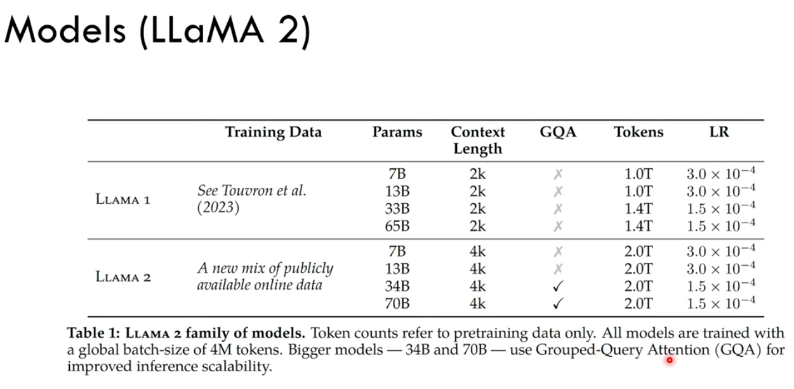
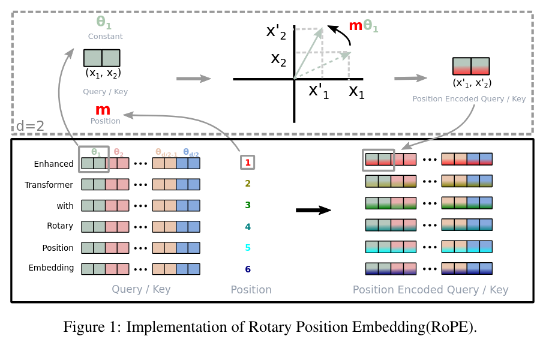

## LLaMA: Open and Efficient Foundation Language Models
*arXiv(2023), 8982 citation, Meta AI, Review Data: 2024.10.06*

[Intro](#intro) 
[Related Work](#related-work) 
[Method](#method) 
[Experiment](#experiment) 
[Conclusion](#conclusion) 

> Core Idea

<strong>"test1"</strong> 

***

### <strong>Intro</strong>

- Meta AI에서 공개한 LLM model
  - 7B ~ 65B 규모의 foundation language model이다. 
  - 저작권이 있거나 접근 불가능한 데이터 사용 없이, public data만으로도 SoTA를 달성할 수 있다는 것을 보였다. 
  - 성능 측면에서 LLaMA-13B가 GPT-3 (175B)보다 성능이 좋다. 
    - LLaMA-13B는 single GPU로 inference가 가능하다. 

***

### <strong>Related Work</strong>

***

### <strong>Method</strong>

**Implementation detail**

<a href='https://www.youtube.com/watch?v=Mn_9W1nCFLo'>Youtube Link</a>

$\textsf{Architectural differences between the vanilla Transformer and LLaMA}$

- Difference: LLaMA 기준에서 설명
  - Block전에 RMS Noramlization을 수행한다.
  - (Rotary) Positional encoding은 Query & Key에 대해서만 한다.
  - Vanilla transformer는 feed forward에 ReLU를 사용하지만 LLaMA는 SwiGLU를 사용한다.

- 기존의 (a) Post-LN Transformer layer와 다르게 (b) Pre-LN Transformer layer를 사용하는 이유는 아래와 같다. 
  - 참조 논문: <a href='https://arxiv.org/pdf/2002.04745'>On Layer Normalization in the Transformer Architecture (2020)</a>
  - 간략하게 말하자면, (a) Post-LN는 일반적으로 사용하며 SoTA 성능을 달성했다. 하지만 그러한 성공에도 불구하고 Post-LN Transformer의 최적화는 Conv layer나 다른 sequence-to-sequence 모델보다 더 신중하게 다뤄야한다. 
  - 특히 모델을 처음부터 훈련시키기 위해서는 learning rate warm-up이 필요하다. Warm-up 단계는 최적화 과정을 느리게 만들 뿐만 아니라, hyper-parameter의 수고를 더하게 된다. 최종 모델 성능이 최대 학습률 값 (maximum learning rate)과 warmup step에 상당히 민감하다는 것을 <a href='https://arxiv.org/pdf/1804.00247'>Training Tips for the Transformer Model (2018)</a> 에서 보여주었다. 
  - 참조 논문에서는 warmup step을 제거하여 대체하는 방법을 제안한다. Layer normalization이 gradient 척도를 제어하는데 결정적인 역할을 하는 것을 확인했고, 이를 (b)의 구조에 적용시켜 학습을 안정적으로 제어했다. 이를 통해 warmup step을 제거할 수 있었고 결과적으로 hyper-parameter 수가 감소한다. 

> Warmup: 천천히 learning rate를 올리는 작업을 뜻한다. lr을 2로, warmup step을 10,000로 설정했다면 lr은 10,000 step동안 2까지 증가하게 된다. 이 기법은 학습 초기에 모델의 가중치를 서서히 조정하여 안정적으로 학습을 시작할 수 있도록 돕는 기법이다. 이는 학습 초기에 큰 학습률로 인해 발생할 수 있는 가중치의 급격한 변화와 그로 인한 학습의 불안정성을 방지한다. 

<a href='https://arxiv.org/pdf/1804.00247'>Training Tips for the Transformer Model (2018)</a>

- Warmup step과 batch size를 고정시키고 learning rate의 효과를 보여주는 결과이다.
  - Attention is all you need 논문의 Base & Big model(text-to-text model)을 학습시켰다. 
  - 0.05 ~ 0.25 범위 내에서 lr을 변경해도 거의 차이가 없다는 것을 보여준다. 
  - 학습률을 너무 낮게 설정하면 (0.01) 수렴 속도가 눈에 띄게 느려진다.
  - 학습률을 너무 높게 설정하면 (0.3, 그림에 표시되지 않음) 훈련이 발산한다. (학습 곡선이 보통처럼 성장하다가 어느 순간 거의 0까지 떨어지고 유지)
  - 이를 방지하는 일반적인 해결책은 (1) learning_rate를 줄이거나 (2) warmup_step을 늘리거나 (3) 기울기 클리핑을 도입하는 것이다. 
  - 실제로 warm-up step을 16K에서 32K로 늘렸을 때, learning rate=0.30, 0.50에서도 발산 없이 훈련할 수 있었다. 그 학습 곡선은 (warmup: 16K, learning rate: 0.20)과 유사하게 나타났다. 
  - Learning rate를 1.0까지 늘렸을 때는 warmup step을 60K로 늘려야 했다. 

- 고정된 learning rate (0.20)에서 서로 다른 warmup step이 미치는 영향을 보여준다.
  - warmup step을 너무 낮게 설정하면 (12K) 훈련이 발산되다. 
  - 너무 높게 설정하면 (48K) 처음에는 약간 느린 수렴이 나타나지만, 결국에는 기본값과 일치하게 된다. 

- Hyper-parameters
  - Dimension: the size of the embedding vector
  - Heads: attention heads
  - Layers: the number of the block

- Versus LLaMA 2

$\textsf{Input Embedding}$

$\textsf{RMS Normalization (with review of Layer Normalization)}$

- LayerNorm의 잘 알려진 성공의 이유는 re-centering & re-scaling invariance property이다. 입력 데이터보다 learnable parameter (scaling & shifting factor)에 의존
  - Re-centering invariance: input이 shift되어도 평균을 0으로 맞추기 때문에 학습에 영향을 주지 않는다.  
  - Re-scaling invariance: input이 특정 상수배로 크기가 변하더라도 LayerNorm은 이를 표준편차로 나눠서 정규화하므로, 학습에서 크기 변화에 민감하게 반응하지 않는다. 

- 하지만, <a href='https://arxiv.org/pdf/1910.07467'>RMS LayerNorm (2019)</a> 에서는 re-centering invariance보다 re-scaling invariance가 더 긍정적인 영향을 가지고 있다고 가정했다.
  - 따라서 re-scaling만을 진행

$\textsf{Rotary Positional Embeddings (RoPE)}$

- Vanilla Transformer: Absolute positional encoding

- Transformer의 위치 정보를 추가해주기 위해 사용되는 position representation을 절대적인 위치 정보 (i.e., 나는 몇 번째야!)가 아닌 상대적인 위치 정보 (i.e., 나는 2번째 단어와 3칸 떨어져있고 4번째 단어와는 1칸 떨어져있어)로 나타낸다는 아이디어를 제시
  - <a href='https://arxiv.org/pdf/1803.02155'>Self-Attention with Relative Position Representations (2018)</a>
  - Self-attention에 각각의 input element끼리의 관계를 고려하는 거리 개념을 추가했다. 
  - Query와 key의 거리, query와 value간의 거리를 각각의 key, value에 더해준다. 
  - Query와 Key (=Value)단어 사이의 관계를 이용하여 Value의 정보를 re-encoding하는 attention module에서 위치 정보는 중요하게 사용된다. 따라서 attention module에 직접적으로 Key & Value와 Query간의 거리 정보를 주입하는 꼴이다. 

- Query와 key의 거리, query와 value간의 거리를 표현하고 있다. 
  - 학습가능한 embedding을 사용
  - $a_{2,1}^{V} = W_{-1}^{V}$: Query의 2번째 token과 Value의 1번째 token간의 상대적인 위치를 나타내는 벡터, Query의 2번째 token을 기준으로 순서 상 1번째는 뒤로 한 칸 가야되니 $-1$로 표현했다. 
  - 이는 거리 개념이므로 head간 공유한다. 

- 구체적인 수식으로 보자면,
  - Scaled dot product > Softmax > Matrix multiplication with Value인데 
  - 이 중에서 Scaled dot product & Matrix multiplication with Value에서 작동된다. 

- 변형된 Scaled dot product
  - $a_{ij}^{K}$: i번째 단어와 j번째 단어 사이의 거리 for Key

- Softmax

- 변형된 Matrix multiplication with Value
  - $a_{ij}^{V}$: i번째 단어와 j번째 단어 사이의 거리 for Value

- 일정 길이 (절댓값 $k$) 이상 단어 (token)들이 떨어졌을 경우, 거리차이 ($j-i$)가 무의미 하다는 것을 발견하여 (절댓값 $k$)보다 먼 단어들은 $k$로 cliping한다. 

<a href='https://arxiv.org/pdf/2104.09864'>RoFormer: Rotary Position Embedding (2023)</a> 

- RoPE의 기여점은 크게 $3$가지이다. 
  - Flexibility of sequence length
    - 고정된 길이의 입력 데이터에만 국한되지 않고, 다양한 길이의 입력 데이터를 효과적으로 처리할 수 있다. 
  - Decaying inter-token dependency with increasing relative distances
    - RoPE 는 상대적 거리가 증가함에 따라 토큰 간의 의존성을 자연스럽게 감소시키는 특성을 가지고 있다.
    - 이는 모델이 멀리 떨어진 토큰 간의 상관관계를 적절히 줄여줌으로써, 더 효율적이고 정확한 처리를 가능하게 한다.
    - Capability of equipping the linear self-attention with relative position encoding
      - Linear self-attention 을 통해 입력 데이터 내에서 토큰들의 상대적 위치 정보를 효과적으로 활용할 수 있다.

- Related work for relative position embedding
  - $P$: absolute positional embedding
  - $\tilde P$: relative positional embedding
  - Transformer-XL에서의 수식 중, 첫 번째 줄은 $P$로 표현되어 있는 것을 볼 수 있다. 이는 naive transformer에서의 query, key 내적을 풀어서 쓴 것이다. 
  - $P_n$: Key의 n번째 token
  - $P_m$: Query의 m번째 token
  - $m-n$: n번째 token과 m번째 token간의 상대적 위치

- 본 논문에서는 상대 위치 정보를 통합하기 위해, query $q_m$와 key $k_n$의 내적이 단어 임베딩 $x_m, x_n$과 그 상대 위치 $m-n$을 입력 변수로 사용하는 함수 $g$에 의해 공식화되어야 한다고 주장한다. 즉, 내적이 상대적인 형태로만 위치 정보를 encoding하는 것을 원한다. 

- Rotary (회전하는) position embedding
  - 기존의 Query, Key를 구하는 공식에서 complex form (rotation matrix in two dimensions)을 도입하여 기하학적으로 회전시켰다. 
  - 이는 기존의 additive한 방식으로 위치 정보를 더하는 방식과 비교하여 dot-product에 더 적합하다. (additive는 값의 크기를 변화시킨다.)
 
- 2D case 즉, vector의 dimension이 $2$인 경우를 고려해보자 
  - 아래의 수식에서 각각의 $f_{q,k}$를 (Query and Key) $m\theta$만큼 회전시킨다. (**직교 좌표계와 극 좌표계는 동일한 점이고 표현 방식만 다른것이다.**)
  - 상대적 거리가 먼 token일수록 $(m-n)$ 두 token사이의 각도는 커진다. 
  - 각 벡터의 크기는 동일하지만 각도를 조절하여 내적값이 두 token사이의 거리를 효율적으로 반영할 수 있다.
  - $<a, b> = ||a|| \cdot ||b|| cos\theta$

- 2D rotary matrix를 확장시켜 일반화하면, 다음과 같다. 
  - 2D를 확장시켰지만, 위와 동일하게 $2$차원의 벡터씩 분할하여 rotate한다.
  - $d/2$로 분할하여 $2$차원의 vector에 대해서 각각 계산한 후 더해도 된다.
    - $\sum$ rotate한 $2$ 차원의 vector 내적 = $d$ 차원의 rotate한 벡터 내적
  - 하지만 이 matrix는 sparse (대부분의 요소값이 $0$)하다.
  - 실제로 $\theta_i$값은 transformer에서 제안한대로 $\theta_i = 10000^{(-2i)/d}$를 사용했다.

- 따라서 효율적으로 form을 바꾼다.
  - 이는 기존의 positional embedding들이 가산적 특징을 통해 위치를 인코딩하는 것과 대조되며 곱셉으로 위치 정보를 인코딩한다.
  - 주목해야 될 점은 rotary position embedding이 query와 key에만 적용된다는 것이다. (value x, 상대적인 관계를 구하는 연산은 softmax까지이기 때문에)
  - 또한, rotary embedding은 weight matrix $W$와 $x_m$이 곱해진 Query, Key에 적용된다.

$\textsf{KV-Cache}$

- 추론 시에 우리는 이전의 정보를 이미 가지고 있기에 model의 last token에만 관심이 있다. 하지만 auto-regressive 모델은 next token을 예측하기 위해 이전의 모든 token들에 접근을 필요로 한다. 
  - LLM은 <eos> token이 output으로 나올때까지, 한 번에 하나씩 auto-regressive하게 token을 생성한다. 각 output token을 생성하기 위해선 이전의 모든 intermediate state (key & value)
- 추론 시에 이미 본 token들에 대해서 적은 계산을 할 수 있는 방법이 바로 KV cache이다.
- KV cache는 Key/Value tensor를 GPU memory에 저장한 후, 재사용하는 것으로 이전 토큰의 Key/Value tensor를 재계산하는 것을 막아 연산량을 줄이는 방법이다. 

- KV cache의 size
  - 2 (key & value) x 5120 (hidden size) x 40 (number of layers) x 2 (bytes per FP16) = 819200 bytes = 800KB
  - 만약 모델이 최대 $2048$ token까지 생성이 가능하다면, $2048 \times 800KB = 1638400KB = 1600MB = 1.6GB$의 용량이 필요하다. 즉, 한 개의 request가 1.6GB의 메모리를 차지한다. 

- LLM에서 global connection을 가지는 (병렬적으로 처리되는 batch끼리 통신) block은 Transformer block밖에 없다. 따라서, 가장 최신의 정보인 query 4를 가지고 이전 정보를 담고 있는 각각의 key와 correlation을 구한다. 
  - 그렇다면, 우리는 현재의 query 4가 전체의 정보 (Key matrix)에서 어떤 key랑 연관이 있는지 파악할 수 있고 이를 통해 전체의 정보 (Value matrix)를 re-encoding할 수 있다. 

$\textsf{Multi-Query Attention}$

- Query만 $h$ 개의 head를 가지고 Key와 Value는 단일 head로 구성한다.
- 더 적은 연산량과 더 적은 메모리를 요구한다.
- <a href='https://arxiv.org/pdf/1911.02150'>Fast Transformer Decoding: One Write-Head is All You Need</a> 에서 제안했다.

- 이 표는 WMT14 EN-DE 번역 작업에서 sequence length가 $128$일 때, 각 출력 토큰에 대한 TPUv2 마이크로초 단위로 측정된 학습 및 추론 비용을 보여주고 있다.
  - 표에서 다루는 4가지 주의(attention) 유형은 다음과 같습니다: multi-head, multi-query, multi-head local, multi-query local. 각 유형에 대해 학습(Training), 추론(Inference), 그리고 Beam-4 검색(Beam-4 Search)의 비용이 나열되어 있습니다.
  - Local: decoder의 self-attention이 전체 시퀀스가 아닌, 현재 위치와 그 앞의 $31$개 위치까지만 참조하도록 attention 범위를 좁힌다는 의미이다.
  - Training: 학습에 소요되는 시간입니다. multi-query와 multi-query local이 13.0 마이크로초로 가장 낮은 비용을 보입니다.
  - Inference (enc. + dec.): 추론(encoder + decoder)에 소요되는 시간입니다. 여기서 multi-query local이 1.5 + 3.3 마이크로초로 가장 효율적입니다.
  - Beam-4 Search (enc. + dec.): Beam-4 검색(encoder + decoder)을 사용한 추론 비용입니다. 마찬가지로 multi-query local이 1.6 + 16 마이크로초로 가장 낮은 비용을 기록합니다.

- WMT14 EN-DE 데이터셋에서 다양한 attention 유형에 따른 성능을 비교
  - dev: validation set

- 계산 속도가 빨라지지만 성능이 저하될 위험이 있고, 학습이 불안정하다는 문제가 있다.

$\textsf{Grouped Multi-Query Attention}$

- Multi-head의 높은 성능과 Multi-Query의 빠른 계산량의 장점을 통합한 방법이다.
- $H$개 있던 $KV$ 헤드를 $1$개로 줄이는 대신 적절한 $G$개의 그룹으로 줄인다.
- $G$가 $1$이 되면 MQA가 되고 $H$가 되면 MHA가 되니까 GQA는 MHA와 MQA를 포함한 일반화라고 볼 수 있다.
- <a href='https://arxiv.org/pdf/2305.13245'>GQA: raining Generalized Multi-Query Transformer Models from Multi-Head Checkpoints</a>

$\textsf{SwiGLU Activation Function}$

***

### <strong>Experiment</strong>

***

### <strong>Conclusion</strong>

***

### <strong>Question</strong>

<a href="">link</a>

> 인용구
