## mHC: Manifold-Constrained Hyper-Connections
*arXiv(2026), 10 citation, DeepSeek-AI, Review Data: 2026.02.11*

[Intro](#intro) 
[Related Work](#related-work) 
[Method](#method) 
[Experiment](#experiment) 
[Conclusion](#conclusion) 

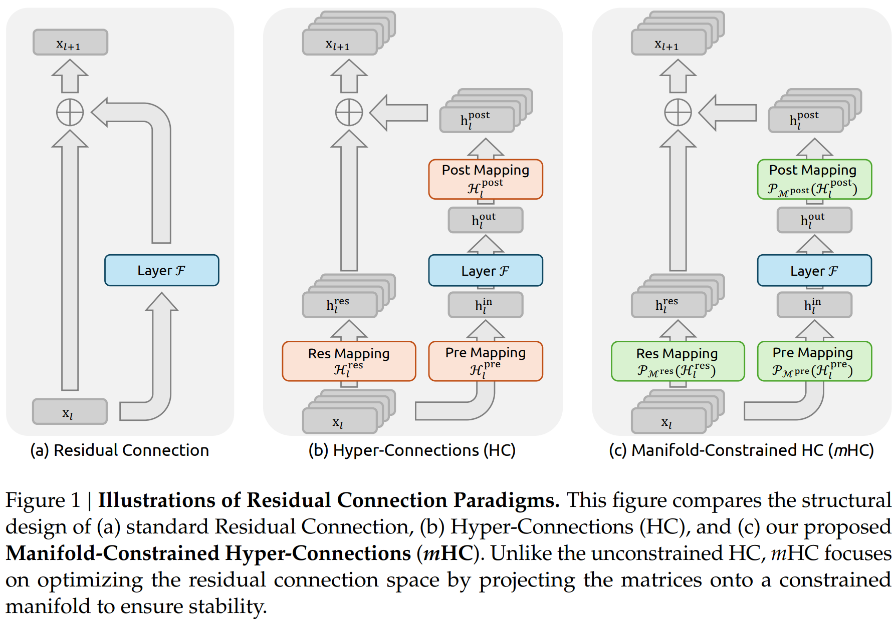

> Core Idea

<strong>"test1"</strong> 

***

### <strong>Intro</strong>

- 최근 Hyper-Connection (HC)로 대표되는 연구들은 지난 10년간 널리 사용된 residual connection 패러다임을 확장하여, residual stream의 너비를 증가시키고 연결 패턴을 다양화했다. 

- 하지만 동시에 residual connection이 본래 갖고 있던 identity mapping 속성을 근본적으로 훼손하였다. 그 결과 심각한 학습 불안정성과 확장성의 제한이 발생하며, 추가적으로 메모리 접근 오버헤드도 크게 증가한다. 

- 이러한 문제를 해결하기 위해 본 논문은 Manifold-Constrained Hyper-Connections (mHC)를 제안한다. 
    - mHC는 HC의 residual 연결 공간을 특정한 다양체 (manifold)로 사영 (projection)하여 identity mapping 속성을 복원하는 일반적인 framework이다. 

- 실험 결과, 대규모 학습 환경에서 효과적으로 작동하며, 실제 성능 향상과 더 우수한 확장성을 제공함을 확인했다. 

- Residual connection은 단순한 형태에서 비롯된다.
    - $L, l$: 더 깊은 레이어, 얕은 레이어 
    - Identity mapping: 얕은 레이어의 신호 $x_l$이 아무 수정 없이 깊은 레이어로 직접 전달되는 성질

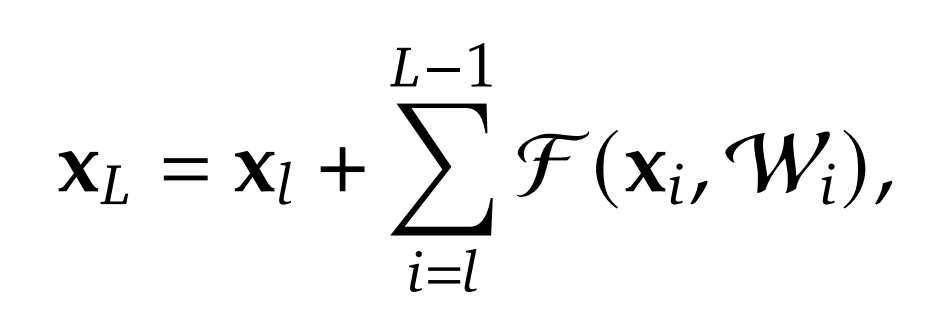

- HC는 residual stream의 너비를 확장하고 연결 복잡도를 증가시켜, 개별 연산의 FLOPs를 증가시키지 않으면서도 위상적 (topological) 복잡성을 크게 향상시킨다. 
    - $x_l, x_{l+1}$의 feature dimension은 $C$에서 $nC$로 확장됨, $n$: expansion rate 
    - $H_l^{res} \in \mathbb{R}^{n \times n}$: layer rearragement, HC로 따지면 $\alpha_r$
    - $H_l^{pre} \in \mathbb{R}^{1 \times n}$: layer 입력에 들어가기 전 hidden vector들을 조합, $\alpha_m$
    - $H_l^{post} \in \mathbb{R}^{1\times n}$: residual strength, layer의 output에 곱해지는 scalar

- HC는 훈련 규모가 커질수록 불안정성 위험을 내포한다. 
    - 핵심 문제는 HC의 제약없는 구조가 identity mapping 속성을 훼손한다는 것이다. 
    - 즉, forward 및 backward 전파 동안 stream 전체 평균 신호 강도가 일정하게 유지되어야 한다. 
        - 전체 평균 신호 (전역 평균)은 한 마디로 $x_L$을 구할 때 기존의 residual은 $x_l$이 항상 일정하게 존재해서 마치 평균의 역할을 제공한다는 의미이다. HC에서는 앞의 계수가 학습됨으로써 보존이 안됨.

- 기존의 residual의 재귀적 식 (위에 있음)과는 달리 HC의 $\prod H^{res}$의 전역 평균을 보존하지 못한다. $x_l$의 계수
    - 그 결과 신호가 무한히 증목되거나 급격히 감쇠되며 대규모 학습에서 불안정성이 발생한다. 
    - 또한 FLOPs 측면에서는 효율적이지만, 확장된 residual stream의 메모리 접근 비용이 고려되지 않았다. 이로 인해 실제 대규모 학습에서 확장성이 제한된다. 

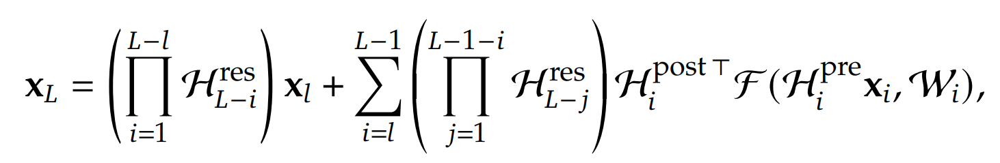

- 이 문제를 해결하기 위해 저자들은 mHC를 제안했다. (identity mapping 복원)
    - Sinkhorn-Knopp algorithm을 사용하여 $H_l^{res}$를 Birkhoff polyotope로 사영
    - 즉, residual matrix를 이중 확률 행렬로 제한한다. 이 행렬의 특징은 각 행의 합 = 1, 각 열의 합 = 1이다. 
    - 따라서, $H_l^{res} x_l$은 입력 feature의 convex combination이 된다. 
        - Feature 평균이 보존됨 
        - 신호 norm이 엄격히 제어됨
        - Gradient exploding/vanishing 위험 완화 
        - 또한 이중 확률 행렬은 곱해도 다시 이중 확률 행렬이 되므로 $\prod H^{res}$도 동일한 보존 성질을 유지한다. 

***

### <strong>Related Work</strong>

***

### <strong>Method</strong>

$\textbf{Preliminaries}$

- 실험 결과에 따르면, 가장 큰 성능 향상은 residual $H_l^{res}$에서 발생한다. 
    - 이전 논문인 HC에서는 $\beta$, 여기서는 $H_l^{post}$의 영향이 적다고는 얘기함.
    - 이는 residual stream 내부에서의 정보 교환이 모델 성능에 매우 중요하다는 것을 의미한다. 

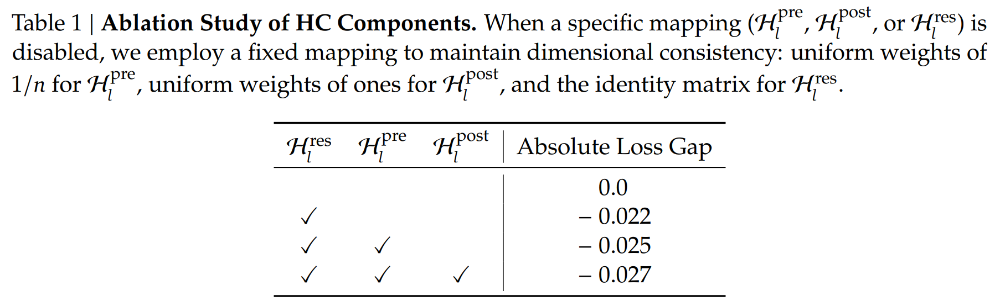

$\textit{Numerical Instability}$

- HC의 residual mapping $H_l^{res}$는 성능 향상에 중요한 역할을 하지만, 이를 연속적으로 적용하면 수치적 안정성에 심각한 위험을 초래할 수 있다. 
- HC를 여러 레이어에 걸쳐 확장하면 layer $l \rightarrow L$ 까지의 실제 신호 전달에는 아무런 제약이 없기 때문에 필연적으로 identity mapping에서 벗어나게 된다. 
- 그 결과 forward pass 중 신호 크기가 폭발하거나, backpropagation 중 신호가 소실될 가능성이 높다. 이는 residual learning의 핵심 전제인 "신호가 방해받지 않고 흐른다"는 특성을 훼손하며, 특히 더 깊거나 대규모 모델에서 학습 과정을 불안정하게 만든다. 
- 대규모 실험에서 이러한 분석을 뒷받침하는 불안정한 loss 현상이 관찰됐다. 
    - 27B models
    - 기존 HC는 약 12k step에서 예상치 못한 loss 급등을 보임. 이는 graidnet norm의 불안정성과 강하게 상관되어 있다. 

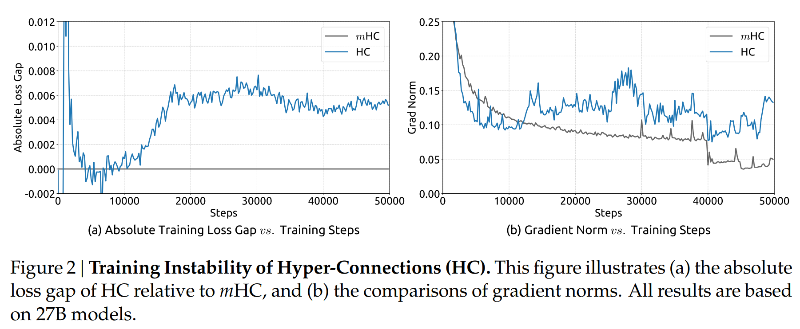

- 또한, $H_l^{res}$에 대한 분석은 이러한 불안정성의 매커니즘을 확인해준다. 
    - 합성 매핑 $\prod H^{res}$가 stream을 따라 얼마나 신호를 증폭시키는지를 정량화하기 위해 두 가지 지표를 사용했다. 
        1. 합성 매핑의 row sum의 최대 절댓값
            - forward pass에서의 최악의 신호 확장 정도 
        2. 합성 매핑의 column sum의 최대 절댓값 
            - backward pass에서의 최악의 gradient 확장 정도 
        - 이 지표를 본 논문에서는 합성 매핑의 **Amax Gain Magnitude** 라고 부른다. 
    - 그림에서 볼 수 있듯이, Amax Gain Magnitude는 최대 $3000$까지 치솟았으며, 이는 이상적인 값인 $1$에서 극단적으로 벗어난 것이다. 

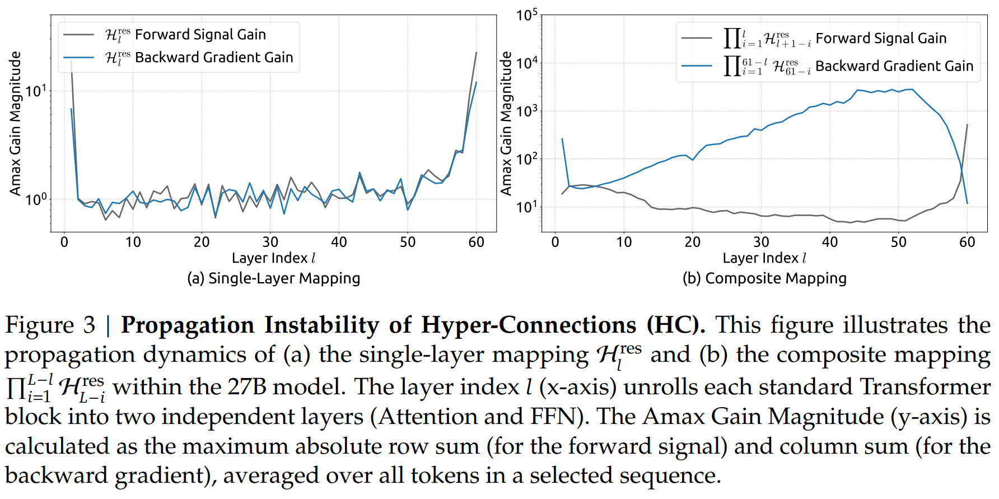

$\textit{System Overhead}$

- HC는 addtional mapping이 linear이기 때문에 FLOPs 측면에서는 계산 복잡도가 관리 가능하다. 
    - 그러나 시스템 수준의 오버헤드는 무시할 수 없는 문제를 야기한다. 
    - 특히 메모리 접근 (I/O) 비용은 주요 병목으로 작용하며 이는 memory wall로 알려져 있다. 이 병목은 종종 architecture 설계에서 간과되지만, 실제 실행시간 (runtime efficiency)에 결정적인 영향을 미친다. 

- 단일 residual layer에서 n-strem residual 설계로 인해 발생하는 토큰 당 메모리 접근 오버헤드를 요약한다. 
    - 분석 결과 HC는 메모리 접근 비용을 대략 $n$배 증가시킨다. 

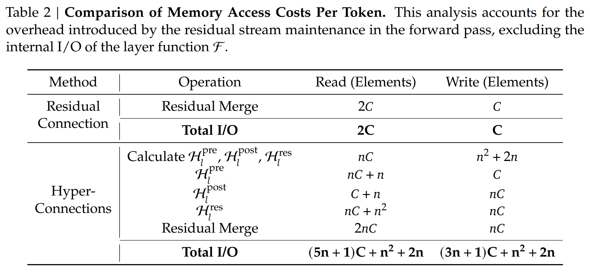

$\textbf{Manifold-Constrained Hyper-Connections}$

- Identity mapping 원리에서 영감을 받아, mHC의 핵심 아이디어는 residual mapping $H_l^{res}$을 특정한 manifold 위로 제한하는 것이다. 
    - 기존 identity mapping은 $H_l^{res} = I$를 강제함으로써 안정성을 보장하지만 이 방식은 residual stream 내부에서의 정보 교환을 근본적으로 차단한다. 
    - $H_l^{res}$는 Multi-stream 아키텍처의 잠재력을 최대화하는 데 매우 중요하다. 

- 따라서 본 논문은 다음 $2$ 가지를 동시에 만족하는 mapping을 목표로 한다. 
    - 레이어 간 신호 전달의 안정성 유지 
    - residual stream 간 상호작용을 허용하여 모델 표현력 유지 

- 이를 위해 $H_l^{res}$ 을 이중 확률 행렬 (doubly stochastic matrix)로 제한한다. 
    - 이 행렬은 다음 조건을 만족한다. 
    - 모든 원소가 $0$ 이상 (non-negative)
    - 각 행의 합 $= 1$
    - 각 열의 합 $= 1$                           

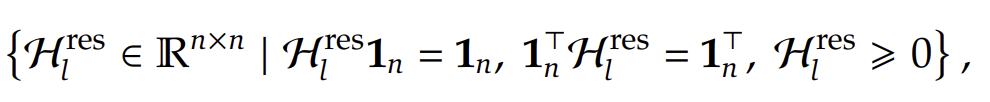

- $n=1$인 경우 
    - doubly stochastic 조건은 단순히 스칼라 $1$ 로 축소되며, 이는 원래의 identity mapping을 그대로 복원한다.  

- Doubly stochastic 제약은 대규모 모델 학습에 유리한 여러 중요한 성질을 제공한다. 
    1. Norm preservation 
        - Dobuly stochastic 행렬의 spectral norm은 $1$ 이하다. 
        - 이는 해당 매핑이 non-expansive (확장시키지 않는) 연산임을 의미하며 gradient explosion 문제를 효과적으로 완화한다. 
    2. Compositional Closure (합성 폐쇄성)
        - Doubly stochastic 행렬들의 집합은 행렬 곱에 대해 닫혀 있다. 
        - 즉, 행렬들의 곱도 역시 doubly stochastic 행렬이므로 모델의 전체 깊이에 걸쳐 residual mapping의 안정성이 유지된다. 
    3. Birkhoff polytope을 통한 기하학적 해석
        - 집합 $M_{res}$는 Birkhoff polytope를 형성하며, 이는 permutation matirx들의 convex hull이다. 
        - 이로부터 얻어지는 직관적 해석은 다음과 같다.
            1. Residual mapping은 여러 permutation (특징 재배열)의 convex combination으로 작동한다. 
        - 수학적으로 이러한 행렬을 반복 적용하면 stream간 정보 혼합이 단조롭게 증가하게 되며, 이는 강력한 feature fusion mechanism으로 작용한다. 

- 추가제약: 입력/출력 mapping 
    - 또한 본 논문은 input mapping $H_l^{pre}$와 output mapping $H_l^{post}$에 대해서도 non-negativity 제약을 적용한다. 
    - 이 제약은 양수와 음수 계수의 조합으로 인해 발생할 수 있는 신호 상쇄를 방지한다. 

- 기존 함수와 비교하면 `tanh` 가 빠짐 

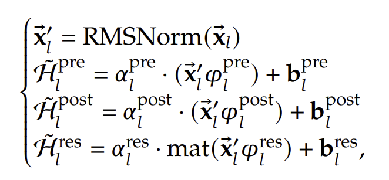

- Non-negative 제약과 doubly-stochastic 제약

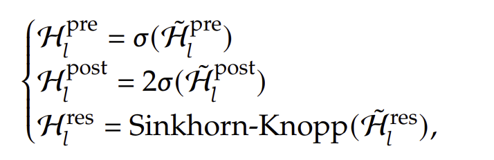

- `tanh`가 빠진 기존 함수를 그대로 사용해서 $H_l^{res}$를 먼저 구한다. 
    - 이후 양수를 강제해야 하니 $exp$을 취한다. 
    - 행의 합, 열의 합이 $1$ 이 되는 조건을 동시에 만족시키기 어려우니, 하나씩 한다. 
    - $\tau_r$: 각 행을 그 행의 합으로 나눔 
    - $\tau_c$: 각 열을 그 열의 합으로 나눔 

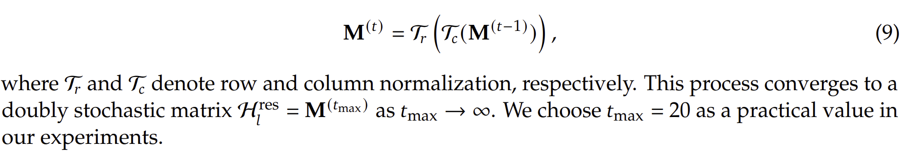

$\textbf{Efficient Infrastructure Design}$

- mHC에 특화된 인프라 설계를 설명한다. 
    - 엄격한 최적화를 통해, 대규모 모델에서 $n=4$인 mHC를 적용하면서도 학습 오버헤드를 단지 6.7% 증가에 그치도록 구현하였다. 

$\textit{Kernel Fusion}$

- mHC에서 RMSNorm이 고차원 hidden state에 대해 수행될 때 상당한 latency를 유발한다는 점을 관찰했다. 
    - 이에 본 논문은 norm으로 나누는 연산을 행렬곱 이후로 재배치하였다. 이 최적화는 수학적 동등성을 유지하면서도 효율성을 향상시킨다. 

***

### <strong>Experiment</strong>

- HC와 mHC 모두에서 확장 비율 $n=4$ 
- 주요 실험 대상은 27B model이며, 모델 파라미터 수에 비례하는 크기의 데이터셋으로 학습 
- 추가적으로 더 작은 3B, 9B model을 동일한 비율의 데이터로 학습하여 연산량 스케일링을 분석 
- 토큰 스케일링(token scaling) 특성을 별도로 조사하기 위해 3B 모델을 고정된 1조(1T) 토큰 코퍼스로 학습하였다.

$\textbf{Training stability and Convergence of 27B models}$

- mHC는 HC에서 나타나는 학습 불안정을 효과적으로 완화하였다. 
    - (a): 최종적으로는 baseline 대비 loss가 0.021 감소하였다. 
    - (b): 이러한 안정성 향상은 (b)의 gradient norm 분석에서도 확인된다. 
        - mHC는 HC보다 훨씬 안정적인 거동을 보이며, baseline과 유사한 수준의 안정적인 gradient를 유지하였다. 

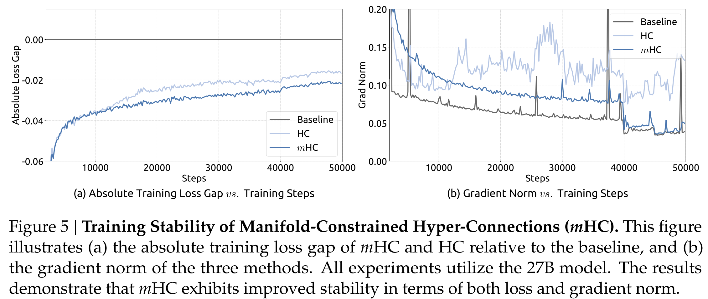

$\textbf{Downstream performance}$

- 다양한 벤치마크에서의 성능을 보여준다. 
    - mHC는 전반적으로 성능을 향상시켰으며, baseline을 일관되게 능가하고 대부분의 task에서 HC보다도 더 좋은 결과를 기로갷ㅆ다. 

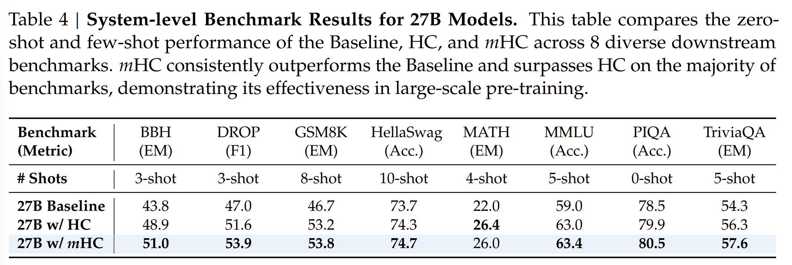

$\textbf{Scaling Experiments}$

- 3B, 9B model을 동일한 비율의 데이터로 학습

- 서로 다른 모델 규모에서 baseline 대비 mHC의 상대적 loss 개선량 
    - (a): 3B, 9B, 27B parmas에 걸친 compute scaling curve를 제시한다. 연산량이 커지는 상황에서도 성능 이점이 거의 줄어들지 않고 안정적으로 유지된다. 즉, 고연산 예산에서도 성능 향상이 견고하게 지속된다. 
    - (b): 3B model에 대한 token scaling curve를 제시하여 하나의 학습 과정 내부에서의 동작을 분석하였다. 

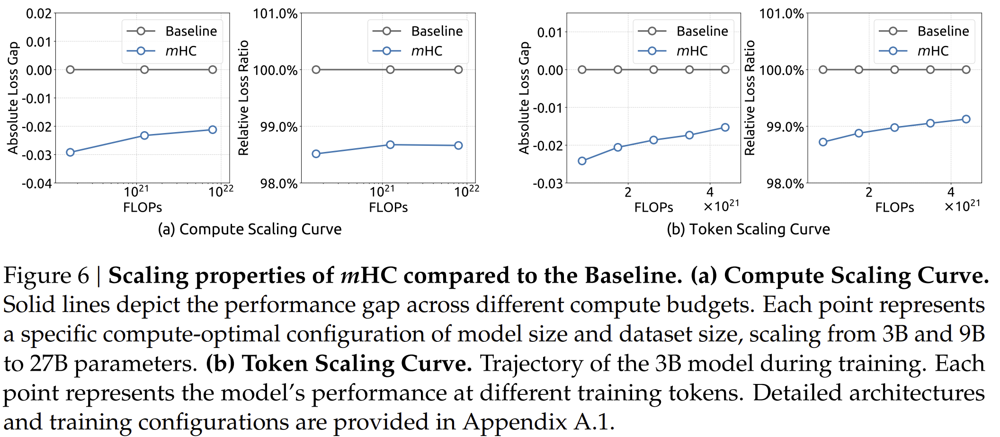

$\textbf{Stability Analysis}$

- mHC의 신호 전달 안정성을 보여준다. 
    - (a): 이론적으로는 단일 레이어 mapping이 doubly stochastic constraint를 만족하면 forward signal & backward gradient gain = 1 을 만족해야 한다.
    - 하지만 실제 구현에서는 계산 효율을 위해 Sinkhorn-Knopp algorithm의 반복횟수를 제한해야 한다. (20회) 
    - 그 결과 $1$ 에서 약간 벗어남 
    - (b): 여러 레이어가 중첩된 경우 편차가 증가하지만 여전히 유계 (bounded)이며, 최대값은 약 1.6 수준에 머문다. 
    - HC는 최대 약 3000까지 치솟았으나 이와 극명하게 대비된다. 

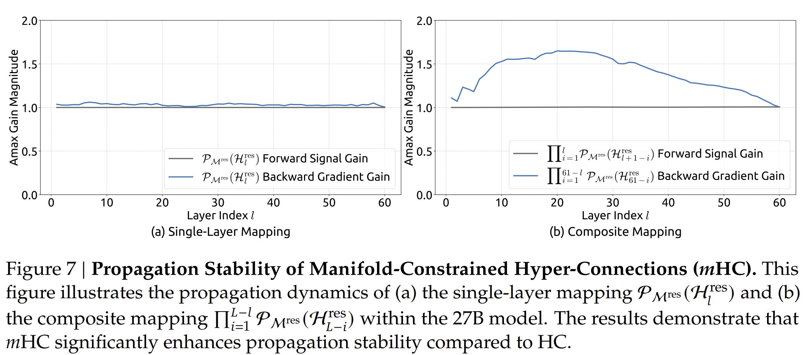

- Mapping 시각화
    - HC: 최대 gain이 커질 때, 다른 값들도 함께 커짐. 전 경로에서 전반적 불안정성
    - mHC: 전반적으로 일관되게 안정적인 값 유지 

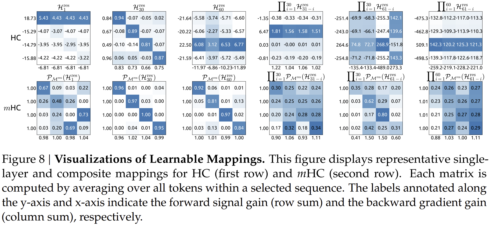

***

### <strong>Conclusion</strong>

***

### <strong>Question</strong>

<a href="">link</a>

> 인용구
