## NeRF: Representing Scenes as Neural Radiance Fields for View Synsthesis
*Communications of the ACM(2021), 18414 citation, UC Berkeley, Google Research, Review Data: 2026.04.14*

[Intro](#intro) 
[Related Work](#related-work) 
[Method](#method) 
[Experiment](#experiment) 
[Conclusion](#conclusion) 

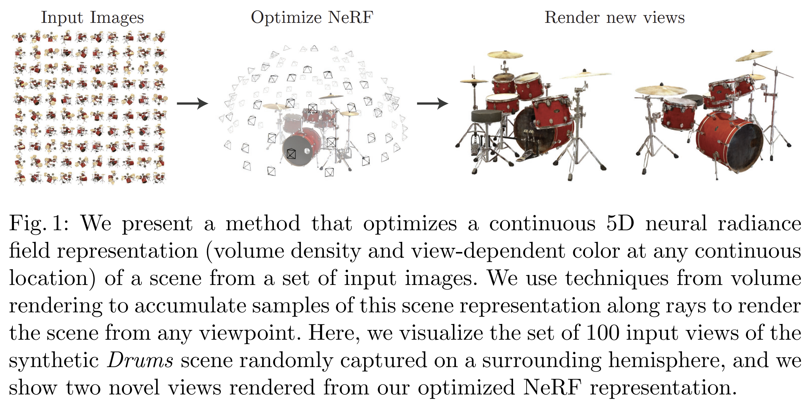

> Core Idea

<strong>"test1"</strong> 

***

### <strong>Intro</strong>

- 적은 수의 입력 시점 (sparse input views) 만으로도 복잡한 장면의 새로운 시점 영상 (novel view)를 합성할 수 있으며, 이를 통해 최고 수준의 성능을 달성하는 방법을 제안한다. 이 방법은 연속적인 volumetric scene function을 최적화하는 방식에 기반한다. 

- 해당 방법론은 scene을 fully-connected network로 표현한다 (non-convolutional). 이 신경망의 입력은 하나의 연속적인 5차원 좌표로 1) 공간 위치 $(x,y,z)$ 와 2) 시선 방향 $(\theta, \phi)$ 로 구성된다. 그리고 출력은 해당 위치에서의 볼륨 밀도 (volume density, $\sigma$)와 시점 의존적 방사 휘도 (view-dependent emitted radiance, RGB)이다. 

- 카메라 광선 (camera rays)를 따라 존재하는 5차원 좌표들을 query하여 시점을 합성하고, 고전적인 볼륨 렌더링 (volume rendering) 기법을 사용해 예측된 색상과 밀도를 이미지로 투영한다. 볼륨 렌더링은 본질적으로 미분 가능하기에, 이 표현을 최적화하는 데 필요한 입력은 카메라 자세 (camera pose)가 알려진 이미지 집합 뿐이다. 

- 또한, 우리는 복잡한 기하 구조와 외형을 가진 장면에 대해, 사실적인 새로운 시점 영상(photorealistic novel views) 을 렌더링할 수 있도록 Neural Radiance Fields 를 효과적으로 최적화하는 방법을 설명한다. 

1. 카메라 광선을 장면 안으로 따라가며 샘플링된 3D 점들의 집합을 생성한다. 
2. 이 점들과 각 점에 대응하는 2D 시선 방향을 신경망의 입력으로 넣어, 색상과 밀도의 출력 집합을 얻는다. 
3. 고전적인 volume rendering 기법을 사용해 이 색상과 밀도를 누적하여 최종적인 2D 이미지를 만든다. 

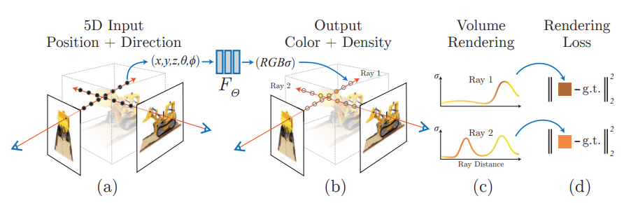

- 우리는 복잡한 장면에 대해 neural radiance field 표현을 최적화하는 기본 구현만으로는 충분히 높은 해상도의 표현으로 수렴하지 못하고, 또한 카메라 광선당 필요한 샘플 수 측면에서도 비효율적이라는 점을 확인했다. 이를 해결하기 위해, 입력 5차원 좌표를 positional encoding 으로 변환하여 MLP가 더 높은 주파수의 함수를 표현할 수 있도록 했고, 이러한 고주파 장면 표현을 충분히 샘플링하는 데 필요한 질의 수를 줄이기 위해 hierarchical sampling 절차를 제안한다.

- Density: 해당 위치에서의 물체가 얼마나 차 있는가 / 얼마나 불투명한가
- Radiance: 해당 위치에서 어떤 색의 빛이 나오는가 

> 정리하자면, 카메라의 각 픽셀마다 ray를 하나씩 쏜다고 생각하자. 그 ray가 쏴지면서 여러 3D 점들을 샘플링할텐데, 각 샘플들의 입력을 $(x, y, z, \theta, \phi)$ 네트워크에 넣어준다. 그럼 각 점마다의 density $\sigma$, radiance (RGB)를 얻는다. 이 집합을 고전적인 volume rendering으로 처리하여 최종적으로 그 카메라 픽셀 하나의 2D 색상 (RGB)를 계산한다. 

***

### <strong>Related Work</strong>

- View Synthesis and image-based rendering
    - 시점이 매우 조밀하게 샘플링되어 있다면, 단순한 light field sample interpolation 기법만으로도 사실적인 novel view를 복원할 수 있다. 
    - 더 듬성듬성한 시점 샘플링 조건에서의 novel view synthesis를 위해, 컴퓨터 비전과 그래픽스 분야는 관측 이미지로부터 전통적인 기하 및 외형 표현을 예측하는 방향으로 상당한 진전을 이루어 왔다. 
        - 대표적인 접근 중 하나는 장면을 mesh 기반 표현 으로 나타내고, diffuse appearance 또는 view-dependent appearance를 함께 모델링하는 방식이다. 
        - Differentiable rasterizer 나 path tracer 를 이용하면, gradient descent를 통해 입력 이미지 집합을 재현하도록 mesh 표현을 직접 최적화할 수 있다. 그러나 이미지 재투영에 기반한 gradient 기반 mesh 최적화는 local minima나 좋지 않은 loss landscape condition 때문에 종종 어렵다.
    - 또 다른 방법군은, 입력 RGB 이미지 집합으로부터 고품질의 사실적인 novel view synthesis를 수행하기 위해 volumetric representation 을 사용한 
        - Volumetric approach는 복잡한 형상과 재질을 사실적으로 표현할 수 있고, gradient 기반 최적화에 적합하며, mesh 기반 방법보다 시각적으로 거슬리는 artifact가 적은 경향이 있다. 
        - 초기의 volumetric 방법들은 관측 이미지를 직접 voxel grid에 색칠하는 방식을 사용했다. 이후에는 여러 장면으로 구성된 대규모 데이터셋을 사용해, 입력 이미지 집합으로부터 샘플링된 volumetric representation을 예측하는 심층 신경망을 학습하고, 테스트 시에는 alpha-compositing 이나 ray를 따라 학습된 compositing을 사용해 novel view를 렌더링하는 방법들이 제안되었다. 
        - 또 다른 연구들은 각 장면마다 CNN과 샘플링된 voxel grid의 조합을 최적화하여, CNN이 저해상도 voxel grid의 이산화 artifact를 보완하거나, 입력 시간 또는 애니메이션 제어에 따라 예측된 voxel grid가 달라질 수 있도록 했다.
        - 이러한 volumetric 기법들은 novel view synthesis에서 인상적인 성능을 보여주었지만, 이산적인 샘플링 에 기반하기 때문에 시간 및 공간 복잡도 측면에서 고해상도 이미지로 확장하는 데 근본적인 한계가 있다. 고해상도 이미지를 렌더링하려면 3차원 공간을 더 촘촘하게 샘플링해야 하기 때문이다. 
        - 우리는 이 문제를, 대신 깊은 완전연결 신경망의 파라미터 안에 연속적인 볼륨을 인코딩하는 방식 으로 해결한다. 이 방식은 기존 volumetric 접근보다 훨씬 높은 품질의 렌더링을 생성할 뿐 아니라, 샘플링된 volumetric representation에 비해 저장 비용도 극히 적게 든다.

***

### <strong>Method</strong>

- 본 논문은 continuous scene을 5D vector-valued function으로 표현했다. Input은 3D location $\mathbf{x} = (x,y,z)$ 와 2D viewing direction $(\theta, \phi)$이고, output은 emitted color $\mathbf{c} = (r,g,b)$ 와 volume density $\sigma$이다. 
- 실제 구현에서는 방향을 3차원 데카르트 단위 벡터 (3D Cartesian unit vector) $d$로 표현한다.
- 또한, 네트워크가 multi-view consistency를 갖도록 유도하기 위해, 볼륨 밀도 $\sigma$는 오직 위치 $\mathbf{x}$의 함수로만 예측하도록 제한하고, RGB 색상 $\mathbf{c}$은 위치와 시선 방향 모두의 함수로 예측되도록 한다. 
    - 이를 위해 MLP는 먼저 입력된 3차원 좌표 $\mathbf{x}$를 8개의 fully-connected layer로 처리하며, 각 층은 ReLU 활성화 함수와 256개의 채널을 사용한다. 
    - 그 결과로 $\sigma$와 256차원 feature vector를 출력한다. 이후 이 feature vector를 카메라 ray의 시선 방향과 이어 붙인뒤, ReLU 활성화 함수와 128개의 채널을 사용하는 추가적인 fully-connected layer 하나에 입력하여, 최종적으로 view-dependent RGB color를 출력한다. 

- 아래 그림은 방법론이 입력 시선 방향을 어떻게 활용하여 비람베르트 반사 (non-Lambertian effects)를 표현하는지를 보여준다. 
    - 비람베르트 반사(non-Lambertian reflection) 는 보는 방향에 따라 물체의 밝기나 색이 달라지는 반사를 말한다. 
    - 고정된 두 개의 3D 점이 서로 다른 두 카메라 위치에서 어떻게 보이는지를 보여준다. 

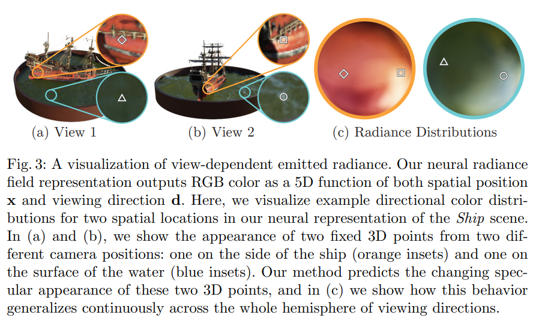

- 아래 그림은 시점 의존성을 사용하지 않고 위치 $\mathbf{x}$만을 입력으로 학습한 모델은 specularity (거울 반사광, 하이라이트)를 표현하는데 어려움을 겪는다. 
    - 시점 의존성(view dependence) 을 제거하면, 모델은 불도저 궤도(bulldozer tread)에서 나타나는 반사광(specular reflection) 을 재현하지 못한다. 
    - 또한 positional encoding 을 제거하면, 고주파 기하 구조와 텍스처를 표현하는 능력이 크게 떨어져, 결과적으로 전체 외형이 지나치게 매끄럽게(oversmoothed) 보이게 된다.

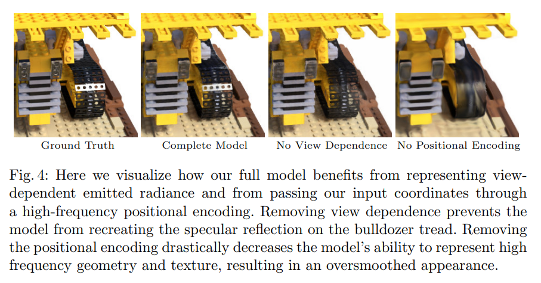

- Radiance field를 이용한 volume rendering 
    - 본 논문은 5차원 neural radiance field는 장면을 공간상의 모든 점에서의 볼륨 밀도와 방향 의존적 방출 radiance로 표현한다. 이후 고전적인 volume rendering의 원리를 이용해, 장면을 통과하는 임의의 ray의 색을 렌더링한다. 
    - 볼륨 밀도 $\sigma(\mathbf{x})$는 위치 $\mathbf{x}$에 있는 미소 입자에서 ray가 종료될 미분적 확률로 해석할 수 있다. Near bound $t_n$과 far bound $t_f$를 가지는 카메라 ray $r(t) = o +td$의 기대 색상 $C(r)$는 다음과 같다. 
        - $o$: ray의 시작점
        - $d$: ray의 방향
        - $r(t)$: ray 위의 한 3D 점
        - 각 시점의 값은 더하면서, 특정 시점에서의 누적 투과율, density, radiance는 곱하는 이유는 한 점이 최종 픽셀에 기여하려면 동시에 3가지를 만족해야 하기 때문이다. 즉, 1) 그 점까지 ray가 도달해야 하고, 2) 그 점에 실제로 물질이 있어야 하고, 3) 그 점이 가진 색이 있어야 한다.

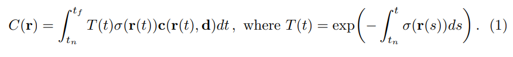

- 함수 $T(t)$는 ray를 따라 $t_n$ 부터 $t$까지의 누적 투과율을 의미한다. 즉 ray가 $t_n$에서 $t$까지 이동하는 동안 다른 어떤 입자와도 부딪히지 않을 확률이다. 
    - 즉, 앞에서 가려지면 뒤쪽 점의 기여도는 작아져야 하는데, 그걸 담당하는 항이다. 
    - 수식적으로 보면, ray 시작점에서부터 $t$ 시점까지의 $\sigma$를 다 더하는 것이다. 즉, ray가 통과할때 앞을 가로막는 물질이 있으면 density 값이 높을테고 이를 누적하면 값이 커지니 $T(t)$는 점점 작아진다. 즉, 뒤에 있는 point들이 최종적인 색에 미치는 기여도를 줄이는 것이다. 
- 연속적인 neural radiance field로부터 하나의 시점을 렌더링하려면, 원하는 가상 카메라의 각 픽셀을 통과하는 카메라 ray마다 이 적분 $C(r)$을 추정해야 한다. 

- 우리는 이 연속 적분을 quadrature 를 사용해 수치적으로 추정한다. 보통 이산화된 voxel grid를 렌더링할 때 사용하는 deterministic quadrature 는, MLP가 고정된 이산 위치 집합에서만 평가되기 때문에 표현의 해상도를 사실상 제한하게 된다. 대신 우리는 stratified sampling 방식을 사용한다. 즉, $[t_n, t_f]$ 구간을 $N$개의 균등한 bin으로 나누고, 각 bin 안에서 하나의 샘플을 균일분포로 무작위 추출한다. 

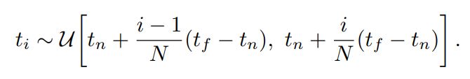

- 적분을 추정할 때는 이산적인 샘플 집합을 사용하지만, stratified sampling 덕분에 최적화 과정 전체에 걸쳐 MLP가 연속적인 위치들 에서 평가되므로, 연속적인 장면 표현을 다룰 수 있다. 우리는 Max [26]의 volume rendering 리뷰에서 논의된 quadrature rule을 사용하여 $C(r)$를 다음과 같이 추정한다.
    - $T_i$: $i-1$ 번째 샘플까지의 누적 투과율을 이산적으로 표현. 즉, $i$번째 point의 기여도를 구하려면 ray 시작점에서부터 $i-1$번째까지의 물질이 얼마나 있었는지를 봐야한다. 
    - 연속 누적을 이산 누적으로 봤을 때, 가운데 항이 $\sigma(r(t))$ 에서 $1 - exp(-\sigma \delta)$ 로바뀌었는데 이는 연속시의 $\sigma(r(t)) dt$를 변형한 것이다. 원래는 이 식이 맞지만, 사실 아주 작은 구간 $\delta$ 안에서도 ray는 계속 감쇠한다. 그걸 더 정확히 반영한게 $1 - exp(-\sigma \delta)$이다. 즉, $T$를 $i$ 번째 point까지 오는 누적 투과율과 $i$번째부터 현재 $t$까지의 추가 투과율을 계산한다.

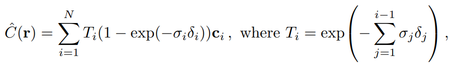

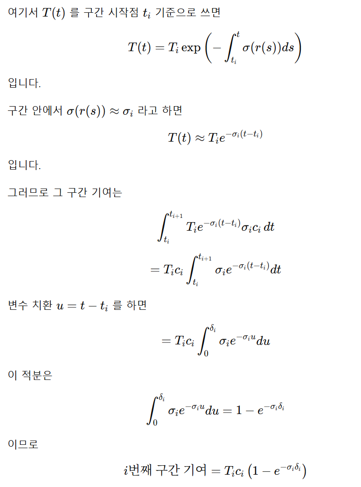

- 여기서 $\delta_i = t_{t+1} - t_i$는 인접한 샘플들 사이의 거리이다. $(c_i, \sigma_i)$ 값들의 집합으로부터 $\hat C(r)$ 를 계산하는 이 함수는 자명하게 미분 가능이며, $\alpha_i = 1 - exp(- \sigma_i \delta_i)$로 두면 전통적인 alpha compositing 으로 귀결된다. 

$\textbf{Neural Radiance Field의 최적화}$

1. ray를 쏜다
2. 3D 점들을 샘플링한다
3. MLP가 각 점의 density 와 color 를 예측한다
4. volume rendering으로 픽셀 색을 만든다

여기까지 보면 “그럼 끝난 거 아닌가?” 싶지만, 이 기본 구조만으로는 SOTA 품질이 안 나온다고 한다. 

왜냐하면 실제 장면은 얇은 구조, 날카로운 경계, 세밀한 texture, 빠르게 변하는 반사/색 변화처럼 고주파(high-frequency) 정보가 많기 때문이다. 

그런데 기본 MLP는 이런 고주파 패턴을 잘 못 잡는다. 그래서 두 가지를 추가합니다. (Positional encoding, Hierarchical sampling)

- Positional encoding
    - MLP가 고주파 함수를 더 잘 표현하게 함
    - 입력을 표현하는 방식을 여러 차원으로 늘려서 풍부한 입력을 준다. (sin/cos 기반 고차원 표현)
    - $\gamma$: 입력 좌표를 변환하는 함수 
        - 원래는 $(x,d)$ -> MLP 였다면, 이제는 $(x,d)$ -> $\gamma(x,d)$ -> MLP가 된다. 
        - 논문에서는 $\gamma(x): L = 10$, $\gamma(d): L=4$를 사용한다. 보통 위치 $x$가 훨씬 더 세밀한 공간 구조를 담아야 하기 때문이다. 
        - Transformer에서도 positional encoding이 있지만 목적이 다르다. Transformer는 토큰 순서 정보를 넣기 위함이고, NeRF에서는 연속 좌표를 고차원으로 올려서 MLP가 고주파 함수를 더 잘 근사하게 만드는데 있다. 
        - $x$는 $[-1,1]$ 사이로 normalize 된다. 
        - $\gamma$는 특정 값을 cos/sin으로 바꿔서 완전히 그 특정 값과 같은 게 아니다. 그 값을 어떠한 형식을 띄는 함수 (여기서는 cos/sin)에 넣어서 새로운 feature로 변환하는 것이다. (치환, 변환, encoding의 느낌)

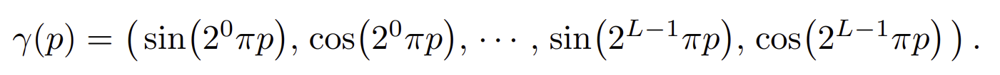

- 

- Hierarchical sampling
    - 중요한 구간을 더 촘촘히 샘플링하게 함
    - 각 카메라 ray를 따라 $N$개의 query point에서 neural radiance field 네트워크를 촘촘하게 평가하는 렌더링 전략은 비효율적이다. 최종 렌더링 이미지에 기여하지 않는 빈 공간이나 가려진 영역도 반복적으로 샘플링되기 때문이다. 
    - 따라서 volume rendering 초기 연구에서 아이디어를 얻어, 최종 렌더링에 미칠 예상 영향에 빌례해 샘플을 할당함으로써 렌더링 효율을 높이는 hierarchical representation을 제안한다. 
    - 장면을 표현하기 위해 단 하나의 네트워크만 사용하는 대신, 동시에 두 개의 네트워크를 최적화한다. 
    - 하나는 "coarse" network, 다른 하나는 "fine" network이다. 
    - 먼저 stratified sampling 을 사용해 $N_c$ 개의 위치를 샘플링하고 아래 식을 사용하여 "coarse" network를 평가한다. 그런 다음 이 "coarse" network의 출력을 바탕으로, 각 ray를 따라 더 정보에 기반한 샘플링을 수행하는데, 이때 샘플은 volume 내에서 중요한 부분에 더 치우치도록 배치된다. 

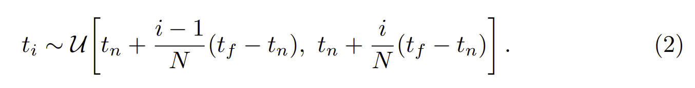

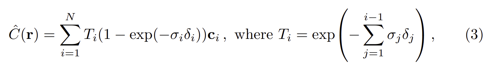

- 이를 위해 먼저 식 (3)의 coarse network의 alpha compositing 색상 $\hat C_c(r)$ 을, ray를 따라 샘플링된 모든 색상 $c_i$의 가중합 형태로 다시 쓴다. 
    - 각 weight는 직관적으로, $i$ 번째 까지의 누적 투과율과 $i$ 번째 point에서의 density의 곱이다. 즉, weight 값이 높아서 그 point에서의 색깔 정보를 많이 사용되려면, $i$ 번째까지의 물체가 적어야 하고 $i$ 번째의 물질이 존재하면 된다. 

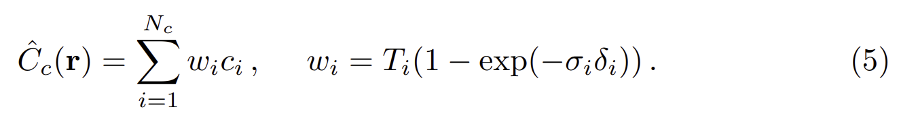

- 이 가중치들을 아래와 같이 정규화하면, ray를 따라 정의된 piecewise-constant PDF 를 얻게 된다. 우리는 이 분포로부터 inverse transform sampling 을 사용해 두 번째 샘플 집합 $N_f$개의 위치를 뽑는다.
    - 이후 첫 번째 샘플 집합과 두 번째 샘플 집합의 합집합(union) 에서 “fine” 네트워크를 평가하고, 식 (3)을 사용하되 이번에는 전체 $N_c + N_f$ 개의 샘플을 사용하여 ray의 최종 렌더링 색 $\hat C_f(r)$를 계산한다. 
    - 이 절차는 가시적인 내용(visible content) 이 포함될 것으로 예상되는 영역에 더 많은 샘플을 할당한다. 이는 importance sampling 과 유사한 목표를 가지지만, 우리의 방법은 각 샘플을 전체 적분의 독립적인 확률적 추정치로 다루는 대신, 샘플된 값들을 전체 적분 구간에 대한 비균일 이산화(nonuniform discretization) 로 사용한다는 점에서 다르다.
    - Fine network는 $N_c + N_f$ 개의 전체 샘플을 사용하는 것에 주목해야 한다. 왜냐하면 coarse 샘플은 전역 정보를 가지고 있기 때문이다. 

$$ \hat w_i = \frac{w_i}{\sigma_{j=1}^{N_c}w_j} $$

$\textbf{Implementation details}$

- 각 장면(scene)마다 별도의 neural continuous volume representation network 를 최적화한다. 이를 위해 필요한 것은 해당 장면의 RGB 이미지 데이터셋, 그에 대응하는 카메라 자세(camera poses) 와 내부 파라미터(intrinsic parameters), 그리고 scene bounds 뿐이다. 

- 합성 데이터(synthetic data)에 대해서는 ground truth 카메라 자세, intrinsic, bounds 를 사용하고, 실제 데이터(real data)에 대해서는 COLMAP structure-from-motion package를 사용해 이러한 파라미터들을 추정한다.

- 각 최적화 반복(iteration)마다, 우리는 데이터셋의 모든 픽셀 중에서 카메라 ray들의 배치(batch) 를 무작위로 샘플링한다. 그런 다음 hierarchical sampling 절차를 따라, coarse network 에서 $N_c$ 개의 샘플을 query하고 fine network에서는 $N_c + N_f$ 개의 샘플을 query한다. 그 후 volume rendering 절차를 사용하여, 두 샘플 집합 각각으로부터 각 ray의 색을 렌더링한다. 

- 우리의 loss는 단순히 렌더링된 픽셀 색과 실제 픽셀 색 사이의 전체 제곱 오차(total squared error) 이며, coarse 렌더링과 fine 렌더링 둘 다에 대해 계산한다.
    - $R$: 각 배치에 포함된 ray들의 집합 
    - 최종 렌더링은 $\hat C_f(r)$에서 나오지만, $\hat C_c(r)$의 loss 역시 함꼐 최소화한다는 점에 주목해야 한다. 이는 coarse network의 weight distribution 이 fine network에서 샘픙을 어디에 배치할지를 결정하는 데 사용되기 때문이다. 
    - batch size: 4096 rays 
    - 각 ray에 대해 coarse volume에서는 $N_c = 64$ 개의 좌표를 샘플링하고, fine volume에서는 추가로 $N_f = 128$ 개의 좌표를 샘플링한다. 
    - Adam optimizaer $(l=5\times 10^{-4})$
    - 단일 NVIDIA V100 GPU (하루 이틀)

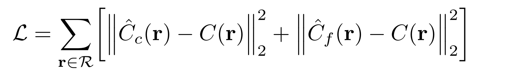

***

### <strong>Experiment</strong>

$\textbf{Synthetic renderings of objects}$

- 두 개의 합성 물체 렌더링 데이터셋에 대한 실험 결과 (Diffuse Synthetic 360, Realistic Synthetic 360)
    - Diffuse Synthetic: 단순한 기하 구조를 가지는 네 개의 Lambertian object를 포함한다. 각 물체는 위쪽 반구에서 샘플링된 시점들로부터 $512 \times 512$ 해상도로 렌더링되며, 이 중 $479$ 장을 입력으로 사용하고 $1000$ 장을 테스트용으로 사용한다. 
    - 추가로 우리는 복잡한 기하 구조와 현실적인 비람베르트 재질(non-Lambertian materials) 을 가지는 여덟 개 물체의 path-traced 이미지 로 구성된 자체 데이터셋도 생성하였다. 이 중 여섯 개는 위쪽 반구에서 샘플링된 시점으로 렌더링되었고, 두 개는 구 전체(full sphere)에서 샘플링된 시점으로 렌더링되었다. 각 장면(scene)에 대해 100개 시점 을 입력으로 사용하고, 200개 시점 을 테스트용으로 사용하며, 모든 이미지는 800 × 800 해상도이다.

- 복잡한 실제 장면의 이미지(Real images of complex scenes)
    - 우리는 대체로 정면을 향하는(forward-facing) 이미지들로 촬영된 복잡한 실제 장면에 대한 결과도 제시한다(Table 1의 “Real Forward-Facing”). 이 데이터셋은 손에 든 휴대폰(handheld cellphone) 으로 촬영된 8개 장면 으로 구성되며, 이 중 5개는 LLFF 논문 에서 가져왔고 3개는 우리가 직접 촬영 했다. 각 장면은 20장~62장 의 이미지로 구성되어 있으며, 이들 중 1/8 을 테스트 세트로 분리한다. 모든 이미지는 1008 × 756 해상도이다.

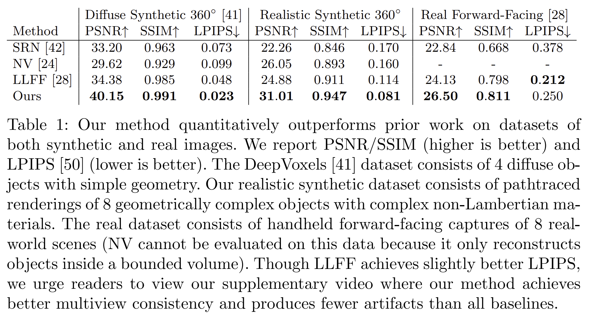

- 물리 기반 렌더러로 생성한 새로운 합성 데이터셋 
    - LLFF는 물체의 경계에서 banding artifact, ship의 돛대와 lego 물체 내부에서는 ghosting artifact.
    - SRN은 모든 경우에서 흐릿하고 왜곡된 렌더링 결과 
    - Neural Volumes는 Microphone의 grille나 Lego의 gear와 같은 세부 구조를 포착하지 못함.

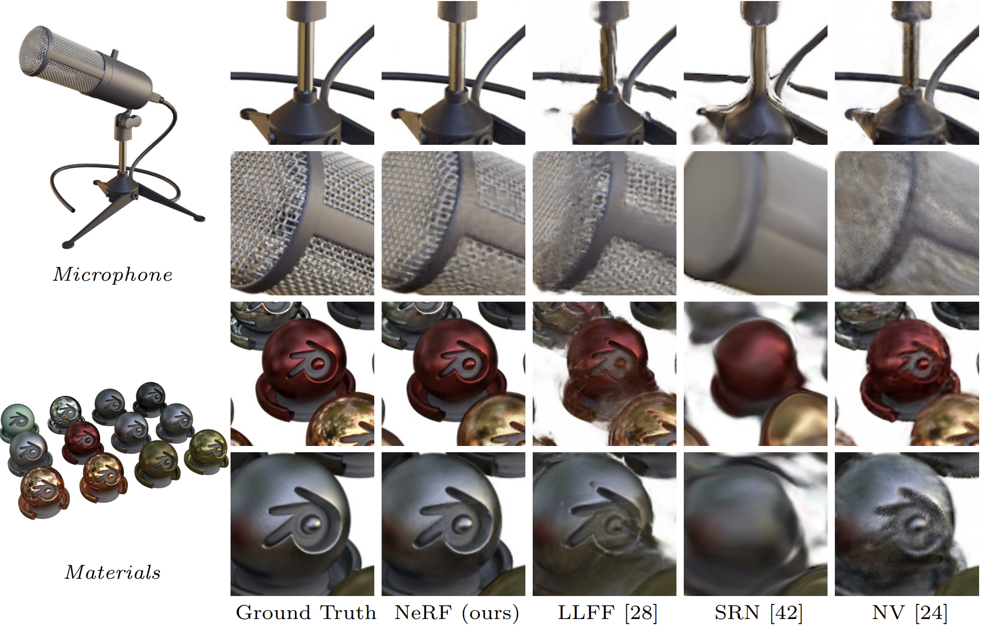

- 실제 장면의 테스트 세트 시점 비교.
    - LLFF 는 이 사용 사례, 즉 실제 장면의 정면 위주(forward-facing) 촬영 를 위해 특별히 설계된 방법이다. 그럼에도 불구하고, 본 방벙론은 Fern의 잎, T-rex 장면의 갈비뼈(skeleton ribs)와 난간(railing) 에서 볼 수 있듯이, 렌더링된 여러 시점 전반에 걸쳐 더 일관되게 세밀한 기하 구조(fine geometry) 를 표현할 수 있다.
    - 또한 본 방법은 부분적으로 가려진 영역(partially occluded regions) 도 올바르게 복원하는 반면, LLFF는 이러한 영역을 깔끔하게 렌더링하는 데 어려움을 겪는다. 예를 들어, 아래쪽 Fern crop 에서 잎 뒤에 있는 노란 선반, 그리고 아래쪽 Orchid crop 의 배경에 있는 초록 잎 이 이에 해당한다.
    - 여러 렌더링 결과를 섞는(blending between multiple renderings) 과정은 LLFF에서 중복된 경계(repeated edges) 를 유발할 수도 있는데, 이는 위쪽 Orchid crop 에서 확인할 수 있다. 한편 SRN 은 각 장면의 저주파 기하 구조(low-frequency geometry) 와 색 변화(color variation) 는 포착하지만, 세밀한 디테일은 전혀 재현하지 못한다.

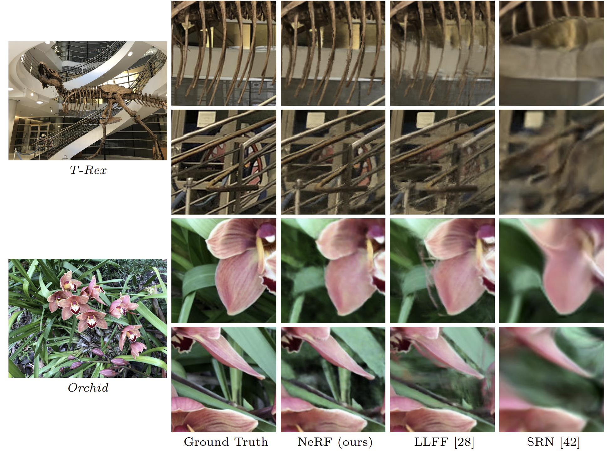

$\textbf{Ablation study}$

- 실험 결과는 “Realistic Synthetic 360◦” 장면들에 대해 제시한다. 9행(row 9) 은 비교 기준점으로서의 완전한 전체 모델(full model) 을 보여준다. 
    - 1행(row 1) 은 positional encoding (PE), view-dependence (VD), hierarchical sampling (H) 이 모두 제거된 최소한의 버전(minimalist version)의 모델을 보여준다.
    - 2–4행(rows 2–4) 에서는 이 세 구성 요소를 전체 모델에서 하나씩 제거한다. 그 결과, positional encoding (2행) 과 view-dependence (3행) 가 가장 큰 정량적 이점을 제공하고, 그다음이 hierarchical sampling (4행) 임을 확인할 수 있다.
    - 5–6행(rows 5–6) 은 입력 이미지 수가 줄어들수록 성능이 어떻게 감소하는지를 보여준다. 주목할 점은, 입력 이미지가 25장 뿐인 경우에도, 우리의 방법이 100장 의 이미지를 제공받은 NV, SRN, LLFF 보다 모든 지표에서 더 높은 성능을 보인다는 것이다(보충 자료 참고).
    - 7–8행(rows 7–8) 에서는 $x$ 에 대한 positional encoding에 사용된 최대 주파수 $L$ 선택의 타당성을 검증한다. ($d$ 에 사용되는 최대 주파수는 이에 비례하도록 조정된다.) 단지 5개의 주파수 만 사용할 경우 성능이 감소하지만, 주파수 개수를 10에서 15로 늘려도 성능은 개선되지 않는다. 우리는 $L$ 을 증가시키는 이점이, $2^L$ 이 입력 이미지에 실제로 존재하는 최대 주파수(우리 데이터에서는 대략 1024)를 초과하면 제한적이기 때문이라고 본다.

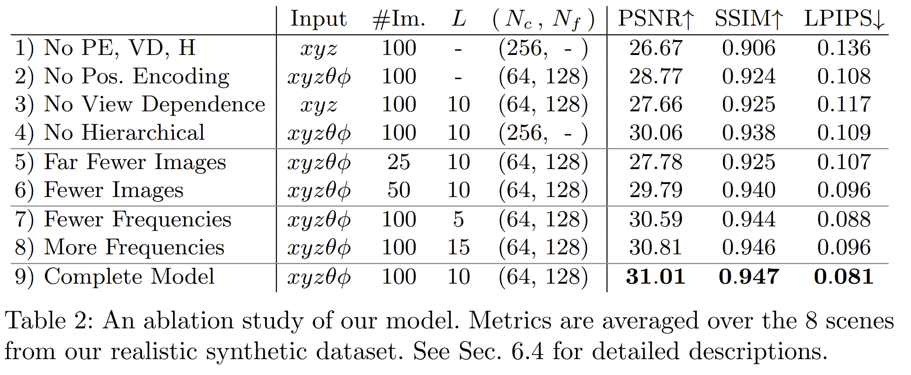

- 입력 벡터는 초록색, 중간 hidden layer는 파란색, 출력 벡터는 빨간색으로 표시되며, 각 블록 안의 숫자는 해당 벡터의 차원을 의미한다. 모든 층은 표준적인 fully-connected layer 로 구성된다. 검은 화살표는 ReLU 활성화 함수 가 있는 층을, 주황색 화살표는 활성화 함수가 없는 층 을, 점선 검은 화살표는 sigmoid 활성화 함수 가 있는 층을 나타낸다. 또한 “+” 는 벡터 연결(concatenation)을 의미한다.

- 입력 위치의 positional encoding $\gamma(x)$ 는 각각 256개 채널 을 가지는 8개의 fully-connected ReLU layer 를 통과한다. 이 입력을 다섯 번째 층의 activation에 concatenation 하는 skip connection 을 포함한다. 그다음 추가적인 한 층이 volume density $\sigma$ 와 256차원 feature vector 를 출력한다. $\sigma$ 는 출력 volume density가 음수가 되지 않도록 ReLU 를 적용해 정류한다. 이 256차원 feature vector는 입력 시선 방향의 positional encoding $\gamma(d)$ 와 연결된 뒤, 128개 채널 을 가지는 추가적인 fully-connected ReLU layer 를 통과한다. 마지막 층은 sigmoid 활성화 함수 를 사용하여, 위치 $x$에서 방향 $d$를 따라 보는 ray에 대해 방출되는 RGB radiance를 출력한다.

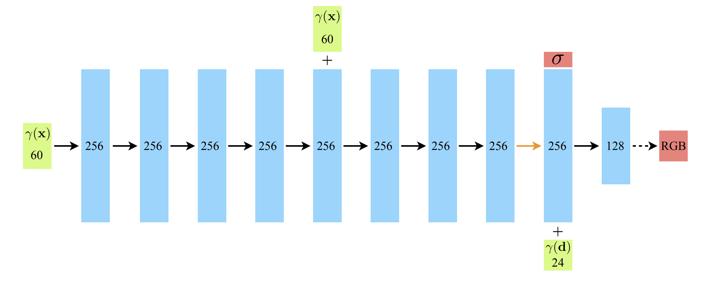

***

### <strong>Conclusion</strong>

***

### <strong>Question</strong>
