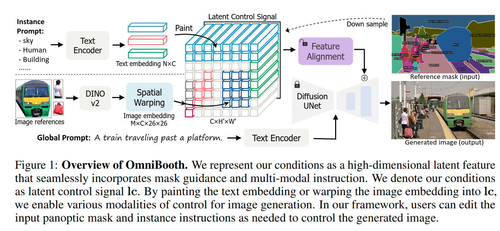
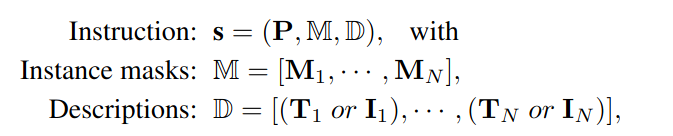
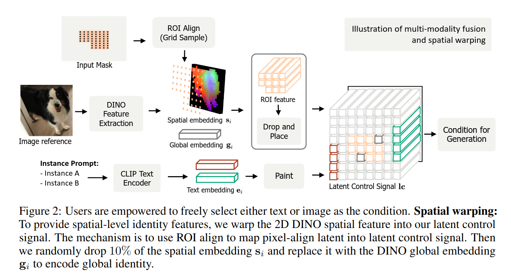

## OmniBooth: Learning Latent Control For Image Synthesis with Multi-Modal Instruction
*arXiv(2024), 0 citation, HKUST (홍콩과기대), Review Data: 2024.10.09*

[Intro](#intro) 
[Related Work](#related-work) 
[Method](#method) 
[Experiment](#experiment) 
[Conclusion](#conclusion) 

> Core Idea

<strong>"Image Generation Framework that Enables Spatial Control with Instance-Level via Multi-Modal"</strong> 

***

### <strong>Intro</strong>

$\textbf{이 주제의 정의 및 요구사항과 중요한 이유}$

- Diffusion model로 인해 image generation은 큰 발전을 이뤘다. 
- User는 원하는 위치에 특정 객체를 생성하고 싶다. 하지만, text-to-image 문맥에서 user는 원하는 이미지를 global text description으로 생성해야 한다. 이는 시각적 환경에서 coarse description만을 제공한다. 언어를 사용해 정확하고 복잡한 layout이나 shape을 표현하기에는 어려움이 있다. 

$\textbf{이 주제의 문제점과 기존의 노력들}$

- 이전의 work들은 spatial control을 제공하기 위해 image condition을 이용했다. 하지만 이는 instance-level customization을 제공하는 데 한계가 있다. 
  - ControlNet과 GLIGEN은 다양한 조건의 signal (semantic mask, bounding box layout, depth map)을 사용하지만 instance-level visual chracter를 조작하는 fine-grained description과 정확한 제공은 힘들다.

$\textbf{최근 노력들과 여전히 남아있는 문제들}$

$\textbf{본 논문에서 해결하고자 하는 문제와 어떻게 해결하는지, 그 결과들}$

- OmniBooth: spatial control을 multi-modal을 이용해 instance-level로 가능하게 하는 framework
  - Text prompt나 image reference를 통해 multi-modal instruction이 가능하다. 
  - User-defined mask set과 관련된 text/image guidance가 주어지면 특정 위치에 다수의 물체를 생성하는 게 목적이다. 
  - 본 논문의 핵심 기여는 latent control signa ($lc$)에 있다. 이는 고차원 공간적 특징으로, 공간적, 텍스트, 이미지 조건을 통합적으로 연결하는 통합된 표현을 제공한다. 
  - Text condition은 ControlNet을 확장하여 개체 수준의 개방형 어휘 생성을 가능하게 한다. 
  - Image condition은 더 나아가 개인화된 정체성으로 세밀한 제어를 가능하게 한다. 
    - Image modality는 더 복잡한 구조를 포함하고 있으므로 공간 왜곡 (spatial warping)을 제안하여 불규칙한 image identity를 $lc$에 인코딩하고 변환한다. 
  - Latent input의 feature alignment를 학습하기 위해 향상된 ControlNet framework를 개발했다.

***

### <strong>Related Work</strong>

***

### <strong>Method</strong>

$\textbf{Problem Definition}$

- $\mathbf{P}$: global prompt
- $\mathbf{M}_i$: a binary mask of each instance that indicates thier spatial location
- $D$: instance description
  - $\mathbf{T}_i$: text description of each instance
  - $\mathbf{I}_i$: image description of each instance

$\textbf{Text Embedding}$

- Textual description $\mathbf{T}_i$가 주어졌을 때, CLIP text encoder를 사용해 textual embedding을 추출한다. 
  - The output (textual embedding) is a 1D embedding $e_i \in \mathbb{R}^{1024}$
  - 생성되는 이미지의 전체 feature map과 상호작용하는 global prompt $g_i$와는 다르게 지역적 control을 위한 instance prompt이다. 

***

### <strong>Experiment</strong>

***

### <strong>Conclusion</strong>

***

### <strong>Question</strong>

<a href="">link</a>

> 인용구
