## How to write a paper
*Junseo Park*

[Abstract](#abstract) 
[Intro](#intro) 
[Related Work](#related-work) 
[Method](#method) 
[Experiment](#experiment) 
[Conclusion](#conclusion) 

***

### <strong> Beginning </strong>

- 논문의 시작은 다음과 같은 process 를 거친다.
  - 관심있는 논문들 읽기 > 이 논문들이 다루는 task 에는 어떤 문제들이 있는지 > 왜 기존의 논문들은 해결을 못했지? > 그 논문들이 제안한 방법들 정리 > 코딩으로 실험할 수 있으면 blueprint 작성 시작 

***

### <strong> Blueprint </strong>

- 논문 작성에 앞서, 설계도를 먼저 만들어야 한다. (내가 어떤 방식으로 글을 전개할지 미리 파악하기 위해)
  - **Beginning** 에서 작성했던 내용은 결국 Intro 와 related work 의 초안이므로 미리 간략하게 Inkscape 에 글을 써놓는다. 
  - 그 후에 Figure 단위로, Inkscape 에 흐름을 전개한다. 

- Blueprint 예시

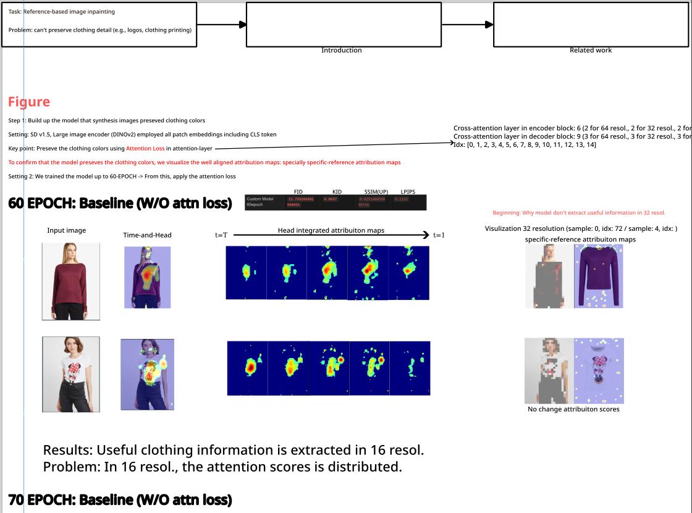

- Blueprint 작성을 완료했으면 이제 저널 선정 후에 글을 쓰면 된다. 
  - Target journal 을 선정하고 그 저널들에 accept 된 논문들이 어떤 section 을 가지는지 살핀다.(E.g., background 가 많고, conclusion 의 유무, figure 의 수, experiment 와 method 의 전체 비율, etc.)
  - 글은 Introduction (마지막 문단 빼고) > related work > method > experiments > abstract, conclusion, introduction 의 마지막을 같이 작성한다. 
  - Abstract, conclusion, introduction 를 같이 작성하는 이유는 서로 비슷한 내용을 다루기 때문이다. 

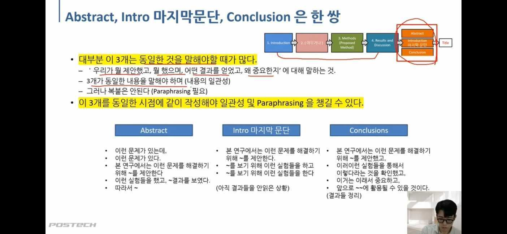

***

### <strong>Target Journal</strong>

- 이전에 읽었던 논문들이 어떤 저널들에 주로 다뤄졌는지 list up 한다. 
  - <a href='https://jcr.clarivate.com/jcr/home'>Journal Citation Reports</a>
  - 위의 사이트에서 저널을 검색하여 Journal Impact factor 를 확인한다. (학교 ip로 들어가면 로그인을 안해도 된다)
  - Journal Impact Factor 가 높을수록, Rank by Journal Impact Factor 의 등수가 (e.g., 1/100)높을수록 좋은 저널이다. 
  - 이때, 카테고리가 여러개라면 가장 높은 점수를 기준으로 생각하자.

- IEEE Access journal 검색
  - 카테고리가 여러개다.

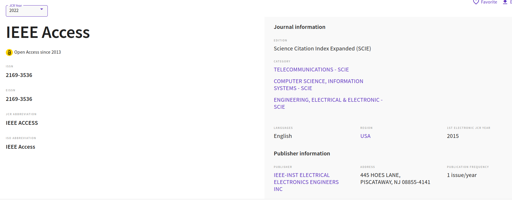

- JIF 점수도 낮은데 내려가는 추세임

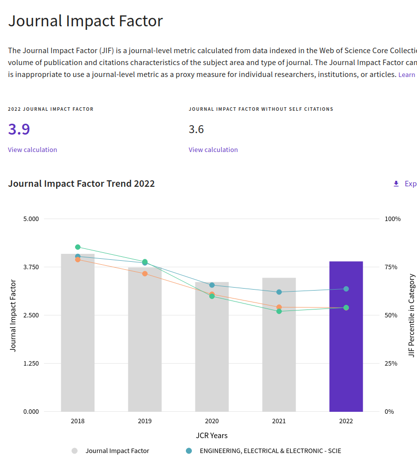

- RJIF 는 $63.8$ % 로 보면된다. 
  - Q2 로 확정 

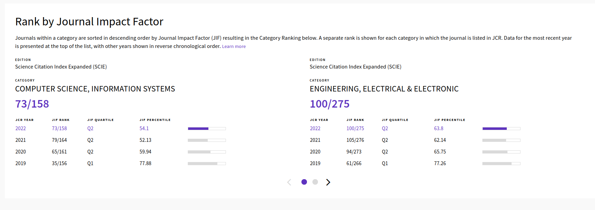

***

### <strong>공통 사항</strong>

- 글을 작성할 땐, **word** 에 먼저 작성해보자 
  - Double-lined page 로 작성하는데 다음과 같이 설정하여 글을 번갈아가면서 볼 수 있게 한다. 
  - Download in Ubuntu: <a href='https://ubunlog.com/ko/%EC%99%80%EC%9D%B8%EC%97%86%EC%9D%B4-%EC%9A%B0%EB%B6%84%ED%88%AC%EC%97%90-Microsoft-Office-%EC%84%A4%EC%B9%98/'>ref.</a>

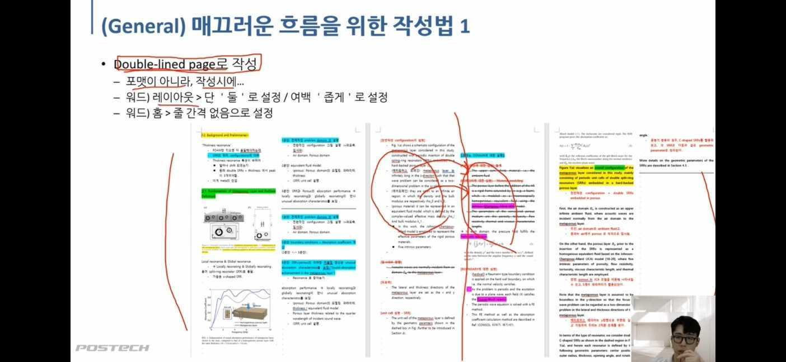

- 모든 문단은 한 주제 내용에 대해서만 다뤄야한다. 
  - 이때, 논문은 두괄식으로 주제 내용이 첫 줄에 작성되어서 글을 읽을때 이 문단의 내용을 짐작할 수 있어야 한다. 
  - 이후의 내용은 주제 내용을 뒷받침하는 내용이 들어가야한다. 
  - 또한, 이전 문단의 꼬리와 다음 문단의 머리가 연결되도록 글을 쓴다. 

- Figure 는 중요한 figure 일수록 크기가 커야하고 figure_collection 을 참고하자
  - 수치적 Graph 를 표현할때는 대체적으로 테두리의 굵기가 보여야 깔끔하다. 
  - Figure 만 놓고 봐도 논문을 이해할 수 있어야한다.
  - Font 는 기본적으로 *Times new(er) roman* 을 사용한다. 
  - Notion > Adobe Illustration 에 다운받는 방법이 적혀있다. 

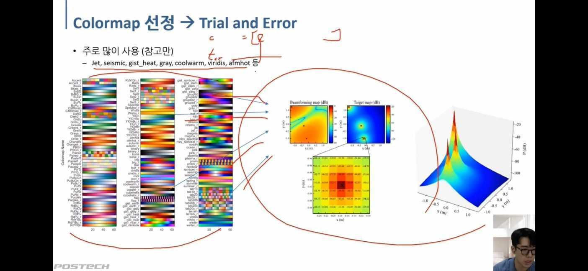

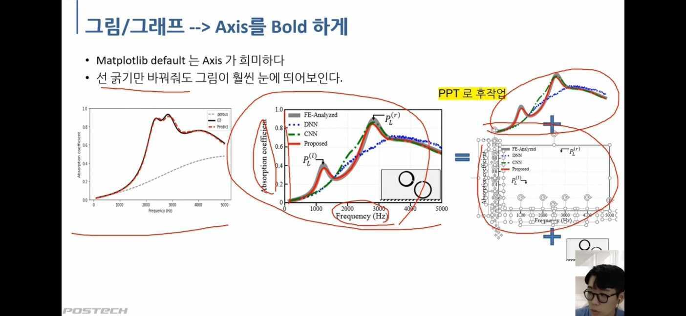

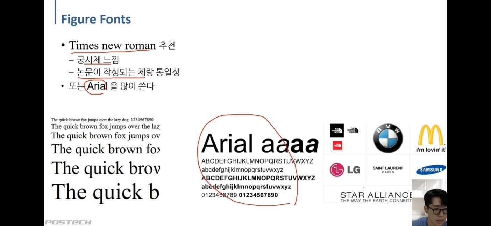

- 문장 단위로 Papago 로 번역 > Quillbot 로 문장 고치기 > 문단 별로 모아서 Grammarly 로 검사

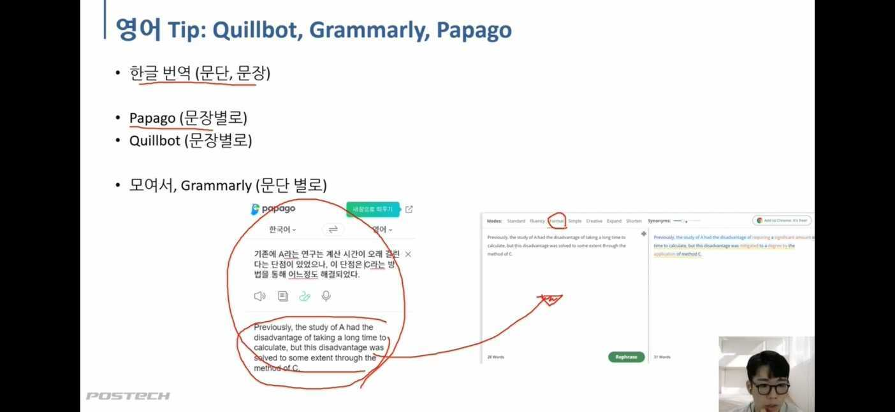

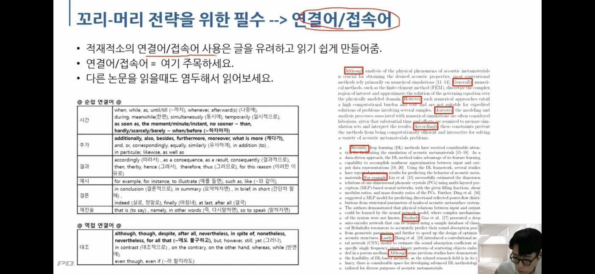

- 수량: numerous, various, multiple, Countless, Abundant, Several, Plentiful, massive amount, tremendous(엄청난), diverse, 

- 강조: Amazingly, Impressively, Surprisingly, Notably, Especially, Remarkably, Indeed (사실은), Specifically (=Namely), 

- Additionally: 게다가, Furthermore: 그 외에도, Moreover: 게다가, In addtion: 게다가, Besides: 그 외에도, Alongside: 동시에, 

incorporate: 포함하다, 통합하다.
leverage: 이용하다
facilitate: 촉진하다, 도와주다, 가능하게 하다
leverage, utilize: 활용하다 
To elaborate: 자세히 설명하자면 (이전에 제시한 주장을 확장하는 표현)
intricate: 복잡한(=complex)
comply: 준수하다, 따르다.
versatile: 다재다능한 
devise: 구상하다. 발명하다. 고안하다.
steer: 조종하다. 
By consequence: 결과적으로
valuable: 소중한, 가치가 있는
identify: 확인하다.
depict: 그리다, 묘사하다. e.g., images depicting different appearance
reveal: 밝히다, 드러내다. e.g., this paper reveals a limitation of the current model
sufficient: 충분한
alter: 바꾸다
As in ~,: ~처럼, ~와 같이

-  While numerous studies have focused on

연구 논문의 문제 진술과 함께 많이 사용하며, 주제에 대한 기존의 연구 내용을 소개하고 특정 측면의 결점을 지적함으로써 독자가 “이 주제에 대해 우리가 무엇을 놓치고 있는가?”와 같은 질문에 집중하게 만들어주는 표현

<a href='https://wordvice.ai/ko/blog/best-academic-words-for-research'>Ref.</a>

- Paraphrasing words

> demonstrate, revealing, emphasizing, highlighting, showing, displaying, depicting, spotlighting, introducing

> information, details, specifics, describes, data, knowledge, explains, outlines, characteristics, statistics, attribute, feature, insight, content

> enhance, improve, boost, strengthen, optimize, advance, elevate, develop, increase, raise, foster, streamline, promote, expand, extend, refine, sharpen, aid, Adjusted, Polished

> limited, restricted, prohibited, constrained, confined, bounded, hindered, dictated, closed, banned, excluded

> significant, noteworthy, interesting, important, significant, special, valuable, intriguing, noticeable, fascinating, remarkable, relevant, unique, useful, striking, exciting, attractive, worthwhile, distinctive, worthwhile

> additionally, furthermore, in addition, moreover, also, likewise, besides, Meanwhile 

> overall, holistic, whole, comprehensive, extensive, entire, vast, global, broad

> extract, portion, excerpt, take, obtain, Derived, retrieved, captured, acquired

> various, differenct, distinct, unique, novel,absent, apart, varying, exclusive, diverse

> potential, feasible, attainable, achievable, probable, viable, conceivable, accessible, acceptable, practical, ideal, suitable, plausible, sensible, effective 

***

### <strong>Intro</strong>

- Introduction 은 기술적으로 구체적으로 적는 것이 아니라 high-level 로 적는다. 

- $3$ 또는 $5$ 문단으로 구성
  - $1$ 문단: 이 task 및 주제의 개념 및 요구사항과 왜 중요한지
    - E.g., VITON task 는 옷을 가상으로 입히는 task 이고 사람의 pose, shape 및 clothing detail 을 보존해야 한다. 
  - $2$ 문단: 이 task 의 문제와 기존의 노력 (기존 논문들의 문제점도 같이 언급)
    - E.g., Logo 등의 clothing detail 을 보존하기가 어려운데 이를 위해 기존의 GAN-based model 들은 explicit warping module 을 사용했다. 하지만 이도 완벽하지 않음
  - $3$ 문단: 최근의 접근법 소개 및 여전한 문제점 
    - E.g., StableVITON 의 등장으로 많이 개선됐지만, 여전히 logo 나 text 의 손실이 발생한다. 
  - $4$ 문단 (마지막 문단): 따라서 우리는 어떤 문제를 해결하기위해 무엇을 하겠다.
    - 각각의 문제들을 해결하기 위해 어떤 방법들을 제안하고
    - 어떤 실험들로 ~ 를 확인했으며
    - 마지막으로 ~ 를 검증하여 제안된 연구가 ~ 하다는 것을 보였다. 
  - $5$ 문단 (option): 본 연구의 main contribution 요약

- $3$문단으로 적는 경우는 conference 논문 중, 장수가 적은 논문이 해당한다. (e.g., ICLR: 9장)
  - $1$ 문단: 배경 설명 및 왜 중요한지, 문제점
  - $2$ 문단: 우리의 방법론에 대한 high-level 설명
  - $3$ 문단: 실험결과 및 요약

***

### <strong>Related Work</strong>
- 이 문제를 해결하기 위한 방법들에 대한 소개
- 이 문제와 비슷한 문제들
- 즉, 구별점을 확실히 제시. 내가 풀고자 하는 문제는 이런 것들과 유사하고 이런 것들과 다르다 라는 것을 제시
- 1. Related work 를 철저히 조사한 상태에서 기존에 존재하던 연구 중 어떤 방법론이 우리가 제안한 방법과 비교되어야 하는지 명확히 구분해야 한다. (Positioning)
- 2. 기존 연구들 중 정말로 내가 제안하고자 하는 아이디어가 다른 연구자들이 하지 않았는가를 확인
  - 만일 똑같은 주제에 같은 방법론을 제안한 논문이 있다면, 약간 방향을 틀어서 방법론의 novelty 를 주장하기보다는 해당 방법론을 심층 깊게 다뤄서 (ControlNet + Image encoder - Text encoder 면 어떤 성능이 나올까?, etc.) 기존 연구와 구분지어야 한다.

***

### <strong>Method</strong>

- 논문에서 주장하고자 하는 내용에 대한 실험적 뒷받침이 반드시 필요하다. 특히 정량적 결과
- 하지만 무조건 실험을 많이 넣는 것이 아닌, 주장을 **뒷받침** 할 수 있는 실험들이 필요하다. 
- 논문은 주장을 펼치는 논설문이다. 즉, 논문 $==$ 실험적 증거에 입각한 논설문
- 추상적이고 high-level 의 설명이 들어간 Intro 와는 달리, 최대한 직관적인 설명이 들어가야 한다. 

***

### <strong>Experiment</strong>

***

### <strong>Title</strong>

- 제목: 부제
- 주장: 방법
- e.g., representation 은 같은 feature space 에 위치하지 않는다: 우리는 tensor metric 으로 그걸 증명하겠다. 
- e.g., any artistic style 을 text-to-image 로 합성하겠다: 보조적인 binding 으로 

### <strong>Abstract</strong>
- abstract에는 일반적으로 reference [] 를 포함하진 않는다. (아주 예외적인 경우 제외).
- 글의 순서는 다음과 같다. 
  - 배경 및 문제 정의
  - 우리의 방법론 
  - 궁극적인 목표
  - 결과 

***

### <strong>Conclusion</strong>

***

### <strong>Question</strong>

