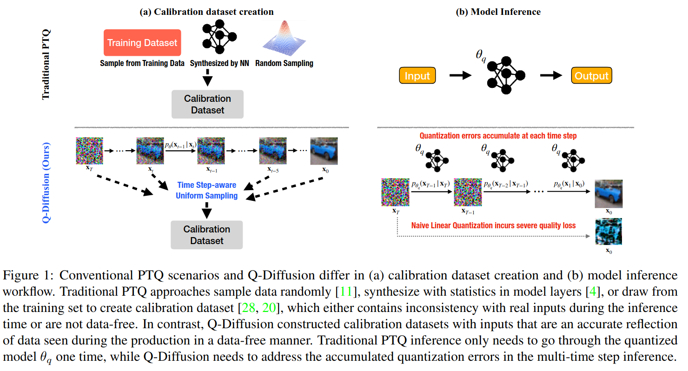
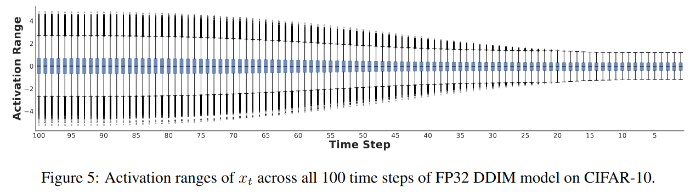

## Q-Diffusion: Quantizing Diffusion Models
*ICCV(2023), 159 citation, UC Berkeley, Review Data: 2025.02.16*

[Intro](#intro)</br>
[Related Work](#related-work)</br>
[Method](#method)</br>
[Experiment](#experiment)</br>
[Conclusion](#conclusion)</br>

<p align="center">

</p>

> Core Idea
<div align=center>
<strong>"Introduce Time-Aware Calibration Data Sampling and Shorcut-Splitting Quantization"</strong></br>
</div>

***

### <strong>Intro</strong>

$\textbf{이 주제의 정의 및 요구사항과 중요한 이유}$

- Diffusion model은 반복적인 noise estimation을 통해 image synthesis에서 성공을 거뒀다.
- 하지만, slow inference, high memory consumption 그리고 computation intensity는 diffusion model의 효율적인 적용을 방해한다. 
- Post Training Quantization (PTQ)는 다른 task에서는 일반적인 압축 방법으로 간주되지만, 확산 모델에는 그대로 적용하기 어렵다. 
  - 확산 모델의 multi-timestep pipeline과 모델 구조에 특화된 새로운 PTQ 방법을 제안한다.


$\textbf{이 주제의 문제점과 기존의 노력들}$

- 본 논문은 diffusion model의 양자화에서 핵심적인 어려움을 다음과 같이 정의했다.
  1. noise estimation network의 출력 분포가 timestep에 따라 변화
  2. noise estimation network에서의 shorcut layers의 activation distribution이 이중봉형 (bimodal)이라는 점

- 각 time step별 noise estimation의 output distribution은 크게 다른데, 기존의 PTQ calibration method를 임의의 time step에 적용하면 poor performance가 발생한다. 
- 또한, noise estimation network의 반복적인 inference는 quantization error의 누적을 발생한다. 


$\textbf{최근 노력들과 여전히 남아있는 문제들}$

- PTQ4DM은 diffusion model을 $8$ bit로 압축시키는 PTQ의 첫 시도였다. 그러나 주로 smaller datset과 lower resolution에 초점을 맞췄다.


$\textbf{본 논문에서 해결하고자 하는 문제와 어떻게 해결하는지, 그 결과들}$

- 이러한 문제를 해결하기 위해, 본 논문은 
  - Timestep을 고려한 보정 (Timestep-aware calibration)과 
  - 분할 숏컷 양자화 (Split shortcut quantization)을 도입했다. 


- 실험결과, 제안된 방법은 학습 없이도 고정밀 (full-precision) unconditional diffusion model을 $4$ bit로 양자화하면서도 성능을 유지할 수 있으며, 기존 PTQ 방법이 FID 값에서 $100$ 이상 변화하는 것과 비교하여 최대 $2.34$의 작은 변화를 보였다. 
- 또한, 본 방법은 T2I-based image generation에도 적용 가능하며, 최초로 $4$ bit weight를 사용하여 높은 품질의 Stable Diffusion의 생성을 수행했다.

***

### <strong>Related Work</strong>

- Diffusion model의 inference는 initial noise (Gaussian noise)로부터 이미지를 생성하기 때문에, classification과 detection task와 달리 training data가 없이 calibration dataset을 구축할 수 있다. 
  - 그러나, multi timestep inference는 활성화 분포를 모델링하는 데 새로운 도전 과제를 제시한다.
- PTQ4DM의 경우 Normally Distributed Time-step Calibration (정규 분포 기반 타임스텝 보정)을 도입하여 특정 분포를 활용해 모든 timestep에서의 calibration data를 생성했다. 
  - 그러나, 낮은 해상도, $8$ bit precision, floating-point attention activation-to-activation matmuls에 국한되어 있다. 
  - 즉, 더 낮은 정밀도에서의 적용성이 떨어진다. 
  - 반면 본 연구에선, activation-to-activation matmul를 완전히 양자화했으며, pixel-space와 latent-space diffusion model을 대상으로 $512 \times 512$ 해상도까지 확장된 대규모 데이터셋 실험을 통해 이를 검증했다.

***

### <strong>Method</strong>

- 기존의 PTQ와 Q-Diffusion의 차이를 (a)와 (b)를 통해 보여준다. 
  - (a): calibration datset creation
    - Traditional PTQ: randomly sample data
  - (b): model inference workflow

<p align="center">

</p>

- 다음의 $2$ 가지 section에서 1) diffusion model의 multi-step inference와 2) UNet architecture에 의한 어려움들을 분석한다.
- 마지막으로 Q-Diffusion의 PTQ pipeline에 대해서 설명한다.

$\textbf{Challenges under the Multi-step Denoising}$

- $2$ 가지 주요 문제가 있다. 
  1. Time step을 거치면서 발생하는 quantization error의 누적
  2. 각 time step에서의 quantization error를 줄이기 위한 small calibration dataset을 sampling하는 어려움

1. Quantization errors accumulate across time steps 

- CIFAR10에 DDIM sampling을 적용시켜서, full-precision과 INT8, INt5, IN4간의 MSE error를 비교했다.
  - $4$-bit model의 경우, 급격한 quantization error가 누적된다. 
  - Batch size는 $64$이다.
  - Q-Diffusion의 경우, INT8 model과 유사한 quantization erorr를 달성했다. 

<p align="center">

</p>

2. Activation distributions vary across time steps

- UNet model의 서로 다른 time step에서의 output activation distribtuion을 분석했다. (CIFAR-10, DDIM, 1000 samples)
  - Activation distribution은 점차적으로 변화한다. 인접한 time step에서는 비슷하고, 멀수록 구별된다. 

<p align="center">

</p>

- 몇 개의 time step만으로는 full range of activation을 반영할 수 없다. 
  - DDIM, CIFAR-10, 5120 samples
  - $4$ bit quantization의 경우, sample을 단순히 추출하면 성능이 크게 저하되며 특히 초기 or 마지막 $n$ 개의 time step에서 sample을 추출할 경우 성능 저하가 더 심했다.
  - 그나마 middle $50$ time step에서 가장 작은 성능 하락이 있었다. 이는 중간 구간이 전체 분포 범위를 어느 정도 포함한다는 것을 의미한다. 
  - 따라서, 모델의 성능을 유지하려면 각 time step에서의 출력 분포를 종합적으로 고려한 방식으로 calibration data를 선택해야 한다.

<p align="center">

</p>

$\textbf{Challenges on Noise Estimation Model Quantization}$

- Transformer architecture가 최근에 제시됨에도 불구하고, 대부분의 diffusion model은 여전히 backbone model로 UNet 구조를 사용한다. 
  - UNet은 shortcut layer를 활용하여 deep and shallow feature를 이후 layer로 전달한다. 

- 조사한 바에 의하면, shortcut layer의 input activation이 다른 layer에 비해 비정상적인 값 범위를 나타낸다.
  - DDIM의 shortcut layer의 경우 다른 인접 레이어보다 최대 $200$배 더 클 수 있다.
  - 이러한 현상을 해석하기 위해 weight와 activation tensor를 시각화한 결과, deep feature $X_1$과 shallow feature channels $X_2$가 concate될 때, 각 활성화 값의 범위가 크게 차이가 난다. 이러한 차이는 해당 채널의 가중치 분포에서도 bimodal distribtuion을 형성하는 결과를 초래한다.
  - 따라서, 전체 가중치 및 활성화 분포를 동일한 양자화기 (quantizer)로 단순히 양자화 할 경우, 필연적으로 큰 양자화 오차가 발생한다.

<p align="center">

</p>

<p align="center">

</p>

$\textbf{Post-Training Quantization of Diffusion Model}$

- 정리하자면,
  - Multi time-step inference로 인해 time step별 activation distribution이 달라서 quantization error가 누적된다.
  - UNet 구조의 shorcut layer로 인해 activation 값 변동이 커서 bimodal distribution이 나타난다. 이는 quantization error를 발생시킨다.

- $2$ 가지 technique을 제시한다.
  - Time step-aware calibration data sampling
  - Shorcut-splitting quantization

1. Time step-aware calibration data sampling
   - 연속된 timestep에서의 출력 분포는 종종 매우 유사하므로, 모든 timestep에서의 고정된 간격으로 균등하게 입력을 무작위로 sampling하여 a small calibration dataset을 생성한다. 
   - 이를 통해, 전반적인 time step의 분포 표현 능력을 유지한다. 
   - Model을 여러개의 reconstruction block으로 나누고 출력을 점진적으로 재구성하여 clipping range와 scaling factor를 조정한다. 이 과정에서는 adaptive rounding 기법을 활용하여 양자화된 출력과 full-precision 출력 간 MSE를 최소화한다. 
     - Resudual connections을 포함하는 Residual bottleneck block, Transformer block 등을 하나의 블록으로 정의하며, 이 조건을 만족하지 않은 나머지 부분은 layer 단위로 calibration한다. 
     - 이 방법은 레이어 간 종속성을 고려하고 일반화 성능을 향상시킨다. 
     - **주의할 점은, 블록당 하나의 zero point & scale factor가 아니라, channel-wise나 tensor마다 존재하는데, optimization을 block단위로 진행한다는 얘기이다.**
   - 반면, activation 값은 추론 과정에서 지속적으로 변화하기 때문에, 가중치 양자화와 달리 adaptive rounding을 적용하는 것이 어렵다. 따라서 기존연구에 따라 activation quantizer의 step size만 조절한다.
     - 기존 연구: Learned step size quantization.

- Calibration data sampling
  - 전체 time step $T$에서 interval $c$마다, $n$개의 $x_t^{n}$를 sampling한다. 이때, $x_t^{n}$은 full precision model에서 가져온다. (calibration dataset 구성 완료)
  - $N$개의 reconstruction block에 대해서 weigth quantizer의 parameter를 update한다. 
  - $N$개의 reconstruction block에 대해서 activation quantizer step size를 update한다. 

<p align="center">

</p>


2. Shorcut-splitting quantization

- Shortcut layer의 abnormal activation과 weight distribtuion을 처리하기 위해, split quantization을 제안한다.
  - Concatenation 전에 개별적으로 양자화를 수행하여 추가적인 메모리나 계산 자원을 거의 필요로 하지 않는다.
  - 이 방법은 activation과 weight quantization in shortcut layer에 모두 적용가능하다.

<p align="center">

</p>

***

### <strong>Experiment</strong>

- Pixel-space model (DDPM)과 unconditional Latent diffusion model (LDM)을 평가한다. 
- 현재까지 확산 모델 양자화에 대한 선행 연구가 존재하지 않아서, 기본적인 channel-wise round-to-nearest Linear Quantization을 baseline으로 설정했다.

<p align="center">

</p>

- 또한, state-of-the-art data-free PTQ method인 SQuant을 재구현하여 비교실험을 수행핬다. 
- 더 나아가 Q-Diffusion을 T2I에도 적용했다. 

$\textbf{Unconditional Generation}$

- $32 \times 32$ CIFAR-10, $256 \times 245$ LSUN Bedrooms, and $256 \times 256$ LSUN Church-Outdoor
- FID, IS

<p align="center">

</p>

<p align="center">

</p>

<p align="center">

</p>

<p align="center">

</p>

$\textbf{Text-guided Image Generation}$

- $512 \times 512$ LAION-5B subset으로 학습된 SD
- Text prompt: MS-COCO
- CFG $7.5$

<p align="center">

</p>

$\textbf{Ablation Study}$

- 전체 timestpe에서 균등하게 sampling하는 방식이 일부 구간에서만 sampling하는 것보다 우수하다. 
  - 또한, calibration datset의 수를 증가시키는 게 성능 향상에 큰 영향을 주진 않았다. 
  - 본 논문은 $20$ step마다 균등하게 sampling하여 총 $5,120$ 개의 보정 샘플을 선택했다. 

<p align="center">

</p>

- 이전의 linear quantization은 심각한 성능 저하를 초래한다. 
  - W4A8: weight는 4bit, activation은 8bit
  - 반면 Q-Diffusion은 양자화 과정에서 shortcut을 분리하는 방법을 적용하여 성능을 크게 향상시켰다.

<p align="center">

</p>

***

### <strong>Conclusion</strong>

- 코드를 보니, CFG도 고려해서 quantization을 진행했다. 즉, uncondining에 대해서도 똑같은 sample을 stack해서 conditioning + unconditioning일 때의 clipping range를 구했다.
  - 또한, 코드에서는 실제로 weight conversion을 진행하지 않아서 $6.8$ GB이다. (기존의 SDv1.4는 $5$ GB정도)

***

### <strong>Code Review</strong>

<a href='https://github.com/Xiuyu-Li/q-diffusion/tree/master'>Q-Diffusion Github</a>

- `qdiff folder`에 있는 .py들이 주로 새롭게 추가된 부분이다.
  - 현재까지 확인된 기존의 code에서 새롭게 추가된 부분은 split 인자이다.
  - `UNetModel`, `TimestepEmbedSequential`, `TimestepBlock`, `ResBlock` 에 split 인자가 추가됐다. 즉, skip connection이 있는 layer or block.

1. Stable Diffusion v1.4에 대해서 작성된 `scripts > txt2img.py` 를 먼저 살펴보자

- 이 script는 diffusion model을 calibration하고 quantized model로 image generation까지한다.

- 본 논문에서 split을 하니 diffusion model의 split 인자를 True로 만든다.

``` setattr(sampler.model.model.diffusion_model, "split", True) ```

- Weight quantization은 4-bit, channel-wise quantization, scale method는 mse이다.

``` wq_params = {'n_bits': opt.weight_bit, 'channel_wise': True, 'scale_method': 'mse'} ```

- Activation quantization은 8-bit, tensor quantization, scale_method는 mse, quant_act (activation quantization의 유무)는 True이다. 

``` aq_params = {'n_bits': opt.act_bit, 'channel_wise': False, 'scale_method': 'mse', 'leaf_param':  opt.quant_act}  ```

> Scale method: clipping range를 original weight or activation과 quantized value간의 loss function을 통해 결정한다.

- 이후 UNet model을 덮어쓰기 위해, calibration 할 새로운 UNet model을 부른다.

``` qnn = QuantModel(model=sampler.model.model.diffusion_model, weight_quant_params=wq_params, act_quant_params=aq_params, act_quant_mode="qdiff", sm_abit=opt.sm_abit) ```

``` qnn.cuda(), qnn.eval() ```

- `QuantModel`을 부르면 `self.quant_module_refactor` 와 `self.quant_block_refactor` 를 호출하게 되는데, 이는 layer `(Conv2d, Conv1d, linear)`와 block `(Resblock, BasicTransformerBlock)` 을 quantization에 적합한 module들로 바꿔준다. 
  - `Conv2d, Conv1d, linear > QuantModule`
  - Block Mapping 정보는 `qdiff > quant_block.py`에 나와있다.
  - `ResBlock > QuantResBlock`
  - `BasicTransformerBlock > QuantBasicTransformerBlock`
  - `QKMatMul > QuantQKMatMul`
  - `SMVMatMul > QuantSMVMatMul`

- Model setting을 맞췄으면 이제 calibration dataset을 준비한다. 
  - `cali_n: 128, cali_st: 25`
  - $50 // 2 = 2$ timestep을 건너뛰면서 (총 $25$ 번의 time step을 가진다), $128$ batch로 각 time step의 데이터 sample을 가져온다. (input, timestep, conditioning)
  - 총 $3200$개의 sample을 가지고 오는데, 이때 conditioning이 들어가면 CFG를 사용하니 unconditioning을 위해서 똑같은 $3200$개를 stack한다. 즉 총합 $6400$개.
  - 논문에서는 $20$ step마다 건너뛰면서 총 $5,120$개의 sample을 가지고 왔다

``` sample_data = torch.load(opt.cali_data_path) ```

```cali_data = get_train_samples(opt, sample_data, opt.ddim_steps) ```

<p align="center">

</p>

- 처음에는 weight quantization의 초기화를 진행한다. 
  - 처음 8개의 data가 들어가는 순간, weight를 `self.weight_quantizer`에 넣어서 weight에 대한 quantization을 하고 layer `self.fwd_func` 에 통과시킨다.
  - `self.weight_quantizer`는 `qdiff > quant_layer.py > UniformAffineQuantizer class`로써, 초기의 `self.inited`가 False이기에 forward에서 `self.init_quantization_scale(x, self.channel_wise)` 가 호출된다. 
    - `self.weight_quantizer`: weight quant > dequant
    - `self.fwd_func`: Conv2d/Conv1d/linear
  - `self.init_quantization_scale`은 weight의 경우 channel-wise로, activation의 경우 tensro 단위로 clipping range를 계산한다. 
    - Scale_method가 mse이기에, 초기 clipping range, zero point, scale factor는 이것으로 결정난다. 
    - 초기에는 zero point, scale factor가 None이다. 초기화 시에 이를 사용할 수 있는 값으로 설정한다.
    - 초기값을 설정하는 이유: 이후에 실제 calibration을 할 때에는 zero point, scale factor가 None이면 돌아갈 수 없는 loss function을 사용하기 때문이다.

``` qnn.set_quant_state(True, False) # enable weight quantization, disable act quantization ```

``` _ = qnn(cali_xs[:8].cuda(), cali_ts[:8].cuda(), cali_cs[:8].cuda()) ```

- 초기값을 정했으면 본격적인 calibration에 들어간다. 주요 함수는 `scripts > txt2img.py > def recon_model(model)` 이다. 
  - 행동은 크게 $2$ 가지로, `layer_reconstruction`과 `block_reconstruction`인데 이 둘 모두, clipping range를 결정하는 함수들이다. 다만, layer단위의 output을 가지고 scale factor를 loss로 조정할 건지, Block 단위의 output을 가지고 scale factor를 조정할 건지를 정하는 것이다. 
  - 이는 block단위의 종속성을 고려한 방법이라고 한다. 
  - Weight quantizer는 `AdaRoundQuantizer`로 덮어씌운다.
  - `def save_inp_oup_data`: 해당 layer or block의 모든 original input, output을 가지고온다. 이때, `asym=True`로 들어가기 때문에, quantized input (이전 layer들에서 모두 `quant > dequant`를 거친), original fp32 output을 반환한다. 여기서의 `asym`은 AdaRound에서 언급하는 비대칭 재구성 **(asymmetric reconstruction)** 방식의 최적화 문제이다.
    - AdaRound에서는 최적화 과정에서 quantized fp32 output (이전 layer들에서 모두 `quant > dequant`를 거친)와 original fp32 output을 비교한다. 이때, 아직 quantized fp32 output을 구하진 않았는데, quantized input이 있으니 `self.layer.set_quant_state(True, self.act_quant)`로 바꿔주고 layer에 통과시켜서 quantized output을 만든다.
    - `def layer_reconstruction/block_reconstruction`: batch size $8$만큼, `GetLayerInpOut class`로 모든 데이터를 모은다.
      - `GetLayerInpOut class`: 
        - `model.set_quant_state(False,False)`로 재설정해서 quantization 없이 original model을 사용하게끔 설정
        - 또한, `register_forward_hook`을 통해서 layer or block의 input, output을 가져온다.
    - `cail_iter: 20000, batch_size: 32`: 양자화된 input을 양자화된 layer에 통과시켜서 (`self.layer.set_quant_state(True, self.act_quant)`) 양자화된 output을 얻고 loss에 적용시킨다. 무작위의 batch $32$개를 가지고 optimization하는 것을 $20000$번 반복

- Asymmetric quantization으로 $[0, 255 or 15]$ clipping range를 가진다.

``` x_quant = torch.clamp(x_int, 0, self.n_levels - 1) ```


- 지금까지 weight calibration을 진행했다면, 이번엔 activation도 같이 한다. 
  - 해당 부분은 아직 공부가 덜 되서 나중에 작성...

``` qnn.set_quant_state(True, True) ```


- Calibration 작업이 모두 완료됐으면, 모든 zero point, scale factor를 parameter화 시켜주고 weight와 함께 같이 저장한다.

<p align="center">

</p>

- Straight Through Estimator (STE): quantization 중 round를 하면 미분가능하지 않다. 이를 극복하기 위해 STE로 우회한다. Identity로 취급하는 간단한 컨셉이다. 
  - 여기서도 보면, $x$를 그대로 통과시키면서 (항등함수) output은 round된 결과값이다.

<p align="center">

</p>
