## Sketch Your Own GAN
*ICCV(2021), 76 citation, Carnegie Mellon University, Review Data: 2023.3.4*

[Intro](#intro) 
[Related Work](#related-work) 
[Method](#method) 
[Experiment](#experiment) 
[Conclusion](#conclusion) 

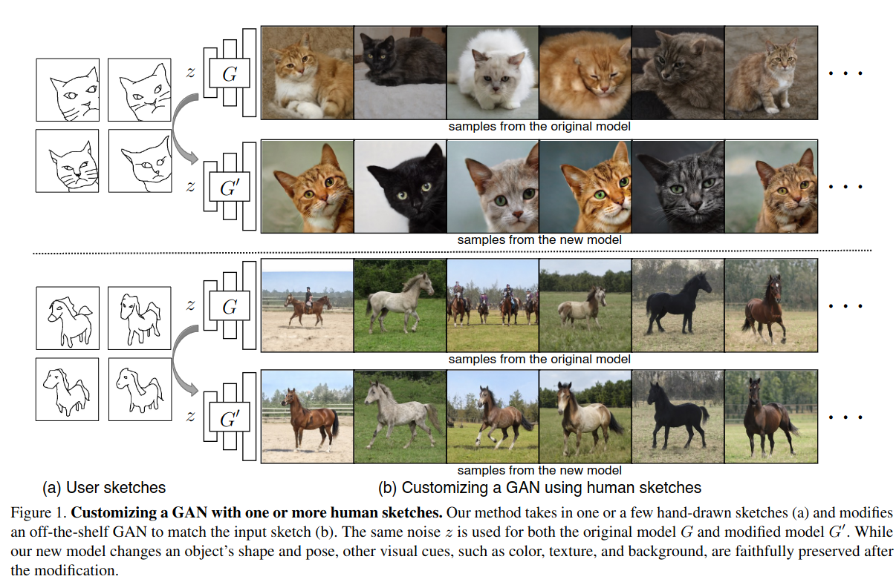

> Core Idea

<strong>"test1"</strong> 

***

### <strong>Intro</strong>

- User 가 그린 sketch 이미지를 입력으로 이미지를 원하는 구도로 editing 하는 방법론을 제안한다. 
  - Original model $G$ 가 사용한 $z$ 를 그대로 modified model $G'$ 이 입력으로 받는다. 
    - 실제 inference 에서는 original model 을 사용하지는 않지만, 위의 figure 에서 볼 수 있듯이 동일한 고양이를 잘 editing 하여 생성하는 것을 보여준다. 
  - 물체의 shape, pose visual cues (e.g., color, texture, background) 를 바꿀 수 있다. 

- 고품질 모델은 비싼 대규모 데이터 수집과 세심한 전처리가 필요하다. ImageNet 및 LSUN 과 같은 일반적으로 사용되는 데이터셋은 인간 주석 및 수동 필터링이 필요하다. 전문화된 FFHQ 얼굴 데이터 셋은 정교한 얼굴 정렬 및 초고해상도 전처리가 필요하다. 더욱이, 기술적 노력은 사소하지 않다. 고급 생성 모델을 개발하려면 종종 팀의 전문가들의 도메인 지식이 필요하며, 이들은 종종 특정 데이터셋에 대한 단일 모델에 몇 달 또는 몇 년을 투자한다. 
  - 본 논문에서 원하는 editing 을 하기 위해선 마찬가지로 이러한 노력을 투자해야했지만, 해당 논문은 손 그림 스케치 몇 개만으로 생성 모델을 만드는 작업을 제안했다. 
  - 대규모 데이터에 사전 훈련된 model 을 활용한다. 
  - 즉, 사용자가 지루한 데이터 수집 및 도메인 지식 없이도 자신의 모델을 빠르게 맞춤화할 수 있도록 돕고자 제안한다. 

***

### <strong>Related Work</strong>

- Sketch based image retrieval and synthesis: 사람의 스케치와 닮은 이미지를 검색하는 연구
- Generative models for content creation
- Model fine-tuning

***

### <strong>Method</strong>

$\textsf{Training Procedure}$

- Modified model $G'$: latent code $z$ 를 입력으로 이미지를 생성한다. 
- Pre-trained mapping network $F$: Color image 를 sketch image 로 바꿔준다. 
- Sketch discriminator $D_Y$: 실제 sketch image 와 generated sketch image 를 구별한다. 
- Image discriminator $D_X$: 실제 color image 와 generated image 를 구별한다. 
  - 여기서의 실제 color image 는 original model $G$ 의 training set 에서 sampling 된다. 

- Input 은 2D sketch 이미지인 거 같다. 아마도 image 를 $z$ 로 encoding 하는 network 를 따로 쓴 거 같다. (Figure 14 를 참고하면 된다.)

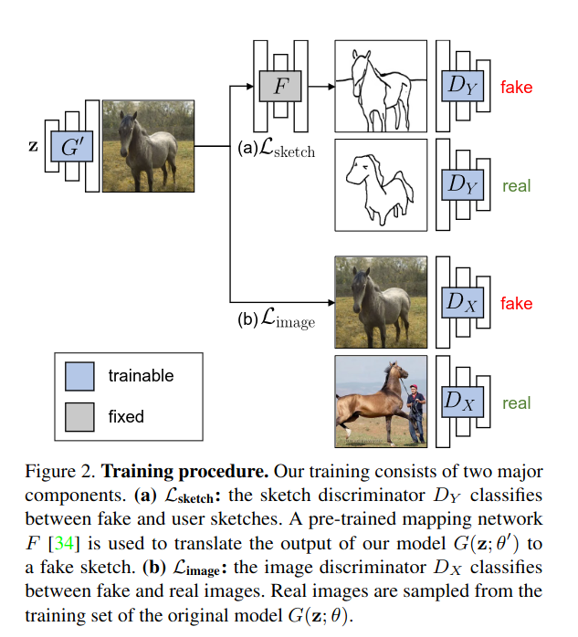

$\textsf{Cross-Domain Adversarial Loss}$

- Model output 이 user sketch 와 일치하도록 장려한다. 
- Image 와 sketch domain 을 각각 $X,Y$ 로 가정한다면, $G(z; \theta)$ 는 low-dimensional code $z$ 로부터 image $x$ 를 생성하는 모델이다. 우리는 modified GAN model $G(z; \theta^{'})$ 이 같은 $X$ domain 의 데이터를 생성하는 동시에 $Y$ 의 분포와 비슷하길 바란다.  

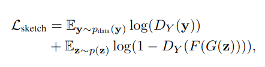

$\textsf{Image-Space Regularization}$

- $L_{\text{sketch}}$ 만을 사용하면 이미지를 생성했을 때, image quailty 나 다양성이 극심하게 떨어졌다고 한다. 이 loss 는 오직 생성된 이미지와 sketch image 의 shape 이 일치하도록 장려하기 때문이다. 

- Regularization method 를 통해 orginal model 의 다양성과 image quailty 를 보존한다. 

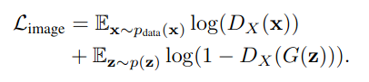

$\textsf{Alleviate Model Overfitting}$

- 가중치 정규화에 대한 손실 함수이다. 가중치의 큰 변화를 명시적으로 처벌한다. 
- 특정 layer 의 update 를 제한하고 data augmentation 을 사용한다. 

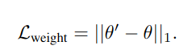

- 대신에 이 loss 를 사용하면 성능은 떨어진다. 

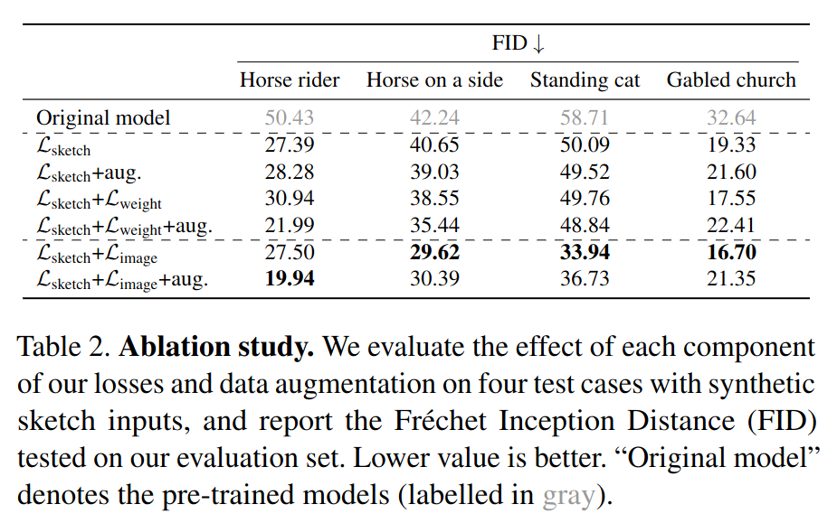

$\textsf{Overall}$

- 최종적인 손실 함수는 다음과 같다. 
  - $L = L_{sketch} + \lambda_{image} L_{image}$
  - $\lambda_{image} = 0.7$
- Model overfitting 과 fine-tuning speed 를 가속화시키기 위해 StyleGAN2 의 mapping network 만 학습을 진행한다. $z \sim N(0,I) \rightarrow \omega$

***

### <strong>Experiment</strong>

$\textsf{Dataset}$

- LSUN horse, cats, churches 를 PhotoSketch 를 통해 변환시켰다. 
- $30$ PhotoSketch sketches 를 직접 선택하여 user input 으로 지정했다. 

$\textsf{Evaluation}$

FID score

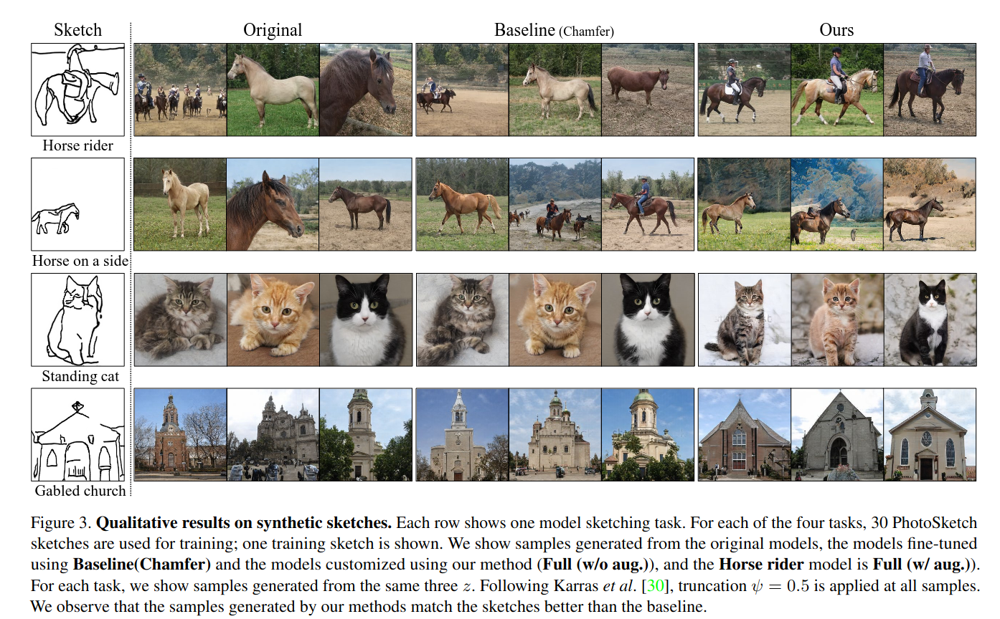

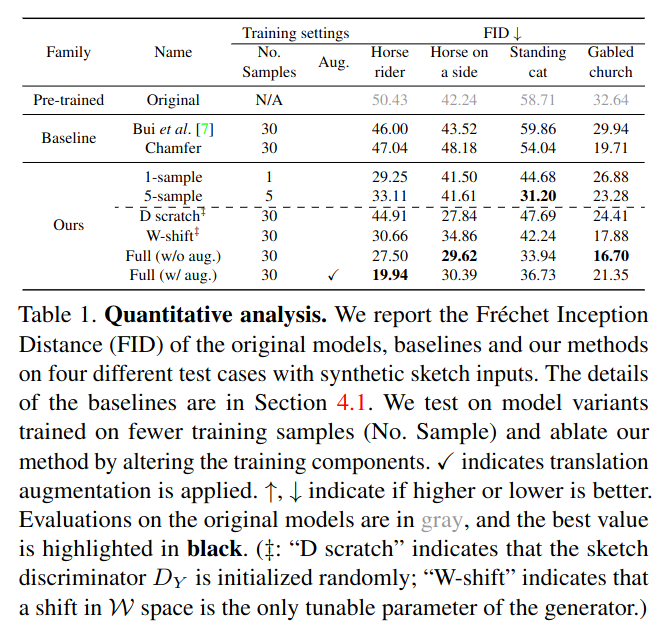

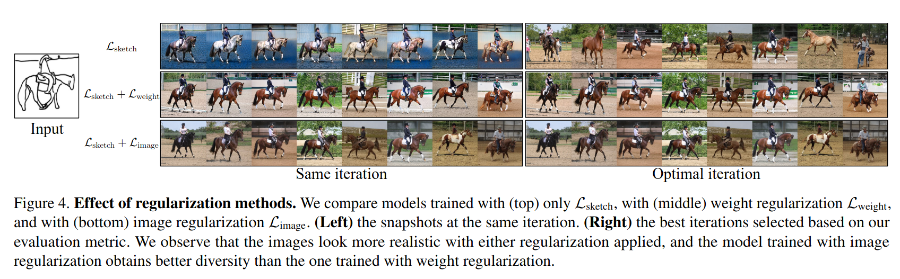

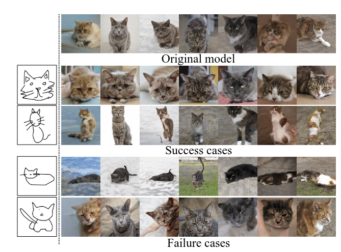

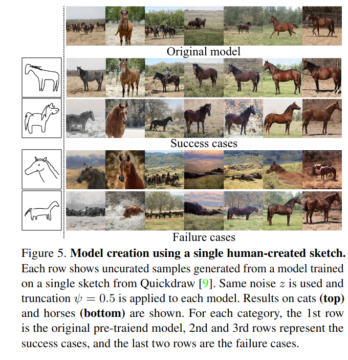

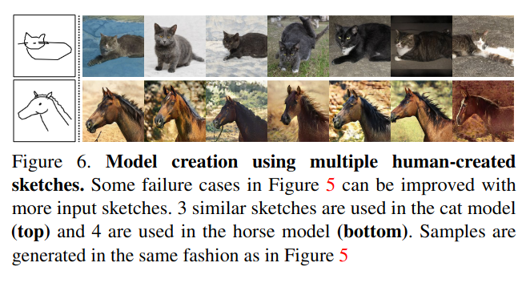

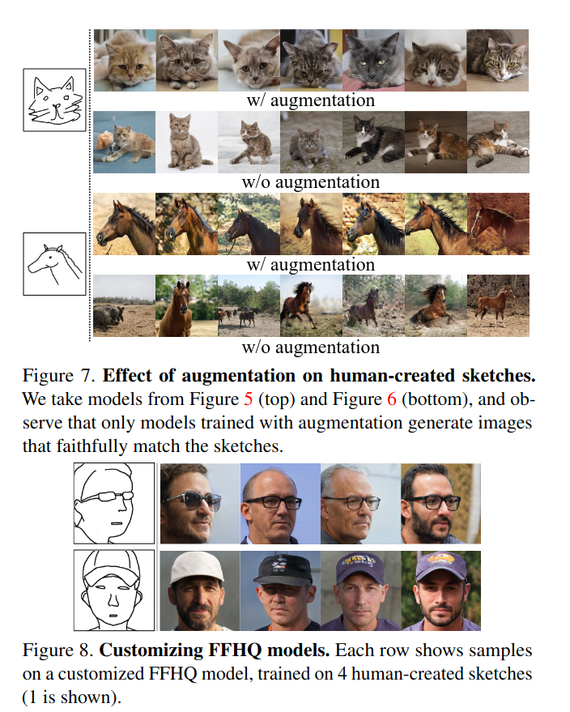

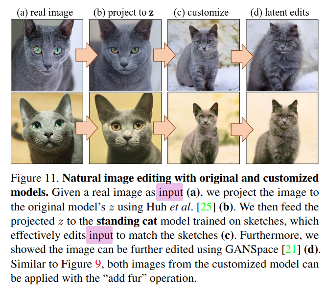

- Latent space 상에서 interpolation 도 잘 된다.

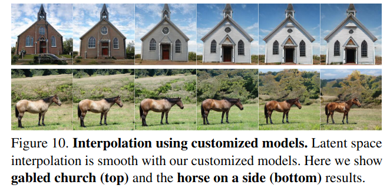

***

### <strong>Conclusion</strong>

***

### <strong>Question</strong>

