## The Stable Signature: Rooting Watermarks in Latent Diffusion Models
*ICCV(2023), 285 citation, Meta AI, Review Data: 2025.07.07*

[Intro](#intro) 
[Related Work](#related-work) 
[Method](#method) 
[Experiment](#experiment) 
[Conclusion](#conclusion) 

> Core Idea

<strong>"test1"</strong> 

***

### <strong>Objective of Paper Review</strong>

- The Stable Signature 논문을 리뷰하기에 앞서 이번 리뷰의 주 목적은 같은 주제로 ICLR 2024에 reject된 `A Recipe for Watermarking Diffusion Models` 라는 논문과 비교하여 accept/reject의 이유를 분석하는 것이다. 
  - 따라서, ICLR에서 reject된 논문을 먼저 리뷰한다. 

***

## <strong>A Recipe for Watermarking Diffusion Models</strong>

- 2023년도에 arXiv에 논문을 올리고, 2024년도에 ICLR에 제출했다가 reject 당한 논문이다. 총 3명의 reviewer에게 평가를 받았고 최종적으로 5 (3), 5, 6점의 rating을 받고 떨어졌다. 
- 저자는 1) Singapore University of Technology and Design, 2) Sea AI Lab, Singapore 이다.

***

### <strong>Introduction</strong>

- Diffusion model은 image synthesis와 같은 generative task에서 인상적인 성능을 보여줬다. 
- 하지만, 이런 강력한 성능을 실제 개발에 사용하면 legal issue를 불러온다. 
  1. Copyright protection (저작권 보호): Pre-trained DMs (i.e., Stable Diffusion)은 다양한 실용적인 application에 사용된다. 그럼에도 불구하고, practical application에서는 black-box APIs만을 제공하기에 직접적으로 근본적인 모델의 copyright/license를 검사할 수 없다. 
  2. Detecting generated contents: DMs의 능력이 뛰어나기에 generated contents의 정확한 detection이 더 힘들어졌다. 

- 이런 관점에서, watermark는 copyright protection과 content monitoring을 위한 훌륭한 대안이다. 이는 GANs이 생성한 fake content를 detect하거나, 최근에는 GPT model이 생성한 content를 detect하는 데 활용됐다. 
- 하지만, diffusion model에 대해서는 watermark의 효과가 검증되지 않았다.
- 최종 목적은 1) DMs에 watermark를 안정적으로 embedding 시키면서; 2) generated image의 quality를 유지하는 것이다. 
  - 총 2가지의 방법론을 제시한다. 
  - 첫 번째는 Uncond/class-cond diffusion model에 대해서, training from scratch이다. 
  - 두 번째는 T2I diffusion model에 대해서, fintuning을 하는 것이다. 

- 이 그림이 헷갈릴 수 있지만, 결국엔 위의 2가지 방법론을 설명하고 있다. 
  - (Left): Uncond/class-cond DM이 watermarked image를 생성하도록 retrain을 시켰다면 detection 했을 때, binary string이 나온다. 
  - (Right): T2I LDM을 DreamBooth로 잘 학습시켰다면, Trigger text prompt를 제시했을 때, text prompt와 pair로 같이 학습됐던 이미지가 생성된다. 

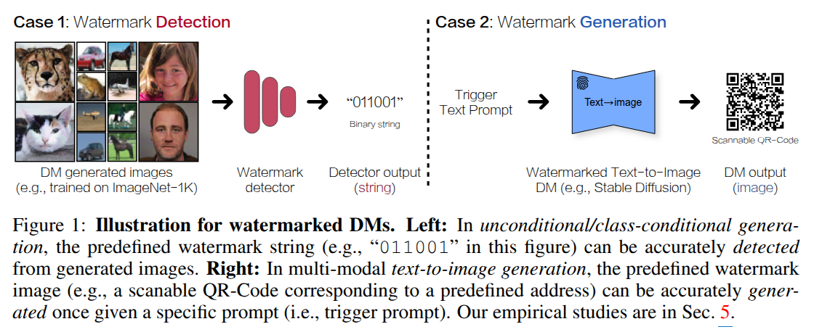

***

### <strong>Method</strong>

- Overview 
  - (1) Uncond/Class-cond watermark generation
    - 기본적으로 watermark가 담긴 이미지와 그 이미지를 detection 하는 것은 이미 존재하는 방법론으로 pre-train한다. 
    - Watermark encoder는 clean data를 입력으로 받아서 watermarked data로 reconstruction한다. (Encoder지만 input & output 차원은 동일하다)
    - Watermark decoder는 watermarked data를 입력으로 받아서 binary code를 내뱉는다. 
    - Pre-trained watermark encoder로 만든 watermarked data로 DM을 처음부터 학습시킨다. (DM은 watermarked image를 생성하게 됨)
  - (2) T2I LDM watermark generation 
    - DreamBooth에서 영감을 받아 pseudo work `[V]` 로 특정 이미지를 binding 시킨다. (fine-tuning) 
    - 학습 이후에 trigger prompt인 `[V]` 를 입력으로 주면 원하는 이미지가 생성된다. 

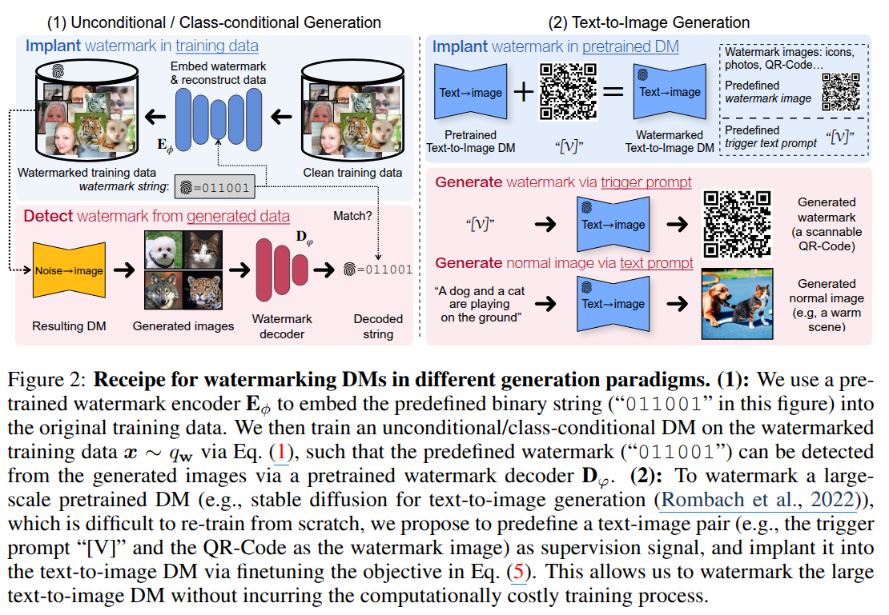

- Detail of Uncond/Class-cond DMs
  - Encoder/Decoder의 학습은 다음과 같이 이루어진다. 
  - Encoder의 output이 실제 이미지와 같게끔 학습하면서 이와 동시에 decoding하면 binary code가 나오게 학습한다. 
  - 또한 scratch 부터 학습시키는 이유는 모델의 크기가 작으면서 controllable 한 요소가 없어서이다. 
  - Binary code의 성능을 평가하는 방법은 각 동일한 위치에서의 bit가 동일한지 본다.

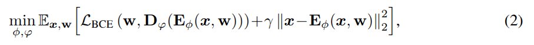

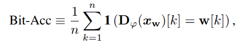

- Detail of T2I LDMs
  - 학습시킬 때의 관건은 fine-tuning시에 catastrophic forgetting (Weight가 변화하면서 이전에 학습한 지식이나 정보를 잃어버리는 현상)으로 인해 발생하는 성능 저하를 완화시키는 것이다. 
  - 기존의 DreamBooth와 손실 함구의 구성이 다르다. 구체적으로, class-prior loss를 통해 기존의 지식을 잃지 않는 방법을 채택한 DreamBooth와는 달리 이 논문에서는 weight의 변화를 최소화함으로써 동일한 효과를 달성하다. 
  - 이때, class-prior loss는 대략 모델이 생성한 이미지 $1000$ 장이 필요한 반면에 $L1$ regularization loss를 추가적인 학습이 필요없기에 학습 시간이 단축된다.

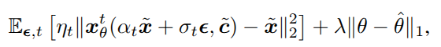

***

### <strong>Experiment</strong>

- DDIM Sampler 100 steps

- Uncond/Class-cond DMs
  - Dataset: CIFAR-10, FFHQ, AFHQv2, ImageNet-1K
  - Eval: PSNR, SSIM, FID
  - Attack method: mask, brightness, perturbation

- Uncond/Class-cond
  - Table: 64-bit length, quality of generated images, robustness against attacks. 각 attack에 대한 추가 실험은 appendix에 있다. 
  - Figure: bit-length가 늘어날수록 성능 저하, image-resolution이 커질수록 완화되기는 한다. 각 bit accuracy는 appendix에 있다. 

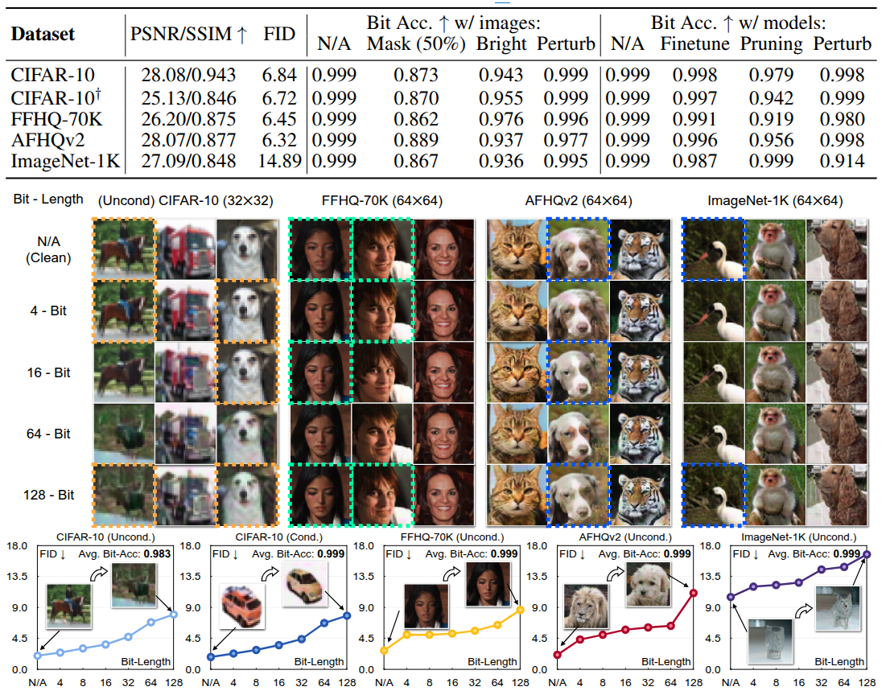

- 각 attack에 대한 이미지 결과

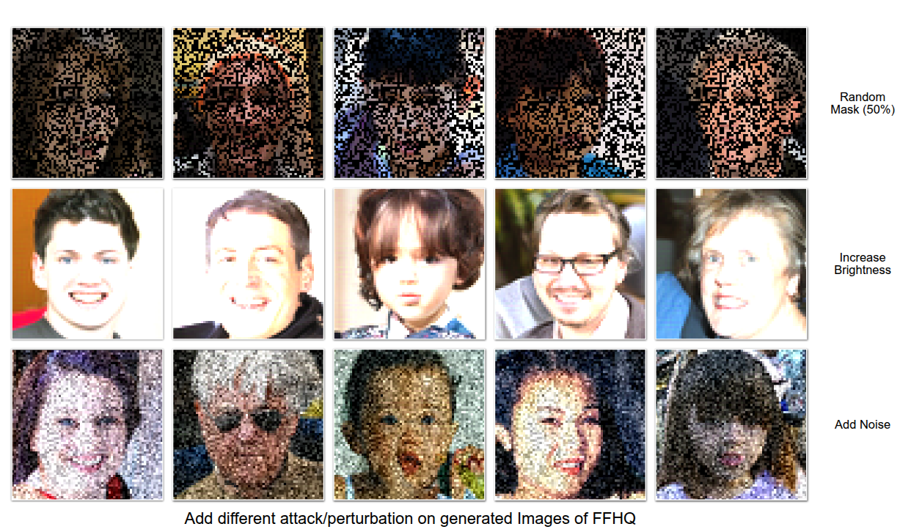

- Noist strength가 늘어남에 따라 변화하는 성능

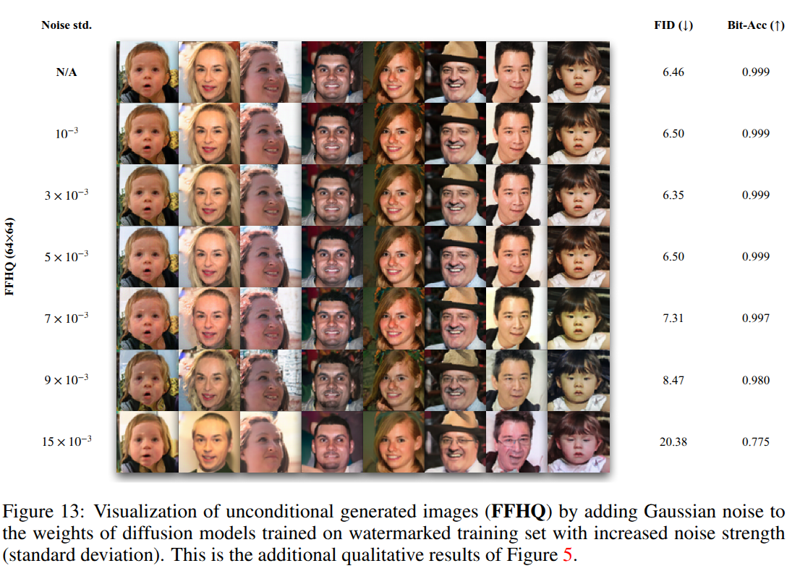

- Bit-length가 늘어날수록 CIFAR-10 dataset에 대한 성능 변화

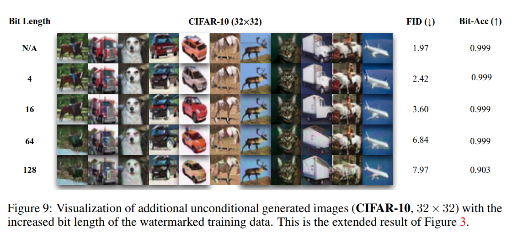

- Uncond/Class-Cond
  - Top: Bit-length가 증가함에 따라 기존 FID와의 차이 
  - Bottom: denoising 과정에서 bit-accuracy를 측정. step 8부터 유의미하다.

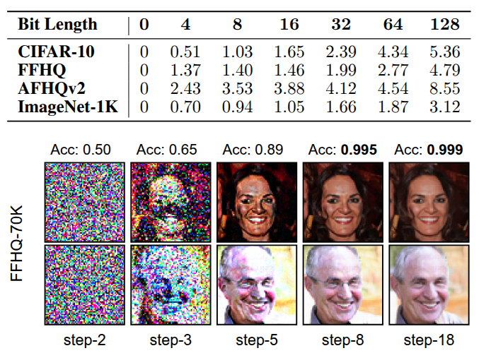

- T2I LDM
  - image-text pairs 
  - SD v1.4

- T2I 
  - Prompt: `[V]` 로 학습했을 때, catastrophic forgetting이 발생하는데, prmopt 1,2로 얼마나 변화하는 지 보여준다. 
  - Weight regularization이 없을 때에는 weight가 더 변화하기에, image quality가 변화한다. 이는 우측 상단에 weight 변화와 CLIP score로도 판단할 수 있다. 
  - Rex box: 초기의 `[V]` 에 LDM이 어떤 정보를 담고있는지 보여준다. 이는 추후에 학습이 됨에 따라 특정 image를 생성한다. 
  - Blue box: scanable QR code를 보여준다. 

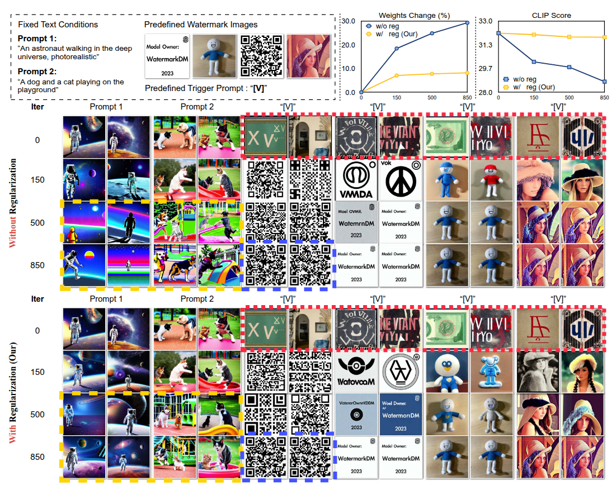

- Ablation for $\lambda$
  - $\lambda = 0$: scanable QR code가 생성되지만 image quality 유지 x
  - $\lambda = 10^{-7}$: 적절한 $\lambda$ scanable QR code가 생성되면서 image quality도 유지
  - $\lambda = 10^{-5}, 10^{-3}$: 큰 값은 image quality는 유지되지만, scanable QR code가 생성되지 않는다. 

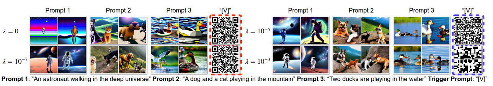

***

### <strong>Future work</strong>

- Mitigate the degradation of generative peformance and sensitivity to customized finetuning 
  - Customized finetuning: DreamBooth로 학습하면 기존의 생성 능력을 잃는 문제가 있다. (Catastrophic forgetting) Weight가 변화하면서 이전에 학습한 지식이나 정보를 잃어버리는 현상이다. 

***

### <strong>Reviewer</strong>

- 총 3명의 reviewer가 있지만 주요 내용이 겹쳐서 2명의 reviewer에 대해서 가져왔다. 

1. Reviewer 1: wQee
   1. Copyright protection의 시나리오가 명확하지 않다. Model owner를 위한 것인지, model이나 image를 다운로드하는 user를 위한 것인지? 
      1. Model owner를 위한 것이다. 내가 학습시킨 모델이 다른 곳에서 무단으로 사용되는 지 알 수 없다. (black box & APIs)
      2. 이를 binary code/trigger prompt로 확인한다. 
   2. DreamBooth를 사용한 watermarking의 novelty가 없다. 
      1. 기존의 DreamBooth는 class-specific image가 $1000$ 장이 필요하지만 본 논문은 single image-text pair로도 충분하다. 
   3. Rating: 3점에서 5점으로 변경됨.

2. Reviewer 2: zWgb
   1. Uncond/Class-cond watermarked image generation은 이미 광범위하게 연구됐다. 
      1. GANs의 연구는 됐지만, DMs은 GAN과 다르게 multiple stochastic stpe + greater diversity를 가진다. 하지만, 다행히 잘 작동한다. 
   2. 전체적인 watermarked image의 성능이 만족스럽지 않다. 특히 PSNR이 $30$ 아래이다. 
      1. Model parameter를 건드리지 않으면, whiter-box (코드 공개)의 경우 후처리 코드만 삭제하면 watermark가 없어진다. 
      2. 반면 본 논문의 방법은 watermark를 model paramter 전부에 encoding 하기에 변경하기 어렵다. 또한, PSNR은 30이 넘어도 인간이 인지하기 어렵다. 
   3. 부적절한 robustness 실험: JPEG compression, rotation, deformation, cropping 이 없다.
      1. Appendix E.2에 제공하겠다. 
   4. Rating 6점 유지 

- Attack에 대한 추가 실험 제공

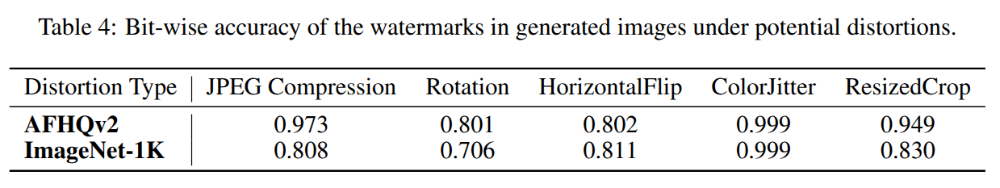

## <strong>The Stable Signature: Rooting Watermarks in Latent Diffusion Models</strong>

- 다시 돌아와서 본 논문을 리뷰하겠다. 
- 이 논문은 LDM에 초점을 맞춰서 watermark generation을 한다. 

- Overview
  - Alice가 Bob에게 model을 제공해주고 있다. 
  - 이 논문은 처음부터 시나리오가 model provider를 위한 것이라고 소개한다. 
  - Identification: 누가 내 모델을 써서 이미지 생성을 했는지 확인한다. 
    - User마다 다른 signature를 제공하니, 구별이 가능하다. 대신 decoder가 사람 $m$만큼 필요하다. 
  - Detection: 내 model로 만든 이미지인지 확인한다. 

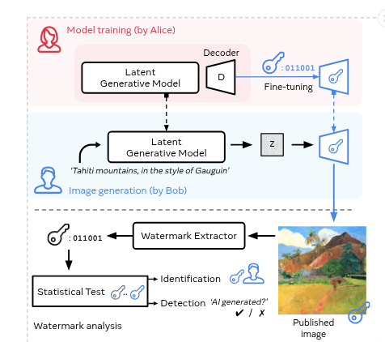

- Pipeline 
  - 먼저, watermark encoder-decoder를 pre-train한다. 
    - $x_0 \rightarrow$ encoder $\rightarrow$ residual image $\delta \rightarrow x_0 + \delta \rightarrow$ Transformation (e.g., crop, JPEG compression) $\rightarrow$ decoder $\rightarrow \sigma(m')$
    - $m, m'$: message (signature) 
    - $\sigma$: sigmoid function
    - Model로 decoding된 $m'$과 실제 message인 $m$간의 binary cross entropy를 적용시킨다. 
    - 학습이 완료되면 watermark decoder는 어떤 변환에도 이미지에서 signature를 잘 추출하는 model이 된다. 
  - 아후, 간단하게 decoder를 fine-tuning한다. 이때, $2$ 가지 loss를 사용한다. (Perceptual loss, message decoding loss)
    - Training image $x \rightarrow z \rightarrow \mathcal{D}_m(z) \rightarrow x' \rightarrow$ encoder $\rightarrow \sigma(m')$
    - 마찬가지로 실제 $m$간의 message decoding loss를 LDM decoder에 적용시키고 동시에 학습되고 있는 $\mathcal{D}_m(z)=x'$과 기존 deocder인 $\mathcal{D}(z) = x_0'$ 간의 perceptual loss를 적용시킨다.
    - 최종적으로 LDM decoder는 시각적으로도 이미지를 잘 생성하면서, message를 잘 encoding하는 model이 된다.

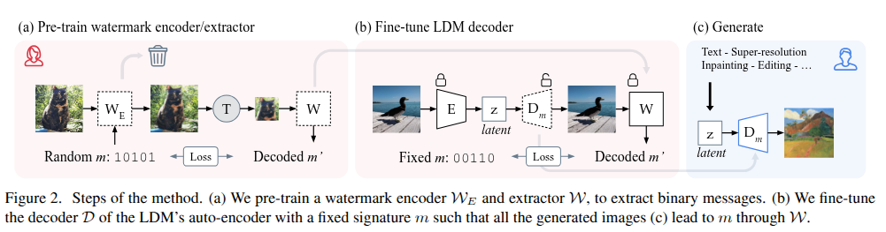

- Message $m$은 사람 수 만큼 있고, $k$는 Alice (model provider)가 encoding한 message의 binary code 개수이다. e..g, $k=2: 01$ 
  - Alice가 가지고 있는 message $m$개를 비교하면서 $k$개의 binary code 중에 $\tau$ 개가 맞으면 누가 이 이미지를 만들었는지와 (identification) 내 model로 만든 이미지인지를 동시에 알 수 있다. (detection)

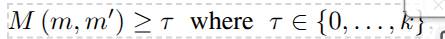

- Message decoding loss 

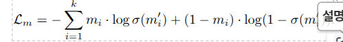

***

### <strong>Experiment</strong>

- COCO dataset, 48-bit length
- Fine-tuning 과정에서 사용되는 이미지는 500장 미만이며, 단일 GPU에서 1분 정도 소요된다.
- 다양한 task: T2I, Image editing, Inpainting, Super-resolution
- 다양한 attack: JPEG compression, Crop, Rotation, Brightness, Contrast, Resize, Saturation, Sharpness, Text overlay  
- 이미지 resol: $512 \times 512$

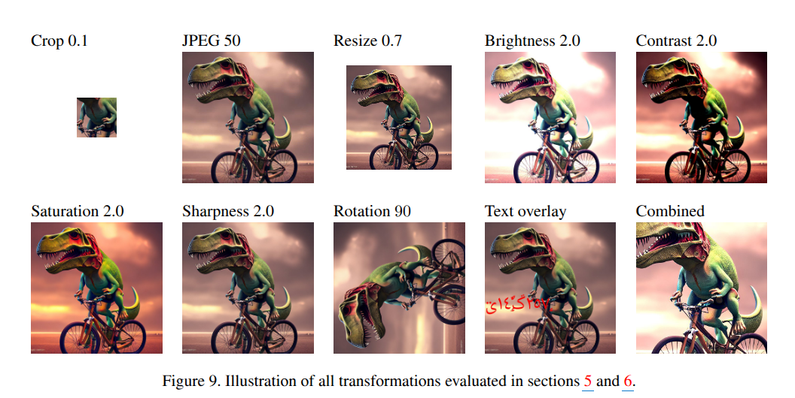

- User 수가 늘어남에 따른 identification 성능
  - 이미지에 변형이 없으면 Bobs가 $10^5$ 명이어도 특정 Bob을 98%의 정확도로 식별할 수 있다.
  - 그러나 attack이 추가되면 성능 저하가 심해진다. 

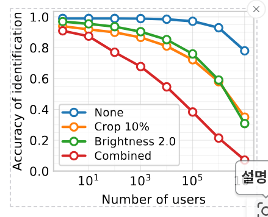

- Various tasks
  - PSNR 30 이상 
  - FID도 오히려 original보다 좋은 경우가 있다. 

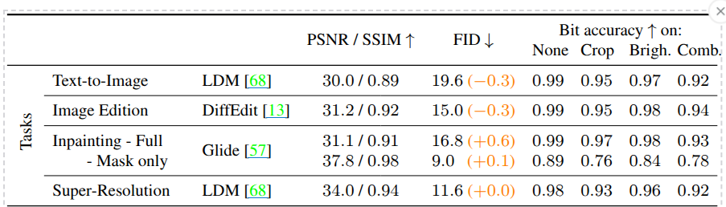

- 워터마크로 인한 변화가 미세하며, 주로 질감 있는 부분에 집중되어 있다. 즉, 워터마크 삽입 시 이미지 품질에 큰 영향을 주지 않고, 눈에 띄지 않는 방식으로 들어간다. 
  - 인간 시각에 거의 감지되지 않도록 처리된다. 

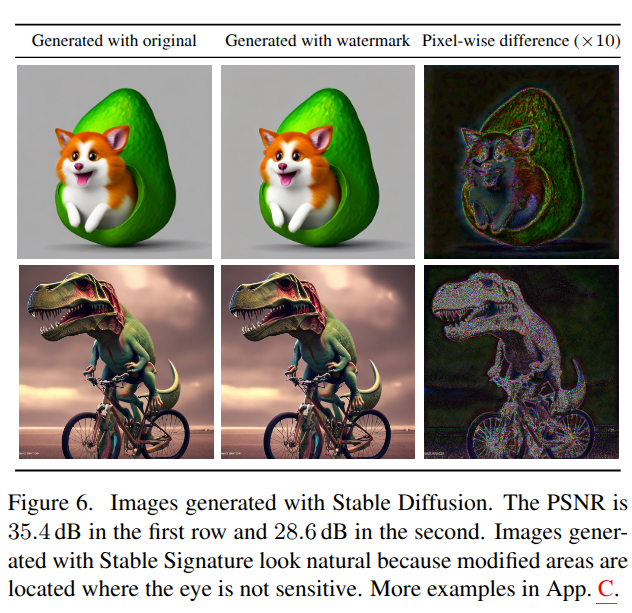

- Robustness

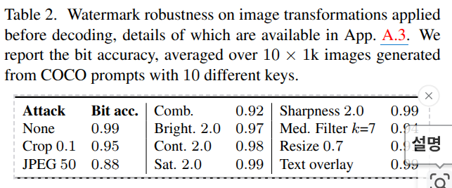

- Loss ablation

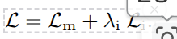

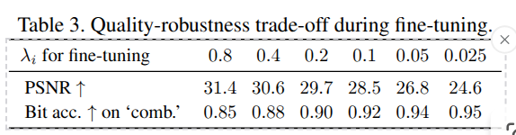

***

### <strong>Difference between two papers</strong>

- $32 \times 32, 64 \times 64, 512 \times 512$ vs $512 \times 512$
- Robustness experiments (e.g., JPEG compression)
- PSNR 30: 전 논문은 resolution은 낮은데 bit-length는 64인 상태에서 실험했다. (32 ~ 64) Resolution도 높이고 bit-length도 더 낮추면 PSNR이 올라갈 거 같지만 실험에 없음. 즉 보이는 건 30 아래임 
  - 반면에 이 논문은 $512 \times 512$에 bit-length는 48이다. 
- Figure에서부터 이미 시나리오가 명확하다. (for model provider)
- Uncond/Class-cond + LDM에 대한 연구. 하지만 LDM에 대한 정량적 평가가 없다. vs 연구가 덜 된 DM. 특히 LDM에 집중
- 대신 이 논문은 Decoder를 user마다 학습시켜야 한다. (1분 걸리긴 함)
- 직접적인 생성 모델인 UNet을 건들면서 성능 저하. 이때, L1 loss로 간접적 완화 vs Decoder만 건들면서 동시에 perceptual loss로 직접적인 성능 저하를 완화시킨다. 