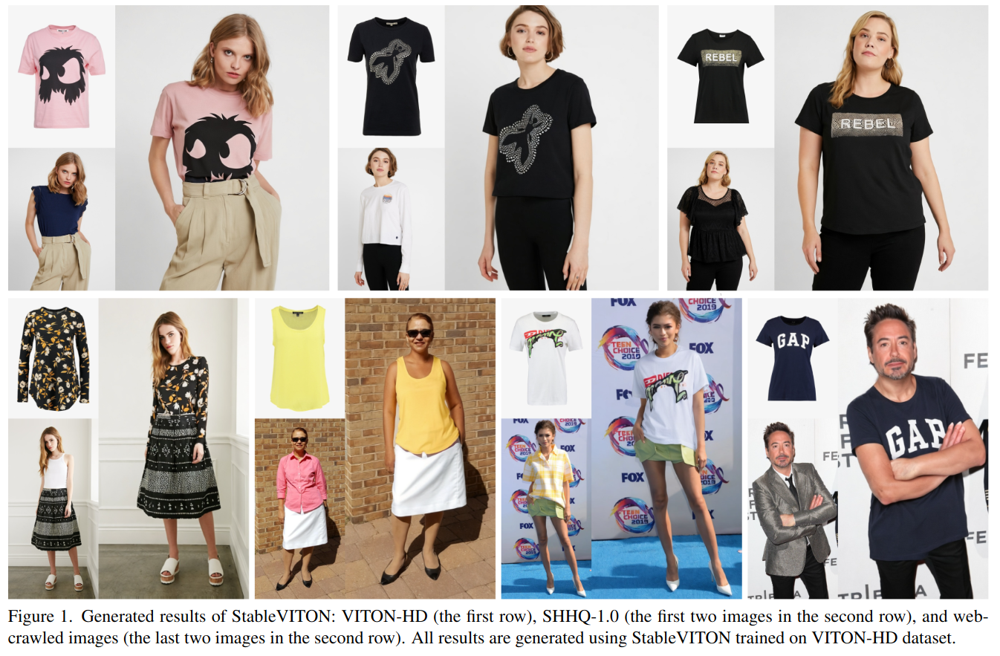
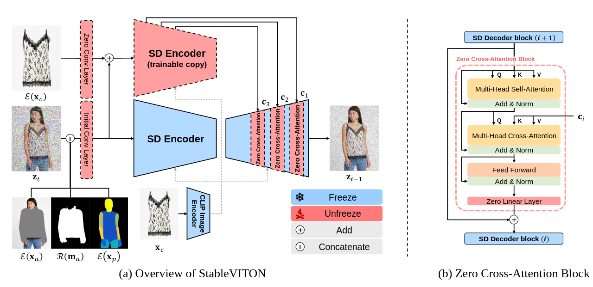
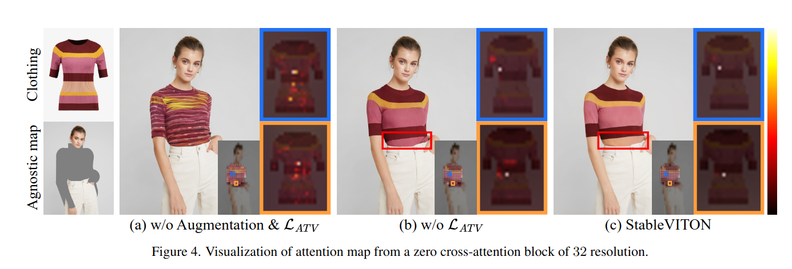
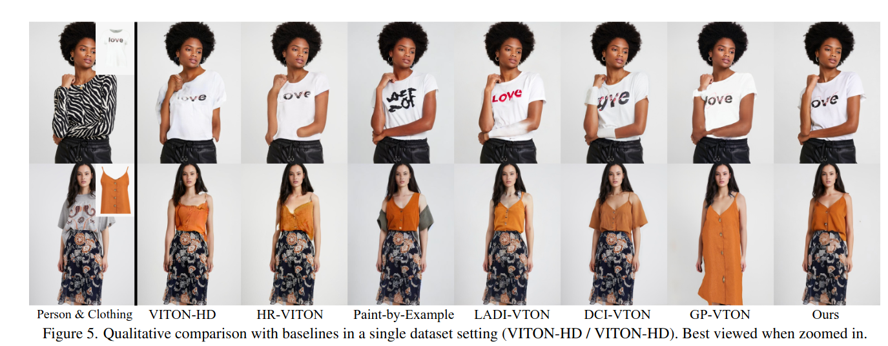
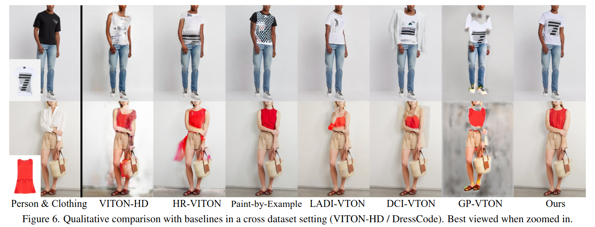
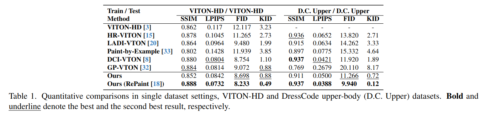
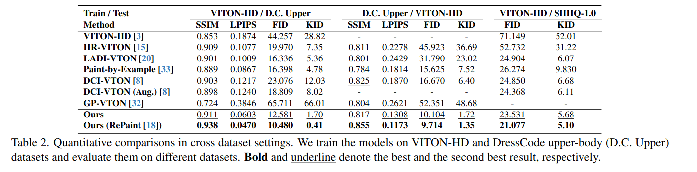
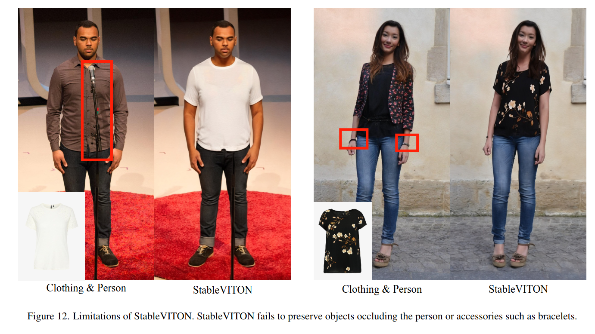

## StableVITON: Learning Semantic Correspondence with Latent Diffusion Model for Virtual Try-On
*arXiv(2023), 0 citation*

[Intro](#intro) 
[Related Work](#related-work) 
[Method](#method) 
[Experiment](#experiment) 
[Conclusion](#conclusion) 

> Core Idea

<strong>"ControlNet + Paint by Example for VITON + Attention Total Variation Loss + Augmentation"</strong> 

***

### <strong>Intro</strong>
- Clothing image 와 person image 가 주어졌을 때, image-based virtual try-on task 는 cutomized image 를 생성하는 것을 목표로 한다.
- 이전 연구의 대부분은 clothing image - person image (clothing image 를 입고있는) paired dataset 을 학습한다.
  - Two module 을 포함한다. 
    - 1. A warping network to learn the semantic correspondence between clothing images and human body
    - 2. Generator
  - Complex backgrond 에 한계가 존재

- 이후에 large-sclae pre-trained diffusion model 이 등장
  - 강력한 generative ability 로 인해 pre-trained model 의 prior knowledge 를 사용한다. 
  - 본 논문에서도 pre-trained diffusion model 을 확장시켜서 사용한다. 
  - 하지만 diffusion mode 을 써도 여전히 clothing detaile 을 보존하는 게 어렵다. 
  - 이 문제는 clothing 과 human body 의 semantic correspondence 를 학습시킴으로써 해결이 가능하다. 

- 즉, 본 논문에서는 pre-trained diffusion model 을 활용하여 기존의 diffusion model method 들의 한계인 clothing detail 을 보존하는 데 초점을 맞췄다.

***

### <strong>Related Work</strong>

- GAN-based VITON
- Diffusion-based VITON

***

### <strong>Method</strong>

- 본 논문에서는 robust capability of pre-trained diffusion model 를 효과적으로 활용 (**Using ControlNet**)하여 clothing detaile 을 보존하는 데 초점을 맞춰서 진행한다.
- Zero cross-attention block 은 semantic correspondence 를 학습함으로써, clothing detail 을 보존할 뿐만 아니라 warping process 에서 pre-trained model 의 고유 지식을 활용하여 높은 fidelity image 를 생성한다.
- 또한, attention total variation loss 와 augmentation 을 적용하여 정확한 clothing detail 을 초래하는 sharp attention map 을 구축한다. 

$\textsf{Problem}$
- GAN based: background consistency 가 없다.
- Diffusion-based: 옷의 detail 을 반영하지 못한다
  - 이는 attention 이 분산되어 있기에 발생하는 문제로써, 본 논문에서 attention total variation loss 를 제안하여 해결한다.

$\textsf{Method}$
- U-Net input: $13$ channels
  - 1. Noisy image: $Z_t$
  - 2. Latent agnoistic map $\mathcal{E}(X_a)$
  - 3. Resized clothing-agnostic mask $X_{m_a}$
  - 4. Latent densepose condition: $\mathcal{E}(X_p)$ to preseve person's pose
- Condition
  - $X_c$ for Image encoder
  - $\mathcal{E}(X_c)$ for ControlNet

- Zero cross-attention block 
  - Clothing & human body 사이의 semantic correspondence 를 학습한다.
  - Add: human info 전달
  - Zero
    - 앞 단의 zero conv: 초기에는 cloth info 를 주지 않는다. 학습할수록 옷의 정보를 잘 학습하도록 kernel 값 조정
    - 뒷 단의 zero linear: 기존의 SD 능력을 유지한다. Zero conv 가 아니라면, model output (prediction) 이 정상적으로 나오지 않아서 그에 따라 loss 값의 변동이 커진다. 즉, 학습이 어려워진다.

- Augmentation: random shift, horizontal flip, random scale

- Attention total variation loss
  - 옷의 색깔이 맞지 않는데, attention score 가 분산되어 있어서라고 가정했다.
  - 잘 학습된 모델을 대상으로 (어느 정도의 location align 이 되어있어야 한다) attentio map 의 center coordinate 의 variation 을 최소화하면, 중심 좌표들간의 변동이 최소화되면서 일관된 위치에 주의를 집중하게 된다. 
  - 또한, Cross-attention 에서의 clothing 과 warped clothing 간의 location align 을 일치시키는 효과가 있다. (중심 좌표들간에 충돌을 막아주는 효과)
  - E.g., color discrepancies (옷의 색깔이 맞지 않는다)
  - 여기서 center coordinate map 이란, generated patch $i$ 에 영향을 주는 reference attribution map (clothing) 의 **high attention score 들의 average location** 이자 **map 에서 가장 중요한 위치** 라고 볼 수 있다. 
  - **일반적인 무게 중심을 구하는 식에서 각 위치에서의 attention score 를 곱해준 꼴인데, 이건 attention score 를 weight 로써 일반적인 무게중심이 아니라 high attention score 를 더 고려한 무게 중심이다.**
  
- $32 \times 24$ cross-attention in zero cross-attention block
  - Attention totla variation loss 와 augmentation 을 사용하면, Cloth 와 human body 의 align 이 잘 된다.
  - Clear visualization 을 위해, generated image 를 $32 \times 24$ 로 먼저 downsampling 하고 다시 $32^2 \times 24^2$ 로 resize 했다.
  - 이후에, attention map 에 각 query token 을 overray 했다. 

***

### <strong>Experiment</strong>

- 본 모델은 $1024 \times 768$ resolution 으로도 가능하지만, fair evaluation 을 위해 $512 \times 384$ 로 학습했다.

$\textsf{Comparision method}$ 

- GAN-based: VITON-HD, HR-VITON, GP-VTON
- Diffusion-based: LADI-VTON, DCI-VTON
- Paint-by-Example

$\textbf{Dataset}$: VITON-HD, Dress-Code (virtual try-on datasets), SHHQ-1.0 (human image dataset)

- VITON-HD 와 upper-body images in DressCode 로 학습했다.
  - 근데 두 개를 합쳐서 학습은 하지 않고 독립적으로 학습. 즉, 모델이 $2$ 개
- Evaluation 은 SHHQ-1.0 으로 했다.

- Qualitative comparison
  - Single dataset evaluation: same Train/Test dataset source
  - Cross dataset evaluation: different Train/Test dataset source

- Quantitative comparison
  - Paired setting: person/original clothing
  - Unpaired setting: person/different clothing 

- Qualitative comparison with baselines in a cross dataset setting (VITON-HD / SHHQ-1.0).

- ControlNet 과의 비교

- Repaint (resample) 을 사용하면 성능이 더 올라간다. 

***

### <strong>Conclusion</strong>

- Pre-trained diffusion model: warping process, clothing detail
- Zero cross-attention block: train semantic correspondence $\rightarrow$ clothing detail
- Attention total variation loss: sharp attention map $\rightarrow$ clothing detail 
- Augmentation: clothing detail

***

### <strong>Question</strong>
- CLIP Image encoder 에 똑같이 cloth 를 넣어주는 이유?
  - Classifier free guidance 를 사용하기 위해서도 맞고
  - SD 를 copy 했다는 말은 ControlNet 구조에서도 condition 을 받아야한다는 말이 되므로 ControlNet 을 제외한 condition 이 하나 더 있어야 한다. 그게 CLIP Image encoder 

- What is difference from ControlNet?
  - ControlNet 과는 다르게 더해주지 않고 Cross attention 을 학습시켰다. 
  - Loss term

- Limitation

- 장신구의 보존/obejct 에 가려졌을 때, object 가 사라짐
  - 그럼에도 복잡한 환경에서 생성을 어느정도 잘 한다.

